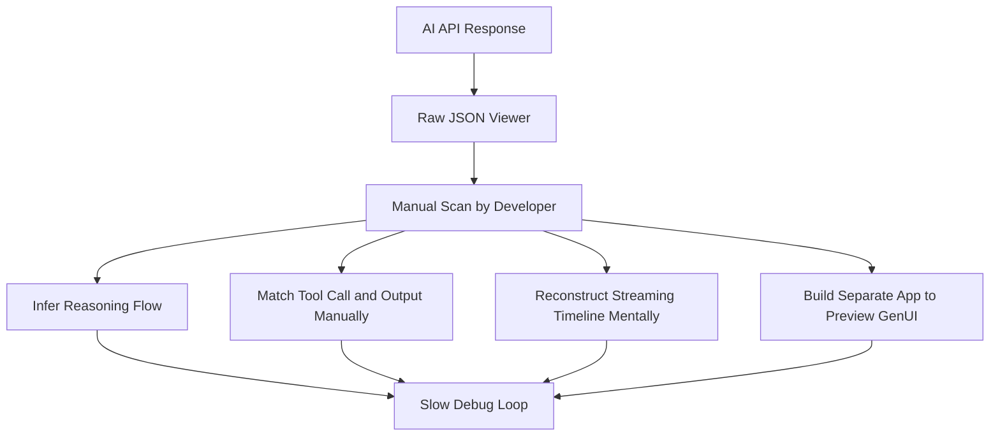
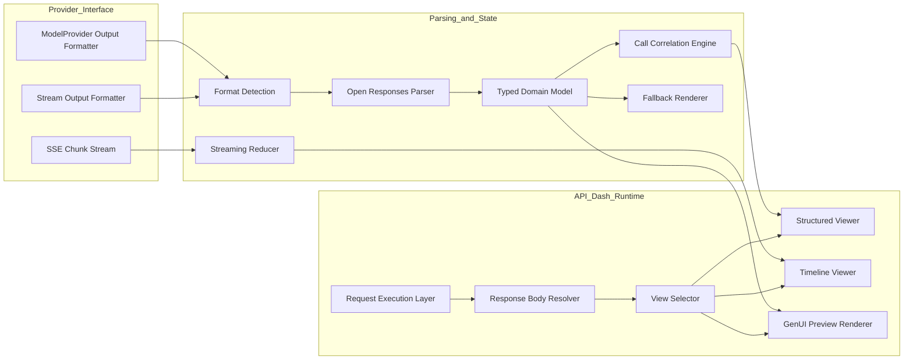
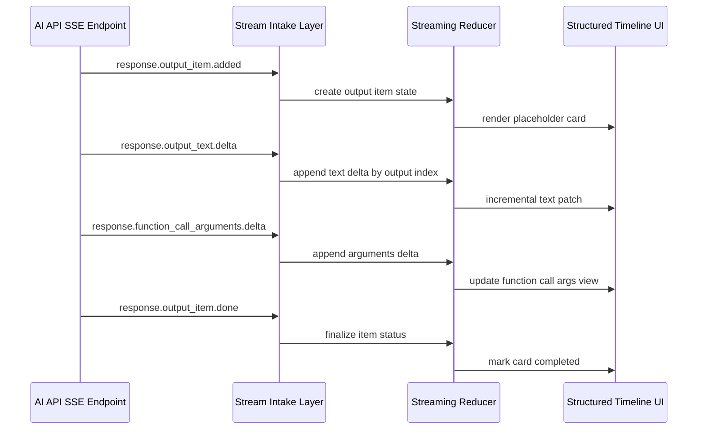
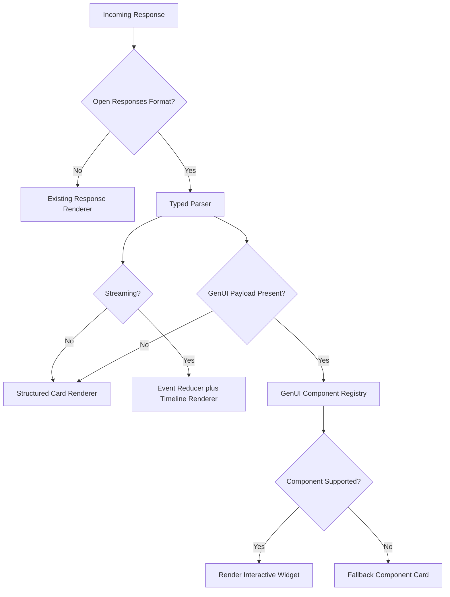
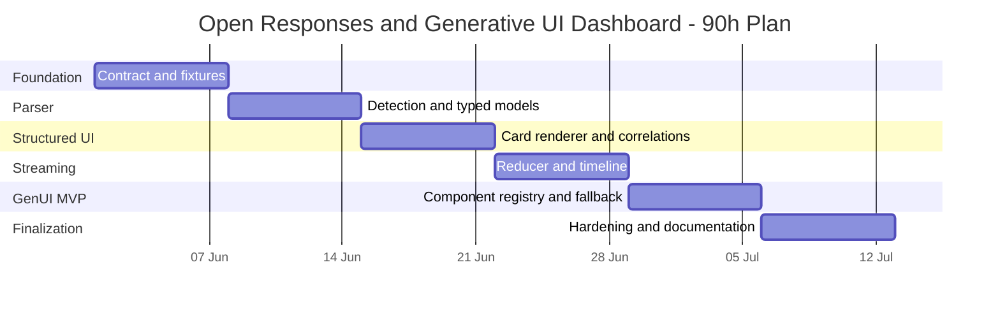

# GSoC 2026 Proposal — Open Responses and Generative UI Dashboard for API Dash

**Organization:** API Dash (foss42/apidash)     
**Contributor:** Dhairya Jangir         
**Email:** dhairya.collegeacc@gmail.com             
**GitHub:** [github.com/DhairyaJangir](https://github.com/dhairyajangir)  
**LinkedIn:** [linkedin.com/in/dhairya-jangir](https://www.linkedin.com/in/dhairya-jangir-163aaa318/)  
**Location:** Pune, Maharashtra, India (UTC+5:30)  
**Year:** Second Year           
**University:** MIT Art Design and Technology University            
**CGPA:** 8.60 / 10.00          
**Expected Graduation:** September 2028             
**Project Size:** medium        

### Motivation & Past Experience

1. Have you worked on or contributed to a FOSS project before? Can you attach repo links or relevant PRs?

Yes. I am actively contributing to API Dash and other open source projects, with a strong focus on production-quality fixes and practical feature delivery. I have stayed consistent in open source for close to two years and regularly work across unfamiliar codebases by understanding architecture first, then implementing in small reviewable increments.

- API Dash contributions:
  - https://github.com/foss42/apidash/pull/1499
  - https://github.com/foss42/apidash/pull/1492
- Other open source contributions:
  - Nextcloud Mail (Germany):
    - https://github.com/nextcloud/mail/pull/11943
    - https://github.com/nextcloud/mail/pull/11980
  - Automagik Genie (Brazil):
    - https://github.com/automagik-dev/genie/pull/378
    - https://github.com/automagik-dev/genie/pull/383
    - https://github.com/automagik-dev/genie/pull/402
- GitHub profile:
  - https://github.com/dhairyajangir
- Relevant product work:
  - SAKHI (Flutter): https://github.com/dhairyajangir/sakhi
  - Supply Chain Cargo Management System: https://github.com/dhairyajangir/Supply-Chain-Cargo-Management-System

2. What is your one project/achievement that you are most proud of? Why?

I am most proud of combining sustained open-source delivery with real Flutter product implementation. The key achievement is not a single patch, but the ability to repeatedly enter active repositories, understand constraints quickly, and ship maintainable work that passes review. That discipline directly maps to GSoC requirements: architecture awareness, implementation clarity, and reliable execution under feedback loops.

3. What kind of problems or challenges motivate you the most to solve them?

I am most motivated by developer-experience bottlenecks where complexity is visible in data but invisible in UX. AI response workflows are exactly that kind of problem: the information is technically present, but the cognitive load is too high in raw JSON form. I enjoy converting this complexity into deterministic parsers, state-safe rendering flows, and testable UI surfaces that developers can trust.

4. Will you be working on GSoC full-time? In case not, what will you be studying or working on while working on the project?

I will prioritize GSoC as my primary commitment during coding weeks. I will continue lightweight university work in parallel, but my schedule is explicitly planned around this 90-hour project with dedicated implementation blocks, review buffer, and test/documentation time.

5. Do you mind regularly syncing up with the project mentors?

Not at all. I strongly prefer regular sync-ups because they reduce drift and improve delivery predictability. My operating model is:

- small and scoped PRs,
- early async updates with blockers,
- rapid turnaround on review comments,
- visible progress every week.

6. What interests you the most about API Dash?

API Dash is one of the most promising open source AI-aware cross-platform API clients, and it already has strong response visualization foundations. Idea 5 fits naturally into the current architecture because the product already separates request execution from response rendering, which makes it feasible to introduce structured AI-specific views without destabilizing core request workflows.

7. Can you mention some areas where the project can be improved?

- Better response observability for AI-native payloads (reasoning, tool calls, tool outputs).
- Better streaming UX for incremental event inspection.
- Better Open Responses-first rendering instead of only raw JSON.
- Better bridge between inspected output and app integration workflows for Flutter and web developers.

8. Have you interacted with and helped API Dash community? (GitHub/Discord links)

Yes.

- API Dash PRs:
  - https://github.com/foss42/apidash/pull/1499
  - https://github.com/foss42/apidash/pull/1492
- Discord handle:
  - warewolf13

### Project Proposal Information

1. Proposal Title

Open Responses and Generative UI Dashboard for API Dash

2. Abstract

Modern LLM APIs increasingly return structured multi-item responses with reasoning traces, tool invocation metadata, and UI descriptors. In most developer workflows, this output is still consumed as raw JSON, which causes high cognitive load, weak debuggability for tool-chaining behavior, and slow integration loops.

This project introduces a production-focused Open Responses and Generative UI Dashboard inside API Dash. The solution will implement schema-aware response detection, typed parsing for core output item types, streaming-aware incremental rendering, timeline-based flow inspection, and an MVP generative UI preview surface with graceful fallback. The expected outcome is a major upgrade in developer observability, confidence, and iteration speed when testing AI APIs.

This proposal is intentionally structured in the same style as strong merged API Dash proposals from recent cycles: explicit problem definition, architecture-first design, phase-gated implementation, measurable deliverables, and test-backed verification.

3. Detailed Description

#### Problem Definition

AI responses in modern APIs are no longer simple completion strings. They are heterogeneous, stateful payloads that often include reasoning, function calls, function outputs, and generated UI descriptors. Today, the core challenge is not data availability but interpretability and temporal coherence during debugging.

| Pain Point | Current Behavior | Engineering Impact | DX Impact |
| --- | --- | --- | --- |
| Structured output visibility | Rendered as generic raw JSON text | Hard to reason about schema semantics and item relationships | Slow manual inspection |
| Tool call correlation | `function_call` and `function_call_output` are not visually paired | Difficult root-cause analysis of agent/tool failures | High debugging friction |
| Streaming inspection | Delta events appear as fragmented text chunks | Loss of causal flow and state transitions | Poor confidence in in-flight behavior |
| GenUI payload preview | UI descriptors require external app rendering | No fast feedback loop inside API client | Longer prototype cycles |

#### Problem Visuals

Raw Open Responses payload in current debugging context:

Raw A2UI payload without native preview:

Pain-point framing from existing API Dash proposal visual references:

#### Current-State Problem Architecture

#### Proposed Solution Overview

I propose a schema-aware response intelligence layer inside API Dash that transforms raw Open Responses and generative UI payloads into interpretable, testable, and stream-aware visual workflows. The solution focuses on deterministic parsing, incremental rendering, component-level fallback safety, and documented integration pathways.

#### Target UX Visuals

Target structured rendering experience:

Target generative UI preview experience:

#### Proposed System Architecture

#### API Dash Integration Touchpoints

| Layer | Primary Responsibility | Existing Integration Surface |
| --- | --- | --- |
| Response view orchestration | Select appropriate render mode by response type | `lib/widgets/response_body.dart`, `lib/widgets/response_body_success.dart` |
| Provider normalization | Map provider-specific payloads into common shape | `packages/genai/lib/models/model_provider.dart` |
| Streaming intake | Parse SSE chunks and push incremental updates | `packages/genai/lib/utils/ai_request_utils.dart` |
| Structured UI | Render reasoning, message, tool call, tool output cards | New or extended widgets in response rendering path |
| GenUI preview | Render supported component descriptors with fallback | New renderer and component registry |

#### Data Contract Strategy

The parser will use a typed item-dispatch architecture where each output item type has explicit validation and rendering semantics. Unknown item types will be safely preserved and surfaced through fallback cards to avoid data loss.

| Output Item Type | Parse Strategy | Render Strategy | Failure Strategy |
| --- | --- | --- | --- |
| `message` | Validate role and content blocks | Chat-style content card | Show raw segment if content schema is invalid |
| `reasoning` | Parse summary and details payload | Collapsible reasoning card | Preserve text-only fallback |
| `function_call` | Parse call id, name, arguments | Tool-call card with status chip | Render as unknown-call card |
| `function_call_output` | Parse call id and output payload | Linked output card near originating call | Keep output as raw payload card |
| unknown | Store raw node and metadata | Explicit unsupported-type card | Non-blocking fallback path |

#### Streaming Event Processing Design

Streaming support will be implemented as an event-sourced reducer model. Each typed event mutates a deterministic state object keyed by output index and call-correlation identifiers. This prevents UI thrashing and preserves temporal consistency during long-running streams.

#### GenUI Preview Engine (MVP)

The GenUI preview layer will use a registry-based component resolver. Supported descriptors are converted into Flutter widgets with controlled data binding and safe fallback behavior.

| Component Group | MVP Support | Notes |
| --- | --- | --- |
| Layout | Container, Row, Column, List | Priority for stable composition |
| Content | Text, status blocks | Markdown-compatible where possible |
| Actions | Button | Event capture hooks for inspection |
| Data | Table (basic) | Column and row safety checks |
| Unsupported | Explicit fallback card | Never crashes render tree |

#### Reliability and Test Strategy

| Test Layer | Scope | Examples |
| --- | --- | --- |
| Unit tests | Parser and format detection | Valid and invalid Open Responses fixtures, unknown type handling |
| Reducer tests | Streaming event state transitions | Delta append ordering, finalization state, partial stream recovery |
| Widget tests | Structured cards and GenUI preview | Message, reasoning, tool card rendering, fallback rendering |
| Integration tests | End-to-end request-to-render path | Response body routing, view switching, timeline continuity |

#### Non-Goals for 90-Hour Scope Integrity

- Full A2UI component parity in one cycle.
- End-to-end production code generation for complete applications.
- Large refactor outside response interpretation and visualization path.

#### Implementation Plan (Phase-wise)

The implementation is divided into phase gates with explicit entry and exit criteria, mirroring accepted API Dash proposal execution discipline.

| Phase | Objective | Key Tasks | Exit Criteria | Estimated Hours |
| --- | --- | --- | --- | --- |
| Phase 1: Contract Discovery and Design | Freeze scope and data contracts | Audit response pipeline, define parser interfaces, create fixture matrix | Signed-off parser contract and fixture set | 10h |
| Phase 2: Parser and Domain Model | Build robust Open Responses parser | Item dispatch, validation guards, unknown fallback, unit tests | Core item types parsed with passing tests | 18h |
| Phase 3: Structured Viewer and Correlation | Render interpretable item cards | Message and reasoning cards, `call_id` correlation, metadata panel | Structured mode stable for non-streaming payloads | 18h |
| Phase 4: Streaming Timeline Engine | Add stream-aware progressive rendering | Event reducer, in-place delta updates, completion states, timeline UI | Stable incremental rendering for streamed responses | 16h |
| Phase 5: GenUI Preview MVP | Render supported generative components | Component registry, binding support, fallback cards, widget tests | MVP component set rendering correctly | 18h |
| Phase 6: Hardening and Documentation | Ship merge-ready quality | Edge-case fixes, docs, integration guide, final polish | Test suite green and docs complete | 10h |

Total: 90h

#### Architecture Decision Flow

4. Weekly Timeline (90 Hours)

| Week | Hours | Focus | Deliverables | Verification Gate |
| --- | --- | --- | --- | --- |
| Week 1 | 15h | Foundation and contracts | Integration mapping, fixture inventory, parser contract doc | Contract review checklist complete |
| Week 2 | 15h | Parsing core | Format detection, domain models, item parser implementation | Parser unit tests passing |
| Week 3 | 15h | Structured UI | Message and reasoning cards, call-output correlation, metadata panel | Widget tests for core cards |
| Week 4 | 15h | Streaming timeline | Event reducer, delta patching, timeline flow | Reducer tests and streaming fixtures passing |
| Week 5 | 15h | GenUI MVP | Registry-based renderer, basic component support, fallback handling | Widget coverage for supported and unsupported components |
| Week 6 | 15h | Hardening and docs | UX polish, edge-case fixes, user and developer docs, examples | End-to-end verification and PR readiness |

#### Timeline Visualization

#### Risk Register and Mitigation

| Risk | Probability | Impact | Mitigation |
| --- | --- | --- | --- |
| Spec evolution or ambiguity | Medium | Medium | Version-aware parsing and unknown-item fallback |
| Streaming edge-case instability | Medium | High | Deterministic reducer model plus fixture-driven state tests |
| Scope creep in GenUI components | High | Medium | Strict MVP matrix and explicit non-goals |
| Regression in existing response modes | Low | High | Isolated integration path and regression checks for existing views |

#### Success Metrics

| Metric | Target |
| --- | --- |
| Parser correctness on fixture suite | >= 95 percent valid-case pass with deterministic fallback for invalid cases |
| Structured response render coverage | Core item types fully rendered in structured mode |
| Streaming state stability | No crash across defined stream fixtures and completion scenarios |
| GenUI preview reliability | Supported components render plus unsupported components fallback safely |
| Documentation completeness | User flow and developer extension path documented |

### Why I Am a Strong Fit for Idea 5

I have long-term hands-on Flutter and Dart experience, strong API curiosity, and a delivery style focused on finishing high-value tasks cleanly. I use AI as an accelerator but keep implementation ownership fully technical, meaning I understand and verify every important code path I propose. My open-source consistency and cross-repository contribution history indicate that I can deliver under review-driven workflows.

- I have contributed to API Dash and external mature projects.
- I can move from architecture understanding to implementation quickly.
- I prefer measurable progress: scoped PRs, test gates, and clear milestone closure.

### Why Mentors Can Trust My Execution

- I scope aggressively but realistically.
- I communicate early and clearly when tradeoffs appear.
- I implement in review-friendly increments.
- I prioritize maintainability and reliability over superficial feature breadth.

### Post-GSoC Commitment

I plan to continue beyond the coding period by expanding supported GenUI components, improving timeline introspection for complex agentic workflows, and helping with follow-up issue resolution and contributor onboarding in this feature area.
