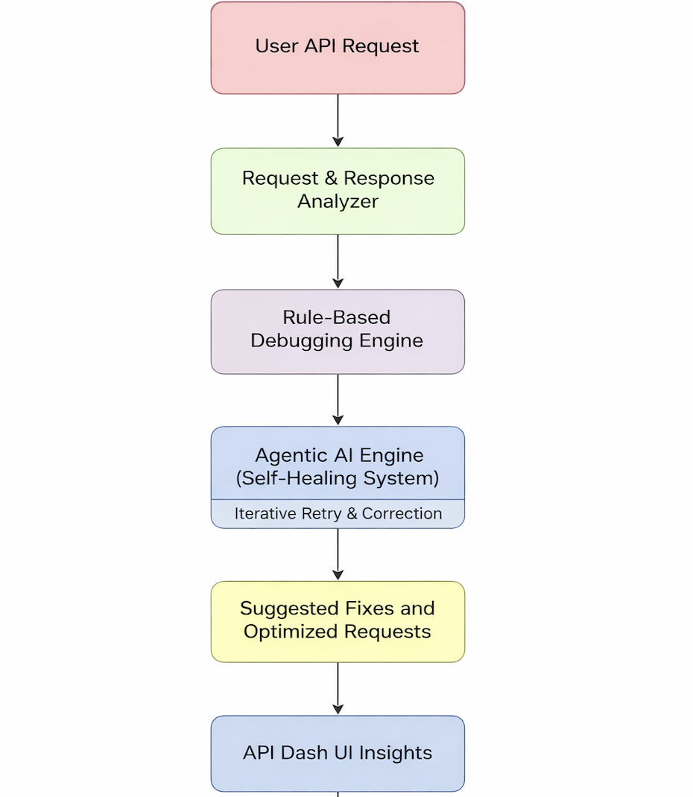

### About

1. Full Name: Greeva Dineshkumar Patel  
2. Contact info (public email): greevapatel04@gmail.com  
3. Discord handle in our server (mandatory): greevapatel (FOSS Developers Group / API Dash Discord) 
• Username: greevapatel
• Link: https://discord.com/users/762692760049549323
4. Home page (if any): https://greevapatel-portfolio.netlify.app/
5. Blog (if any): N/A  
6. GitHub profile link: https://github.com/Greeva48  
7. LinkedIn: https://www.linkedin.com/in/greeva-patel-1a7b11299/  
8. Time zone: IST (UTC +5:30)  
9. Resume: https://drive.google.com/file/d/1cIn-3daZsEJQvxZqRhHmkYJ_aGNcRA0s/view?usp=sharing  

---

### University Info

1. University name: Indus University, Ahmedabad  
2. Program: Bachelor of Technology (Computer Science and Engineering)  
3. Year: Final Year  
4. Expected graduation date: 2026  

---

### 📄 Full Proposal (PDF)

👉 [View Full Proposal](./Greeva_Dineshkumar_Patel_GSoC_2026_API_Dash_Proposal.pdf)

### Motivation & Past Experience

1. Have you worked on or contributed to a FOSS project before?  
I have worked on multiple real-world projects and built production-grade systems. While my direct contributions to large-scale open-source projects are limited, I am comfortable working in collaborative environments and actively engaging with communities.  
GitHub: https://github.com/Greeva48  

2. What is your one project/achievement that you are most proud of? Why?  
I am most proud of my work at ISRO (Space Applications Centre), where I designed and deployed 30+ REST APIs and built high-throughput asynchronous pipelines handling large-scale data. This experience gave me deep insights into system design, API debugging challenges, and reliability at scale.  

3. What kind of problems or challenges motivate you the most to solve them?  
I am highly motivated by problems that improve developer productivity and automate repetitive workflows. Building intelligent systems that reduce manual debugging effort and enhance efficiency excites me the most.  

4. Will you be working on GSoC full-time?  
Yes, I will be fully dedicated to GSoC during the coding period.  

5. Do you mind regularly syncing up with the project mentors?  
Not at all. I prefer regular communication and feedback loops to ensure alignment and continuous improvement.  

6. What interests you the most about API Dash?  
API Dash focuses on improving developer experience in API testing. The opportunity to enhance it with intelligent debugging, automation, and self-healing capabilities aligns strongly with my interests in backend systems and AI-driven tools.  

7. Can you mention some areas where the project can be improved?  
- Intelligent debugging and automated issue detection  
- Suggestion-based API correction  
- Self-healing API workflows  
- Better developer insights and automation  

8. Have you interacted with and helped API Dash community?  
Yes, I have joined the API Dash Discord server and engaged in discussions regarding my proposal and approach.  

---

### Project Proposal Information

#### 1. Proposal Title  
Building an Agentic Self-Healing API Debugging System for API Dash  

---

#### 2. Abstract  
Developers frequently face issues while working with APIs such as missing parameters, incorrect request formats, and unexpected responses. Debugging these issues manually is repetitive and inefficient.  

This project aims to build an intelligent, agentic API debugging system that can detect issues, suggest fixes, automatically correct requests, and retry them to achieve successful responses, significantly improving developer productivity.  

---

#### 3. Detailed Description  

The proposed system introduces an intelligent debugging pipeline integrated into API Dash.

## Architecture

This architecture ensures a modular, scalable, and extensible debugging pipeline where API requests pass through analysis, validation, intelligent correction, and optimization before being presented in the API Dash UI.

---

### Components

**1. Request & Response Analyzer**  
- Parses API requests and responses  
- Extracts debugging signals  
- Identifies structural issues  

**2. Rule-Based Debugging Engine**  
- Applies validation rules  
- Detects missing fields, invalid formats, incorrect structures  

**3. Agentic AI Engine (Self-Healing System)**  
- Generates intelligent suggestions  
- Automatically modifies requests  
- Iteratively retries until success  

**4. Suggestion Layer**  
- Provides clear, human-readable debugging insights  

**5. UI Integration (API Dash)**  
- Displays issues, suggestions, corrected requests, and final responses  

---

## Prototype

I have already built a working prototype demonstrating the core idea of this project:

🔗 GitHub Repository: https://github.com/Greeva48/api-self-healing-debugger  

The prototype includes:
- Rule-based API debugging  
- Detection of missing fields and invalid inputs  
- AI-like suggestion generation  
- Self-healing request modification  
- Automatic retry mechanism  
- Interactive UI using Streamlit  

This validates the feasibility of the approach and demonstrates my ability to build real, working systems.

### Output

- Detects missing required field: `password`  
- Suggests fix  
- Automatically corrects request  
- Retries successfully  

---
## 📅 Weekly Timeline

| Phase              | Duration        | Tasks                                                                 |
|--------------------|-----------------|----------------------------------------------------------------------|
| Community Bonding  | Before coding   | Study API Dash codebase, discuss design, finalize architecture       |
| Week 1–2           | Core Setup      | Implement Request & Response Analyzer                                |
| Week 3–4           | Rule Engine     | Build rule-based debugging engine                                    |
| Week 5–6           | Enhancements    | Add advanced rules and edge case handling                            |
| Week 7–8           | AI Engine       | Develop suggestion system and intelligent fixes                      |
| Week 9–10          | Self-Healing    | Implement automatic correction and retry mechanism                   |
| Week 11            | Integration     | Integrate system into API Dash UI                                    |
| Week 12            | Finalization    | Testing, optimization, documentation                                 |
