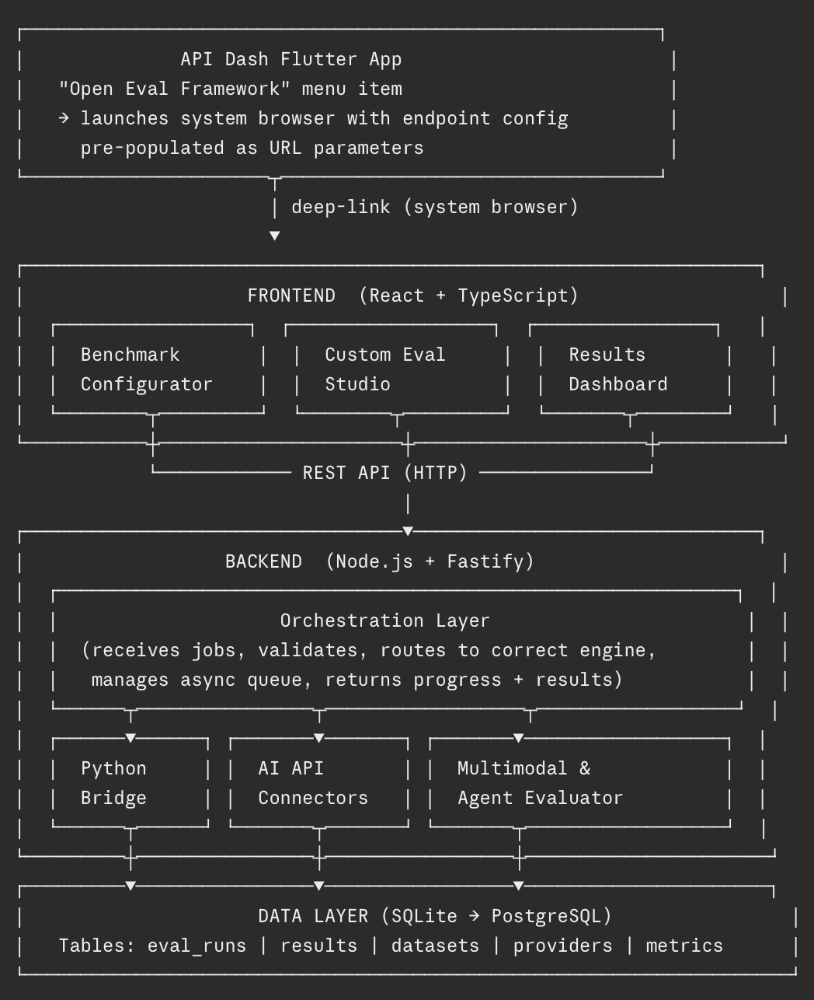

### About

1. Full Name - Harsh kumar Singh
2. Contact info (public email) - harshsinghdmk2006@gmail.com
3. Discord handle in our server (mandatory) - Harsh Singh
4. Home page (if any) - N/A
5. Blog (if any) - N/A
6. GitHub profile link - https://github.com/harshsingh-developer
7. LinkedIn - https://www.linkedin.com/in/harsh-singh-2ba574382/
8. Time zone - India (GMT +5:30)
9. Link to a resume (PDF, publicly accessible via link and not behind any login-wall) - N/A

### University Info

1. University name - NxtWave of Innovation in Advanced Technologies NOIDA INTERNATIONAL UNIVERSITY Campus
2. Program you are enrolled in (Degree & Major/Minor) - Btech Computer Science AI/ML
3. Year - 1st Year
4. Expected graduation date - June 2029

### Motivation & Past Experience

1. Have you worked on or contributed to a FOSS project before? Can you attach repo links or relevant PRs?
    Yes. I recently made my first open source contribution to API Dash itself.

    - **PR #1466** — Added "How to Run Generated Code" instructions for Python (httpx) 
    to the API Dash user guide. This involved studying the existing documentation structure, identifying a genuine gap in the covered languages, and following the repo's contribution conventions precisely.
    **Link**: https://github.com/foss42/apidash/pull/1466

2. What is your one project/achievement that you are most proud of? Why?
    My proudest project is **DETECT-BEES** — an AI powered deepfake detection system built entirely in the browser using an ONNX runtime model in OpenAI X NxtWave Buildathon.
    **Link**: https://github.com/harshsingh-developer/detect-bees
    **Link**: https://www.linkedin.com/in/harsh-singh-2ba574382/?skipRedirect=true

    **What it does**: Users upload a photo and the system runs a trained deepfake detection model directly in the browser no server, no backend, no data leaving the device. The inference happens client side using the ONNX runtime loaded via JavaScript.

    **What made it challenging**: My original plan was to ship this as a browser extension for real time deepfake flagging on social media. The extension failed Chrome's security review due to the way the ONNX model was being loaded.

    **Who used it**: Friends tested it with their own photos, which gave me real feedback on detection accuracy and UI clarity the first time I had actual users telling me what worked and what didn't.

3. What kind of problems or challenges motivate you the most to solve them?

    I am most motivated by problems at the intersection of AI and developer tooling where the solution is not just an AI model, but a system that helps other developers work with AI more effectively. This is exactly what this GSoC project represents, and why it felt like a natural fit for my background and interests.

4. Will you be working on GSoC full-time? In case not, what will you be studying or working on while working on the project?

    Not entirely full time, but the timing works strongly in favour of meaningful contribution.

    - **May:** End term examinations for my 1st year of BTech. I will have limited availability during this month and will use it primarily for community bonding, codebase study, environment setup, and finalising 
    the technical design tasks that do not require deep uninterrupted coding blocks.

    - **June – July:** Summer break with no college commitments. I will be working on GSoC full time during these two months, targeting the bulk of the core implementation (Deliverables 1, 2, and 3).

    - **August:** 3rd semester begins. I will balance GSoC with college classes, dedicating evenings and weekends to completing Deliverable 5 (Results Dashboard), testing, documentation, and final submission. I have managed parallel workloads before and am comfortable with this schedule.

    I have planned the week by week timeline in my proposal to reflect this availability honestly the heaviest coding weeks are mapped to June and July, not May or August.

5. Do you mind regularly syncing up with the project mentors?
    Not at all I actively look forward to it. Regular mentor syncs are one of the most valuable parts of GSoC for a contributor at my stage. I am already attending the API Dash Weekly Connect for GSoC Participants and will continue to do so throughout the programme. I am comfortable with async updates via Discord between syncs and will always come prepared with specific progress updates and concrete questions rather than open ended status reports.

6. What interests you the most about API Dash?
    The direction the project is heading this season MCP testing, multimodal AI evaluation, and agentic features. These are exactly the problems that are underserved by existing tools. Postman and Insomnia 
    are excellent for REST APIs but they were designed before LLMs existed. API Dash is being built for the AI API era from the ground up, and contributing to that transition at this specific moment feels meaningful rather than incremental.

7. Can you mention some areas where the project can be improved?
    
    **Documentation depth for new contributors** — The existing developer guide and user guide are good foundations, but some setup steps have gaps (for example, the Flutter version requirements and macOS dependency documentation noted in issue #1196). As someone who just went through the setup process, I noticed places where a first time contributor could get stuck. My PR #1466 is a small step toward improving this I plan to continue contributing to documentation quality alongside the core project work.

8. Have you interacted with and helped API Dash community? (GitHub/Discord links)

    Yes, across three touchpoints:

    1. **GitHub — PR #1466**: Submitted a documentation contribution adding Python (httpx) run instructions to the user guide, referencing issue #527.
    **Link**: https://github.com/foss42/apidash/pull/1466

    2. **GitHub — Issue #527 comment**: Left a comment on the open documentation issue after submitting the PR, describing what was added and offering to contribute additional language instructions.
    **Link**: https://github.com/foss42/apidash/issues/527

    3. **Discord — API Dash server**: Introduced myself in the `#introduce-yourself` channel on 14th March and have been active in the `#gsoc-foss-apidash` channel, engaging with the community and following project discussions.

### Project Proposal Information

1. **Proposal Title**
    Multimodal AI and Agent API Eval Framework

2. **Abstract**
    API Dash excels at building and inspecting API requests but once a developer integrates an AI API into their product, a critical question remains unanswered: is the AI actually performing well? There is currently no developer friendly way to systematically evaluate AI API responses across text, images, and audio or to test how AI agents behave across multi turn workflows without writing custom scripts from scratch.
    This proposal builds an endt o end Multimodal AI and Agent API Eval Framework as a companion web service to API Dash. 
    It provides: 
    (1) an intuitive interface to run standard AI benchmarks (lm-evaluation-harness, lighteval) without touching the command line, 
    (2) a Custom Eval Studio where developers upload their own datasets, configure any AI API, and define scoring criteria, 
    (3) a MultimodalHandler that evaluates image and audio models across providers with automatic format transformation, 
    (4) a Results Dashboard with comparison charts, leaderboard views, and per example drill downs, and 
    (5) an Agent Evaluator that scores multi turn tool use workflows on tool selection, parameter correctness, and call ordering. 
    The framework integrates with the existing API Dash Flutter app via a single deep link a developer builds a request in API Dash, clicks "Open Eval Framework", and immediately runs an evaluation against that exact endpoint in their browser, no reconfiguration required.

3. **Detailed Description**
    **Problem**
    AI APIs are now core infrastructure. Every developer building an AI product needs to evaluate their AI but the current tooling forces them to choose between two painful options: use research grade benchmark tools (lm-evaluation-harness, lighteval) that require technical expertise just to run, or write custom evaluation scripts from scratch for every new model or dataset. Neither option is accessible, reproducible, or multimodal.
    Multimodal evaluation is especially neglected. OpenAI, Anthropic, and Gemini all support image and audio inputs but their request formats are incompatible, and no developer tool currently provides a unified interface to evaluate them side by side.

    **Solution**

    A companion web service (React + Node.js + Python) that sits alongside the API Dash Flutter app and fills this gap completely.

    **Integration with API Dash**

    The eval framework is a companion web service a standalone React + Node.js application that runs alongside the existing Flutter desktop app, not inside it. The Flutter app handles what it does best (HTTP request building, response inspection, code generation), while the eval framework handles what requires a different runtime (benchmark orchestration, async job queuing, Python based scoring engines).

    The integration point is a single deep link: the API Dash Flutter app includes an "Open Eval Framework" menu entry that launches the eval UI in the system browser, pre populated with the user's current API endpoint and provider configuration as URL parameters. During the GSoC period, the Flutter side change is intentionally minimal a single menu item and URL launch call so the full 350 hours is directed at building the eval framework itself.

    ## Architecture

    
    

    **Deliverable 1 — Benchmark Runner UI**

    A web interface wrapping lm-evaluation-harness and lighteval. Users pick a benchmark task (HellaSwag, MMLU, TruthfulQA, etc.), pick a model endpoint, and click Run. No command line required.

    The PythonBridge spawns lm-harness and lighteval as subprocesses, captures their JSON output, and normalises it into a standard result schema: `{ task, model, metric, score, stderr, latency }`. BullMQ manages benchmark jobs as async background tasks with retries and live progress tracking  a 200 task benchmark run never blocks the HTTP thread.

    **Deliverable 2 — Custom Eval Studio**

    A workspace where developers upload their own datasets (JSONL, CSV), configure any AI API (OpenAI, Anthropic, Gemini, Mistral, Ollama, or any OpenAI compatible endpoint), define what "correct" means, and run evaluations at scale.

    The ScoringEngine supports: exact match, F1, BLEU, ROUGE, cosine similarity, and LLM as Judge (where a separate cheap model scores the response). The unified APIConnector interface mirrors the provider 
    abstraction pattern used in API Dash's own Dart packages same concept, implemented in TypeScript.

    **Deliverable 3 — Multimodal Evaluation Support**

    Text only evaluation is the industry default. This deliverable breaks that ceiling. Developers evaluate image understanding (send image + prompt, score the response), audio/speech models (send audio, evaluate transcription quality), and vision language models all through the same interface.

    The core challenge is that providers use incompatible request formats. OpenAI expects images as `{ type: "image_url" }` inside a content array. Anthropic expects images under `source: { type: "base64", media_type, data }`. Gemini uses `inlineData: { mimeType, data }`. A single multimodal request cannot reach multiple providers without transformation.

    The MultimodalHandler solves this with a provider agnostic canonical format: `{ type, media_type, data }`. Provider-specific formatters (OpenAIFormatter, AnthropicFormatter, GeminiFormatter) each implement 
    the same `format(asset)` interface and produce the schema that provider expects. Adding a new multimodal provider requires writing one formatter class, nothing else. If a provider does not support a given modality, the system detects this at configuration time before the run starts and returns a clear error without billing the user an API call.

    **Deliverable 4 — AI Agent Evaluation (Stretch Goal)**

    Agents are not single turn models. This deliverable introduces multi turn evaluation tracking tool use decisions, planning quality, and task completion across a full agent workflow via API.

    Agent state is represented as a structured conversation trace a JSON array where each entry records turn index, role (user/assistant/tool), message content, and any tool call including tool name and parameters. 
    This trace is the ground truth for scoring.

    Tool use evaluation checks three criteria per turn: 
    (1) tool selection correctness did the agent call the expected tool or skip/wrong call? 
    (2) parameter correctness were parameters accurate and complete? 
    (3) call ordering did calls happen in the correct sequence?

    A failing eval example: a task requires `search(query)` then `summarize(results)`. The agent calls `summarize` with no prior search this is a tool ordering failure scored independently from a parameter 
    failure. The dashboard shows not just pass/fail but exactly where in the workflow the agent broke down.

    This deliverable is scoped as a stretch goal. The data model is designed from Week 1 to accommodate agent traces adding this deliverable later introduces zero schema changes to the core system.

    **Deliverable 5 — Results Dashboard**

    A visual dashboard with: accuracy and latency charts (Recharts), side by side provider comparison tables, leaderboard views across models, per example drill downs showing the exact question, model response, expected answer, and score, and export to CSV/JSON.

    **Error Handling and Resumability**

    Eval runs are long running jobs. Each row result is written to the database immediately after scoring not batched at the end. If an API call fails mid run, all completed rows are preserved.

    Three failure modes handled explicitly:
    - **Rate limit (HTTP 429):** Exponential backoff — 2s, 4s, 8s — up to 3 retries before marking the row as failed.
    - **Malformed dataset row:** Row is skipped and flagged with a specific validation error. The run continues. User can fix and rerun failed rows only.
    - **Backend crash mid-run:** BullMQ persists job state to Redis. On restart, the job resumes from the last completed row not from the beginning.

    The dashboard never shows a run as simply "failed" it shows exactly how many rows succeeded, how many failed, and the specific error code for each failure.

    ## Tech Stack

    | Layer | Technology | Reason |
    |---|---|---|
    | Frontend | React + TypeScript | Type safety for complex eval configs |
    | Backend | Node.js + Fastify | Async performance, TypeScript support |
    | Job Queue | BullMQ + Redis | Resumable async jobs, crash recovery |
    | Eval Engine | Python (subprocess) | lm-harness and lighteval are pure Python |
    | Benchmarks | lm-evaluation-harness, lighteval | Industry standard, 200+ tasks |
    | Database | SQLite → PostgreSQL | Start simple, scale when needed |
    | Charts | Recharts | Clean React-native charting |
    | Validation | Zod | Schema validation for eval configs |
    | Testing | pytest, Vitest, React Testing Library | Full stack coverage |
    | Deployment | Docker Compose | One command runs the entire stack |

4. **Weekly Timeline**

    **Community Bonding Period (May)**

    **Note on availability:** May coincides with my 1st year end term examinations. I will use this period for non coding GSoC work studying the API Dash codebase in depth, setting up the full dev environment, finalising the technical design with mentors, and completing any remaining pre coding questions. No coding deliverables are promised during this period.

        | Week | Focus | Concrete Output |
        |---|---|---|
        | CB Week 1 | Deep codebase study | Architecture diagram of API Dash internals |
        | CB Week 2 | Dev environment setup | Docker Compose running locally, all dependencies installed |
        | CB Week 3 | Technical design review | Schema design for all DB tables, API contract for all endpoints, mentor reviewed |

        ---

    **Coding Period (June – August)**

    **Week 1 (June, Week 1)**
    **Focus:** Project scaffold + infrastructure
        - Node.js + Fastify + TypeScript project structure
        - SQLite database setup with SQLAlchemy equivalent (Drizzle ORM)
        - BullMQ + Redis job queue wired up
        - Docker Compose file: Node backend + Python engine + Redis + DB
        - Basic health check endpoint

    **Output:** Running scaffold — `docker compose up` starts the full stack

        ---

    **Week 2 (June, Week 2)**
    **Focus:** Dataset management + Python bridge foundation
        - Dataset upload endpoint: accepts JSONL and CSV, validates schema, stores in DB
        - Dataset preview API: paginated rows
        - Python bridge: Node.js spawns Python subprocess, captures stdout as JSON
        - `harness_runner.py` skeleton: accepts task name + model config, returns JSON

    **Output:** Can upload a dataset and call a Python script from Node.js

        ---

    **Week 3 (June, Week 3)**
    **Focus:** lm-evaluation-harness integration
        - `harness_runner.py` complete: wraps lm-harness, normalises output to standard schema
        - `/api/runs` POST endpoint: creates run record, enqueues BullMQ job
        - Worker: picks up job, calls harness_runner, stores results row by row
        - `/api/runs/:id/status` GET: returns progress percentage

    **Output:** Can run a real lm-harness benchmark (e.g. HellaSwag) via API call

        ---

    **Week 4 (June, Week 4)**
    **Focus:** lighteval integration + OpenAI connector
        - `lighteval_runner.py`: wraps lighteval, same output schema as harness
        - First AI API connector: OpenAI text unified `evaluate(prompt, config)` interface
        - ScoringEngine: exact match and F1 implemented and tested
        - Error handling: rate limit backoff, malformed row skipping

    **Output:** Can run lighteval benchmark AND custom text eval against OpenAI

        ---

    **Week 5 (July, Week 1)**
    **Focus:** Anthropic + Gemini + Ollama connectors
        - AnthropicConnector following same interface as OpenAI
        - GeminiConnector
        - OllamaConnector (local model support)
        - ScoringEngine: BLEU, ROUGE added
        - Connector unit tests: mock API responses, verify output schema

    **Output:** 4 providers working for text evaluation

        ---

    **Week 6 (July, Week 2)**
    **Focus:** React frontend core structure + Benchmark UI
        - React + TypeScript + Vite project setup
        - ProviderSelector, ModelConfig, BenchmarkPicker components
        - RunMonitor: polls `/api/runs/:id/status`, shows live progress bar
        - Connect to backend: POST run, poll status

    **Output:** Can configure and launch a benchmark run from the browser UI

        ---

    **Week 7 (July, Week 3)**
    **Focus:** Custom Eval Studio UI + LLM as Judge
        - DatasetManager: upload, preview, browse datasets in UI
        - MetricSelector: exact match, F1, BLEU, LLM as Judge options
        - LLM as Judge implementation: sends (response, expected) to a judge model, returns score + reasoning
        - Custom eval end to end: upload dataset → configure → run → see results

    **Output:** Full custom text eval working end to end in the browser

        ---

    **Week 8 (July, Week 4)**
    **Focus:** MultimodalHandler image evaluation
        - Canonical internal format: `{ type, media_type, data }`
        - Base64 encoding pipeline for image uploads
        - OpenAIFormatter, AnthropicFormatter, GeminiFormatter
        - Fallback detection: unsupported modality caught before run starts
        - Image eval pipeline end to end: upload image → send to vision model → score response

    **Output:** Image evaluation working for OpenAI, Anthropic, Gemini

        ---

    **Week 9 (August, Week 1)**
    **Focus:** Audio evaluation + multimodal UI
    **Note:** 3rd semester begins. Evenings and weekends dedicated to GSoC.
        - Audio eval pipeline: encode audio, send to Whisper/speech APIs, score transcription
        - React UI updates: image upload widget, audio upload widget, modality selector
        - Multimodal eval end to end tested with real image and audio datasets

    **Output:** Full multimodal eval (image + audio) working in browser

        ---

    **Week 10 (August, Week 2)**
    **Focus:** Results Dashboard
        - Recharts integration: accuracy chart, latency histogram
        - Provider comparison table: side by side scores across models
        - Leaderboard view: rank models by metric
        - Per example drill down: question | response | expected | score | reasoning

    **Output:** Complete results dashboard rendering real eval data

        ---

    **Week 11 (August, Week 3)**
    **Focus:** Export + testing + stretch goal start
        - Export panel: download results as CSV and JSON
        - pytest: full coverage of Python eval scripts
        - Vitest: Node.js service layer tests
        - React Testing Library: RunMonitor, DatasetManager, ResultsDashboard
        - If on schedule: begin Agent Evaluator (conversation trace data model)

    **Output:** Tested, exportable results. Agent eval data model if on schedule.

        ---

    **Week 12 (August, Week 4)**
    **Focus:** Final polish + documentation + submission
        - Load test: 3 simultaneous 100 row eval runs identify and fix bottlenecks
        - Write `README.md` for the eval framework: setup, usage, architecture
        - Record 3 minute demo video
        - If agent eval started: complete tool selection + parameter scoring
        - Final GSoC report in `doc/gsoc/2026/harsh_singh.md`
        - All code merged or in open PR state
        - "Future Work" section: deeper Flutter WebView integration, additional 
        provider formatters, agent eval completion if not finished

    **Output:** Complete, documented, tested eval framework ready for use

        ---

    **Timeline Summary**

        | Period | Weeks | Primary Focus |
        |---|---|---|
        | Community Bonding | May | Design, setup, no coding |
        | June | Weeks 1–4 | Backend foundation + benchmark engine |
        | July | Weeks 5–8 | Connectors + frontend + multimodal |
        | August | Weeks 9–12 | Audio + dashboard + testing + submission |
        | Stretch | Weeks 11–12 | Agent evaluation if on schedule |

        The timeline is deliberately conservative on Deliverables 1–3 to ensure 
        production quality delivery of the core framework. Agent evaluation 
        (Deliverable 4) is designed into the data model from Week 1 but 
        implemented only if the core work is completed ahead of schedule 
        this is honest scoping, not reduced ambition.