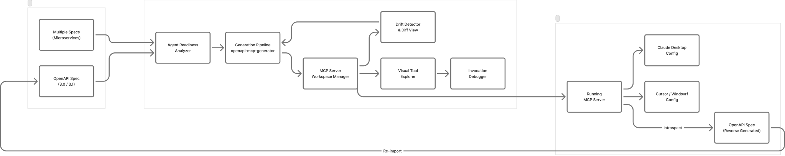
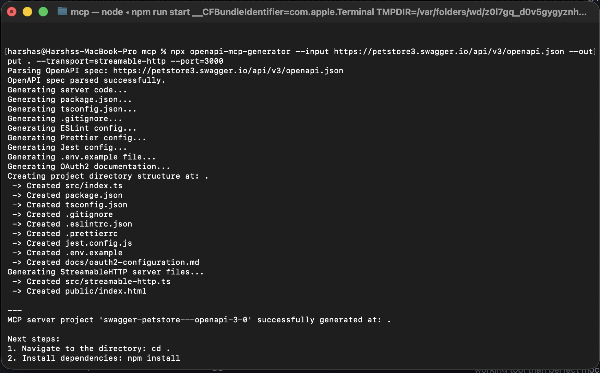
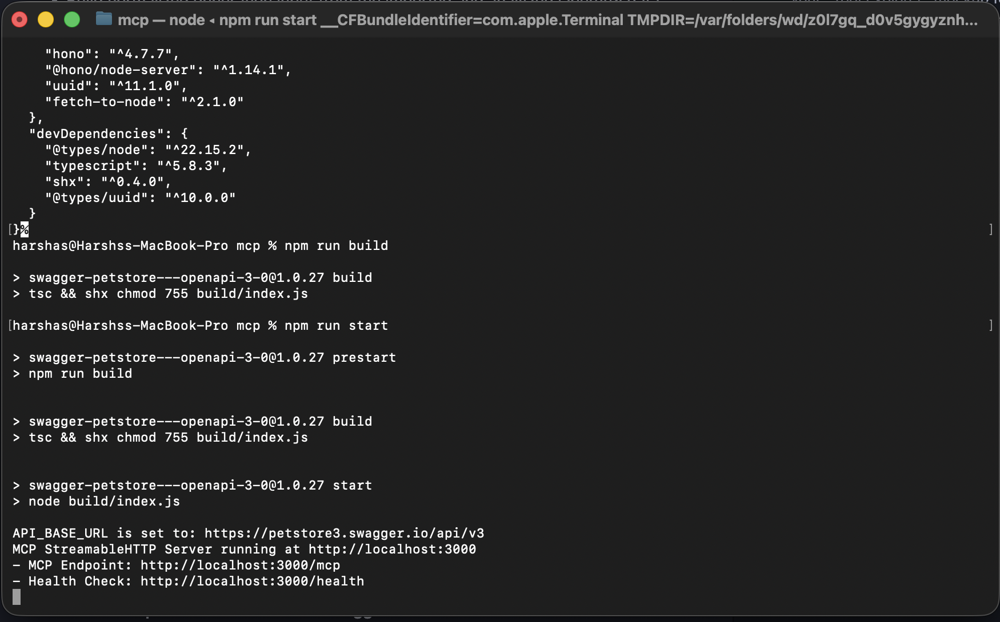
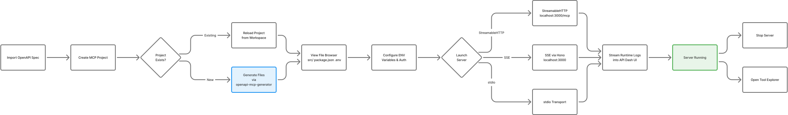
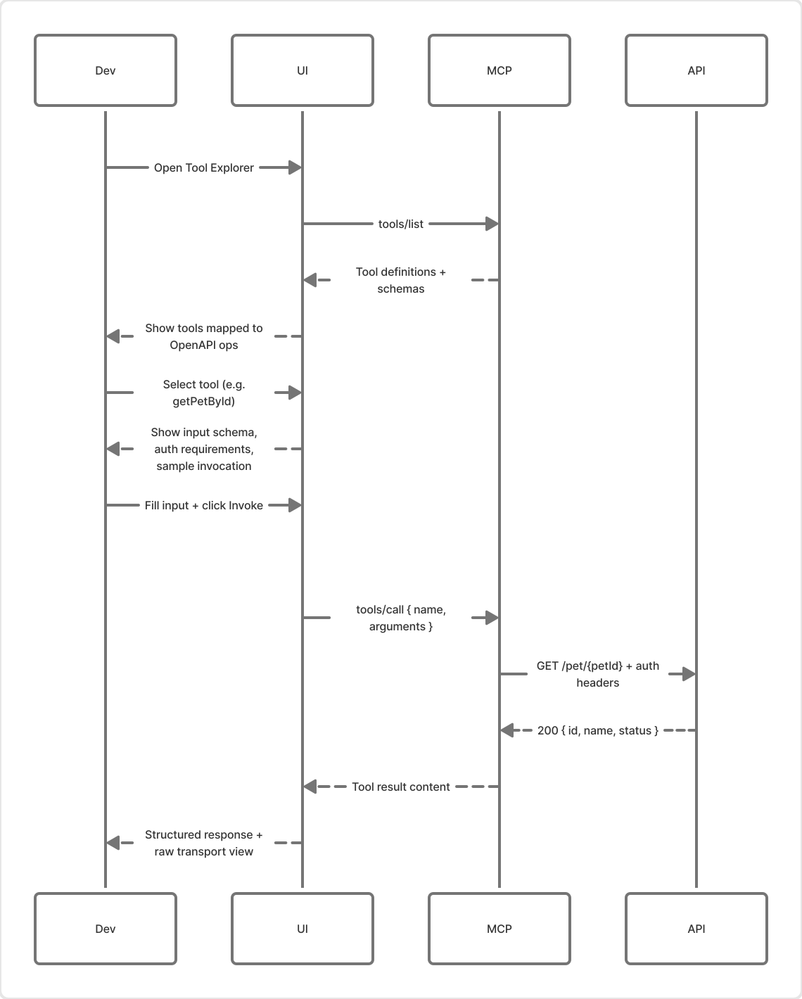
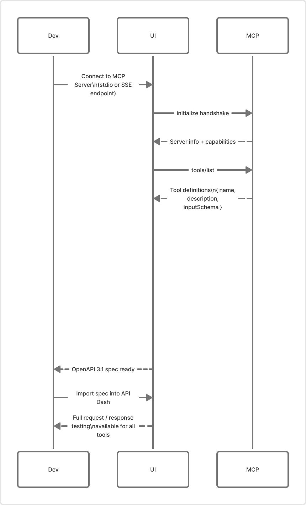
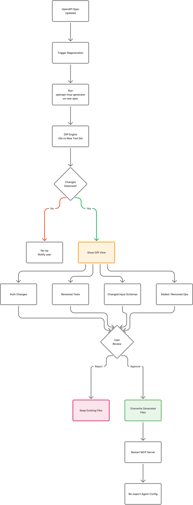
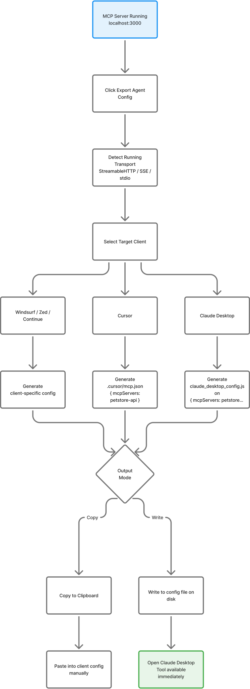
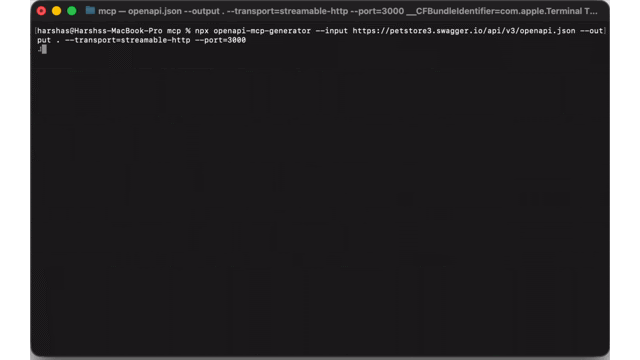

# GSoC 2026 Application: API-Agent Bridge — OpenAPI ↔ MCP Forge for API Dash

### About

1. **Full Name:** Harsha Vardhan
2. **Contact Info:** harshadots@gmail.com
3. **Discord Handle:** har.sha
4. **Home Page:** https://harshakm.vercel.app
5. **Blog:** N/A
6. **GitHub:** https://github.com/harsha-iiiv
7. **LinkedIn / Socials:** [linkedin.com/in/hs-73a518354](https://linkedin.com/in/hs-73a518354) · [@sdotharsha](https://x.com/sdotharsha)
8. **Time Zone:** PST (UTC -8) — Long Beach, CA
9. **Resume:** [harshakm.vercel.app](https://harshakm.vercel.app)

---

### University Info

1. **University:** California State University, Long Beach (CSULB)
2. **Program:** MS, Information Systems
3. **Year:** 1st Year (started Aug 2025)
4. **Expected Graduation:** May 2027

> B.Tech, Computer Engineering — IIIT Vadodara, India (May 2021)

---

### Motivation & Past Experience

**1. Have you worked on or contributed to a FOSS project before? Can you attach repo links or relevant PRs?**

Yes. My open-source work spans mentorship, tooling, and shipped production libraries.

**openapi-mcp-generator** — https://github.com/harsha-iiiv/openapi-mcp-generator

This is my most significant OSS contribution and is directly central to this proposal. It is a TypeScript CLI and library that converts any OpenAPI 3.0+ specification into a fully functional MCP server. As of March 2026:

- **547 GitHub stars, 76 forks**
- **113,164 total npm downloads**
- **35,520 downloads in the last 30 days** (~1,200/day)
- **13,852 downloads in the last 7 days**
- Version **3.3.0** — actively maintained across 14 releases since March 2025

This is not a proof of concept. It is a tool that real developers are using to bridge their existing REST APIs into agent-native workflows today.

**api-as-agent** — https://github.com/harsha-iiiv/api-as-agent

A Python project that transforms the traditional API interaction model with an intelligent natural language interface — a direct predecessor to the ideas in this proposal.

**browser-flow** — https://github.com/harsha-iiiv/browser-flow

A Node.js Express API for controlling a browser with natural language commands. Early exploration of agent-controlled tooling.

**LinkedIn Reverse Lookup** — https://github.com/harsha-iiiv/lInkedIn-reverese-lookup — 38 stars

**CircuitVerse** — Google Code-In 2019 Mentor. Helped student contributors understand open-source workflows on the CircuitVerse simulator platform. [Fork](https://github.com/harsha-iiiv/CircuitVerse)

**Hackathon Projects (FOSS-adjacent):**
- **PulseCall** — IBM CSU AI Hackathon 2026 Winner. Real-time AI communication platform.
- **VibeCheck** — CSULB BeachHacks 9.0 Winner. Mood-aware app built in 24 hours.
- **SkillBridge** — AWS Irvine Hackathon Winner. AI-powered skills marketplace.
- **Research Hub** — Internal research collaboration tool built and shipped during my MS program.

**Professional Experience (relevant to OSS work):**
- **StaynEarn** — Backend Engineer. Architected REST APIs and service layers used in production.
- **DialogueIQ** — Founding Engineer. Built core product from scratch; shaped technical direction from day one.
- **Stealth Startup** — Team Lead. Led a small engineering team shipping features under tight timelines.

**API Dash** — Actively studying the codebase, architecture, and proposal landscape to contribute meaningfully within the project's direction.

---

**2. What is your one project/achievement that you are most proud of? Why?**

`openapi-mcp-generator`. Not because of the star count, but because of what the download curve tells me.

I built the first version in March 2025 because I was frustrated — I had an OpenAPI spec, I wanted to give an AI agent access to my API, and there was no clean path between the two worlds. So I built the bridge myself.

What makes me proud is that 113,000 developers since then have faced the same exact problem and found the same tool. It taught me that the most valuable engineering work is building at the seam between two ecosystems that are growing independently but haven't yet connected.

That same insight is the foundation of this GSoC proposal.

---

**3. What kind of problems or challenges motivate you the most to solve them?**

The problems that excite me most are the ones where two well-designed systems exist independently but nobody has built the right bridge between them. OpenAPI and MCP are the perfect example right now:

- OpenAPI is mature, battle-tested, and describes almost every production API in existence
- MCP is rapidly becoming the standard tool interface for AI agents
- But developers who want their API accessible to agents still have to manually write glue code with very little visibility into what gets generated or why it breaks

I enjoy designing bridges because they require systems thinking, careful abstractions, and an obsession with developer experience. Shipping `openapi-mcp-generator` gave me deep intuition about where that conversion fails and what makes it excellent.

---

**4. Will you be working on GSoC full-time?**

Yes, with one caveat: I am enrolled in the MS Information Systems program at CSULB (started Aug 2025, graduating May 2027). The GSoC coding period falls during the summer semester break, so there are no conflicting coursework obligations. GSoC will be my primary commitment during the coding period and I can commit consistent weekly hours with regular progress updates.

---

**5. Do you mind regularly syncing up with the project mentors?**

Not at all — I strongly prefer it. This project touches API design, protocol boundaries, and developer UX simultaneously. Tight mentor feedback loops will help validate scope early and prevent investing in wrong directions. I will share weekly progress and flag blockers proactively.

---

**6. What interests you most about API Dash?**

API Dash is one of the few open-source API tools that is genuinely evolving with the AI tooling landscape rather than bolting AI on as an afterthought. Its architecture — clean separation between `apidash_core` and the app layer, cross-platform Flutter foundation, and a community that is already thinking about MCP and agent workflows — makes it the right foundation for this kind of feature.

It already understands APIs deeply: requests, environments, auth, collections, debugging. Extending that into an agent-facing workflow is a natural next step, not a pivot.

---

**7. Can you mention some areas where the project can be improved?**

The biggest untapped opportunity is becoming the place where developers don't just call APIs — they transform them into agent-ready interfaces and maintain that transformation over time.

Today there is no strong visual workflow for:
- Converting an OpenAPI spec into a working MCP server
- Inspecting what the agent actually sees when it discovers those tools
- Testing tool invocations with real debugging visibility
- Detecting when spec changes break the MCP contract
- Going the other direction: introspecting an existing MCP server and generating its documentation

API Dash is uniquely positioned to own this entire workflow.

---

**8. Have you interacted with and helped the API Dash community?**

I have been actively reviewing the repository structure, architecture decisions, and proposal landscape to ground this proposal in the project's actual direction. I am engaging through proposal discussions and will continue through Discord, issue conversations, and code contributions tied to this scope.

---

### Project Proposal Information

**1. Proposal Title**

API-Agent Bridge: OpenAPI ↔ MCP Forge for API Dash

---

**2. Abstract**

The Model Context Protocol is becoming the standard tool interface for AI agents. OpenAPI already describes the vast majority of production REST APIs. These two worlds are growing fast but remain disconnected — developers who want to expose their APIs to agents must manually write generation pipelines, debug opaque MCP servers, and repeat the process every time the spec changes.

This project turns API Dash into a **bidirectional API-Agent Bridge**: a visual workflow where developers can import an OpenAPI spec, generate a production-ready MCP server, launch and inspect it locally, test tool invocations with full debug visibility, detect spec drift, and one-click export the MCP config directly into Claude Desktop or Cursor. The reverse direction is also supported: connect to any live MCP server and reverse-engineer its OpenAPI documentation.

The generation engine is my existing [`openapi-mcp-generator`](https://github.com/harsha-iiiv/openapi-mcp-generator) — a published, actively maintained tool with **547 stars and 113K+ downloads**. This proposal is not a research experiment. It is integration and product work around a real, proven engine.

---

**3. Detailed Description**

### The Problem



Most production APIs have OpenAPI specs. Most AI agents speak MCP. The gap between them is currently filled with ad-hoc scripts, undocumented servers, and no tooling for maintenance. Specific pain points:

- No visual way to see what tools an agent gets from your API
- Generated MCP servers break at runtime for auth, naming, or schema reasons — with no debug surface
- When the API spec changes, developers have no diff to understand what broke
- MCP servers have no reverse documentation — if you receive a server, there is no spec for it

API Dash understands APIs deeply. It is the right place to solve all of this.

---

### Core Architecture

The project is structured as six tightly integrated layers:

#### A. OpenAPI Import and Analysis Layer

Parse OpenAPI 3.0 / 3.1 documents and extract a normalized internal model:
- Operations, tags, path/query/header/body parameters
- Security schemes and auth requirements
- Request body content types and response schemas
- Descriptions and examples for agent-readiness evaluation

This layer integrates cleanly with existing and planned OpenAPI support in API Dash.

#### B. Agent Readiness Analyzer (New)

Before generation, run a quality pass over the imported spec and score each operation for agent-friendliness:

| Check | Example Issue | Severity |
|-------|--------------|----------|
| Tool name clarity | `POST /usr/upd` → ambiguous | High |
| Description completeness | Missing `description` on parameter | Medium |
| Destructive exposure | `DELETE /users/{id}` exposed by default | High |
| Response schema richness | Returns `{}` — agent cannot parse result | Medium |
| Auth mapping coverage | Security scheme with no environment variable | High |

The analyzer surfaces a scored report with inline fix suggestions before any code is generated. This makes `openapi-mcp-generator` a quality advisor, not just a converter.


<!-- Save your first terminal screenshot here as terminal_generation.png -->

#### C. Generation Pipeline (Powered by openapi-mcp-generator)

Use `openapi-mcp-generator` as the generation engine, adapted for API Dash's architecture:

- Build normalized generation input from the imported and analyzed OpenAPI data
- Expose generator options in the API Dash UI: transport mode (stdio / SSE / StreamableHTTP), naming strategy, tag-based grouping, safe operation filtering
- Support multi-spec composition: import multiple OpenAPI specs (e.g. separate microservice specs) and generate a single unified MCP server surface
- Write generated MCP project files to a managed workspace location inside API Dash

The generator remains a standalone reusable library. API Dash provides the orchestration, UX, and persistence layer around it.


<!-- Save your second terminal screenshot here as terminal_server_running.png -->

#### D. Local MCP Server Workspace Manager

API Dash manages generated MCP projects as local artifacts with a persistent workspace:

- Create a new MCP project from a spec
- Reload a previously generated project
- View generated file structure and configuration state
- Launch and stop the local MCP server (process lifecycle management)
- Stream runtime logs and status into the API Dash UI



#### E. Visual Tool Explorer and Invocation Debugger

The most visible feature — makes the entire workflow feel alive.

**Tool Explorer view:**
- Source OpenAPI operation ↔ generated MCP tool name and description
- Input schema rendered from Zod-generated types
- Auth requirements and env variable mapping
- Sample invocation with one-click test

**Invocation Debugger:**
- Input payload editor
- Resolved auth and environment variables
- Raw transport request (stdio JSON or HTTP body)
- MCP tool response with structured result rendering
- Error classification: schema validation, auth failure, upstream API error, transport error





#### F. Regeneration and Drift Detection

APIs change. This layer makes the forge usable in a real iterative workflow:

When the source spec changes and the user triggers a regeneration:
- Diff old vs new tool set: renamed tools, changed input schemas, added/removed operations, changed auth requirements
- Show a visual diff before overwriting any generated files
- Surface breaking changes (a tool renamed means every agent using that name breaks)
- Allow selective regeneration — keep manual overrides, regenerate only changed tools



#### G. One-Click Agent Integration Export (New)

After the MCP server is generated and running locally, API Dash can auto-generate the configuration files for popular agent clients:

- **Claude Desktop** → writes to `claude_desktop_config.json`
- **Cursor** → writes `.cursor/mcp.json`
- **Windsurf, Zed, Continue** → appropriate config formats

A single button: **"Export Agent Config"** — API Dash writes the config pointing to the running local server. The developer can immediately open Claude Desktop and talk to their API through an agent.



> **Live demo**: openapi-mcp-generator generating a full MCP server from the Petstore OpenAPI spec — build, start, running at localhost:3000
> 

#### H. Reverse Direction — MCP Server → OpenAPI (Bidirectional Bridge)

This is the feature that makes the proposal truly differentiated.

Most MCP servers in the wild have no documentation. When a developer receives an MCP server endpoint, they have no spec to work with. API Dash can fix this by:

1. Connecting to any running MCP server (via stdio or SSE)
2. Calling `tools/list` to introspect all available tools
3. Reconstructing an OpenAPI 3.1 specification from the tool schemas, descriptions, and parameter types
4. Importing that spec back into API Dash for testing, editing, or sharing

**This closes the full circle:**

```
OpenAPI Spec
     │
     ▼ (generate)
  MCP Server  ─────────────────────────┐
     │                                 │
     ▼ (test & debug in API Dash)       │ (introspect & reverse)
 Agent Calls                           │
                                       ▼
                               OpenAPI Spec (regenerated)
```


No other tool in the open-source API tooling space currently does this.

---

### Integration with openapi-mcp-generator

My npm package already provides:
- Full OpenAPI 3.0/3.1 parsing
- Tool schema generation with Zod validation
- Authentication mapping (API key, Bearer, Basic, OAuth2)
- Three transport modes (stdio, SSE via Hono, StreamableHTTP)
- Programmatic API (`getToolsFromOpenApi()`) for embedding in other tools
- HTML test clients for web transports
- TypeScript output with tsconfig and package.json scaffolding

Within GSoC, I will adapt this package so it integrates cleanly with API Dash's Dart/Flutter architecture via a local process bridge, and refine it based on real usage patterns I have observed across 113K installs.

---

### Expected Deliverables

1. OpenAPI import → agent readiness analysis → MCP generation pipeline
2. Local MCP server workspace management (create, launch, stop, reload)
3. Visual MCP Tool Explorer with OpenAPI ↔ tool mapping
4. Interactive tool invocation and debugging UI
5. Spec drift detection and regeneration diff workflow
6. One-click Claude Desktop / Cursor / Windsurf config export
7. Bidirectional reverse: MCP server introspection → OpenAPI spec generation
8. Multi-spec composition for microservice environments
9. Tests for critical generation, parsing, diffing, and introspection paths
10. Documentation and example projects for contributors

---

**4. Weekly Timeline**

### Community Bonding Period (May 8 – Jun 1)

- Set up full development environment; get comfortable with `apidash_core` and relevant Flutter packages
- Review all existing OpenAPI and MCP-related discussions, code paths, and open issues
- Finalize exact integration boundary between API Dash and `openapi-mcp-generator`
- Define internal data model for MCP workspace state and generation config persistence
- Draft technical design doc and risk register; validate with mentors
- Begin preparatory OSS contributions to API Dash unrelated to proposal scope

---

### Week 1 (Jun 2 – Jun 8)

- Audit existing OpenAPI-related utilities in `apidash_core`
- Define normalized intermediate model for OpenAPI → MCP generation input
- Sketch generation config schema including transport, naming, auth, and filter options
- Validate data model and package boundaries with mentors

### Week 2 (Jun 9 – Jun 15)

- Implement OpenAPI import and normalized internal model
- Add generation config persistence (save/restore project state)
- Wire API Dash actions to generation pipeline adapter
- First round of unit tests for import and normalization

### Week 3 (Jun 16 – Jun 22)

- Build Agent Readiness Analyzer: per-operation scoring logic
- Implement severity classification (High / Medium / Low) and fix suggestions
- Add Agent Readiness panel to UI with per-operation badges
- Tests for readiness scoring edge cases (missing descriptions, destructive endpoints, etc.)

### Week 4 (Jun 23 – Jun 29)

- Implement generation options UI (transport, naming strategy, safe operation filter)
- Wire generation config to `openapi-mcp-generator` programmatic API
- Support tag-based tool grouping from OpenAPI tags
- Add auth/env variable mapping configuration to generation flow
- Tests for generation option permutations

### Week 5 (Jun 30 – Jul 6)

- Implement MCP Server Workspace Manager (create, list, reload projects)
- Add generated file browser and configuration state view inside API Dash
- Implement workspace persistence across sessions
- Tests for workspace state management

### Week 6 (Jul 7 – Jul 13)

- Implement local MCP server process launch and stop (process lifecycle)
- Stream runtime logs and status into API Dash UI
- Support stdio and SSE transport modes in launch flow
- Handle startup errors and surface them clearly

### Midterm Checkpoint (Jul 14 – Jul 18)

- Phase 1 deliverables complete and merged: import, analysis, generation, workspace, launch
- Mentor review and scope validation for Phase 2
- Buffer for any Phase 1 cleanup or rework

### Week 7 (Jul 15 – Jul 21)

- Build Visual MCP Tool Explorer
- Implement source operation ↔ generated tool mapping view
- Add input schema rendering and sample invocation in the explorer
- Add auth requirement and env variable visibility per tool

### Week 8 (Jul 22 – Jul 28)

- Implement interactive tool invocation UI (input editor, submit, response viewer)
- Add error classification layer (schema, auth, upstream, transport)
- Improve debugging traces: raw request visibility, structured response rendering
- Tests for invocation and error handling paths

### Week 9 (Jul 29 – Aug 4)

- Implement spec drift detection: compare old vs new tool set on regeneration
- Build diff view for renamed, changed, added, and removed tools
- Add breaking change warnings for incompatible schema changes
- Selective regeneration: allow keeping manual overrides

### Week 10 (Aug 5 – Aug 11)

- Implement one-click agent config export (Claude Desktop, Cursor, Windsurf, Zed)
- Auto-populate config with running server address and transport settings
- Add copy-to-clipboard and write-to-disk options
- Implement reverse direction: connect to live MCP server via `tools/list` introspection

### Week 11 (Aug 12 – Aug 18)

- Build MCP → OpenAPI reconstruction from introspected tool schemas
- Import reconstructed spec back into API Dash for testing and editing
- Implement multi-spec composition: merge multiple OpenAPI specs into one MCP server
- Resolve naming conflicts and tag grouping across composed specs
- Expand test coverage across all layers: end-to-end generation, runtime, drift, reverse

### Week 12 (Aug 19 – Aug 25)

- Performance and resilience pass: test against large and messy real-world specs
- Polish all UI panels; ensure consistency with API Dash design language
- Write contributor documentation and user guides
- Prepare demo assets: GIFs, screenshots, example projects
- Final mentor review; submission readiness

---

### Final Deliverable Summary

By the end of GSoC, API Dash will be able to:

- Import any OpenAPI spec and score it for agent readiness before generation
- Generate a production-ready MCP server from that spec using a battle-tested engine
- Launch and manage that server locally with live log visibility
- Inspect the generated tool surface with full OpenAPI ↔ MCP mapping
- Invoke tools interactively with deep debugging support
- Detect and diff spec changes before regenerating
- Export one-click agent configs for Claude Desktop, Cursor, and other MCP clients
- Introspect any live MCP server and reverse-engineer its OpenAPI documentation
- Compose multiple microservice specs into a single unified MCP server

This makes API Dash the **only open-source tool** that bridges OpenAPI and MCP in both directions — with full visual tooling, debugging, and developer workflow support.
