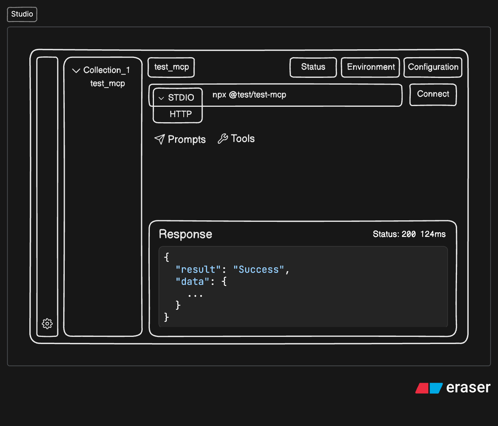
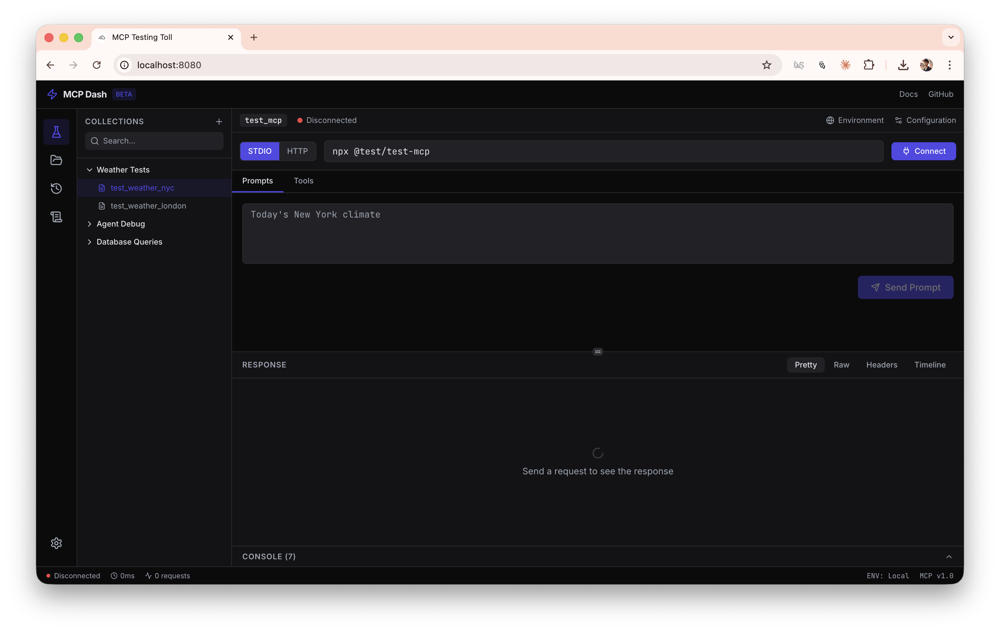

### About

1. Full Name: Khushal Khandelwal
2. Contact info (public email): khandelwalkhushal79@gmail.com
3. Discord handle in our server (mandatory): khushalk
4. Home page (if any): https://khushalk.xyz/
5. Blog (if any)
6. GitHub profile link: https://github.com/K-Khushal
7. Twitter, LinkedIn, other socials: https://www.linkedin.com/in/khushal-khandelwal/
8. Time zone: UTC+05:30 (IST)
9. Link to a resume (PDF, publicly accessible via link and not behind any login-wall): https://drive.google.com/file/d/1SbZ0T4GPMD0zDjGbzOScnnFBwtupuGJi/view?usp=sharing

### University Info

1. University name: Swarrnim startup and innovation university
2. Program you are enrolled in (Degree & Major/Minor): B.Tech CSE
3. Year: Graduated
4. Expected graduation date: 2025

### Motivation & Past Experience

##### 1. Have you worked on or contributed to a FOSS project before? Can you attach repo links or relevant PRs?
- No, I am very new to open source. I started exploring open source just this month and began contributing. I have raised a PR in another organization. (PR: https://github.com/RocketChat/Rocket.Chat/pull/39009

##### 2. What is your one project/achievement that you are most proud of? Why?
- If I talk about projects, I built an AI chatbot with persistent memory across chats. I created it from scratch using documentation and figured out everything on my own. The challenging parts (at that time) were redirection, state management, and building a proper UI with smooth fallbacks and no jump or lag issues.
- Apart from tech, I am very proud that I was part of the core team that organized a 36-hour international hackathon with 400+ offline participants. I have also been very active in tech communities like Google Developer Club, OSS Weekend, etc.

##### 3. What kind of problems or challenges motivate you the most to solve them?
- I love building things that have real impact and are used by real users. We are in an era where DX is improving day by day with great libraries and tools. I am really passionate about working in this space. Creating tools which will be used by developers is my biggest motivation.

##### 4. Will you be working on GSoC full-time? In case not, what will you be studying or working on while working on the project?
- Yes, I will be working on GSoC full-time. Currently, I have a full-time job which will end on 20 April. After that, I will be fully dedicated to GSoC.

##### 5. Do you mind regularly syncing up with the project mentors?
- I am available anytime after 8 PM IST. In fact, it would be great to regularly discuss problems, solutions, and approaches on calls.

##### 6. What interests you the most about API Dash?
- I found API Dash interesting because it is available on both mobile and desktop, which makes it very accessible. It is lightweight and easy to use compared to other API tools. The code generation feature for multiple languages is also very useful for developers. Overall, I am interested in API Dash because it focuses on good developer experience and makes API testing simple and efficient. Moreover, it is open source, which makes it even more exciting to contribute and improve.

##### 7. Can you mention some areas where the project can be improved?
- Support for WebSocket (which is already in progress). It would be great if it also had an IDE extension. Another idea is to provide an iframe or SDK that can be integrated into API documentation of different applications, where users can test APIs directly on the docs page itself. This is just a thought, as I do not know much about Dart or the current codebase yet.

##### 8. Have you interacted with and helped API Dash community? (GitHub/Discord links)
- Yes, I have participated in and interacted with the community on Discord and GitHub.
- Discord: https://discord.com/channels/920089648842293248/1284452937330065460/1475750572832329831
- Github: https://github.com/foss42/apidash/discussions/1225#discussioncomment-16010532

## Project Proposal Information

## 1. Proposal Title: MCP DASH (MCP Testing)

#### Quick Links
- [Discussion Logs](https://github.com/foss42/apidash/discussions/1225)
- [Demo Video](https://youtu.be/4ICjtz_p2Pc)

#### References
- https://modelcontextprotocol.io/docs/learn/architecture
- https://www.mindstudio.ai/blog/what-are-mcp-servers
- https://www.speakeasy.com/mcp/monitoring-mcp-servers
- https://zeo.org/resources/blog/mcp-server-observability-monitoring-testing-performance-metrics
- https://medium.com/%40yash.p_60148/top-tools-for-real-time-mcp-server-monitoring-and-analytics-dbae42da5aab
- https://dev.to/ashita/a-practical-guide-to-building-mcp-apps-1bfm
- https://github.com/IBM/mcp-context-forge/issues/301
- **[Developer Feedback Survey](https://tally.so/r/gDAN6J). Collected responses from developers working with MCP tools.**


## 2. Project Description

The Model Context Protocol (MCP) enables AI agents to interact with external tools in a structured way. MCP servers expose tools that agents can call with arguments and receive results from. As MCP adoption grows, developers are building more MCP servers and tools. However, the developer workflow for testing MCP tools is still very manual. This makes debugging more complex compared to traditional APIs.

API Dash already provides strong tooling for inspecting APIs. Extending it with MCP support would help developers debug and test MCP servers more effectively.

MCP Dash(MCP Testing Tool) is a developer tool designed to help engineers debug, test, and observe MCP servers and clients while building AI agents and integrations.

The primary motivation is to improve DX (Developer Experience) and UX (User Experience) when working with the MCP ecosystem. The tool aims to provide:

- Clear visibility into MCP communication and logs
- Structured UI for testing workflows and invoking tools
- Multi-environment configuration support
- Streaming response visualization
- Better debugging with error insights
- Improved iteration speed when building AI agents

#### 2.1 Problem (By Survey Insights)

1. Difficult to test MCP tools
- No standardized UI for invoking tools manually
- Hard to simulate real-world tool usage scenarios

2. Poor visibility into MCP communication. Developers cannot easily inspect: 
- requests
- responses
- tool calls
- errors
- metadata

3. Debugging is cumbersome. Hard to identify:
- malformed payloads
- schema mismatches
- tool failures
- transport issues (stdio / SSE)

4. Iteration speed is slow. Each test requires:
- re-running agents
- modifying code
- re-sending requests manually

5. Poor developer ergonomics
- Lack of observability tools tailored for MCP workflows
- Hard to track interactions between MCP client, MCp server and tools


#### 2.2 Key Differentiators

| Gap in Existing Tools       | MCP Studio Solution                                   |
| --------------------------- | ----------------------------------------------------- |
| No persistent history       | Rolling local history                                 |
| Weak environment management | Multi-environment support with variable interpolation |
| No collections              | Save and replay tool calls                            |
| No response diffing         | Side-by-side comparison of results                    |
| Poor debugging visibility   | Protocol-level logs                                   |
| Limited UX                  | Quality UI/UX                                         |
| Limited auth configuration  | Custom headers and env variable injection             |
| No performance visibility   | Request lifecycle timeline                            |
| No automated validation     | Test assertions (planned)                             |


## 3. Project Implementation

MCP Dash will be a local web app + local Bun backend Browser UI at localhost:8080, with Bun server running locally to handle subprocess spawning and MCP communication. Chosen because STDIO transport requires spawning subprocesses because a browser alone cannot do this.

#### 3.1 Core Features 


**1. Transport Layer**

- Support STDIO Transport and HTTP/SSE Transport.
- Single MCP server session at a time. One active connection per running instance.

**Task:**
- `ConnectionPanel` - transport selector + connection config
- `EnvironmentManager` - multi-env (Local/Staging/Prod) with {{VAR}} support and highlighting

1. Backend Server (Bun + TypeScript)
- Bun runs TypeScript natively with no build step, has built-in WebSocket server and subprocess API (Bun.spawn), and shares the same language as the frontend enabling shared types.
2. STDIO Transport (form + config file)
- A structured form with fields for command, args, working directory, and env vars is the primary input.
- Additionally, users can import from `claude_desktop_config.json` (the format used by Claude Desktop and Cursor), enabling zero-manual-entry setup for existing MCP server configs.
3. HTTP Transport (Authentication)
- Custom headers + {{VAR}} interpolation. 
- Users can define request headers (e.g. Authorization: Bearer {{API_KEY}}). Values reference environment variables using {{VAR_NAME}} syntax, keeping secrets in the env manager rather than hardcoded in connection configs.


**2. Tool and Prompt support**

- Automatically detect available tools exposed by MCP servers.
- Display tool schema. Show parameters and expected structure.
- Allow manual execution of MCP tools with structured input forms.
- Support raw JSON editing mode.

**Task:**
- `ToolExplorer` - tool list + parameter form + form/JSON toggle
- `PromptPanel` - prompt invocation UI

1. Dynamic form builder 
- Flat primitives + one-level nesting + raw JSON fallback Dynamically generates forms from MCP tool JSON Schemas.
- Supports flat types (string, number, boolean, enum), arrays of primitives, and one level of nested objects this covers ~95% of real-world MCP tools.
2. A raw JSON editor tab handles anything the form builder can't render.


**3. Request / Response Inspector**

- Provide structured visualization of request, response, metadata and timing.
- Response streaming with progressive rendering.

**Task:**
- `ResponseViewer` - pretty/raw/headers/timeline tabs

1. Browser - Backend Communication 
- WebSockets full-duplex persistent connection per session. Naturally maps to MCP's message-passing model and allows the backend to push streamed responses, logs, and connection status updates to the browser in real time.
2. Message Protocol
- Typed JSON with discriminated unions. A single shared `packages/types` file defines `ClientMessage` and `ServerMessage` union types. Simple, fully type-safe, no extra dependencies. Both frontend and backend import from the same types package.
3. Response Streaming
- Stream chunks progressively over WebSocket. The backend forwards MCP response chunks to the browser as they arrive. The UI renders output progressively, giving real-time feedback for slow or long-running tools.
4. Response diff viewer to compare results across executions.
- Side-by-side JSON diff between any two entries in the history panel. Replaces automated assertions.

**4. Error Handling/Observability**

- Serialization issues, Schema mismatches, Runtime tool errors, Protocol failures.
- Protocol-level log capture (MCP events/ stdout / stderr).

**Task:**
- `LogsPanel` - collapsible console with filtering

1. Log Capture
- Protocol events + raw subprocess output. The `LogsPanel` receives two streams:
  1. Structured MCP protocol events (tool call, response, error, initialize) 
  2. Raw stdout/stderr from the subprocess.
2. Error Handling
- Toasts for connection-level errors: Connection failures (server crash, timeout, disconnect) as toast notifications. 
- Inline for tool-level errors: Tool invocation errors show inline in the `ResponseViewer` with the full error payload.
- All errors are also captured in the `LogsPanel` for deep debugging.


#### 3.2 Architecture

This project uses a monorepo (Turborepo) for clear separation of concerns and scalability.

```
mcp-dash/             # Turborepo monorepo
├── apps/
│   ├── web/          # React frontend
│   └── server/       # Bun backend
├── packages/
│   ├── types/        # Shared TS types (messages, schemas, config)
│   └── mcp-client/   # MCP client wrapper (reusable, testable)
└── turbo.json
```

#### 3.3 Tech Stack

**Frontend**: React + TypeScript + Tailwind + shadcn/ui
**Backend**: Bun (TypeScript-native, built-in WebSocket + subprocess)
**Communication**: WebSockets with typed JSON discriminated unions
**Storage**: Local Persistence JSON files at `~/.mcp-studio/` (no database, no auth). All data stays on the developer's machine and is portable and git-friendly

> The frontend communicates through a `StudioTransport` interface, never directly via WebSocket calls. This enables a future Electron migration (swap `WebSocketTransport` for `ElectronIPCTransport`).

#### 3.4 Design and Prototypes

**Initial Mockup:**




**Initial POC:** [Demo Video](https://www.youtube.com/watch?v=4ICjtz_p2Pc)



## 4. Schedule of Deliveries (175 hours/12 Week)

| Week | Deliverable                                                                     |
| ---- | ------------------------------------------------------------------------------- |
| 1    | Turborepo monorepo setup, shared types package, WebSocket message protocol      |
| 2    | Bun server — WebSocket server, session manager, connection lifecycle            |
| 3    | STDIO transport — subprocess spawning, env var injection, config file import    |
| 4    | HTTP/SSE transport — connection, custom headers, {{VAR}} interpolation          |
| 5    | Real tool discovery — fetch schemas from live MCP server                        |
| 6    | Dynamic form builder — flat + one-level nesting + raw JSON fallback             |
| 7    | Response streaming — chunk forwarding over WebSocket, progressive UI rendering  |
| 8    | Log capture — protocol events + raw stdout/stderr, filter in UI                 |
| 9    | Persistent history — rolling JSON file, history panel, replay from history      |
| 10   | Response diff view (compare last history entries)                               |
| 11   | Frontend improvement/accessibility and collections persistence                  |
| 12   | Polish, error handling, docs, demo video, npx packaging                         |

#### 4.1 Stretch Goals

1. Automated value assertions + test runner
- Value-based assertions (e.g. response.temperature is a number, response.unit equals "celsius") would turn MCP Dash into a proper test runner.
- However, the UI alone requires a field picker, operator selector, test runner, and results view, estimated 3-4 weeks.
2. Snapshot testing
3. MCP Resources support
- Tools are the primary use case. Prompts are low-effort additions (simpler schema, no dynamic invocation).
- Resources require a fundamentally different UI paradigm (URI browser, binary content rendering, subscription model), estimated 2 weeks of additional work.
4. Electron desktop application (`apps/electron/` added to monorepo)
- Migration is designed to be easy, the frontend uses a `StudioTransport` interface and swapping `WebSocketTransport` for `ElectronIPCTransport` is a one-line change. Estimated migration effort would be 1-2 weeks of packaging/IPC.
