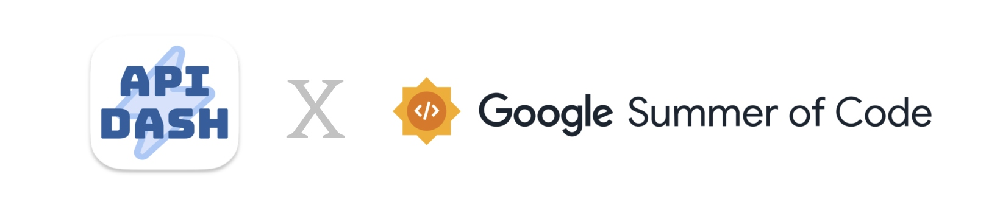

# MCP Testing: Design & Build MCP Server and Client Testing in API Dash

### Personal Information
- **Full Name:** Khushboo
- **Contact Info:** khushb0518@gmail.com `+919718648169`
- **Discord Handle:** `khushboo0596`
- **GitHub Profile:** https://github.com/khushboo0518
- **LinkedIn:** https://www.linkedin.com/in/khushboo-a42a272b5/
- **Resume:** [Link](https://drive.google.com/file/d/1noYDO3M48ZtmEnBv1ORb2qL_fTN7GJmr/view?usp=drive_link)
- **Time Zone:** IST — GMT +05:30

### University Information
- **University Name:** Dronacharya College of Engineering
- **Program Enrolled In:** B.Tech — Computer Science (AIML) & Engineering
- **Year:** 3rd Year
- **Expected Graduation Date:** June 2027

### Motivation & Past Experience

1. Have you worked on or contributed to a FOSS project before? Can you attach repo links or relevant PRs?
   - **ANS:** No direct FOSS contributions yet — but I have worked on large production codebases. I also engaged with the API Dash community early by posting an architecture proposal in discussion thread [#1225](https://github.com/foss42/apidash/discussions/1225) before submitting this proposal. GSoC is my formal entry into open source.

2. What is your one project/achievement that you are most proud of? Why?
   - **ANS:** **MCPilot** — an MCP-based cloud automation system I built at Yotta Private Limited. I engineered an orchestration layer on Apache CloudStack APIs + Claude AI that automated full VM, VPC, and networking workflows. Setup time dropped from 20–30 min to under 5 min. What makes me proud is I didn't just use MCP as a library — I designed the tool schemas, debugged transport failures under production load, and handled async JSON-RPC edge cases. I learned the protocol from the inside out.

3. What kind of problems or challenges motivate you the most to solve them?
   - **ANS:** I am particularly motivated by challenges that address real pain points for developers. I thrive on problems that require creative and efficient solutions that scale. I enjoy opportunities that allow me to take ownership and make critical decisions that shape the direction of the solution.

4. Will you be working on GSoC full-time? In case not, what will you be studying or working on while working on the project?
   - **ANS:** Yes, I will primarily be working full-time on GSoC. Occasionally, I may have exams or course projects, but they will not impact my commitment to GSoC.

5. Do you mind regularly syncing up with the project mentors?
   - **ANS:** I am available after 3 PM IST and can get on calls when needed.

6. What interests you the most about API Dash?
   - **ANS:** What drew me in first was how fast and focused API Dash is — no clutter, no unnecessary features, just clean API testing that works. I've been using it locally and it genuinely feels like a tool built by developers who respect their users' time. The multi-format response support is something I didn't expect to love as much as I do. And when I saw MCP Testing on the ideas list, it felt like a perfect fit — a tool I already enjoy, working on a problem I've personally felt.

7. Can you mention some areas where the project can be improved?
   - **ANS:** Two things I'd love to add beyond this proposal: (1) a CLI mode so MCP test suites run in GitHub Actions without a GUI, and (2) an exportable HTML test report teams can attach to PRs as proof their MCP server contract is intact. I've already scoped both into my deliverables.

---

## Project Details

- **Project Title:** MCP Testing: Design & Build MCP Server and Client Testing in API Dash
- **Discussion Thread:** [#1225](https://github.com/foss42/apidash/discussions/1225)
- **Idea Description:** The Model Context Protocol (MCP) acts as the API layer of the AI world, defining a standard way for AI agents to discover, understand, and interact with tools, data, and software systems — much like REST or GraphQL do for traditional applications. Developers building MCP servers today have no systematic way to validate them. There is no assertion engine, no mock server, no CI integration — nothing. This project strengthens the MCP Developer ecosystem by designing and building the capability to **create and comprehensively test MCP servers and clients** directly inside API Dash. The goal is to give developers the same confidence testing MCP APIs that they already have testing REST APIs.

- **Abstract:**
  This project builds a **two-sided MCP testing system** inside API Dash. The **MCPServerTester** connects as an MCP client to any server, auto-discovers its tools, resources, and prompts, sends parameterized `tools/call` requests, and runs a composable **AssertionEngine** to validate every response — checking schema, types, values, ranges, and latency. The **MockMCPServer** simulates a server under fully controlled conditions — configurable tool stubs, error simulation (timeouts, schema mismatches, malformed responses), traffic recording, and deterministic replay — enabling developers to test exactly how their MCP clients behave under any scenario. A **React/TypeScript UI** integrated into API Dash provides a visual MCP Explorer, Request Builder, batch Test Runner, and Report Viewer. A standalone **mcp-test-utils Python library** exposes the same engine for CI pipelines with a single `assert results.all_passed`. A **working prototype** already demonstrates the core idea — 21 assertions across 4 test cases, all passing: [github.com/khushboo0518/mcp-tester-prototype](https://github.com/khushboo0518/mcp-tester-prototype)

- **Project Goals:**
  - **MCPServerTester** — A Python class that connects to any MCP server as a client via stdio, HTTP/SSE, or WebSocket. Auto-discovers all tools, resources, and prompts. Sends parameterized `tools/call` JSON-RPC 2.0 requests and collects responses for assertion validation. This is the engine that makes **server testing** possible.
  - **MockMCPServer** — A configurable fake MCP server that developers point their MCP clients at. Supports success stubs, error stubs, delay stubs, traffic recording via `TrafficRecorder`, and deterministic `ReplayEngine` for regression testing. This makes **client testing** possible without any real backend.
  - **AssertionEngine** — A composable, declarative assertion library: `has_key`, `key_equals`, `key_type`, `key_in_range`, `matches_schema`, `response_time_under`, and `custom()` for any user-defined logic. Each assertion is a **pure function** — testable, reusable, and composable. Handles LLM non-determinism gracefully.
  - **React/TypeScript UI** — A new **MCP Testing** section inside API Dash with four screens: MCP Explorer (browse server capabilities), Request Builder (compose tool calls visually), Test Runner (batch execution with live pass/fail per assertion), and Report Viewer (charts + HTML/JSON export).
  - **mcp-test-utils Python Package** — A standalone pip-installable package exposing the same engine as the GUI. CI-friendly, GitHub Actions compatible. Developers run MCP tests headlessly with `assert results.all_passed` — **fails the CI pipeline** if any assertion fails.
  - **MCP Apps Testing** — Extend the testing system to validate MCP App registrations: `ui://` resource URIs, correct MIME type (`text/html;profile=mcp-app`), tool-to-app linking via `_meta.ui.resourceUri`, `ui/initialize` handshake, host context support, and CSP declarations. This ensures developers can validate their MCP Apps are correctly built before testing them in hosts like VS Code. *(Incorporated after studying the [MCP Apps guide](https://dev.to/ashita/a-practical-guide-to-building-mcp-apps-1bfm) shared by mentors.)*

---

## Proposal Description

### Deliverables

1. **MCPServerTester** — Core Python class that connects to any MCP server as a client via stdio, HTTP/SSE, or WebSocket. Auto-discovers tools, resources and prompts. Executes `ToolTestCase` instances and runs assertions.
2. **TransportAdapter** — Abstraction layer that wraps stdio, HTTP/SSE, and WebSocket behind a single `connect()`/`send()`/`receive()` API so the tester never needs to know which transport is in use.
3. **AssertionEngine** — Composable assertion library. Developers declare what a response must look like. Engine runs each assertion and returns `TestResult(passed, error)`.
4. **MockMCPServer** — Simulates an MCP server with configurable tool stubs, error simulation, traffic recording, and ReplayEngine for regression testing.
5. **React/TypeScript UI** — New MCP Testing section in API Dash: MCP Explorer, Request Builder, Test Runner, Report Viewer.
6. **mcp-test-utils** — Standalone pip-installable Python package. Same engine as GUI. CI-friendly with GitHub Actions example.
7. **MCP Apps Testing** — Validate `ui://` resource registration, MIME type, tool-to-app linking, `ui/initialize` handshake, host context support, and CSP declarations.
8. **Test Reports** — JSON and HTML export from every test run, shareable as CI artifacts or PR attachments.

---

### Technical Details

---

### Overall System Architecture

[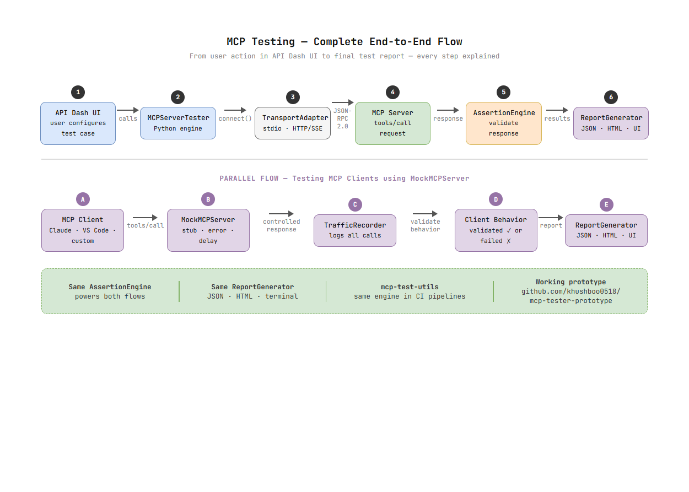](images/e2e_flow.png)

The complete end-to-end flow — from a user configuring a test in API Dash UI all the way to the final pass/fail report.

[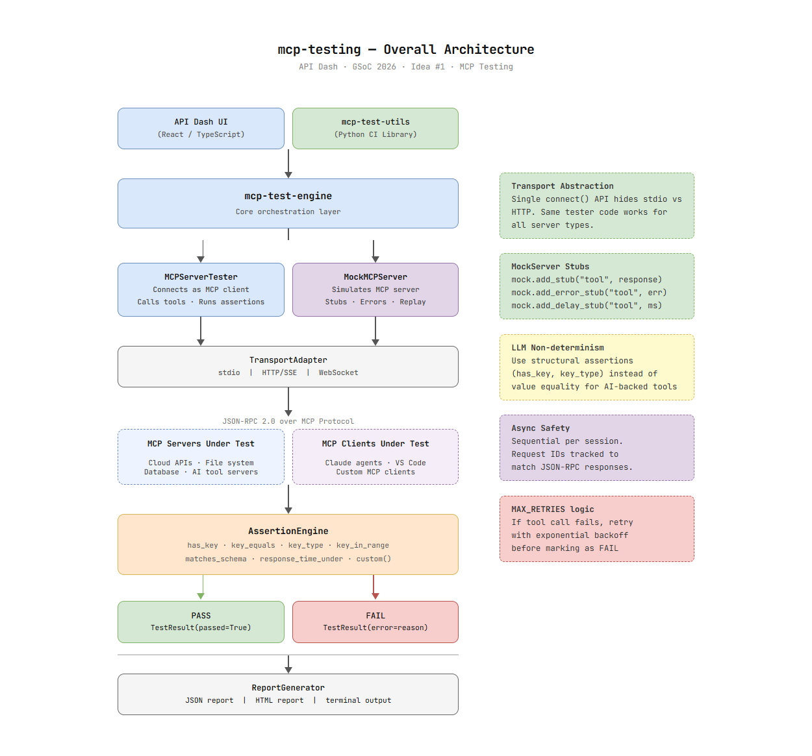](images/arch_main.png)

Parts of the MCP Testing Architecture:

1. **API Dash UI (React/TypeScript)** — frontend where users configure servers, build test cases, run suites, and view reports.
2. **mcp-test-utils (Python)** — same core engine exposed as a pip-installable package for CI pipelines.
3. **MCPServerTester** — connects as MCP client, runs discovery and tool calls, feeds responses into AssertionEngine.
4. **MockMCPServer** — simulates a real MCP server so MCP clients can be tested under controlled conditions.
5. **TransportAdapter** — hides transport complexity. Supports stdio, HTTP/SSE, and WebSocket.
6. **AssertionEngine** — runs composable assertions against every tool response. Returns `TestResult` per assertion.
7. **ReportGenerator** — aggregates all `TestResult` objects into JSON, HTML, or terminal output.

---

### MCPServerTester

[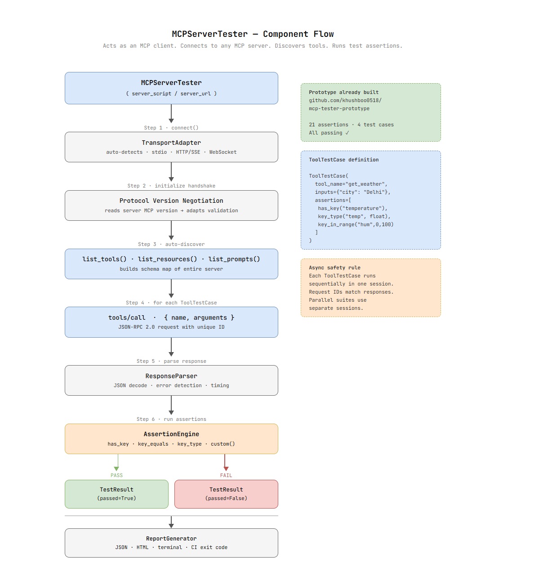](images/server_tester_flow.png)

The `MCPServerTester` connects to any MCP server as a client, auto-discovers all tools, and runs structured test cases against them.

```python
# MCPServerTester — core class (from working prototype)
class MCPServerTester:
    def __init__(self, server_script: str):
        self.server_script = server_script
        self.discovered_tools: list = []

    async def connect_and_discover(self, session: ClientSession):
        await session.initialize()
        tools_response = await session.list_tools()
        self.discovered_tools = tools_response.tools
        return self.discovered_tools

    async def call_tool(self, session: ClientSession,
                        tool_name: str, inputs: dict) -> dict:
        response = await session.call_tool(tool_name, inputs)
        if response.content and len(response.content) > 0:
            raw = response.content[0].text
            try:
                return json.loads(raw)
            except (json.JSONDecodeError, AttributeError):
                return {"raw_response": str(raw)}
        return {}

    async def run_test_case(self, session: ClientSession,
                            test: ToolTestCase) -> list[TestResult]:
        results = []
        try:
            response = await self.call_tool(
                session, test.tool_name, test.inputs
            )
            for assertion in test.assertions:
                passed = bool(assertion.check(response))
                results.append(TestResult(
                    tool_name=test.tool_name,
                    assertion_name=assertion.name,
                    passed=passed,
                    error="" if passed else f"Got: {response}"
                ))
        except Exception as e:
            results.append(TestResult(
                tool_name=test.tool_name,
                assertion_name="tool_call",
                passed=False,
                error=f"Tool call failed: {str(e)}"
            ))
        return results
```

**TransportAdapter — abstraction over all MCP transports:**
```python
class TransportAdapter:
    def __init__(self, transport_type: str, target: str):
        self.transport_type = transport_type  # "stdio" | "http" | "ws"
        self.target = target

    async def connect(self):
        if self.transport_type == "stdio":
            return stdio_client(StdioServerParameters(
                command=sys.executable, args=[self.target]
            ))
        elif self.transport_type == "http":
            return sse_client(self.target)
```

---

### MockMCPServer

[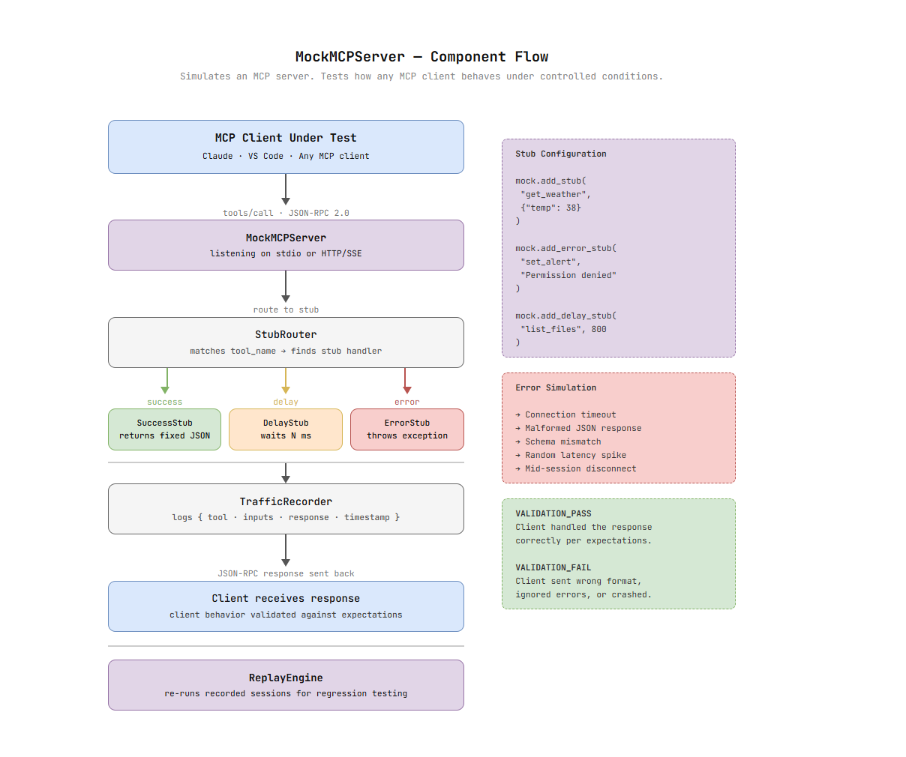](images/mock_server_flow.png)

The `MockMCPServer` simulates a real MCP server so developers can test how their MCP clients behave under controlled conditions — without needing a real backend.

```python
class MockMCPServer:
    def __init__(self):
        self.stubs: dict[str, callable] = {}
        self.recorded_calls: list = []

    def add_stub(self, tool_name: str, response: dict):
        self.stubs[tool_name] = lambda inputs: response

    def add_error_stub(self, tool_name: str, error: str):
        def _raise(inputs):
            raise MCPToolError(error)
        self.stubs[tool_name] = _raise

    def add_delay_stub(self, tool_name: str,
                       response: dict, delay_ms: int):
        async def _delayed(inputs):
            await asyncio.sleep(delay_ms / 1000)
            return response
        self.stubs[tool_name] = _delayed

    def record(self, tool_name: str, inputs: dict, response: dict):
        self.recorded_calls.append({
            "tool": tool_name, "inputs": inputs,
            "response": response, "timestamp": time.time()
        })

    async def replay(self):
        for call in self.recorded_calls:
            await self.handle_tool_call(
                call["tool"], call["inputs"]
            )
```

**Stub configuration examples:**
```python
mock = MockMCPServer()

# Success stub
mock.add_stub("get_weather", {"temp": 38, "city": "Delhi"})

# Error stub — tests client error handling
mock.add_error_stub("set_alert", "Permission denied")

# Delay stub — tests client timeout handling
mock.add_delay_stub("list_files", {"files": []}, delay_ms=800)
```

---

### AssertionEngine

[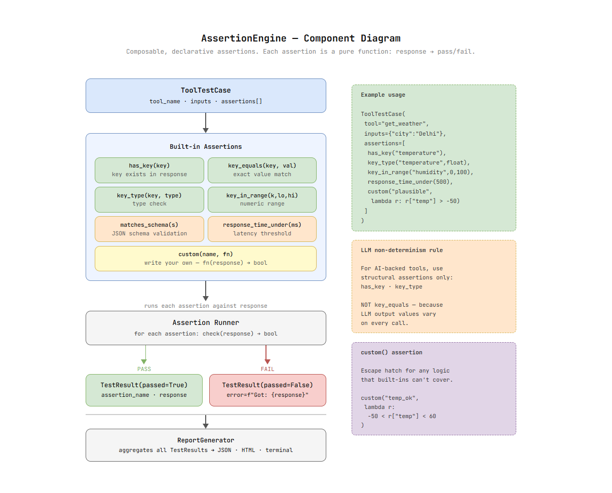](images/assertion_engine.png)

The `AssertionEngine` is the heart of the testing system. Assertions are composable pure functions — each one takes a response dict and returns `True` or `False`.

```python
@dataclass
class Assertion:
    name: str
    check: callable      # fn(response: dict) -> bool
    description: str

@dataclass
class TestResult:
    tool_name: str
    assertion_name: str
    passed: bool
    error: str = ""
```

**All built-in assertions:**
```python
def has_key(key: str) -> Assertion:
    return Assertion(
        name=f"has_key:{key}",
        check=lambda r: key in r,
        description=f"Response contains key '{key}'"
    )

def key_equals(key: str, expected: Any) -> Assertion:
    return Assertion(
        name=f"{key}=={expected}",
        check=lambda r: r.get(key) == expected,
        description=f"Response['{key}'] equals {expected}"
    )

def key_type(key: str, expected_type) -> Assertion:
    if isinstance(expected_type, tuple):
        type_name = " | ".join(t.__name__ for t in expected_type)
    else:
        type_name = expected_type.__name__
    return Assertion(
        name=f"type({key})=={type_name}",
        check=lambda r: isinstance(r.get(key), expected_type),
        description=f"Response['{key}'] is of type {type_name}"
    )

def key_in_range(key: str, lo: float, hi: float) -> Assertion:
    return Assertion(
        name=f"{lo}<={key}<={hi}",
        check=lambda r: lo <= r.get(key, float("nan")) <= hi,
        description=f"Response['{key}'] is between {lo} and {hi}"
    )

def response_time_under(ms: int) -> Assertion:
    return Assertion(
        name=f"response_time<{ms}ms",
        check=lambda r: r.get("_response_time_ms", 0) < ms,
        description=f"Response time under {ms}ms"
    )

def custom(name: str, fn: callable,
           description: str = "") -> Assertion:
    return Assertion(name=name, check=fn, description=description)
```

**Complete ToolTestCase example:**
```python
ToolTestCase(
    tool_name="get_forecast",
    description="Weather for Delhi in Celsius",
    inputs={"city": "Delhi", "unit": "celsius"},
    assertions=[
        has_key("temperature"),
        has_key("condition"),
        has_key("humidity"),
        key_type("temperature", (int, float)),
        key_in_range("humidity", 0, 100),
        key_equals("unit", "celsius"),
        response_time_under(500),
        custom(
            name="temp_is_plausible",
            fn=lambda r: -50 < r.get("temperature", -999) < 60,
            description="Temperature is physically plausible"
        ),
    ]
)
```

> **Note on LLM non-determinism:** For AI-backed MCP tools, use structural assertions (`has_key`, `key_type`) instead of `key_equals`. The `custom()` assertion handles any non-deterministic validation.

---

### mcp-test-utils Python Library

[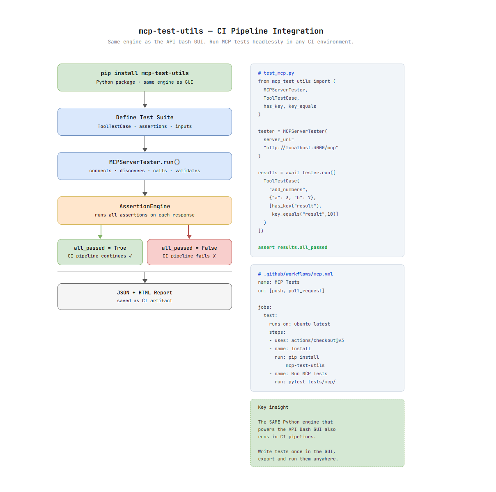](images/ci_library.png)

A standalone pip-installable package exposing the same engine as the GUI for CI pipelines.

```python
# pip install mcp-test-utils
from mcp_test_utils import (
    MCPServerTester, ToolTestCase,
    has_key, key_equals, key_type, key_in_range, custom
)

tester = MCPServerTester(server_url="http://localhost:3000/mcp")
results = await tester.run([
    ToolTestCase(
        tool_name="add_numbers",
        inputs={"a": 3, "b": 7},
        assertions=[
            has_key("result"),
            key_equals("result", 10),
            key_type("result", int),
        ]
    )
])

assert results.all_passed  # fails CI if any assertion fails
```

**GitHub Actions integration:**
```yaml
name: MCP Server Tests
on: [push, pull_request]
jobs:
  mcp-test:
    runs-on: ubuntu-latest
    steps:
      - uses: actions/checkout@v3
      - name: Install
        run: pip install mcp-test-utils
      - name: Run MCP Tests
        run: pytest tests/mcp/
      - name: Upload Report
        uses: actions/upload-artifact@v3
        with:
          name: mcp-test-report
          path: mcp_report.html
```

---

### React / TypeScript UI

The UI adds a new **MCP Testing** section to API Dash with four screens:

#### MCP Explorer — Browse all tools, resources and prompts a server exposes

[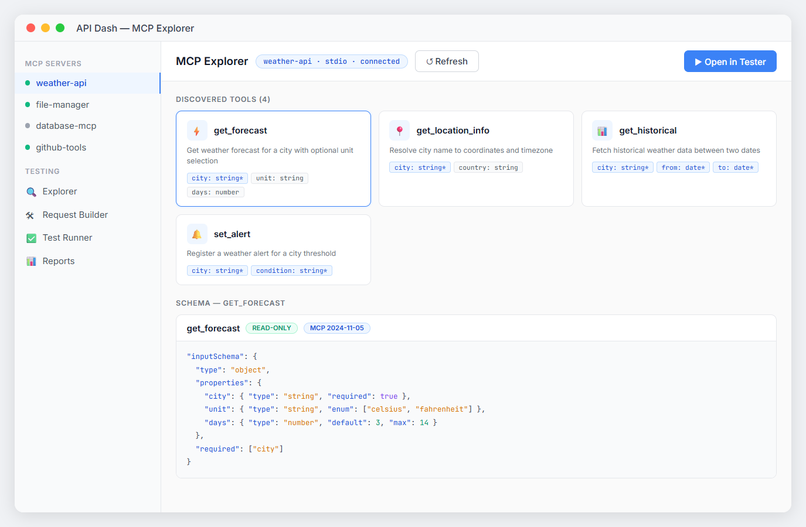](images/ui_explorer.png)

#### Test Runner — Run batch test cases, view pass/fail per assertion

[](images/ui_test_runner.png)

#### Mock Server Config — Configure stubs, toggle error simulation, view traffic

[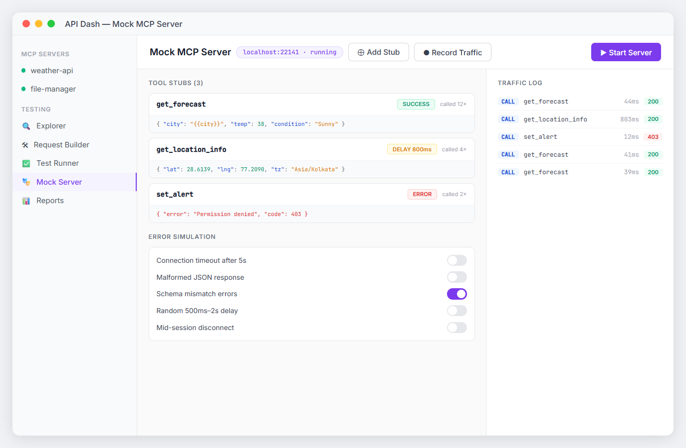](images/ui_mock_server.png)

#### Report Viewer — Charts, export HTML/JSON, re-run failed tests

[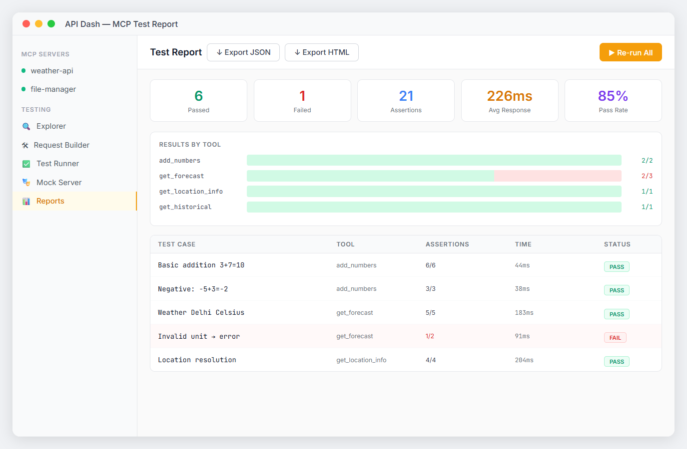](images/ui_report.png)

---

### MCP Apps Testing

After reading the article [A Practical Guide to Building MCP Apps](https://dev.to/ashita/a-practical-guide-to-building-mcp-apps-1bfm) shared by the mentor, I understand that MCP Apps are a powerful extension of MCP where servers deliver **rich HTML UI components** (dashboards, forms, visualizations) rendered as sandboxed iframes inside AI hosts like VS Code. This opens up a completely new dimension for testing that my proposal will incorporate.

**What are MCP Apps?**
- MCP servers register `ui://` URI resources that serve HTML content with MIME type `text/html;profile=mcp-app`
- The HTML app communicates with the host via JSON-RPC messages — `ui/initialize`, `ui/notifications/initialized`, `ui/open-link`, `ui/update-model-context`, `ui/message` etc.
- The host sends `hostContext` (CSS theme variables) and `hostCapabilities` back to the app during the handshake
- Apps run in a sandboxed iframe with CSP (Content Security Policy) for security

**What MCP Apps Testing means for this project:**

The `MCPServerTester` will be extended to also validate MCP App registrations:

```python
# MCP Apps testing — validate ui:// resource registration
class MCPAppsTester:
    async def test_app_registration(self, session, resource_uri: str):
        """Validates that a ui:// resource is correctly registered"""
        resources = await session.list_resources()

        # Check resource is registered with correct URI
        app_resource = next(
            (r for r in resources.resources
             if r.uri == resource_uri), None
        )
        assert app_resource is not None, \
            f"MCP App resource {resource_uri} not found"

        # Check correct MIME type
        assert app_resource.mimeType == "text/html;profile=mcp-app", \
            f"Expected MCP App MIME type, got {app_resource.mimeType}"

        return app_resource

    async def test_app_handshake(self, html_content: str):
        """Validates that the MCP App HTML contains ui/initialize handshake"""
        assert "ui/initialize" in html_content, \
            "MCP App must call ui/initialize for host handshake"
        assert "ui/notifications/initialized" in html_content, \
            "MCP App must send ui/notifications/initialized after handshake"

    async def test_host_context_support(self, html_content: str):
        """Validates that MCP App applies host context for theme adaptation"""
        assert "applyHostContext" in html_content or \
               "hostContext" in html_content, \
            "MCP App should apply hostContext for native host theme"

    async def test_csp_declaration(self, session, resource_uri: str):
        """Validates CSP domains are declared for apps making external requests"""
        # Checks _meta.ui.csp.connectDomains and resourceDomains
        tool = await self._get_linked_tool(session, resource_uri)
        if tool and tool.meta and tool.meta.get("ui", {}).get("csp"):
            csp = tool.meta["ui"]["csp"]
            assert "connectDomains" in csp or "resourceDomains" in csp, \
                "MCP App with external requests must declare CSP domains"
```

**MCP Apps assertions added to AssertionEngine:**

```python
# New MCP Apps specific assertions
def has_ui_resource(uri: str) -> Assertion:
    """Checks that server exposes a ui:// resource"""
    return Assertion(
        name=f"has_ui_resource:{uri}",
        check=lambda r: uri in [res.uri for res in r.get("resources", [])],
        description=f"Server exposes MCP App at {uri}"
    )

def has_mcp_app_mimetype() -> Assertion:
    """Checks resource has correct MCP App MIME type"""
    return Assertion(
        name="has_mcp_app_mimetype",
        check=lambda r: r.get("mimeType") == "text/html;profile=mcp-app",
        description="Resource uses MCP App MIME type"
    )

def tool_links_to_app(resource_uri: str) -> Assertion:
    """Checks tool is linked to MCP App via _meta.ui.resourceUri"""
    return Assertion(
        name=f"tool_links_to:{resource_uri}",
        check=lambda r: r.get("_meta", {}).get("ui", {})
                         .get("resourceUri") == resource_uri,
        description=f"Tool linked to MCP App {resource_uri}"
    )

def app_has_handshake() -> Assertion:
    """Checks MCP App HTML contains ui/initialize handshake"""
    return Assertion(
        name="app_has_handshake",
        check=lambda r: "ui/initialize" in r.get("html_content", ""),
        description="MCP App implements ui/initialize handshake"
    )
```

**What this means for the UI:**
The MCP Explorer screen will show not just `tools` and `resources` but also detect and display **MCP App registrations** — showing the linked `ui://` URI, the tool that triggers the app, and CSP declarations. Users can validate their MCP App is correctly registered before testing it in a host like VS Code.

This directly incorporates the architectural patterns from the article — resource registration, tool-to-app linking via `_meta.ui.resourceUri`, handshake validation, host context support, and CSP compliance — making the MCP Testing module future-ready for the full MCP Apps ecosystem.

---

### Proof of Concept

A working Python prototype is already built and running:
**🔗 [github.com/khushboo0518/mcp-tester-prototype](https://github.com/khushboo0518/mcp-tester-prototype)**

```
═══════════════════════════════════════════════════════
  MCP SERVER TESTER — API Dash GSoC 2026 Prototype
═══════════════════════════════════════════════════════
✓ Connected · Discovered 2 tool(s): add_numbers, get_weather
▶ Running 4 test case(s)...

  [add_numbers] Basic addition: 3 + 7 = 10
    ✅ PASS  has_key:result
    ✅ PASS  result==10
    ✅ PASS  type(result)==int

  [get_weather] Weather for Delhi in Celsius
    ✅ PASS  has_key:temperature
    ✅ PASS  type(temperature)==int | float
    ✅ PASS  0<=humidity<=100
    ✅ PASS  unit==celsius

  Results: 21 passed, 0 failed · ✅ ALL TESTS PASSED
```

---

## Week-wise Breakdown

[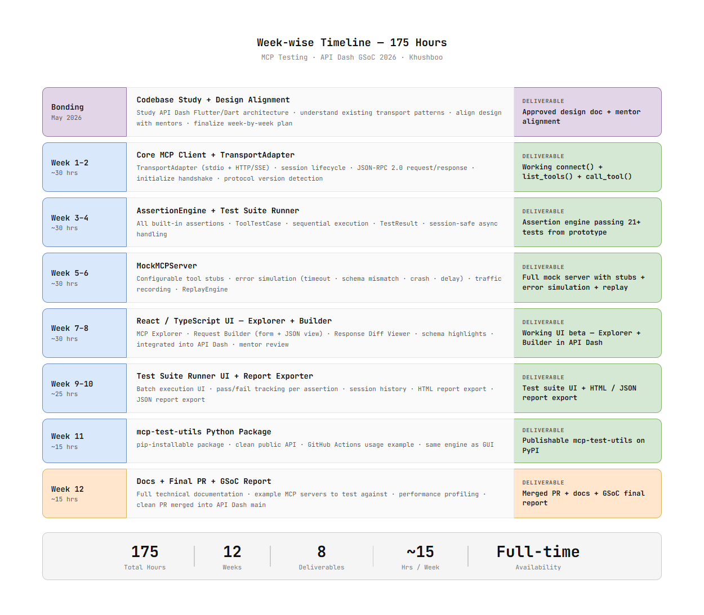](images/timeline.png)

### Community Bonding (May 2026)
- Study API Dash Flutter/Dart codebase — understand existing request handling and transport patterns
- Read all MCP-related issues and discussions
- Discuss transport priority and UI integration with mentors
- Finalize and get design doc approved

**DELIVERABLE:** Approved design doc + confirmed architecture with mentors

---

### Week 1 (TransportAdapter + Session Management)
- Implement `TransportAdapter` base class with stdio support
- Session lifecycle: connect → initialize → list_tools → disconnect
- JSON-RPC 2.0 request/response with unique ID tracking
- `initialize` handshake + protocol version detection

**DELIVERABLE:** Working `connect()` + `list_tools()` discovering tools from any stdio MCP server

---

### Week 2 (HTTP/SSE Transport + Tool Calling)
- Extend `TransportAdapter` to support HTTP/SSE transport
- Implement `call_tool()` with full parameter passing
- `list_resources()` and `list_prompts()` discovery
- Response parsing + error detection + timing

**DELIVERABLE:** Full transport support (stdio + HTTP/SSE) + working `call_tool()` API

---

### Week 3 (AssertionEngine — Core Assertions)
- `Assertion` and `TestResult` dataclasses
- Built-in assertions: `has_key`, `key_equals`, `key_type`, `key_in_range`, `custom()`
- `ToolTestCase` data structure
- Sequential execution with session safety

**DELIVERABLE:** AssertionEngine passing all 21 prototype test cases

---

### Week 4 (AssertionEngine — Advanced + Runner)
- `matches_schema()` with JSON Schema validation
- `response_time_under()` with timing instrumentation
- Full `TestSuiteRunner` — runs all test cases, collects results
- `ReportGenerator` — terminal output with pass/fail per assertion

**DELIVERABLE:** Complete AssertionEngine + TestSuiteRunner + terminal report

---

### Week 5 (MockMCPServer — Stubs + Error Simulation)
- `MockMCPServer` base class with stdio transport
- `add_stub()`, `add_error_stub()`, `add_delay_stub()` API
- `StubRouter` — matches tool_name to stub handler
- Error simulation: timeout, malformed JSON, schema mismatch, random delay

**DELIVERABLE:** Working MockMCPServer with all stub types and error simulation

---

### Week 6 (MockMCPServer — Record/Replay + State)
- `TrafficRecorder` — logs every call with tool, inputs, response, timestamp
- `ReplayEngine` — replays recorded sessions deterministically
- Session state machine for multi-turn workflows
- Integration tests: real MCP client → MockMCPServer → validate behavior

**DELIVERABLE:** Full MockMCPServer with record/replay and session state

---

### Week 7 (UI — MCP Explorer + Request Builder)
- MCP Explorer — visual tool/resource/prompt browser with schema view
- Request Builder — form + JSON view for composing tool calls
- Response Diff Viewer — expected vs actual with schema highlights
- Mentor review + feedback

**DELIVERABLE:** MCP Explorer + Request Builder integrated into API Dash

---

### Week 8 (UI — Test Runner + Mock Server Config)
- Test Runner — batch execution, live pass/fail, session history
- Mock Server Config — stub config, error toggles, live traffic log
- Polish from Week 7 feedback
- Responsive layout

**DELIVERABLE:** All 4 UI screens working end-to-end in API Dash

---

### Week 9 (Report Exporter)
- HTML report export — fully self-contained, shareable
- JSON report export — CI-friendly, machine-readable
- Results chart by tool in Report Viewer
- `assert results.all_passed` CI exit code

**DELIVERABLE:** HTML + JSON report export + CI exit code support

---

### Week 10 (mcp-test-utils Package)
- Clean public API + `__init__.py` exports
- GitHub Actions workflow example
- Full API reference documentation
- PyPI publication preparation

**DELIVERABLE:** Publishable `mcp-test-utils` on PyPI

---

### Week 11 (Testing + Integration + Performance)
- Comprehensive tests for all modules
- End-to-end integration tests against 3+ real MCP servers
- Performance profiling — large test suites, concurrent sessions
- Fix any issues + pending tasks

**DELIVERABLE:** Full test coverage + performance verified

---

### Week 12 (Documentation + Final PR)
- Complete technical documentation for all components
- Example MCP servers in `/examples` folder
- Final mentor review
- Clean PR merged into API Dash main
- GSoC final report

**DELIVERABLE:** Merged PR + full docs + GSoC report ✅

---

## Relevant Skills and Experience

### Skills
- **Python** — intermediate/advanced: async, dataclasses, packaging, REST APIs, MCP SDK, Flask, FastAPI
- **Python Libraries** — NumPy, Pandas, Scikit-learn, TensorFlow, LangChain, Requests, Pydantic
- **AI / ML** — model integration, LLM APIs (Claude, OpenAI, Gemini), prompt engineering, agentic workflows
- **MCP (Model Context Protocol)** — server design, tool schemas, transport layers, JSON-RPC 2.0
- **React / TypeScript** — working knowledge, built real projects with React
- **Git, Docker, REST APIs, IoT integration, CI/CD**

### Experience

**AI & Cloud Intern — Yotta Private Limited (June–August 2025)**
- Engineered **MCPilot**: MCP orchestration layer on Apache CloudStack + Claude AI
- Designed MCP tool schemas for VM, VPC, networking, and service operations
- Automated end-to-end cloud provisioning workflows using Python, Flask, Docker
- Reduced provisioning time from 20–30 min to under 5 min
- Reduced configuration errors by ~40%, manual effort by ~65%

**Smart India Hackathon 2025 — Finalist Runner-Up (National Level)**
- One of 2 core members who managed the entire project end-to-end
- Built an automated underground drilling machine — owned all software integration: IoT sensor pipeline, real-time hardware-software communication, and control dashboard built with React
- Proves ability to deliver working software under pressure and tight deadlines

**GSoC 2026 Prototype (March 2026)**
- Built `mcp-tester-prototype`: working `MCPServerTester` + `AssertionEngine` + `MockMCPServer`
- 21 assertions across 4 test cases, all passing
- [github.com/khushboo0518/mcp-tester-prototype](https://github.com/khushboo0518/mcp-tester-prototype)

### More About Me

I'm Khushboo, a third-year B.Tech (AIML) student at Dronacharya College of Engineering. I have hands-on production experience with MCP — I shipped MCPilot, a real MCP orchestration system, during my internship at Yotta Private Limited. I am a Smart India Hackathon 2025 Finalist Runner-Up — one of 2 people who drove a full hardware+software project to national level competition.

I am not proposing this project because it fits a GSoC slot. I am proposing it because I have personally felt the pain of building MCP systems without proper testing tools, and I know exactly what needs to be built, how to build it, and how to make it genuinely useful for the developer community.

MCP is the API layer of the AI world. API Dash can be the tool developers reach for when testing it. I want to build that.
