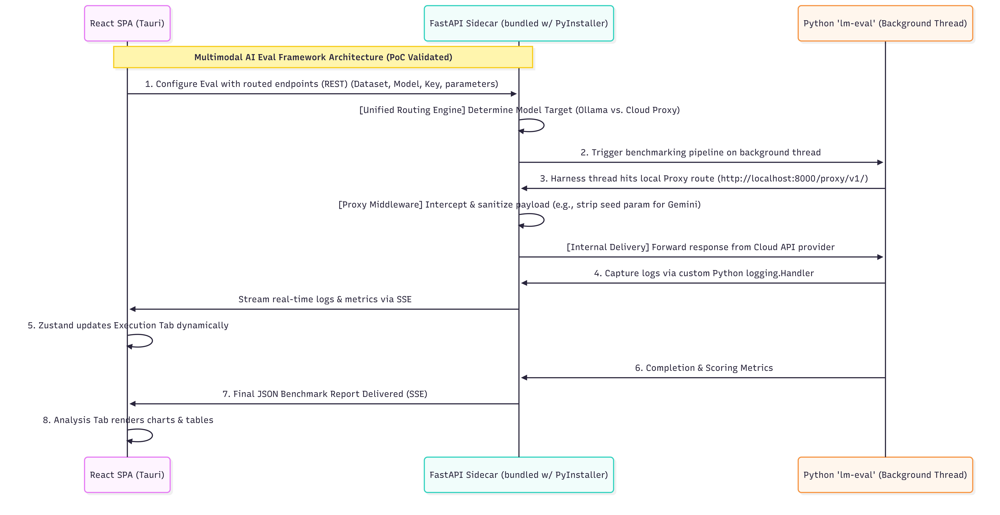
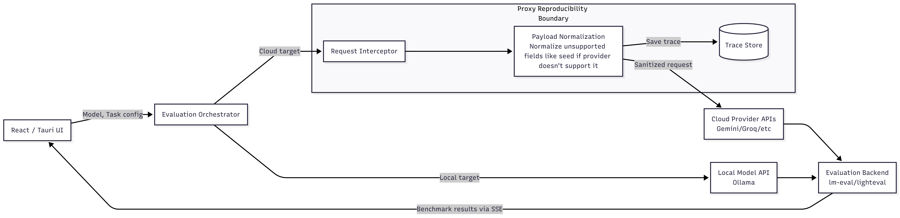
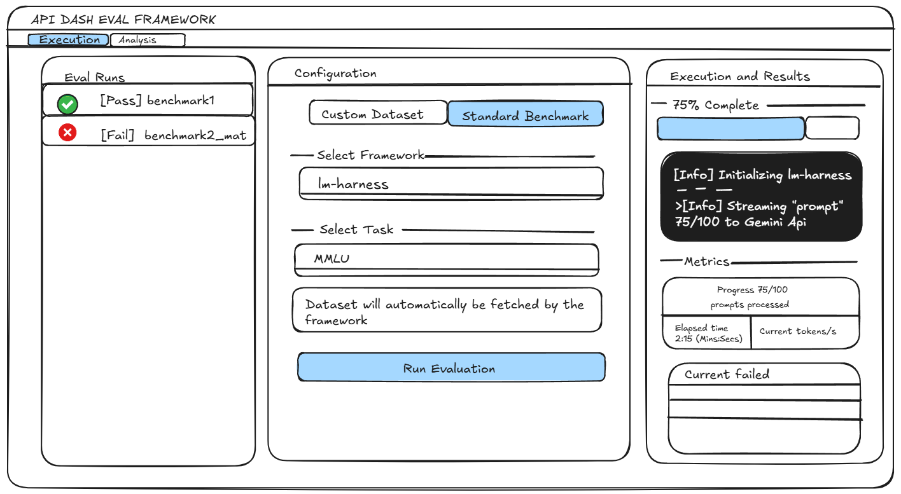

# Multimodal AI and Agent API Eval Framework
### About

1. **Full Name:** Lokeshwar Goud Parasa
2. **Contact info:** lokeshparasa50@gmail.com
3. **Discord handle:** spark_899
6. **GitHub profile link:** [GitHub Profile- Spark960](https://github.com/Spark960)
7. **Twitter, LinkedIn, other socials:** [My LinkedIn](https://www.linkedin.com/in/lokesh-parasa-66698631a/)
8. **Time zone:** IST - (UTC +5:30)
9. **Link to a resume:** [My Resume](https://drive.google.com/file/d/1fxRin2BQmlPSGLGh3oaVZxj47O9GgXKK/view?usp=sharing)

### University Info

1. **University name:** Manipal Institute of Technology
2. **Program you are enrolled in:** B.Tech in Computer and Communication Engineering
3. **Year:** 2nd Year 
4. **Expected graduation date:** June 2028
## Motivation & Past Experience

1. **Have you worked on or contributed to a FOSS project before? Can you attach repo links or relevant PRs?**

   * **ANS:** I have worked with large codebases before, but I have not made any major contribution to any FOSS project yet. I am actively working toward changing that through my current contributions to API Dash :)


2. **What is your one project/achievement that you are most proud of? Why?**
   * **ANS:** The project I am most proud of isn't actually the biggest or most technically complex one I've built, but rather the first real-world application I ever shipped: an IPC (Innovation Policy Consortium) portal.

   * It was the project that truly sparked my love for software development. The technical learning curve was steep, but what made it special was deploying it and actually watching people use it. Hearing their feedback and seeing how it genuinely solved a problem for them and made their workflow easier was an incredible feeling.

   * Since then, I've continuously been taking on more complex things like building the custom proxy for the API Dash PoC, contributing to a research paper on breast cancer detection using deep learning, and I also developed a critical backend solution and managed Atom payment integration for MES, a University wide Entreprenuership Summit.

3. **What kind of problems or challenges motivate you the most to solve them?**
   * **ANS:** I am motivated by architectural bottlenecks. I love diving into the intersection of deep learning, full-stack systems, and backend routing to figure out how data actually flows. That moment where something I've built ends up helping a lot of people is what keeps me going.

4. **Will you be working on GSoC full-time? In case not, what will you be studying or working on while working on the project?**
   * **ANS:** Yes, I will be dedicating my full summer break to GSoC. I have no other internships or major academic commitments, so I will be treating this as a full-time role.

5. **Do you mind regularly syncing up with the project mentors?**
   * **ANS:** I don't mind regularly syncing up. I actually would prefer frequent communication. Helps me stay on track

6. **What interests you the most about API Dash?**
   * **ANS:** The privacy-first, local-first philosophy. Especially the privacy part, I'm a sucker for secure things. Also, I prefer light, minimalist designs which API Dash makes a priority.

7. **Can you mention some areas where the project can be improved?**
   * **ANS:** Currently, API Dash is an great tool for traditional backend developers testing standard REST/GraphQL endpoints. However, as the industry shifts toward LLMs, the definition of "testing an API" is changing. The project can be improved by expanding its target audience to include AI engineers and fine tuners. While API Dash currently verifies if an endpoint works (Eg: HTTP 200 OK), it lacks the ability to evaluate how well an AI endpoint performs against standardized benchmarks (like GSM8K) or agentic tool-calling scenarios. By introducing a dedicated Evaluation Framework, API Dash can evolve from a standard API client into a rigorous, reproducible benchmarking suite for the AI era which is exactly what is proposal is all about.

8. **Have you interacted with and helped the API Dash community? (GitHub/Discord links)**
   * **ANS:** Yes, I mostly help people through dm's for their setup and other things. 
   https://discord.com/channels/920089648842293248/942975979595395123/1486068010325246054
   https://drive.google.com/file/d/1LbACs00mFkoww6DSFj0-GVYLuF6QNZ5-/view?usp=drive_link
   https://drive.google.com/file/d/1z4W91UPlRtIhYlexyhOKNf19L4TbGy8i/view?usp=drive_link


### Project Proposal Information

**1. Proposal Title**

Local First Desktop Architecture for Multimodal AI and Agent API Eval Framework

**2. Abstract**

As developers build with LLMs, they need a secure way to benchmark prompts against privacy first local models (Ollama) and strict cloud APIs (Gemini/Groq/OtherModels). Running `lm-eval` (a heavy Python process) directly within API Dash's Flutter environment causes UI freezing. This project implements a decoupled, zero config desktop companion: a React SPA frontend packaged via Tauri, communicating with a FastAPI evaluation engine bundled as a native Tauri sidecar. This guarantees non blocking execution, real time log streaming via SSE, and zero data leakage for local testing.

**3. Detailed Description**

The framework's execution capabilities are structured into three core phases. The primary focus is enabling secure local testing, followed by cloud benchmarking to establish performance baselines, and finally expanding into advanced agentic evaluations. The cloud models can be used to see how good their model is performing compared to standard cloud models.

**The God Architecture Diagram**


[Core Feature 1: Local Model Testing (The Primary Use Case)](#core-feature-1-local-model-testing-the-primary-use-case)

[Core Feature 2: Cloud API Testing & The Proxy Middleware](#core-feature-2-cloud-api-testing--the-vendor-neutral-proxy-middleware)

[Core Feature 3: Agentic & Multimodal Evaluation](#core-feature-3-implementing-multimodal-and-agentic-evaluation)

[Deployment Architecture: Tauri Desktop Bundling](#deployment-architecture-tauri-desktop-bundling)


## Core Feature 1: Local Model Testing (The Primary Use Case)


*The current working Proof of Concept (React SPA), demonstrating a cloud evaluation configuration alongside a live terminal streaming execution logs via SSE without blocking the UI thread*

### What We Are Doing

The core objective of this framework is to serve developers who are actively fine-tuning or running local models via tools like Ollama, vLLM, or LM Studio, and need a rigorous benchmarking solution where model inputs and outputs never leave their machine.

These developers need to know how their local model performs against standardized benchmarks like GSM8K or HellaSwag, without sending proprietary weights or inference data to any external service.

This framework provides a unified routing engine that executes `lm-harness` evaluation pipelines entirely against local endpoints, while keeping the UI completely responsive during runs that can take minutes or hours.

### How We Are Implementing It

#### 1. Asynchronous Background Execution

The core problem with running `lm-eval.simple_evaluate()` directly is that it is a long, blocking, synchronous call.

Running it naively inside a FastAPI route handler would freeze the entire web server until completion.

To solve this, the backend immediately spawns a dedicated Python background thread the moment an evaluation is triggered, returning a unique `run_id` to the frontend before the evaluation even begins.

This keeps the server fully responsive.

```python id="s0d4fz"
@app.post("/api/evaluate")
async def start_eval(request: Request):
    data = await request.json()
    run_id = str(uuid.uuid4())

    queues[run_id] = asyncio.Queue()
    results_store[run_id] = {"status": "running"}

    loop = asyncio.get_running_loop()
    threading.Thread(
        target=run_evaluation_thread,
        args=(
            run_id,
            data['model'],
            data['api_key'],
            data['task'],
            data['limit'],
            queues[run_id],
            loop,
            results_store
        ),
        daemon=True
    ).start()

    return {"run_id": run_id}
```

Note that `task` and `limit` are passed through explicitly here.

In the GSoC implementation, these replace the hardcoded `tasks=["gsm8k"]` and `limit=5` values that exist in the current PoC, making evaluation fully user-configurable.

#### 2. The Unified Routing Engine

Inside `eval_runner.py`, the background thread performs a routing decision before invoking `lm-eval`.

For local targets, it constructs a `base_url` pointing directly to the locally running model server.

Since Ollama, vLLM, and LM Studio all expose OpenAI-compatible endpoints, routing only needs to determine the correct port.

```python id="qjgh6l"
def run_evaluation_thread(run_id, model_name, api_key, task, limit, queue, loop, results_store):

    if "ollama" in model_name.lower():
        # Ollama runs unauthenticated on a local port
        args_string = f"model={model_name},base_url=http://localhost:11434/v1/chat/completions"

    elif "vllm" in model_name.lower():
        # vLLM exposes an OpenAI-compatible server
        args_string = f"model={model_name},base_url=http://localhost:8000/v1/chat/completions"

    elif "gemini" in model_name.lower():
            # Route through our Gemini proxy
            args_string = f"model={model_name},base_url=http://localhost:8000/proxy/v1/chat/completions"
        elif "llama" in model_name.lower() or "mixtral" in model_name.lower() or "gemma" in model_name.lower():
            # THE FIX: Route through our new Groq proxy to sanitize the message array
            args_string = f"model={model_name},base_url=http://localhost:8000/proxy/groq/v1/chat/completions"
        else:
            # Default behavior: Let lm-eval talk straight to OpenAI
            args_string = f"model={model_name}"

    results = lm_eval.simple_evaluate(
        model="local-chat-completions",
        model_args=args_string,
        tasks=[task],
        limit=limit,
        log_samples=False,
        apply_chat_template=True
    )
```

Note that for local targets, no API key is required. I've not yet checked ollama and vllm in my PoC, I only checked gemini and groq but this is like a baseline idea. I'm still figuring out the best possible way to handle multiple things.

Also, for the Ollama Endpoint: The base_url for Ollama in the snippet is http://localhost:11434/v1/chat/completions. Depending on the exact version of lm-eval we are using, we usually just pass the base path http://localhost:11434/v1 and the library appends the /chat/completions part. I will look into this properly.

The frontend conditionally renders the API key field only when the user selects a cloud provider target, keeping local configuration clean.

#### 3. Live Terminal Streaming via SSE

The final problem is observability.

A local evaluation run against even a few samples takes noticeable time, and a silent UI is unusable.

The solution is a lightweight custom `logging.Handler` that bridges Python's synchronous logging system into the async event loop.

```python id="vbb0jg"
class QueueLogHandler(logging.Handler):
    def __init__(self, queue: asyncio.Queue, loop: asyncio.AbstractEventLoop):
        super().__init__()
        self.queue = queue
        self.loop = loop

    def emit(self, record):
        msg = self.format(record)
        asyncio.run_coroutine_threadsafe(self.queue.put(msg), self.loop)
```

Python's built-in `QueueHandler` only works with synchronous `queue.Queue`.

This custom handler exists specifically to solve the thread-boundary problem:

`asyncio.run_coroutine_threadsafe()` safely delivers each log line from the blocking background thread into the async event loop, where the SSE endpoint can consume it.

The React frontend connects to:

```text id="cbv9yy"
/api/stream/{run_id}
```

using the browser's native `EventSource` API.

Each incoming log line is rendered into the live terminal view.

When evaluation completes, the final JSON benchmark report is delivered through the same SSE connection as a terminal completion event, after which the Analysis tab renders the results.


## Core Feature 2: Cloud API Testing & The Vendor-Neutral Proxy Middleware


### What We Are Doing

Evaluating a local model in isolation is not enough.

A developer whose fine tuned model scores **68% on GSM8K** needs to know how good that is, does Gemini 2.5 Flash score **85%** on the exact same task or **60%**?

The cloud baseline can give some good context baseline to compare it to.

The proxy middleware is what makes this comparison possible, because without it, cloud evaluation attempts fail before returning a score.

The root cause is a **schema mismatch problem**.

`lm-eval` was built around the OpenAI API and hardcodes OpenAI-specific parameters into outgoing requests:

* `seed`
* `presence_penalty`
* `frequency_penalty`
* nested `type` arrays inside message objects

Strict cloud providers such as Gemini and Groq reject these immediately with **400 Bad Request** errors.

The bad solution: patching `lm-eval` directly, this would make upstream upgrades fragile and unsustainable.

Instead, schema correction is performed entirely at the networking layer, without modifying `lm-eval` internals.

### How We Are Implementing It

#### 1. Intercepting the Request at the Routing Layer

The interception begins inside `eval_runner.py` before `lm-eval` is invoked.

Instead of passing the real cloud provider endpoint into `simple_evaluate()`, the routing engine points `lm-eval` to a local FastAPI proxy route.

`lm-eval` therefore believes it is communicating with a standard OpenAI-compatible server.

```python id="e0g5i5"
def run_evaluation_thread(run_id, model_name, api_key, task, limit, queue, loop, results_store):

    if "gemini" in model_name.lower():
        # Route through local Gemini proxy
        args_string = f"model={model_name},base_url=http://localhost:8000/proxy/v1/chat/completions"

    elif "llama" in model_name.lower() or "mixtral" in model_name.lower():
        # Route through local Groq proxy
        args_string = f"model={model_name},base_url=http://localhost:8000/proxy/groq/v1/chat/completions"

    results = lm_eval.simple_evaluate(
        model="local-chat-completions",
        model_args=args_string,
        tasks=[task],
        limit=limit,
        log_samples=False,
        apply_chat_template=True
    )
```

The current PoC uses string matching on the model name for routing.

This approach is brittle. For example, a differently formatted Gemini identifier could bypass the correct branch.

During GSoC, this will be replaced with an explicit **provider dropdown in the UI**, making routing deterministic rather than inferred. I'm actively exploring other methods too

#### 2. Payload Sanitization: The Gemini Case

The FastAPI proxy intercepts the outgoing request and strips unsupported fields before forwarding the payload to the real Gemini endpoint.

For Gemini, the issue is primarily top level OpenAI only keys.

```python id="isq60c"
@app.post("/proxy/v1/chat/completions")
async def gemini_proxy(request: Request):
    payload = await request.json()

    payload.pop('seed', None)
    payload.pop('presence_penalty', None)
    payload.pop('frequency_penalty', None)

    auth_header = request.headers.get('Authorization')
    url = "https://generativelanguage.googleapis.com/v1beta/openai/chat/completions"

    async with httpx.AsyncClient() as client:
        resp = await client.post(
            url,
            json=payload,
            headers={'Authorization': auth_header},
            timeout=60.0
        )

        return Response(
            content=resp.content,
            status_code=resp.status_code,
            media_type="application/json"
        )
```

#### 3. Deep Schema Sanitization: The Groq Case

Groq requires deeper manipulation than just stripping top level keys. Its API rejects the type property inside individual message objects entirely. This properly handles cases where lm-eval internally formats message content as a vision style list of dicts even on purely text tasks which Groq rejects regardless of whether any image data is present

```python id="z89hgd"
@app.post("/proxy/groq/v1/chat/completions")
async def groq_proxy(request: Request):
    payload = await request.json()
    
    if 'messages' in payload:
        for msg in payload['messages']:
            # Groq strictly rejects 'type' inside message objects
            msg.pop('type', None)
            
            # Flatten multimodal content arrays down to plain strings
            if isinstance(msg.get('content'), list):
                text_content = " ".join([
                    item.get('text', '') for item in msg['content'] 
                    if item.get('type') == 'text'
                ])
                msg['content'] = text_content
                
    # Groq does not support logprobs on chat completions
    payload.pop('logprobs', None)
    payload.pop('top_logprobs', None)

    auth_header = request.headers.get('Authorization')
    url = "https://api.groq.com/openai/v1/chat/completions"
    
    async with httpx.AsyncClient() as client:
        resp = await client.post(
            url,
            json=payload,
            headers={'Authorization': auth_header},
            timeout=60.0
        )
        return Response(content=resp.content, status_code=resp.status_code, media_type="application/json")
```

#### 4. GSoC Implementation Goal: Scalable Provider Profiles

* The current PoC has one hardcoded route per provider. During the GSoC period, this will be refactored so that each provider's sanitization rules are defined as a declarative configuration profile. 

* A structured dict specifying which top level keys to strip, which message level transformations to apply, and which endpoint to forward to. After that,  adding support for a new provider like Mistral or any other provider would just be adding a profile entry, not writing a new FastAPI route. This makes the middleware genuinely extensible by the API Dash community without requiring changes to core proxy logic.


#### 5.Why proxy instead of adapter

* The natural question is why a proxy middleware rather than writing backend adapters directly into lighteval or lm-eval. Backend adapters require modifying the evaluation library itself, which creates two problems: 
    * it makes upgrading the library dangerous since every update risks breaking the adapter
    * it only works when the evaluation is invoked through that specific library's Python API. 
* The proxy operates one layer lower, at the HTTP boundary, which means it works regardless of which evaluation library triggers the request, whether that is lm-eval, lighteval, a CLI invocation, or any future backend we add. The evaluation engine remains completely unmodified and upgradeable independently of the provider support layer.

### 6.Proxy as reproducibility boundary

* Beyond cloud compatibility, the proxy middleware also functions as a provider independent reproducibility boundary. Every outgoing request is normalized into a logged evaluation payload before forwarding, preserving the exact prompt text, generation parameters and provider target used for that run. This creates replayable traces for later inspection and allows logically equivalent requests to be executed across providers under controlled settings. While providers still differ internally in tokenization and decoding behavior, input side normalization ensures that score differences arise from model behavior rather than hidden request formatting differences.




## Core Feature 3: Implementing MultiModal and Agentic Evaluation
(The ui mock for distinction)


### What We Are Doing
* Phases 1 and 2 lock down text based evaluations. Core Feature 3 is where we push into the actual frontier: testing models on images (multimodal) and their ability to use tools (the core building block of any AI agent).

* Multimodal (Vision): Developers need to know if their vision models can actually see and reason about an image. The framework will allow users to upload local images paired with prompts and expected answers. We are strictly scoping this to paired datasets—without a ground truth expected answer to grade against, it's just a playground demo, not a benchmark.

* Agentic (Tool Calling): We are explicitly scoping our primary deliverable to Level 1: Tool Call Evaluation. We want to measure if a model knows which tool to call and outputs the exact JSON arguments required. We are not building a live tool execution environment. Running live tools introduces wild card variables (network latency, API downtime). Grading exact JSON outputs gives us a hard, reproducible baseline metric that we can fairly compare across different models.

*(Note on Audio: Audio evaluation is at the very end of scope for now. The API landscape is just too fragmented, Groq uses a dedicated Whisper endpoint, while Gemini has a native audio format. Trying to unify that under a chat-completions schema right now is massive task. We will tackle vision and agents first. If that's stable, we can work on audio eval)

### How We Are Implementing It
The Elephant in the Room: Why Two Libraries?
* Before diving into the code, let's address a deliberate architectural choice: why are we running both lm-harness and lighteval?

* They aren't competing; they solve different problems. lm-harness is the industry standard for established, static benchmarks (like GSM8K or HellaSwag). We are keeping it because it's battle-tested and trusted. However, building custom, runtime-defined tasks in lm-harness is a headache. That is exactly where Hugging Face's lighteval shines.

* The UI toggle in the mockup isn't just switching datasets; it tells the backend's dispatch layer to route the execution to either lm_eval.simple_evaluate() or the lighteval task runner. Because we built the background threading and SSE streaming properly in Core Feature 1, the live log terminal works identically regardless of which engine is running under the hood.

* Multimodal Vision Pipeline & Capability Checking
We handle the image-to-Base64 encoding directly inside the React frontend. Passing raw binary files over IPC to the Python sidecar is slow and unnecessary. The sidecar just receives a clean, standardized JSON payload:

* The Capability Check: Expanding the payload to an array introduces a dangerous edge case. What happens if a user accidentally runs a vision benchmark against a text-only model? In Core Feature 2, our proxy flattened arrays to prevent 400 Bad Request crashes. We cannot do that here. If we strip the image and ask a text model "What's in this image?", we silently corrupt the benchmark. Instead, the orchestrator implements a hard Capability Check: if a vision dataset hits a text-only endpoint, we explicitly fail the run with a mismatch error rather than silently degrading it. Failures need to be visible, not hidden in bad scores.

* Agentic Tool Call Evaluation with lighteval
When a user defines a mock tool schema and expected outputs in the UI, the sidecar dynamically spins up an in memory lighteval task. Here is how that pipeline flows:

* Stage 1 & 2: Frontend JSON to Python Docs & Prompting
The user's sample pairs arrive as a JSON array. The sidecar maps these into lighteval Doc objects and constructs the system prompt:

```python
from lighteval.tasks.lighteval_task import Doc

def build_docs_from_payload(samples: list[dict]) -> list[Doc]:
    docs = []
    for sample in samples:
        docs.append(Doc(
            task_name="custom_tool_call_eval",
            query=tool_call_prompt_fn(sample),
            choices=[sample['expected_output']],
            gold_index=0,
        ))
    return docs

def tool_call_prompt_fn(doc: dict) -> str:
    return f"""You have access to the following tool:
{doc['tool_schema']}
User query: {doc['query']}
Respond only with a valid JSON function call.
```

* Stage 3: Response Normalization (The Hard Part)
Before we can grade anything, we have to normalize the provider's response. OpenAI, Gemini, and Groq all return tool call invocations in structurally different JSON formats. Our metric code expects a clean, flat structure:

```JSON
{"name": "get_weather", "arguments": {"city": "London"}}
```
* To fix this, each provider adapter will include a response normalization rule alongside its existing proxy sanitization profile. This intercepts the proprietary JSON response and flattens it into our standard schema before handing it to the metric engine.

* Stage 4: Metric Computation
We are going with strict, exact matching for our baseline scoring.

* Semantic or partial matching sounds alright but it introduces weird ambiguity that makes scores impossible to compare across multiple differnent runs. Exact matching keeps the evaluation deterministic, backing up the reproducibility guarantees we established in Core Feature 2.

* Level 2 Stretch Goal: Multi Turn Trajectory
If we lock down Level 1 ahead of schedule, the natural next step is Level 2: Multi Turn Execution. This involves intercepting the model's tool call, running it against a mock stateful registry, and feeding the result back into the context window for the next turn to see if the model reaches the correct final answer. The heavy lifting—the background threading and SSE architecture from Core Feature 1 already supports this loop. The only missing piece is the trajectory scoring logic.

## Deployment Architecture: Tauri Desktop Bundling

### What We Are Doing
* The evaluation pipeline built across Phases 1 through 3 requires no manual Python installation, no virtual environment management, and no terminal commands from the end user. API Dash is a desktop product, and this framework must ship as one — a single double clickable executable that works on Windows, macOS, and Linux with zero configuration. We achieve this using Tauri, which gives us a native desktop shell with a low ram webview renderer, wrapping both the React frontend and the Python execution engine in a single distributable package.
### How We Are Implementing It
Freezing the Python Backend with PyInstaller
* The first step is compiling the FastAPI backend and all its Python dependencies into a standalone OS specific binary using PyInstaller. The critical engineering challenge is binary size. A naive PyInstaller bundle of lm-eval and lighteval will transitively pull in PyTorch as a dependency, producing a 2GB+ executable. Because this framework exclusively targets API based evaluation via lm-eval[api] and never performs local tensor operations, PyTorch is an unnecessary transitive dependency. The PyInstaller spec file explicitly excludes it:

* This exclusion strategy targets a final sidecar binary of approximately 300-400MB, it's comparable in size to applications like VS Code or Slack. The exact size depends on the transitive dependency trees of datasets and evaluate, which will be checked during the GSoC implementation and trimmed further if necessary.
Declaring the Sidecar in Tauri
* Once the backend binary is compiled for the target OS — Windows .exe, macOS binary, Linux AppImage — it is declared as an externalBin in tauri.conf.json, instructing Tauri to bundle it inside the final application package:

Process Lifecycle Management
* A desktop application cannot leave orphaned Python processes running after the user closes the window. The Tauri Rust backend owns the sidecar's full process lifecycle — spawning it on launch and terminating it cleanly on exit.
* A non trivial startup challenge is the readiness race condition: the React frontend must not begin making fetch requests to the FastAPI server before it has finished initialising. The Rust backend solves this by monitoring the sidecar's stdout for FastAPI's startup confirmation line before telling the frontend to proceed

* The child process handle is explicitly retained via app.manage(child) rather than dropped, ensuring the sidecar remains alive for the application's full lifetime. When the Tauri window closes, the managed child handle is dropped automatically, cleanly terminating the FastAPI process.

* With the sidecar running, the React SPA makes standard fetch() and EventSource calls to http://localhost:<port>, completely unaware that the Python server is being orchestrated by Rust underneath. From the user's perspective, they double clicked an application. The entire Core Feature 1 through 3 pipeline is available immediately.

Cross Platform CI/CD

* Because PyInstaller must be run on the target OS to produce a valid binary, cross platform distribution requires building on each platform natively. GitHub Actions CI/CD will run three parallel build jobs — Windows, macOS, and Ubuntu — each producing a platform specific sidecar binary that is then bundled into the corresponding Tauri distributable via tauri build.


**4. Project Weekly Timeline & Milestones (350 Hours)**

## Pre Coding & Community Bonding (May 1 – May 20)

> **Note:** My university end semester exams conclude on May 19th. During this period, my focus will remain on lightweight, small setup tasks that do not interfere with coding intensive milestones.

- Finalize Figma wireframes for the Agent Configuration and Analytics tabs.
- Set up GitHub Actions workflows for cross-platform Tauri builds:
  - Windows (`.exe`)
  - macOS (`.app`)
  - Linux (`AppImage`)
- Finalize JSON schemas for IPC communication between the Tauri Rust backend and the Python evaluation sidecar.

---

## Week 1–2: Foundation & Tauri Bundling (Deployment Architecture)

- Initialize the Tauri + React (Vite) workspace.
- Configure PyInstaller to freeze the FastAPI + lm-eval backend into a standalone executable.
- Explicitly exclude unnecessary tensor dependencies:
  - `torch`
  - `xformers`
  - `triton`

> **Goal:** Maintain a lightweight sidecar binary (~400 MB target).

- Implement the Rust lifecycle manager to:
  - dynamically assign an open port
  - spawn the Python sidecar at startup
  - terminate the process cleanly when the application exits

> **Milestone:** The desktop shell launches successfully and starts the Python sidecar without manual setup.

---

## Week 3–4: Local Benchmarking & SSE Streaming (Core Feature 1)

- Build the React configuration UI for standard benchmarks:
  - model selection
  - task selection
  - target backend selection

- Port the PoC asynchronous execution model (`eval_runner.py`) into the compiled sidecar.
- Implement `QueueLogHandler` to safely bridge synchronous Python logs into the async event loop.
- Connect the frontend to `/api/stream/{run_id}` using `EventSource` for live terminal output.

> **Milestone:** A user can benchmark a local Ollama / vLLM model through the UI without blocking or freezing.

---

## Week 5–6: Proxy Reproducibility Layer (Core Feature 2)

- Build local FastAPI interception routes under `/proxy/v1/`.
- Implement declarative sanitization profiles for strict cloud providers:

  - **Gemini:** strip unsupported fields such as `seed`, `presence_penalty`
  - **Groq:** strip incompatible `type` fields from content arrays

- Implement the Trace Logger to persist:
  - exact sanitized requests
  - provider targets
  - raw provider responses

> **Mid-Term Milestone:** Stable text-only evaluation works across:
> - local bypass targets
> - strict cloud API providers

---

## Week 7–8: Multimodal Vision Integration (Core Feature 3a)

- Add image upload support to the React UI.
- Implement browser-side Base64 encoding.
- Format payloads into OpenAI-compatible multimodal content arrays.
- Add explicit capability checking in the orchestrator:

> Reject vision datasets routed to text-only endpoints rather than silently degrading samples.

> **Milestone:** Vision-capable providers can execute image-based benchmark samples with valid capability enforcement.

---

## Week 9–10: Agentic Tool-Call Evaluation (Core Feature 3b)

- Build the Agent Configuration Panel:
  - JSON editor for mock tool schemas
  - expected output dataset editor

- Implement backend generation of runtime lighteval task definitions:
  - prompt construction
  - exact-match metric

- Build response normalization for provider-specific tool-call outputs:
  - Gemini
  - Groq

> Normalize proprietary tool-call formats into one standard schema before metric evaluation.

> **Milestone:** The framework correctly grades JSON tool-call outputs against custom datasets.

---

## Week 11–12: Analytics UI & Final Polish

- Replace raw benchmark JSON output with a dedicated **Analysis Tab**.
- Render benchmark metrics such as:
  - Exact Match
  - F1 Score

- Use a charting library such as:
  - Recharts
  - Chart.js

- Conduct end-to-end testing across:
  - Windows
  - macOS
  - Linux

- Fix platform-specific issues involving:
  - file paths
  - sidecar spawning
  - process cleanup

- Write final user documentation:
  - README
  - architecture overview
  - provider profile extension guide

> **Milestone:** Full desktop workflow is stable across supported operating systems.

---

## Week 13+: Final Submission

- Code cleanup
- Final pull request review iterations
- Submit final GSoC evaluation report