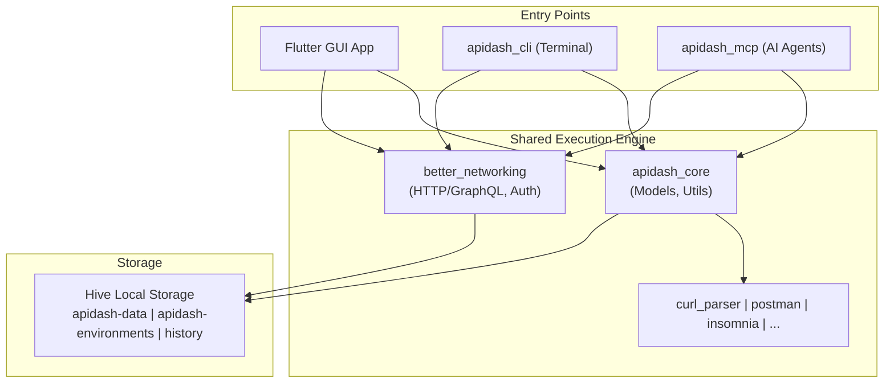

# GSoC 2026 Proposal — API Dash: CLI & MCP Support

---

## About

1. **Full Name:** Luxshan Thavarasa
2. **Contact info:** luxshan2327@gmail.com
3. **Discord handle:** *(will join and update)*
4. **Home page:** https://luxshan2000.github.io/
5. **Blog:** —
6. **GitHub:** https://github.com/Luxshan2000
7. **LinkedIn:** https://linkedin.com/in/lux-thavarasa
8. **Time zone:** UTC+5:30 (Sri Lanka)
9. **Resume:** https://luxshan2000.github.io/

---

## University Info

1. **University:** University of Moratuwa, Sri Lanka
2. **Program:** BSc Engineering Honours — Computer Science & Engineering
3. **Year:** Graduated
4. **Graduation date:** May 2025

---

## Motivation & Past Experience

### 1. Have you worked on or contributed to a FOSS project before?

This would be my first major open-source contribution, but I've built several projects that are directly relevant to what I'd be doing here:

| # | Project | Description | Tech |
|---|---------|-------------|------|
| 1 | **[mcp-lint](https://github.com/Luxshan2000/mcp-lint)** | A linter for MCP servers — 23 rules covering protocol compliance, schema validation, security, and performance. Published on PyPI. Supports stdio + SSE transports, CI/CD exit codes. | Python, MCP, Rich |
| 2 | **[FastMCP File Server](https://github.com/Luxshan2000/fastmcp-file-server)** | MCP server with 20+ file operation tools. Multi-transport (stdio, HTTP, ngrok), tiered access control. 6 stars on GitHub, published on PyPI. | Python, MCP, FastMCP |
| 3 | **[DravidaKavacham](https://github.com/Luxshan2000/dravida-kavacham)** | Abusive content detection for Tamil/Malayalam — published at DravidianLangTech 2025 (NAACL) | Python, PyTorch, NLP |
| 4 | **Professional work** | Full-stack development on an enterprise AI platform — agentic applications, LLM API integrations, tool interfaces | React, FastAPI, Python |
| 5 | **QuickChat Chrome Extension** | Real-time chat as a browser extension | JavaScript, WebSocket |

### 2. What is your one project/achievement that you are most proud of? Why?

My MCP projects — specifically [mcp-lint](https://github.com/Luxshan2000/mcp-lint).

To build a tool that checks *other people's* MCP servers for correctness, I had to really understand the protocol — the handshake lifecycle, how tool schemas should be structured, what resource URIs look like, what security pitfalls to watch for, and how performance characteristics show up in practice. It's one thing to build an MCP server; it's another to understand the spec well enough to tell others what they're doing wrong.

[FastMCP File Server](https://github.com/Luxshan2000/fastmcp-file-server) is the builder side — 20+ tools, multi-transport, access control. Together, these two projects mean I've seen MCP from both angles: building servers and auditing them.

On the professional side, I've been building agentic AI applications for the past couple of years — which taught me what makes a good tool interface from the AI agent's perspective. That's the kind of insight that matters when designing an MCP server: what information does the agent actually need? How should tool schemas be structured so the AI doesn't hallucinate parameters? These are things I think about daily.

### 3. What kind of problems or challenges motivate you the most?

Developer tooling. I love building things that make other developers' lives easier. There's something satisfying about removing friction from a workflow — like when you can run a saved API request from your terminal instead of switching to a GUI, or when your AI assistant can actually talk to your API client instead of you copy-pasting responses back and forth.

The CLI & MCP project is exactly this kind of problem: taking something that already works well (API Dash) and making it accessible in more places.

### 4. Will you be working on GSoC full-time?

Part-time. The 90-hour scope works well for this — roughly 11 hours a week over 8 weeks. I've already built two MCP servers and I'm familiar with the protocol, so I can move quickly on the MCP side. The refactoring and CLI work is straightforward Dart development.

### 5. Do you mind regularly syncing up with the project mentors?

Not at all — I'd want to. I'm used to daily standups and weekly reviews. Happy to sync on whatever cadence works best. Flexible on timing despite the UTC+5:30 timezone.

### 6. What interests you the most about API Dash?

A few things caught my eye while exploring the codebase:

- **The architecture is genuinely clean.** The monorepo with separate packages (`apidash_core`, `better_networking`, importers) made me think "okay, adding a CLI and MCP server here won't be a hack — the structure supports it." That's rare.
- **The AI integration is thoughtful.** DashBot with local LLM support shows the team cares about privacy, not just features. Adding MCP support is a natural extension of this philosophy.
- **25+ code generators** via a template system — this is immediately useful in a CLI context and trivial to expose via MCP tools.
- **The privacy-first approach.** Everything runs locally. No data leaves the machine. That matters.

### 7. Can you mention some areas where the project can be improved?

After digging through the codebase, a few things stood out:

- **`better_networking` has Flutter dependencies that block headless use.** Three files import `flutter/foundation.dart` and `flutter_web_auth_2`. This means you can't use API Dash's HTTP engine from a pure Dart CLI — which is the core blocker for this project. I plan to fix this as Phase 0.

- **Test coverage in core packages is thin.** `better_networking_test.dart` is mostly empty. The refactoring phase is a good opportunity to improve this.

- **No headless entry point exists.** The whole app requires `WidgetsFlutterBinding.ensureInitialized()` to start. The CLI and MCP server would be the first way to use API Dash without a GUI.

- **Workspace path is Flutter-coupled.** It's stored via `shared_preferences`, which won't work in pure Dart. The CLI needs a different resolution strategy (env var + config file).

### 8. Have you interacted with and helped API Dash community?

Just getting started — this proposal PR is my first interaction. I'll be joining the Discord and the weekly connect sessions.

---

## Project Proposal Information

### 1. Proposal Title

**CLI & MCP Support for API Dash**

### 2. Abstract

API Dash's features are currently only accessible through the Flutter GUI. This project adds two new packages — `apidash_cli` and `apidash_mcp` — that expose request execution, collection management, environment handling, and code generation to the terminal and to AI agents.

The CLI lets developers run requests, execute collections, manage environments, and generate code from the command line — making API Dash usable in CI/CD pipelines, scripts, and terminal workflows. The MCP server exposes these same capabilities via the Model Context Protocol, so AI assistants like Claude Desktop, VS Code Copilot, and Cursor can directly interact with your API collections.

Both packages share the same execution layer (`apidash_core` + `better_networking`), so behavior is identical whether you're using the GUI, CLI, or an AI agent. A prerequisite refactoring of `better_networking` to remove Flutter dependencies comes first, which benefits the entire project.

### 3. Detailed Description

---

## Architecture

Three entry points into the same core:



### Key Decisions

| Decision | Why |
|----------|-----|
| **Pure Dart** (no Flutter) | CLI and MCP need to run without Flutter. Also enables `dart compile exe` for native binaries. |
| **Reuse existing packages** | No duplication. Fixes to `better_networking` automatically propagate everywhere. |
| **stdio MCP transport** | It's what Claude Desktop, Cursor, and VS Code expect. No ports, no network exposure. |
| **Config file + env var for workspace** | Replaces `shared_preferences` (Flutter-only) with something that works everywhere. |

---

## Phase 0: Making `better_networking` Pure Dart

This is the unlock — without this, nothing else works. Three files need changes:

### Change 1: Replace `kIsWeb`

**Files:** `http_client_manager.dart`, `platform_utils.dart`

```dart
// Before (Flutter)
import 'package:flutter/foundation.dart';
// Uses kIsWeb

// After (Pure Dart — identical behavior)
const bool kIsWeb = bool.fromEnvironment('dart.library.js_interop');
```

### Change 2: Replace `debugPrint`

**File:** `handle_auth.dart`

```dart
// Before
debugPrint('OAuth token received');

// After
import 'dart:developer' as dev;
dev.log('OAuth token received', name: 'better_networking');
```

### Change 3: Split OAuth2 by platform

**File:** `oauth2_utils.dart`

`flutter_web_auth_2` is only needed on mobile. The fix:

1. Define a `BrowserAuthProvider` interface in `better_networking`
2. Implement the localhost callback flow as the default (works for desktop + CLI)
3. The Flutter app injects the mobile implementation via `flutter_web_auth_2`
4. No Flutter import left in the package

```dart
abstract class BrowserAuthProvider {
  Future<String> authenticate({
    required String url,
    required String callbackUrlScheme,
  });
}

// Default: localhost callback (already exists in better_networking)
class LocalhostAuthProvider implements BrowserAuthProvider {
  @override
  Future<String> authenticate({...}) async {
    return OAuthCallbackServer.startAndWait(url, callbackUrlScheme);
  }
}
```

**Validation:** All existing Flutter app tests must still pass. The `pubspec.yaml` drops the Flutter SDK constraint.

---

## Phase 1: `apidash_cli`

### Package Structure

```
packages/apidash_cli/
├── bin/
│   └── apidash.dart              # Entry point
├── lib/
│   ├── src/
│   │   ├── commands/
│   │   │   ├── request_command.dart
│   │   │   ├── collection_command.dart
│   │   │   ├── env_command.dart
│   │   │   ├── import_command.dart
│   │   │   └── codegen_command.dart
│   │   ├── services/
│   │   │   ├── workspace_resolver.dart
│   │   │   ├── hive_service.dart
│   │   │   └── output_formatter.dart
│   │   └── utils/
│   │       └── exit_codes.dart
│   └── apidash_cli.dart
├── test/
└── pubspec.yaml
```

### Commands in Action

```bash
# Fire off a request
$ apidash request https://api.example.com/users
200 OK  GET  https://api.example.com/users  143ms
[{"id": 1, "name": "Alice"}, {"id": 2, "name": "Bob"}]

# POST with headers and body
$ apidash request https://api.example.com/users \
  --method POST \
  --header "Content-Type: application/json" \
  --body '{"name": "Alice", "role": "engineer"}'

# JSON output for CI pipelines
$ apidash request https://api.example.com/health --output json
{"status_code": 200, "latency_ms": 43, "body": {"status": "healthy"}}

# List your saved requests
$ apidash collection list
ID            Name                Method   URL
────────────  ──────────────────  ──────   ──────────────────────────
abc123        Get Users           GET      https://api.example.com/users
def456        Create User         POST     https://api.example.com/users

# Run a collection against a specific environment
$ apidash collection run "User Tests" --env staging --output json

# Import a Postman collection
$ apidash import ./postman_collection.json --format postman
Imported 12 requests from "My API Collection"

# Generate Python code for a saved request
$ apidash codegen abc123 --lang python --lib requests

# Environment management
$ apidash env list production
Variable     Value
───────────  ──────────────────────────────
BASE_URL     https://api.prod.example.com
API_KEY      sk-prod-****
```

### Workspace Resolution

The CLI needs to find the same Hive database the GUI uses:

```dart
class WorkspaceResolver {
  /// 1. --workspace CLI flag (highest priority)
  /// 2. APIDASH_WORKSPACE env var
  /// 3. ~/.config/apidash/config.json
  /// 4. Default platform path
  static Future<String> resolve({String? cliFlag}) async {
    if (cliFlag != null) return cliFlag;

    final envPath = Platform.environment['APIDASH_WORKSPACE'];
    if (envPath != null) return envPath;

    final configPath = _getConfigFilePath();
    final configFile = File(configPath);
    if (configFile.existsSync()) {
      final config = jsonDecode(configFile.readAsStringSync());
      if (config['workspace_path'] != null) return config['workspace_path'];
    }

    return _getDefaultPath();
  }
}
```

### Exit Codes

| Code | Meaning |
|------|---------|
| 0 | Success |
| 1 | API error (4xx/5xx) |
| 2 | CLI error (bad args, missing config) |
| 3 | Network error (timeout, connection refused) |

This makes it easy to use in CI:
```yaml
# GitHub Actions
- name: Health Check
  run: apidash request ${{ env.API_URL }}/health --output json
```

### Distribution

```bash
# Install from pub.dev
dart pub global activate apidash_cli

# Or compile a native binary
dart compile exe bin/apidash.dart -o apidash
```

---

## Phase 2: `apidash_mcp`

### Package Structure

```
packages/apidash_mcp/
├── bin/
│   └── apidash_mcp.dart          # Entry point
├── lib/
│   ├── src/
│   │   ├── tools/
│   │   │   ├── request_tools.dart
│   │   │   ├── collection_tools.dart
│   │   │   ├── env_tools.dart
│   │   │   ├── import_tools.dart
│   │   │   └── codegen_tools.dart
│   │   ├── resources/
│   │   │   ├── request_resources.dart
│   │   │   ├── env_resources.dart
│   │   │   └── history_resources.dart
│   │   ├── prompts/
│   │   │   ├── debug_prompt.dart
│   │   │   ├── test_prompt.dart
│   │   │   └── explain_prompt.dart
│   │   └── server.dart
│   └── apidash_mcp.dart
├── test/
└── pubspec.yaml
```

### Server Entry Point

```dart
void main() async {
  final server = McpServer(
    Implementation(name: 'apidash-mcp', version: '1.0.0'),
    options: ServerOptions(
      capabilities: ServerCapabilities(
        tools: ServerCapabilitiesTools(),
        resources: ServerCapabilitiesResources(),
        prompts: ServerCapabilitiesPrompts(),
      ),
    ),
  );

  registerRequestTools(server);
  registerCollectionTools(server);
  registerEnvironmentTools(server);
  registerImportTools(server);
  registerCodegenTools(server);
  registerResources(server);
  registerPrompts(server);

  await server.connect(StdioServerTransport());
}
```

### Tools

| Tool | What it does |
|------|-------------|
| `execute_request` | Run a saved request by ID or an ad-hoc request by URL |
| `list_requests` | List all saved requests with IDs, names, methods, URLs |
| `run_collection` | Execute all requests in a collection and return a summary |
| `import_curl` | Parse a cURL command into a request |
| `generate_code` | Generate integration code in 25+ languages |
| `manage_environment` | List, get, set, or delete environment variables |

Here's what `execute_request` looks like under the hood:

```dart
server.addTool(
  'execute_request',
  description: 'Execute an HTTP request. Provide request_id to run a '
      'saved request, or url+method for an ad-hoc request.',
  inputSchema: {
    'type': 'object',
    'properties': {
      'request_id': {'type': 'string', 'description': 'ID of a saved request'},
      'url': {'type': 'string', 'description': 'URL for ad-hoc request'},
      'method': {
        'type': 'string',
        'enum': ['GET', 'POST', 'PUT', 'DELETE', 'PATCH', 'HEAD'],
      },
      'headers': {'type': 'object'},
      'body': {'type': 'string'},
      'environment': {'type': 'string', 'description': 'Environment for variable resolution'},
    },
  },
  handler: (CallToolRequest request) async {
    final args = request.arguments;
    final requestId = args['request_id'] as String?;

    HttpRequestModel httpModel;
    if (requestId != null) {
      httpModel = await hiveService.getRequest(requestId);
    } else {
      httpModel = HttpRequestModel(
        url: args['url'] as String,
        method: HTTPVerb.values.byName(
          (args['method'] as String? ?? 'GET').toLowerCase()
        ),
      );
    }

    if (args['environment'] != null) {
      httpModel = resolveEnvironment(httpModel, args['environment']);
    }

    final response = await httpService.sendRequest(httpModel);
    return formatToolResult(response);
  },
);
```

### Resources

Read-only context that AI agents can browse without executing anything:

| URI | Description |
|-----|-------------|
| `apidash://requests` | All saved requests |
| `apidash://requests/{id}` | Individual request details |
| `apidash://environments` | All environments and variables |
| `apidash://history` | Recent request/response history |

```dart
server.addResource(
  uri: 'apidash://requests',
  name: 'Saved Requests',
  description: 'All API requests saved in API Dash',
  handler: (_) async {
    final requests = await hiveService.getAllRequests();
    return ReadResourceResult(
      contents: [
        TextResourceContents(
          uri: 'apidash://requests',
          text: jsonEncode(requests.map((r) => r.toJson()).toList()),
          mimeType: 'application/json',
        ),
      ],
    );
  },
);
```

### Prompts

Pre-built templates that make AI assistants genuinely helpful for API work:

| Prompt | What it does |
|--------|-------------|
| `debug_api` | Feeds the AI a failing request + response + error for diagnosis |
| `test_endpoint` | Generates test assertions for an endpoint |
| `explain_response` | Explains a response in plain language |

```dart
server.addPrompt(
  name: 'debug_api',
  description: 'Debug a failing API request with full context',
  arguments: [
    PromptArgument(name: 'request_id', description: 'The failing request', required: true),
  ],
  handler: (GetPromptRequest req) async {
    final request = await hiveService.getRequest(req.arguments['request_id']!);
    final lastResponse = await hiveService.getLastResponse(request.id);

    return GetPromptResult(
      messages: [
        PromptMessage(
          role: Role.user,
          content: TextContent(text: '''
You are debugging a failing API request.

## Request
- **Method:** ${request.method.name.toUpperCase()}
- **URL:** ${request.url}
- **Headers:** ${jsonEncode(request.headers)}
- **Body:** ${request.body ?? 'None'}

## Response
- **Status:** ${lastResponse?.statusCode ?? 'No response'}
- **Body:** ${lastResponse?.body ?? 'No body'}

Analyze the request and response, identify the likely issue, and suggest fixes.
'''),
        ),
      ],
    );
  },
);
```

### Connecting to AI Clients

```json
// Claude Desktop
{
  "mcpServers": {
    "apidash": {
      "command": "apidash_mcp",
      "env": { "APIDASH_WORKSPACE": "/path/to/workspace" }
    }
  }
}
```

```json
// VS Code
{
  "servers": {
    "apidash": { "type": "stdio", "command": "apidash_mcp" }
  }
}
```

```json
// Cursor
{
  "mcpServers": {
    "apidash": { "command": "apidash_mcp" }
  }
}
```

Once connected, you can just say *"run my login request and check if the token is valid"* — and it happens.

### Testing

- **Unit tests:** Each tool, resource, and prompt handler tested with mock Hive data
- **Integration tests:** Start the server as a subprocess, send JSON-RPC via stdin, validate stdout
- **MCP Inspector:** Manual validation during development

```bash
npx @modelcontextprotocol/inspector dart run packages/apidash_mcp/bin/apidash_mcp.dart
```

And yes — I'll run my own [mcp-lint](https://github.com/Luxshan2000/mcp-lint) against the server to catch protocol compliance issues early.

---

## Challenges & How I'll Handle Them

| Challenge | What I'll do |
|-----------|-------------|
| `better_networking` Flutter deps | Tackle first (Week 1). Only 3 files need changes — well-scoped. |
| Hive concurrent access (GUI + CLI) | CLI reads GUI data read-only. Writes go through a file-lock mechanism. |
| MCP spec evolution | Pin `mcp_dart` version during development. The package tracks the spec. |
| 90-hour scope | MVP-first: working request execution by Week 2. Everything else builds on that foundation. |

---

## 4. Weekly Timeline

### Community Bonding (Pre-coding)

- Join Discord, attend weekly connects
- Deep-dive into `better_networking`, `apidash_core`, `hive_services.dart`
- Set up dev environment, run existing tests
- Align scope with mentors
- Start the `better_networking` refactoring early if possible

---

### Week 1: Refactor `better_networking` to Pure Dart (~11.5h)

| Days | Task | Hours |
|------|------|-------|
| 1-2 | Replace `kIsWeb` in `http_client_manager.dart` and `platform_utils.dart` | 3h |
| 3 | Replace `debugPrint` in `handle_auth.dart` | 1.5h |
| 4-5 | Extract `BrowserAuthProvider` interface, split OAuth2 flows | 4h |
| 6-7 | Update pubspec, run all tests, fix regressions | 3h |

**Deliverable:** PR merged — `better_networking` works as a pure Dart package

---

### Week 2: CLI Skeleton + `request` Command (~12h)

| Days | Task | Hours |
|------|------|-------|
| 1-2 | Set up `apidash_cli` package, command routing via `args` | 3h |
| 3-4 | Implement `WorkspaceResolver` | 3h |
| 5-6 | Implement `request` command end-to-end | 4h |
| 7 | Add `--output json`, exit codes, basic tests | 2h |

**Deliverable:** `apidash request https://httpbin.org/get` works

---

### Week 3: Remaining CLI Commands (~11h)

| Days | Task | Hours |
|------|------|-------|
| 1-2 | `collection list` — read Hive, format as table | 3h |
| 3-4 | `collection run` — batch execution with progress | 3h |
| 5 | `env list`, `env set` | 2h |
| 6-7 | `import` command using existing parsers | 3h |

**Deliverable:** Full CLI command suite working

---

### Week 4: MCP Server + First Tool (~11h)

| Days | Task | Hours |
|------|------|-------|
| 1-2 | Set up `apidash_mcp`, integrate `mcp_dart`, entry point | 3h |
| 3-4 | Register `execute_request` tool with full schema | 3h |
| 5-6 | Wire handler to `better_networking` | 3h |
| 7 | Test with MCP Inspector | 2h |

**Deliverable:** MCP server executes requests via tool calls

---

### Week 5: Full MCP Tool Suite (~11h)

| Days | Task | Hours |
|------|------|-------|
| 1-2 | `list_requests` and `run_collection` | 3h |
| 3-4 | `import_curl` and `generate_code` | 3h |
| 5-6 | `manage_environment` | 2.5h |
| 7 | Test all tools via Inspector | 2.5h |

**Deliverable:** All 6 MCP tools working

---

### Week 6: Resources + Prompts + Integration (~11h)

| Days | Task | Hours |
|------|------|-------|
| 1-2 | Resources: `apidash://requests`, `apidash://environments`, `apidash://history` | 3h |
| 3-4 | Prompts: `debug_api`, `test_endpoint`, `explain_response` | 3h |
| 5-7 | End-to-end testing with Claude Desktop and VS Code | 5h |

**Deliverable:** Working integration with real AI clients

---

### Week 7: Testing (~11h)

| Days | Task | Hours |
|------|------|-------|
| 1-2 | Unit tests for CLI commands (mock Hive, mock HTTP) | 3h |
| 3-4 | Unit tests for MCP tools and resources | 3h |
| 5-6 | Integration tests (CLI end-to-end, MCP subprocess) | 3h |
| 7 | Edge cases: timeouts, bad input, missing workspace | 2h |

**Deliverable:** >80% coverage on new packages

---

### Week 8: Polish + Docs (~11h)

| Days | Task | Hours |
|------|------|-------|
| 1-2 | READMEs for both packages | 3h |
| 3-4 | MCP client configuration guides | 2h |
| 5 | Compile native binaries, test `dart pub global activate` | 2h |
| 6-7 | Final review, demo recording, submission | 4h |

**Deliverable:** Everything merged, documented, and ready for pub.dev

---

**Total: ~90 hours over 8 weeks (~11h/week)**

---

## Deliverables Summary

| # | What | Description |
|---|------|-------------|
| 1 | `better_networking` refactoring | Remove Flutter deps — benefits the whole project |
| 2 | `apidash_cli` package | CLI with request, collection, env, import, codegen commands |
| 3 | `apidash_mcp` package | MCP server with 6 tools, 3 resources, 3 prompts |
| 4 | Test suite | Unit + integration tests for both packages |
| 5 | Documentation | READMEs, install guides, client config guides |
| 6 | Native binaries | Compiled executables for macOS, Windows, Linux |
