# Proposal

### My Information

1. **Full Name:** Rishi Ahuja
2. **Contact info:** [rishia2220@gmail.com](mailto:rishia2220@gmail.com) / [rishi@silentninja.tech](mailto:rishi@silentninja.tech)
3. **Discord handle:** rishi_2220
4. **Home page:** [rishia.in](https://rishia.in)
5. **Blog:** [rishia.in/blogs](https://rishia.in/blogs) | upstream: [Hashnode](https://rishi2220.hashnode.dev)
6. **GitHub:** [Link](https://github.com/RishiAhuja)
7. **Resume:** [Link](https://artifacts.rishia.in/resume/rishi-resume-v10.pdf)
8. **LinkedIn:** [Link](https://www.linkedin.com/in/rishi-ahuja-b1a224310/)
9. **Time Zone**: GMT +05:30

### University Info

1. **University Name:** National Institute of Technology, Jalandhar
2. **Program:** Bachelor of Technology, Department of Information Technology
3. **Year:** Sophomore
4. **Expected graduation:** Aug, 2028

### Motivation & Past Experience

Short answers to the following questions:

1. **Have you worked on or contributed to a FOSS project before? Can you attach repo links or relevant PRs?**
    
    I’ve previously contributed to different open source software, which includes [API Dash](https://github.com/foss42/apidash), [AppFlowy.io](https://github.com/AppFlowy-IO/), [asdf-vm](https://github.com/asdf-vm/), [Processing Foundation](https://github.com/processing/), and [Open Food Facts](https://github.com/openfoodfacts/smooth-app/)
    
    - API Dash ([#918](https://github.com/foss42/apidash/pull/918)): Open: I tried implementing a hurl file import for macOS by bridging a Rust parsing library into Flutter over FFI, mapping the parsed request data onto API Dash's existing models, It was fun to have some hands dirty on Rust.
    - API Dash ([#1121](https://github.com/foss42/apidash/pull/1121)): Open: Fixed a bug where video and audio would keep playing silently in the background when switching between tabs, caused by how API Dash keeps all tabs mounted simultaneously.
    - asdf-vm ([#2245](https://github.com/asdf-vm/asdf/pull/2245)): Open: Fixed a long-standing issue (which I personally faced) where interrupted installs would show up as valid versions in list, by writing to a staging directory and only promoting it to the final path once installation fully succeeds.
    - AppFlowy.io ([#8278](https://github.com/AppFlowy-IO/AppFlowy/pull/8278)): Merged: Fixed a screen flickering issue that occurred when clicking through the sidebar too quickly.
    - AppFlowy.io ([#8261](https://github.com/AppFlowy-IO/AppFlowy/pull/8261)): Open: Fixed layout spacing and inconsistent hover behavior in the keyboard shortcuts settings page.
    - Processing Foundation ([#8190](https://github.com/processing/p5.js/pull/8190)):  Merged: Updated outdated links in Contributing Guide and added the Discord server reference to help new contributors find the right channels.
    - Open Food Facts ([#6963](https://github.com/openfoodfacts/smooth-app/issues/6963)): Closed: Reported and documented a layout overflow bug on the Scan screen that caused a Render Flex error on smaller devices, which was subsequently resolved by the maintainers.
    
    Contributing to these organizations sits alongside my production experience building Flutter apps, ML pipelines, and backend systems at companies like [Stack Wealth](https://stackwealth.in/) (YC S21), [Annam.ai](https://www.annam.ai/) (IIT Ropar) and [Zenbase Technologies](http://silentninja.tech) (Singapore). Additionally, leading app development at my university's GDGC and organizing a [recent Flutter bootcamp](http://rishia.in/flutter-bootcamp) has strengthened my ability to mentor others and navigate large, collaborative ecosystems.
    
2. **What is your one project/achievement that you are most proud of? Why?**
    
    In 9th grade I built a Flutter app for classmates, then got distracted by a more interesting questions like, how does any of this actually render on screen? That curiosity eventually became [FernKit](https://fernkit.in/) — a UI toolkit that renders pixel-by-pixel for Linux and WebAssembly, with its own CLI toolchain, networking layer, and a TTF text rasterizer written from scratch in C++. Generally people try to make clone apps, but I tried to clone and understand the internals of a framework, i.e. flutter. What I'm proud of isn't the output, it's the habit of understanding systems deeply enough to rebuild them, which is the same instinct behind this proposal.
    
3. **What kind of problems or challenges motivate you the most to solve them?**
    
    The problems that pull me in most are the ones where the surface looks simple but there's a lot going on underneath — bugs with non-obvious root causes, systems that seem like magic until you read the spec. That same curiosity spills into how I learn too. I write technical blogs, but not the quick surface-level kind, some of them are long enough that I'd hesitate to share them casually. I've only published 11, but I obsess over each one. At one point I sat down and actually read through the WebSocket RFC just to understand what was really going on beneath the WebSocket API, wrote about it [here](https://rishia.in/blogs/you-dont-know-websockets-yet) if that gives a sense of how I approach things. I'm not publishing blogs right now, as I was working on a research paper which got accepted in A* conference workshop (ICLR).
    
4. **Will you be working on GSoC full-time? In case not, what will you be studying or working on while working on the project?**
    
    Yes, my university summer break covers June and July, which overlaps with the bulk of the GSoC coding period (May 25 – Aug 24), so I'll be fully available during that stretch. Light coursework for the new semester starts in August, but it won't meaningfully affect my availability — I'll still be able to commit full-time hours to the project.
    
5. **Do you mind regularly syncing up with the project mentors?**
    
    Not at all, I'd actually appreciate it. I work better with regular feedback than without it, it keeps things from drifting in the wrong direction for too long. I'm available on Discord, email, or calls, and pretty flexible on timing given IST, I also sleep a lot less. Happy to sync as often as the mentors find useful.
    
6. **What interests you the most about API Dash?**

    I know you guys probably get this a lot, but honestly, it's just fast and doesn't get in my way. I've always had a thing against Electron tax, Postman and Discord being the usual suspects. Before API Dash I was already using lighter alternatives like Hopscotch and qapi just to dodge the bloat, so when I found something that opens and is ready to go in under a second, I was sold + its Flutter! Beyond that, the monorepo split is something I genuinely appreciate, when I worked on the Hurl import PR [#918](https://github.com/foss42/apidash/pull/918), I could add a new file-format parser without touching a lot of stuff. That kind of clean separation makes it easy to go deep on one thing without fear of breaking something unrelated.

7. **Can you mention some areas where the project can be improved?**

    The biggest missing piece right now is protocol coverage. REST and GraphQL are solid, but a huge chunk of modern infrastructure speaks gRPC (every Kubernetes control-plane call, most microservice meshes), or runs on persistent connections (WebSocket for real-time apps, MQTT for IoT). API Dash currently has no way to test any of those, which means developers have to context-switch to separate tools for each protocol. Building first-class support for WebSocket, MQTT, and gRPC with the same clean UX that REST already has — would make API Dash a genuine all-in-one tool instead of a REST-only one.

    Beyond protocols, integration code generation for the new protocol types (gRPC client stubs, MQTT publish/subscribe snippets, WebSocket connection code) would be the natural next step, so users can go from "I tested it" to "I can use it in my app" without copy-pasting from docs.

---

## Project Proposal Information

### Proposal Title

**WebSocket, MQTT & gRPC — First-Class Protocol Support for API Dash**

### Issue

[#15](https://github.com/foss42/apidash/issues/15) (WebSocket), [#115](https://github.com/foss42/apidash/issues/115) (MQTT), [#14](https://github.com/foss42/apidash/issues/14) (gRPC)

### Working Implementation

Before writing this proposal, I built all three protocols end-to-end — WebSocket connections with a full message log, MQTT pub/sub with topic management and QoS, and the complete gRPC flow including server reflection and dynamic protobuf encoding. Everything described here has been tested against real servers.

**Fork:** [RishiAhuja/apidash](https://github.com/RishiAhuja/apidash)

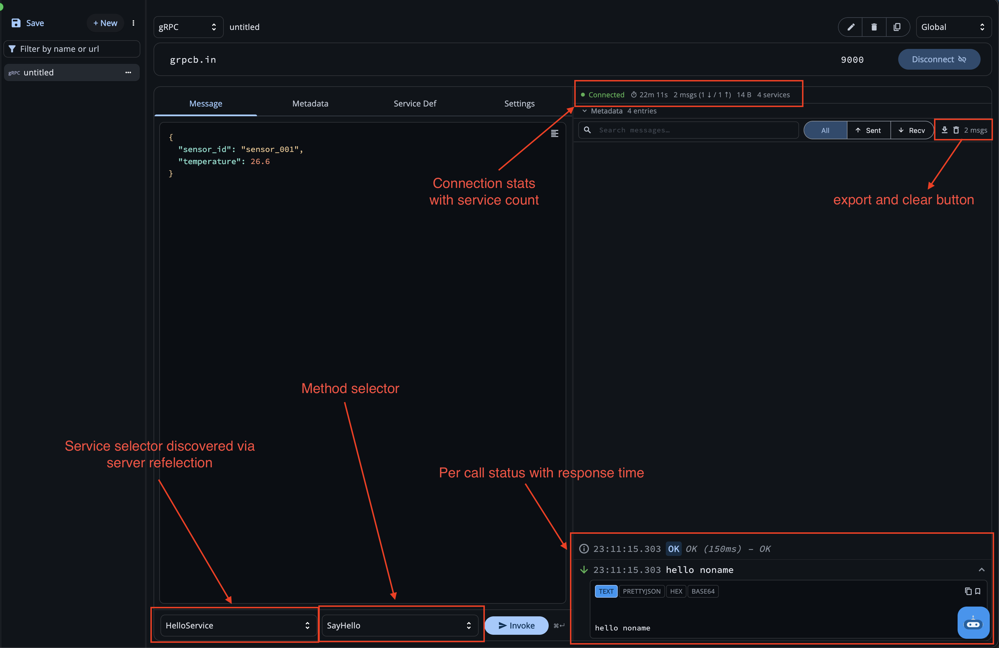

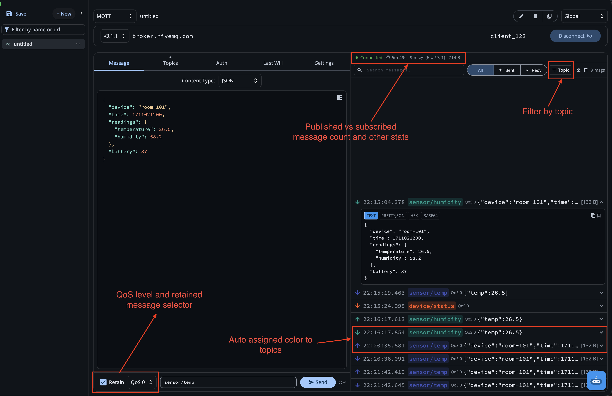

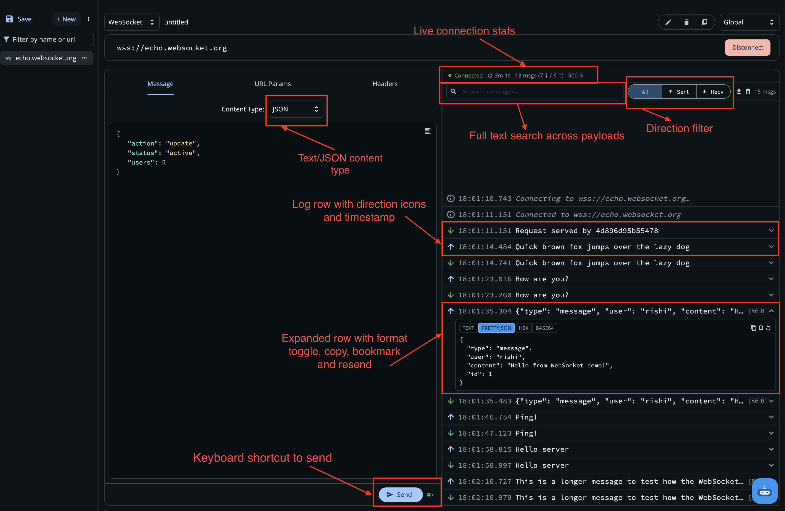

---

### Abstract

API Dash handles REST and GraphQL well, but developers testing WebSocket, MQTT, or gRPC APIs today have to jump between separate tools — Postman, MQTTX, grpcurl, wscat — each with its own workflow and quirks. I want to add first-class support for all three protocols with a focus on the developer experience: a message log with full-text search, filtering, payload inspection, keyboard shortcuts, and topic management — the kind of experience developers expect from modern tooling but rarely get in a single, free, open-source app.

I've already built a working implementation that covers all three protocols. This proposal covers completing, hardening, and polishing all three, then integrating code generation for each protocol.

---

### Detailed Description

#### The Problem Today

If you're building a system that uses WebSocket, MQTT, or gRPC, your testing workflow today looks something like this (for open source tooling ofcourse):

- **WebSocket:** Fire up `wscat` in a terminal, or use Postman's WebSocket tab, or hunt for a browser extension. I personally go to Hopscotch for this.
- **MQTT:** Download MQTTX (a standalone Electron app), or use the `mosquitto_pub`/`mosquitto_sub` CLI tools. I've used MQTT once in a project myself, and I used MQTTX that time.
- **gRPC:** Run `grpcurl` from the command line (hope you have the `.proto` files handy), or use Postman (which requires importing proto files upfront).

That's three different tools with three different UIs for three protocols that often coexist in the same project. A developer working on a system with a REST gateway, a gRPC backend, and MQTT telemetry has to context-switch between completely different environments just to test their own stack.

API Dash already provides a clean, fast client for REST and GraphQL. This project extends that same experience to WebSocket, MQTT, and gRPC — so developers have one tool for everything.

---

### WebSocket

I have a personal connection to this protocol. Last year I sat down and read through the entire [RFC 6455](https://datatracker.ietf.org/doc/html/rfc6455) — every section from the opening handshake to the masking algorithm to the security considerations (obviously with the help of AI tools) - and wrote a [25-minute blog post](https://rishia.in/blogs/you-dont-know-websockets-yet) about it. That deep understanding helped with practical decisions in the implementation, one example goes like making sure to `await channel.ready` before reporting "connected" — because the library returns immediately from `connect()` but the actual handshake hasn't completed yet.

WebSocket has been the oldest open feature request since April 2023 ([#15](https://github.com/foss42/apidash/issues/15)) in APIDash. Five previous PRs were all blocked by losing connection state when switching tabs — I solved this with Riverpod family providers keyed by request ID, which naturally preserves state across tab switches, it was simple.

The request pane gives you three tabs: Message (compose area with a Text/JSON content type selector), URL Params, and Headers. URL Params and Headers are the exact same widgets REST already uses — because the WebSocket handshake *is* an HTTP request with gets eventually hijacked. No need to rebuild that.

The initial prototype used chat-style bubbles — sent messages right-aligned, received left-aligned, like a messaging app. It worked, but it didn't feel like a debugging tool. I looked at how **Postman's WebSocket timeline** uses compact, reverse-chronological rows with direction arrows and timestamps, how **Browser DevTools' Network panel** shows size badges and information-dense rows, and how **MQTTX** color-codes each subscription topic. I took elements from all three and rebuilt the entire response pane around a professional looking message log.

Every message is now a single compact row, direction icon (↑ sent / ↓ received), timestamp down to milliseconds, payload preview, and byte size. You can click any row to expand the full payload — four format chips let you switch between Text, Pretty JSON, Hex, and Base64 views. You can see the expanded row with format toggle, copy, bookmark, and resend actions in the screenshot above. Pretty JSON auto-formats with proper indentation, Hex gives you a byte-level dump for binary payloads. This entire message log is a shared widget that works identically across all three protocols.

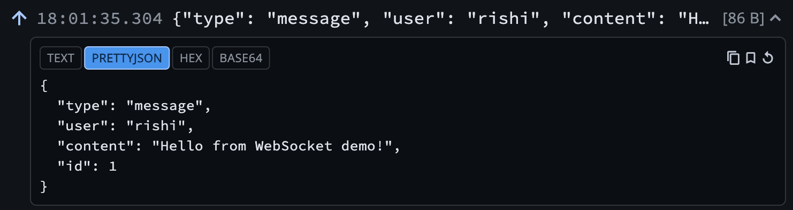

There's a search bar at the top of the log — type a query and only matching messages are shown, with a live "N found" counter that updates as you type. A segmented button next to it lets you filter by All / Sent / Received messages instantly. A persistent stats bar shows connection status, uptime, message counts with direction breakdown, and total bytes transferred — all visible in the annotated screenshot above.

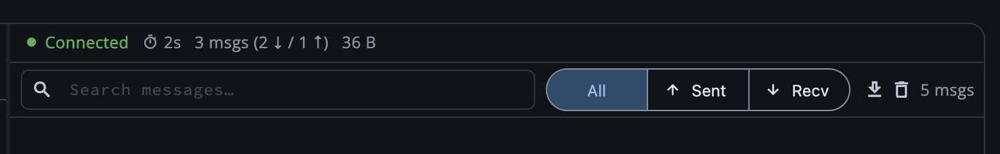

I also added keyboard shortcuts that make a real difference when you're in the flow of testing: Command/Ctrl+Enter to send, Command/Ctrl+L to clear all messages, Command/Ctrl+F to jump to the search field. A subtle Command/Ctrl↵ hint appears next to the Send button so users discover the shortcut naturally. You can also export the entire session as JSON, and on each expanded message: copy payload, bookmark it, or resend with one click.

Auto-reconnect with exponential backoff is built in — if the connection drops unexpectedly, the client retries with increasing delays (2s → 4s → 8s → 16s → 30s cap, max 5 attempts). Each attempt appears as a status message in the log so you can see what's happening. This is standard in production WebSocket clients but often missing in testing tools.

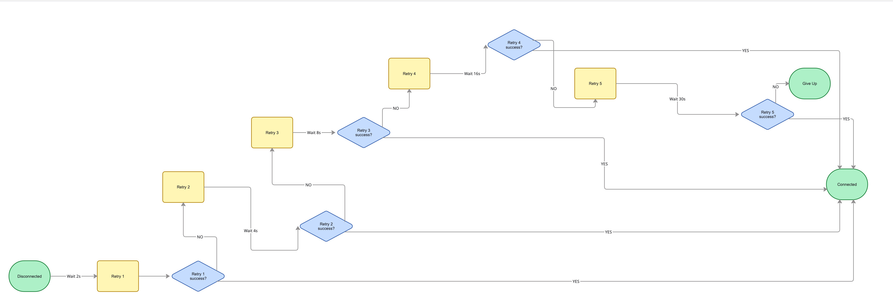

---

### MQTT

MQTT has a personal backstory for me. In my second semester, I was building a controller for a robowar competition at my college — I needed to send joystick commands from a phone flutter app to an ESP32 over WiFi. HTTP was too heavy, WebSocket needed a server, so I found MQTT. Used [MQTTX](https://mqttx.app/) to test the broker setup and the [mqtt_client](https://pub.dev/packages/mqtt_client) Dart package on the app side. It worked well enough to steer the robot through the competition, but I just had enough knowlege to just make it work.

  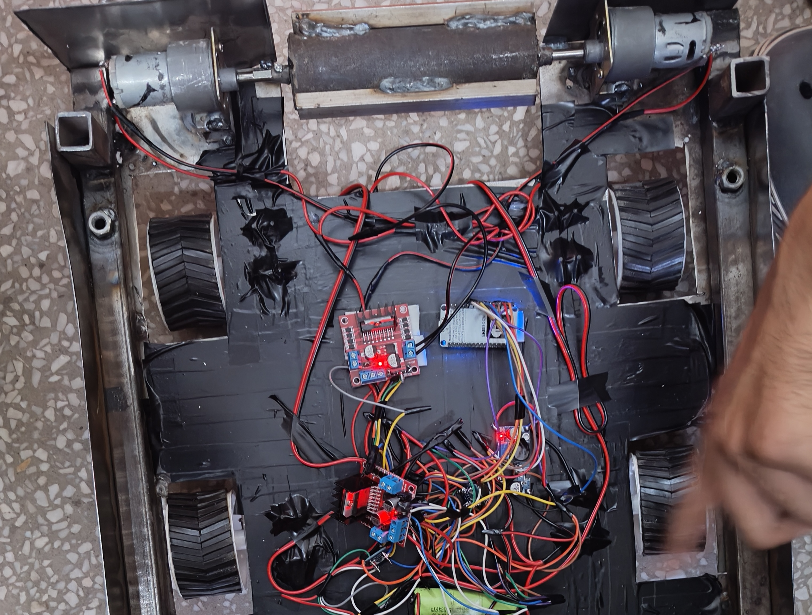

For this project I went much deeper — reading the [MQTT v3.1.1 OASIS spec](https://docs.oasis-open.org/mqtt/mqtt/v3.1.1/os/mqtt-v3.1.1-os.html) (again AI assisted) to understand QoS delivery guarantees, retained message behavior, and the CONNECT packet structure. The core idea is that clients never talk to each other directly, everything goes through a broker. Here's a diagram I drew while working through the pub/sub architecture:

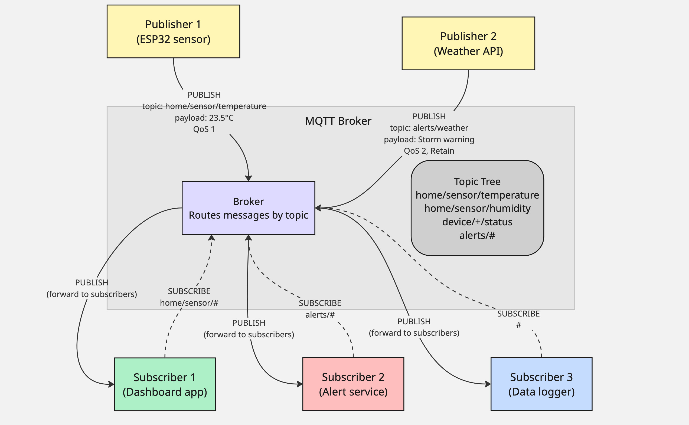

The MQTT implementation has five configuration tabs.

Message for composing the publish payload with syntax highlighting, Topics for managing subscriptions where you can add topics, pick QoS levels, and toggle subscribe on/off while connected, Auth for username and password with environment variable support, Last Will for the message the broker sends if you disconnect unexpectedly, and Settings for port, keep-alive interval, clean session, and MQTT version.

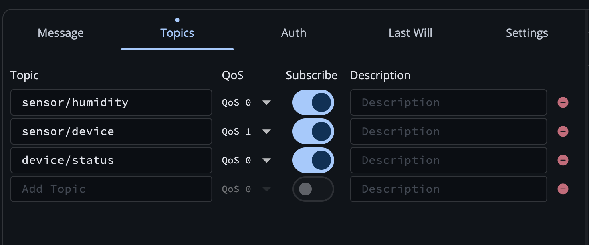

At the bottom there's a publish bar that stays always visible — retain checkbox, QoS selector, topic field, and the send button. I borrowed this layout directly from MQTTX because it's a pattern MQTT developers are already comfortable with.

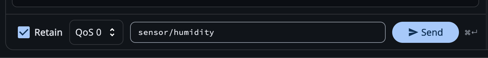

The message log has the same search, filtering, payload inspection, keyboard shortcuts, and export that I described for WebSocket — it's all the same shared widget. What's different for MQTT is topic-specific features. Each subscribed topic automatically gets a distinct color from a 10-color palette — I borrowed this directly from MQTTX, where each subscription gets a unique visual identity. When you're watching messages from `sensor/temp`, `sensor/humidity`, and `device/status` arrive simultaneously, the colors make it instantly scannable.

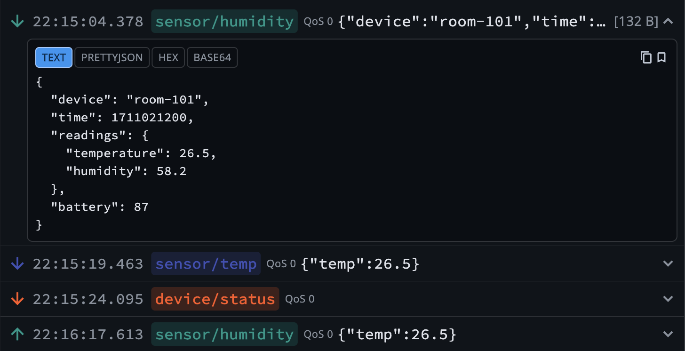

In addition to the direction filter, MQTT gets a topic filter dropdown — click it, select a topic, and the log shows only messages from that one. This was inspired by MQTTX, where clicking a subscription in the sidebar filters the message view.

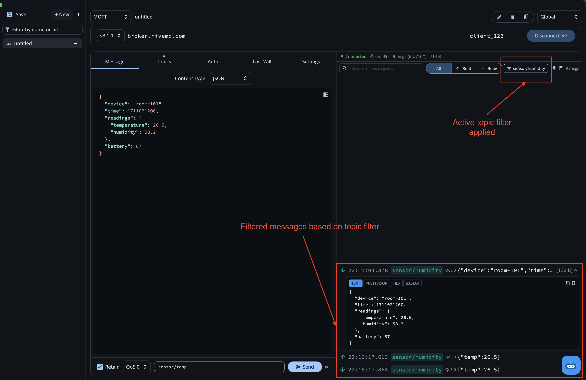

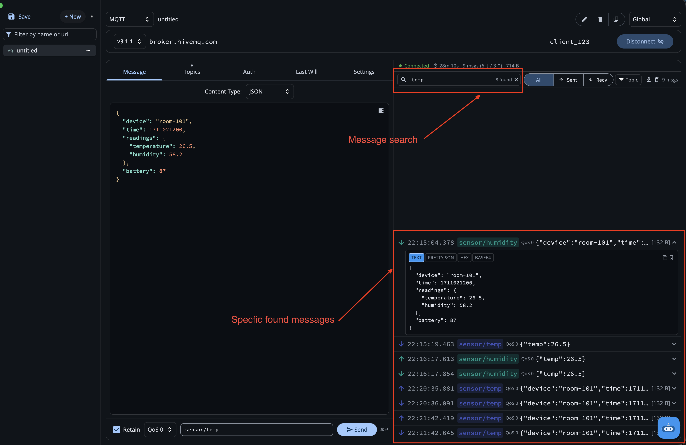

MQTT was first requested in February 2024 ([#115](https://github.com/foss42/apidash/issues/115)). Previous attempts were blocked by reusing the HTTP request model for MQTT — which doesn't work because MQTT needs its own broker, client ID, topics, QoS, and LWT fields. This implementation uses a dedicated MqttRequestModel with separate providers, so nothing collides with REST.

MQTT v5 is planned for the GSoC coding period. The current implementation supports v3.1.1. v5 adds shared subscriptions, user properties, and more granular reason codes — each of these needs new UI components that I'd like to design with mentor input during community bonding.

---

### gRPC

gRPC was the protocol I was least familiar with going in. I'd used [Serverpod](https://pub.dev/packages/serverpod) in Flutter before for a app — similar RPC pattern — but the actual wire format (Protocol Buffers over HTTP/2) was completely new to me. I spent time reading the [gRPC spec](https://grpc.io/docs/what-is-grpc/core-concepts/) and the [Protocol Buffers encoding guide](https://protobuf.dev/programming-guides/encoding/). Here are handwritten notes from working through how protobuf field types map to wire encoding, just thought to attach them casually:

  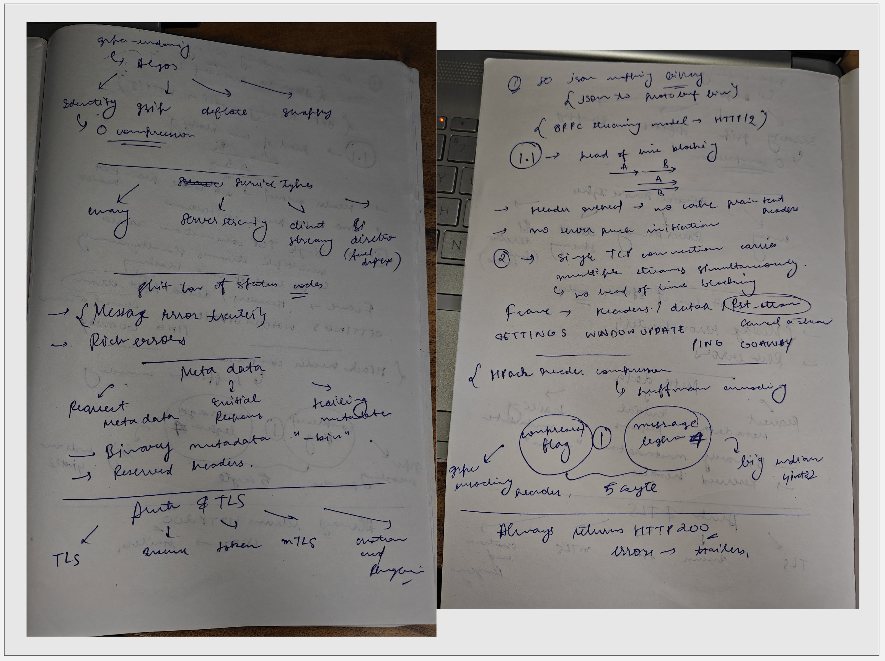

This matters because I wrote a custom encoder that takes JSON input and produces valid protobuf binary at runtime, without needing compiled `.proto` files. It handles all 15 protobuf field types, including tricky ones like ZigZag-encoded signed integers and nested messages. gRPC supports four call types — unary, server streaming, client streaming, and bidirectional:

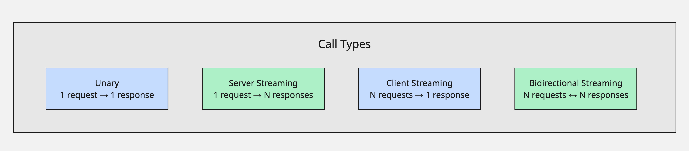

The feature that makes gRPC genuinely pleasant to test is **Server Reflection**. Tools like Postman and grpcui support this too, but many gRPC workflows still start with importing `.proto` files manually — and for a lot of developers that's still the default path. Server Reflection flips the workflow — we connect to the server and ask "what services do you expose?", it sends back its service definitions, and we populate the service/method dropdowns automatically. No proto file management, no compilation step. Just connect and test.

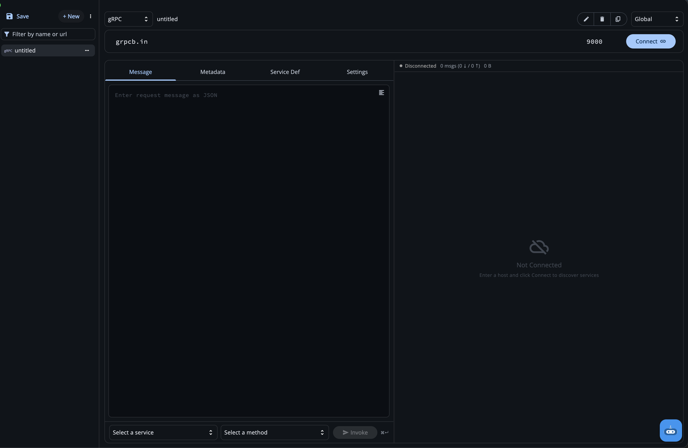

The request pane has four tabs — Message for the JSON request body that gets encoded to protobuf at send time, Metadata for key/value headers (gRPC's equivalent of HTTP headers), Service Def where you can browse discovered services, their methods, and message schemas, and Settings for TLS toggle and server reflection toggle with `.pb` file import as a fallback for servers without reflection enabled.

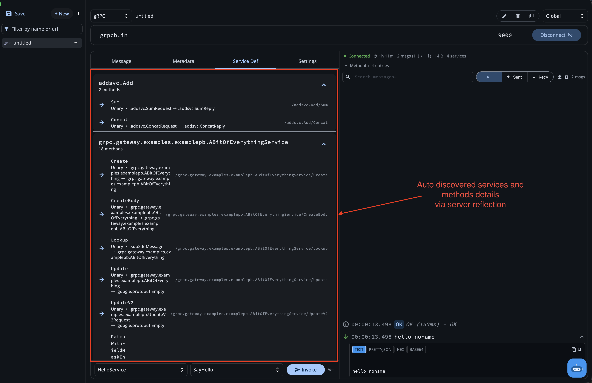

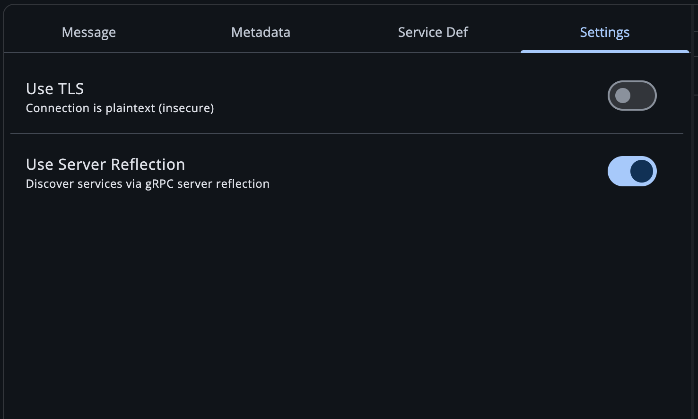

For servers that don't have reflection enabled (common in production), users can import a `.pb` descriptor file — the pre-compiled binary output of `protoc --descriptor_set_out=output.pb`. We chose `.pb` descriptors over raw `.proto` files deliberately. Parsing `.proto` text requires either maintaining a full Protocol Buffer IDL parser — which is a serious undertaking (proto3 syntax, imports, nested messages, options, all of it) — or bundling the `protoc` compiler binary with the app. Postman takes the second approach: they ship `protoc` internally and compile `.proto` files behind the scenes, which adds dependency weight and binary size. With `.pb` descriptors, we skip all of that — the binary is trivially deserialized by any protobuf library, and the user just runs `protoc` once on their machine (which they already have if they're working with gRPC). We can explore adding direct `.proto` file support during GSoC if there's demand — potentially bundling a lightweight parser or `protoc` binary — but that's a discussion best had during community bonding. The UI works identically regardless of whether services come from reflection or a `.pb` import. The message log, search, filtering, and all the shared features work the same way as WebSocket and MQTT — plus gRPC's stats bar additionally shows the discovered service count.

gRPC was requested in April 2023 ([#14](https://github.com/foss42/apidash/issues/14)). No previous PR reached a working implementation — the combined scope of reflection, protobuf encoding, streaming, and UI blocked every attempt. This is the first complete end-to-end implementation, tested against `grpcb.in`, local Go servers, and local Python servers.

---

### How Everything Fits Together

All three protocols follow the same layered pattern API Dash already uses for REST:

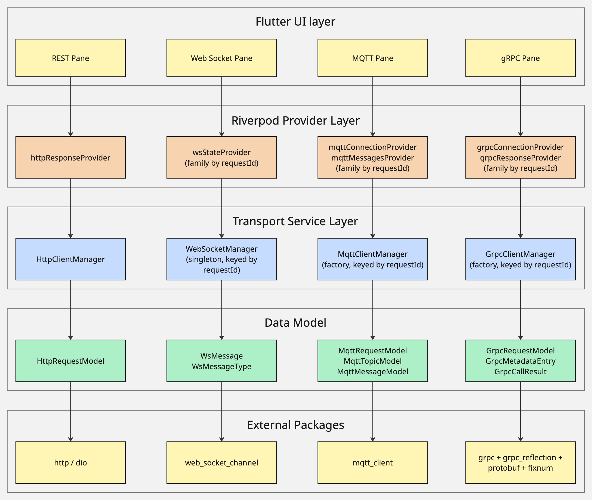

Each protocol has its own transport service, data model, Riverpod state layer, and UI pane. The response panes all feed into a shared `MessageLogView` widget — which is why search, filtering, format toggle, export, and keyboard shortcuts work identically everywhere without duplicating code.

---

### The Session That Changed Everything

During the initial idea presentation, I showed the working prototype with all three protocols to [@animator](https://github.com/animator). The prototype had the plumbing right — connections worked, messages flowed, data was correct. But the feedback was direct: *"We are a developer-experience-first org. I don't care much about architecture deep-dives. What I want to see is features that solve developer difficulties. And the chat-style UI — that looks unprofessional for a debugging tool."*

He was right. I'd been thinking about this as a protocol engineering problem, but the real challenge was the *experience.* So I went back and studied how Postman, MQTTX, and grpcui handle their interfaces — noting what each tool does well — and rebuilt the entire response pane from scratch. Every feature I described above — search, filtering, format toggle, topic colors, keyboard shortcuts, export — came out of that rethink.

**Before → After:**

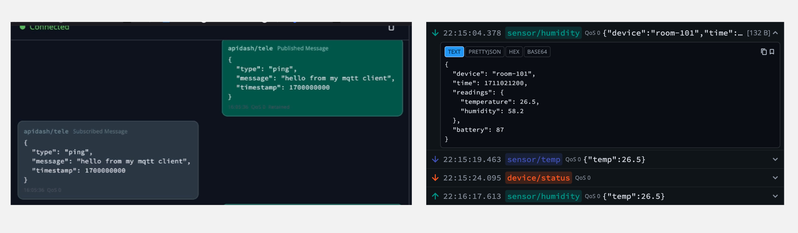

---

### Code Generation (Stretch Goal)

Once the three protocols are stable in the UI, the natural next step is generating integration code — so users can go from "I tested it in API Dash" to "using it in my app" with one click. This follows the existing codegen architecture API Dash already uses for REST.

Planned generators cover Dart, Python, JavaScript, and Go for each protocol. Core protocol support is the priority — codegen comes after everything is solid.

---

### Weekly Timeline

| Week | Dates | What Developers Get |
|------|-------|---------------------|
| **Community Bonding** | May 1 – May 24 | Read MQTT v5 spec. Set up test infrastructure for all three protocols. Finalize UI decisions with mentor — auto-reconnect behavior, v5 UX, message persistence strategy. |
| **Weeks 1–2** | May 25 – Jun 7 | **WebSocket polish and completion.** Binary frame support with hex view, ping/pong visibility, connection headers in response, auto-reconnect refinements. Message persistence to Hive. Subprotocol negotiation. Unit and widget tests. Verified against echo.websocket.org and local servers. |
| **Weeks 3–5** | Jun 8 – Jun 28 | **MQTT v5 and polish.** Switch to `MqttServerClient5` for v5 connections — reason codes, user properties, shared subscriptions, updated UI for v5-specific fields. TLS/SSL support, topic auto-complete, wildcard topic visualization, message persistence. Full test suite verified against HiveMQ, Mosquitto, and EMQX. |
| **Week 6** | Jun 29 – Jul 5 | **Buffer week.** Catch up on any spillover. Integration tests for WebSocket and MQTT. Mentor review of everything so far. Midterm prep. |
| **Midterm** | **Jul 6 – Jul 10** | **WebSocket and MQTT fully functional, tested, and reviewed.** |
| **Weeks 7–9** | Jul 6 – Jul 26 | **gRPC hardening and polish.** Handle `oneof`, `map` fields, packed repeated fields, well-known types (`Timestamp`, `Duration`, `Any`). Client streaming UI, bidirectional streaming, `.pb` file picker integration. Error code mapping to human-readable text. TLS certificate import. Manual testing against multiple servers. |
| **Weeks 10–11** | Jul 27 – Aug 9 | **Code generation and cross-platform.** Implement codegen for all three protocols (prioritize Dart and Python). Test on macOS, Linux, Windows. Fix platform-specific issues. Remaining unit tests. |
| **Week 12** | Aug 10 – Aug 16 | **Final polish and documentation.** Developer docs, user guide updates, final cleanup. |
| **Final Submission** | Aug 17 – Aug 24 | Submit final work product, GSoC report, final mentor evaluation. |

> Timeline starts with WebSocket (smallest scope), moves to MQTT (v5 is the main new work), and ends with gRPC (largest scope). The buffer week before midterm gives room for overruns. June and July are my summer break so I'll be fully available; light coursework starts in August but won't affect my commitment. The schedule is flexible — I explicitly want the mentors to reorder things if they see fit.

---

### References & Resources

**WebSocket:**
- [RFC 6455](https://datatracker.ietf.org/doc/html/rfc6455) — [my detailed write-up](https://rishia.in/blogs/you-dont-know-websockets-yet)

**MQTT:**
- [MQTT v3.1.1 OASIS Standard](https://docs.oasis-open.org/mqtt/mqtt/v3.1.1/os/mqtt-v3.1.1-os.html)
- [MQTT v5.0 Spec](https://docs.oasis-open.org/mqtt/mqtt/v5.0/mqtt-v5.0.html)

**gRPC & Protocol Buffers:**
- [gRPC Core Concepts](https://grpc.io/docs/what-is-grpc/core-concepts/)
- [Protocol Buffers Encoding Guide](https://protobuf.dev/programming-guides/encoding/)
- [gRPC over HTTP/2](https://github.com/grpc/grpc/blob/master/doc/PROTOCOL-HTTP2.md)
- [gRPC Server Reflection Protocol](https://github.com/grpc/grpc/blob/master/doc/server-reflection.md)

---

### About Me

I'm Rishi, a sophomore in Information Technology at [NIT Jalandhar](https://www.nitj.ac.in/). I've been writing Flutter since it was transitioning from v2 to v3, and somewhere along the way I got curious enough about what happens beneath the framework that I built [my own UI toolkit from scratch](https://fernkit.in/) in C++ — rendering pipeline, layout engine, text rasterizer, all of it.

On the professional side, I've built Flutter apps at [Stack Wealth](https://stackwealth.in/) (YC S21) where I was the [#2 top contributor](https://artifacts.rishia.in/resume/rishi-resume-v10.pdf) to their main app, worked on AI infrastructure at [Annam.ai](https://www.annam.ai/) (IIT Ropar) with NVIDIA H200/H100 GPUs, and currently work on DevOps and backend systems at [Zenbase Technologies](http://silentninja.tech) (Singapore). I also have a research paper under review at IJCAI 2026, and one accepted at [ICLR 2026's TSALM Workshop](https://rishia.in/research) — I'll be presenting it in Rio.

In open source, I've contributed to API Dash ([#918](https://github.com/foss42/apidash/pull/918), [#1121](https://github.com/foss42/apidash/pull/1121)), AppFlowy ([#8278](https://github.com/AppFlowy-IO/AppFlowy/pull/8278), [#8261](https://github.com/AppFlowy-IO/AppFlowy/pull/8261)), and asdf-vm ([#2245](https://github.com/asdf-vm/asdf/pull/2245)). I write [in-depth technical blogs](https://rishia.in/blogs) (11 published, some taking more than an hour to read), and lead the app development track at my university's GDSC chapter where I recently organized a [14-day Flutter bootcamp](http://rishia.in/flutter-bootcamp).
