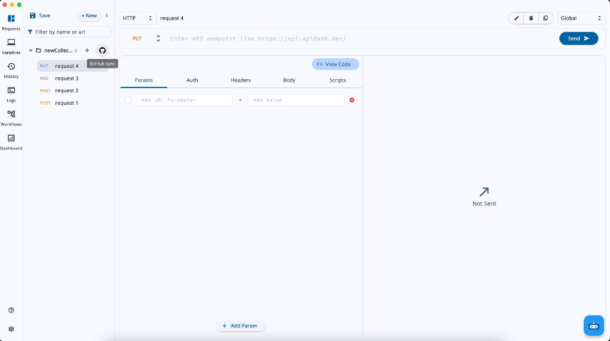
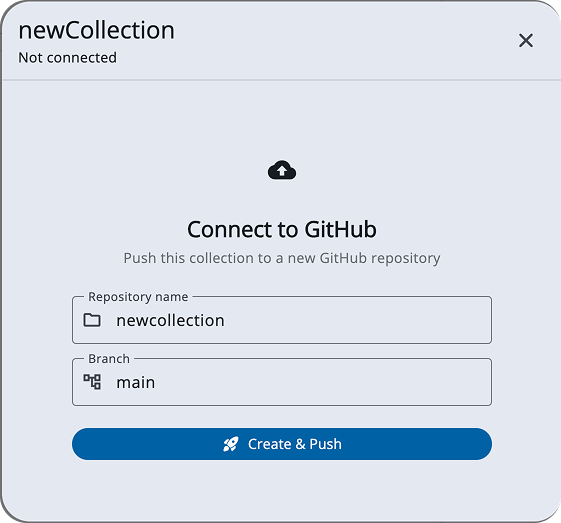
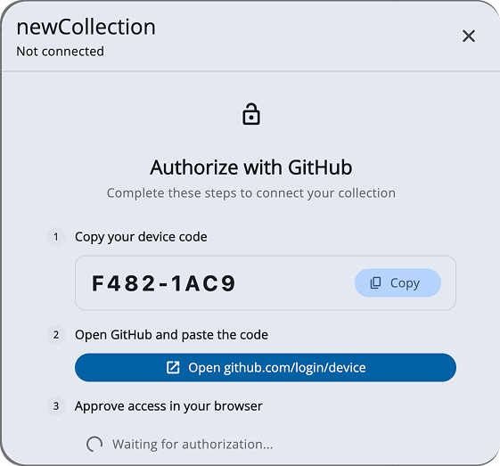
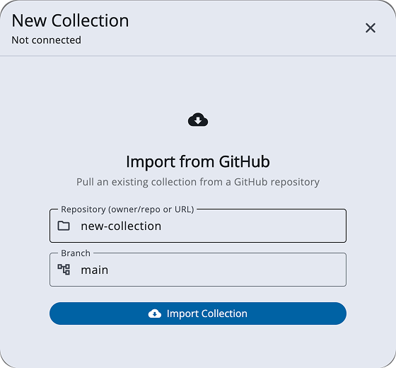
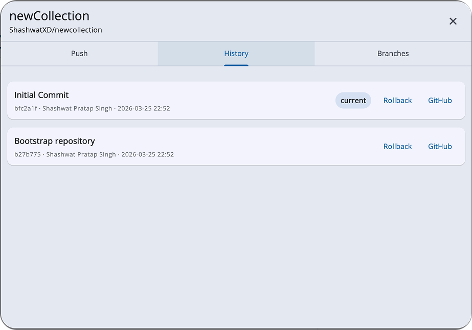
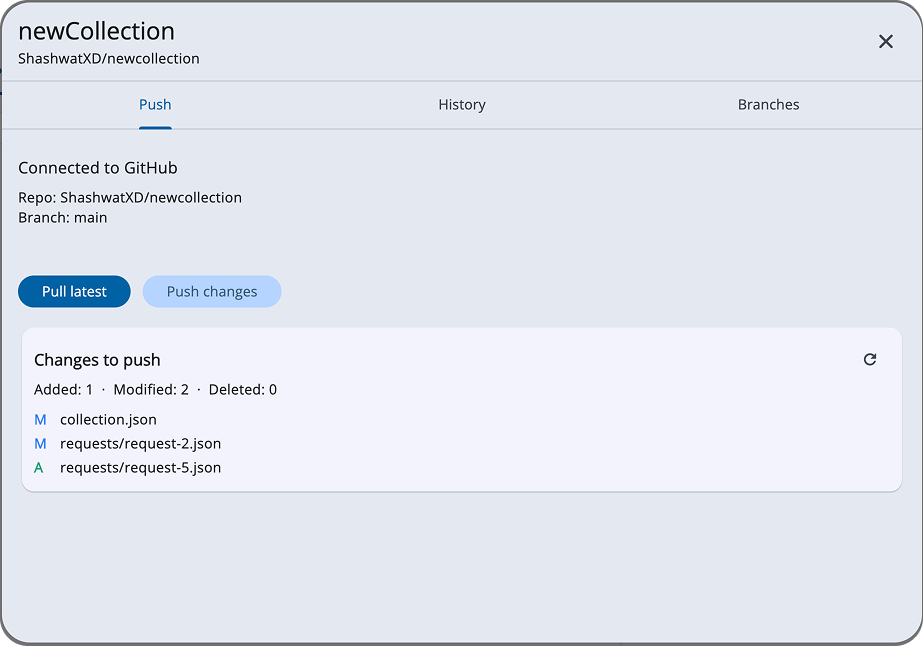
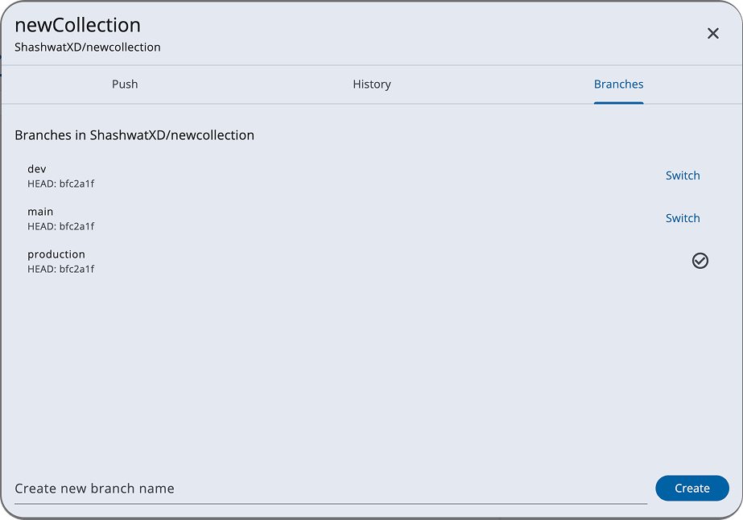
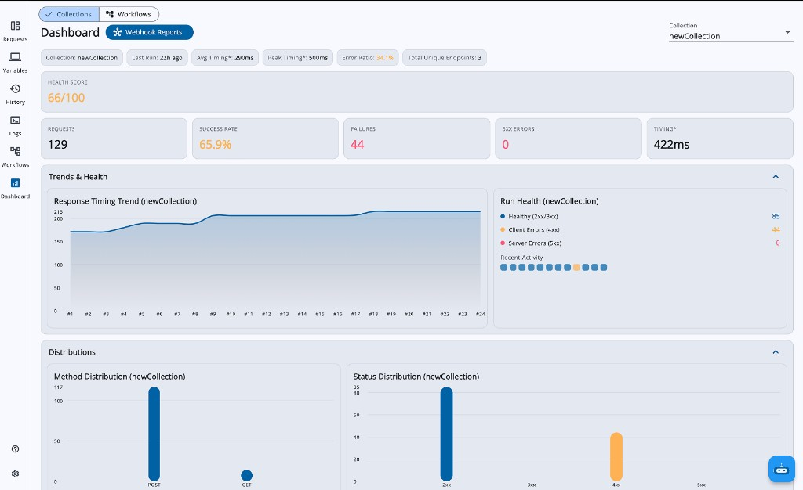
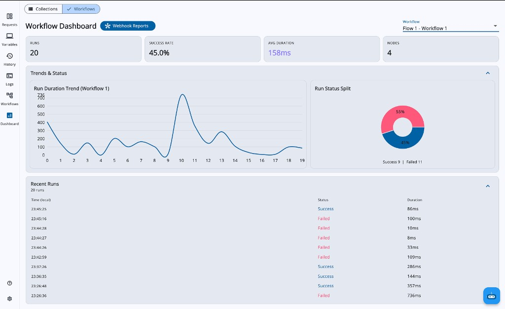

### About

1. Full Name : Shashwat Pratap Singh
2. Contact info (public email) : shashwatsingh3363@gmail.com
3. Discord handle in our server (mandatory) : shashwat.
4. Home page (if any) ; shashwatxd.vercel.app
5. Blog (if any) : N/A
6. GitHub profile link : [ShashwatXD](https://github.com/ShashwatXD)
7. LinkedIn : [Shashwat](https://www.linkedin.com/in/shashwatxd/)
8. Time zone : India Standard Time (IST), UTC+5:30
9. Link to a resume : [ShashwatSingh.pdf](https://github.com/user-attachments/files/26239787/shashwat.resume.pdf)

### University Info

1. University name : Dr. APJ Abdul Kalam Technical University
2. Program you are enrolled in (Degree & Major/Minor): Bachelor of Technology
3. Year : Pre-Final Year, 3rd Year
4. Expected graduation date : May 2027

### Motivation & Past Experience

Short answers to the following questions (Add relevant links wherever you can):

1. Have you worked on or contributed to a FOSS project before? Can you attach repo links or relevant PRs?

API Dash is my first open source project, and these contributions have been my initial experience with open source. Below are some of my contributions.

My merged contributions:
- [#952](https://github.com/foss42/apidash/pull/952) - fix: fix cursor jumping in URL field
- [#979](https://github.com/foss42/apidash/pull/979) - fix: populated params in http request

Ongoing contributions under review:
- [#1031](https://github.com/foss42/apidash/pull/1031) - feat: proxy integration
- [#1163](https://github.com/foss42/apidash/pull/1163) - fix: fix cursor ai field
- [#961](https://github.com/foss42/apidash/pull/961) - feat: added focussed tap to copy


2. What is your one project/achievement that you are most proud of? Why?

The project I am most proud of is XDriven, where app UI and features are rendered dynamically from the backend.

It solves a real problem with Play Store/App Store updates. Instead of releasing a new version for every change, updates and A/B testing can be done directly from the backend, and the app reflects them on restart.

This project helped me understand Server Driven UI (SDUI) and build a more flexible and scalable system.

Github: [XDriven-App](https://github.com/ShashwatXD/XDriven-App)

3. What kind of problems or challenges motivate you the most to solve them?

I am most motivated by problems where I can add real value to a product and improve user experience.

I focus on making features simple to use, intuitive, and clear so that users can easily understand what each feature does without confusion. I enjoy working on problems where usability and real world impact matter.

4. Will you be working on GSoC full-time? In case not, what will you be studying or working on while working on the project?

I will not be working full time during the initial phase due to college classes. However, I will be consistently dedicating time every day to ensure steady progress.

From 10-June-2026 onwards, during my summer break, I will be able to work full time and focus completely on the project.

5. Do you mind regularly syncing up with the project mentors?

Absolutely not. Regular sync ups with mentors is something I genuinely look forward to. Being able to discuss my approach, get feedback, and improve in real time is one of the main reasons I am applying for this project.

I am comfortable joining calls whenever needed and believe clear and regular communication is important to build something meaningful.

6. What interests you the most about API Dash?

What interested me the most about API Dash is how it is doing something unique in the developer tools space using Flutter.

As someone who enjoys working with Flutter, finding a serious Dart based project and contributing to it has been a very special experience for me. It gave me the opportunity to work on a real product and understand how things are built at scale.

I am particularly motivated by the idea of contributing to the Flutter ecosystem and creating something that developers actually use. Being able to bring meaningful impact in this space is something I truly value.

7. Can you mention some areas where the project can be improved?

One area of improvement is the lack of a proper dashboard to track API performance. Users should be able to see metrics like success rate, failures, and latency in one place to quickly identify issues.

Another improvement is around collaboration and sharing. Currently, there is no simple way to share APIs or progress with others, and most data is stored locally. Adding better sharing and collaboration support would make the tool more useful in team environments.

8. Have you interacted with and helped API Dash community? (GitHub/Discord links)

Yes, I have been actively involved with the API Dash community through both GitHub and Discord.

On GitHub, I have participated in discussions and shared ideas on multiple issues:

- [#1132](https://github.com/foss42/apidash/issues/1132)
- [#993](https://github.com/foss42/apidash/issues/993)
- [#938](https://github.com/foss42/apidash/issues/938)

I have helped other contributors on Discord to navigate through issues, explain issues, and help people make their first contributions. I've also helped with onboarding people.

### Project Proposal Information

#### 1. Proposal Title

**Git Support, Visual Workflow Builder & Collection Dashboard**

#### 2. Abstract

API Dash currently stores all requests in a flat local list with no version control, no sharing, and no collaboration support. The storage layer uses a Load All / Save All model with manual save, which blocks any collection or sync feature. This project first refactors the storage to **request-level autosave**, then introduces three features: **Git Support** for version-controlling and sharing collections via GitHub, a **Visual Workflow Builder** for chaining multi-step API flows, and a **Dashboard** for visualizing API health and workflow metrics.

**Prototype:** A working prototype has been submitted as [PR #1451](https://github.com/foss42/apidash/pull/1451) with a [video walkthrough](https://youtu.be/4-7SIQqLTwo).

**Relevant Issues & Discussions:**

- **Save/Autosave feature** [#1034](https://github.com/foss42/apidash/discussions/1034) - PR [#1061](https://github.com/foss42/apidash/pull/1061) has similiar approach.
- **Shared Community Collections** [#964](https://github.com/foss42/apidash/issues/964) - Enabled by Git Support, collections shared via GitHub repos
- **Git support and version control** [#502](https://github.com/foss42/apidash/issues/502) - Core issue for repository-backed collaboration and history.
- **Dashboard and analytics visibility** [#120](https://github.com/foss42/apidash/issues/120) - Tracks monitoring/reporting expectations for collection and workflow health.

#### 3. Detailed Description

---

##### Pillar 1: Git Support - Version Control for Collections

**Problem:**
API Dash stores all data locally in Hive. There is no way to version-control requests, share collections with teammates, or roll back to a previous state. For teams, this means manually exporting and importing API collections, which is error-prone and fragile.

Before Git support or collections can work, the storage layer needs to change. Today the app uses a **Load All / Save All** model: `dataBox` is a regular Hive `Box` that loads every request into memory at startup, and `saveData()` re-serializes the entire map back to Hive when the user clicks Save. Every mutation calls `unsave()` which only sets a dirty flag, nothing is persisted until the manual save.

This breaks Git support in two ways:
1. **No per-request persistence** - Git push needs to know which specific requests changed since the last commit. With bulk save, there's no granular change tracking.
2. **Data loss risk** - If the app is killed, all unsaved changes are lost. Collections that sync with GitHub cannot afford silent data loss.

The fix is a **Lazy Load / Granular Save** architecture: change `dataBox` from `Box` to `LazyBox`, load only request metadata (id, name, method, URL) at startup, load full request data on demand when the user opens a request, and save each individual request to Hive immediately on every change (debounced). This approach updates `CollectionStateNotifier` to call `hiveHandler.setCollectionRequestModel()` directly on each mutation instead of bulk-saving.

This autosave refactoring is the first deliverable of GSoC and unblocks everything else.

**Design Principle:**
Hive remains the single source of truth. There are no local Git repositories, no on-disk files to sync, no file watchers. Everything goes through the GitHub REST API over HTTPS. This means Git Support works identically on macOS, Windows, Linux, Android, iOS, and web.

**Why a serialization layer is needed:**
Hive stores data in a proprietary binary format that is not human-readable or diffable. Every request is serialized to clean JSON before push, and deserialized on pull or rollback. GitHub sees readable JSON files; the app keeps using Hive locally.

**Architecture:**

```
┌─────────────────┐     serialize      ┌──────────────────────┐
│  Hive (SSOT)    │ ─────────────────→ │  JSON Files          │
│  dataBox (Lazy) │                    │  collection.json     │
│  environmentBox │ ←───────────────── │  requests/*.json     │
└─────────────────┘     deserialize    │  environments.json   │
        │ autosave on                  └──────────┬───────────┘
        │ every mutation                          │ GitHub REST API
        │                              ┌───────────▼───────────┐
        └──────────────────────────    │  GitHub Repository     │
          (granular per-request save)  │  blob → tree → commit  │
                                       │  → update ref          │
                                       └───────────────────────┘
```

**CollectionModel: Introducing the Collection Concept**

Currently all requests live in a flat `Map<String, RequestModel>` inside `CollectionStateNotifier`. Once autosave is in place, the next step is introducing a `CollectionModel` that groups requests into named collections. Each collection maps to one GitHub repository.

```dart
class CollectionModel {
  final String id;
  final String name;
  final String description;
  final List<String> requestIds;
  final String? activeEnvironmentId;
  final GitConnectionModel? gitConnection;  // owner, repo, branch, lastSyncedCommitSha
}
```

**How it works in the UI:**

A collection dropdown sits above the sidebar's request list. Each collection has a GitHub icon button with two states:

- **Not connected** - Local-only. Clicking opens **Connect to GitHub**: user types a repo name and clicks Connect. On first use, the app shows a device code and opens `github.com/login/device`. User enters the code, authorizes, and the app picks up the token. API Dash creates the repo, serializes requests to JSON, and pushes the first commit.

- **Connected** - The collection is linked to a GitHub repo. Clicking opens a **Git panel** with three tabs:
  - **Push** - Shows a preview of added, modified, or deleted requests since last push. User writes a commit message and pushes. One atomic operation.
  - **History** - Scrollable list of commits (message, author, timestamp). Click any commit for one-click rollback: API Dash fetches that commit's tree, deserializes, and replaces the collection in Hive.
  - **Branches** - Lists remote branches. User can switch, create from current HEAD, or delete.

**GitHub API Adapter: Technical Implementation**

A `GitHubApiAdapter` class handles all GitHub communication:

- **Authentication:** GitHub Device Flow. Requires a registered GitHub OAuth App whose **Client ID** is shipped with the app (no client secret needed, Device Flow is designed for public clients). On first use, the app sends the Client ID to GitHub's `/login/device/code` endpoint, receives a short user code, and opens `github.com/login/device`. User enters the code, authorizes, and the app polls until it receives an access token. Token stored in `flutter_secure_storage`. One-time setup, all later operations use the saved token. Scopes: `repo` + `workflow`.

- **Push (atomic commit):**
  1. Serialize all requests to JSON
  2. Create blobs for each file via `/git/blobs`
  3. Create a tree referencing all blobs via `/git/trees`
  4. Create a commit pointing to the tree via `/git/commits`
  5. Fast-forward the branch ref via `/git/refs/heads/{branch}`

  This is a single atomic operation, either the entire commit succeeds or nothing changes.

- **How changed files are tracked before push (preview logic):**
  The implementation will build a local Git file snapshot from Hive (`collection.json`, `environments.json`, `requests/*.json`) and use a SHA-first diff strategy against the remote branch tree. It will first compare path-level tree/blob SHAs and fetch full file content only for candidate changed files. Final change type is computed as:
  - path in local only -> `added`
  - path in remote only -> `deleted`
  - path in both but different content -> `modified`
  This result powers the "Changes to push" preview card before commit.

- **Pull / Rollback / Branch switch:** Fetch tree at target commit, get blobs, deserialize JSON, replace collection in Hive.

- **Conflict detection:** Before push, compare local `lastSyncedCommitSha` with remote HEAD. If they differ, someone else pushed. Show a conflict dialog with options to pull first or view commits.

- **Commit history:** GitHub API returns log with message, author, date, SHA. Tapping a commit triggers rollback.

- **Branches:** List, create from HEAD, switch (re-pulls), delete via GitHub API.

**Serialization Layer: `GitCollectionSerializer`**

Converts Hive data to/from Git-friendly JSON files:
- `collection.json` - collection metadata and request order
- `requests/{slug}.json` - individual request files (human-readable slugified names)
- `environments.json` - all environments with variable values

Handles edge cases: malformed request files are skipped with warnings, request order is preserved, duplicate names get suffixed.

**Import from GitHub:**

This is how collaboration starts. A teammate shares a GitHub repo URL, and the user imports it as a new collection. The user pastes the repo (e.g., `owner/repo-name` or a full URL) and optionally picks a branch. The app fetches the tree from that branch via the GitHub API, downloads the JSON blobs, deserializes them through `GitCollectionSerializer`, and creates a new local collection already linked to that repo. From that point on, the user can push their own changes and pull updates from others.

The key insight: the user never thinks about blobs, trees, or API calls. They think about their collection. GitHub is just a button that lets them share it, version it, and roll back with one click.

**Usage: Git Support UI**









---

##### Pillar 2: Visual Workflow Builder

**Problem:**
Testing multi-step API flows today requires writing scripts or manually sequencing requests. There is no visual way to compose, connect, and execute chained API workflows, inspect intermediate results, or conditionally branch based on responses.

**Design Principle:**
The workflow builder is a new section in the navigation rail (alongside Requests and Dashboard). It uses a node-based canvas where users visually compose API workflows by connecting nodes with edges. Each workflow is a directed acyclic graph (DAG) that the engine walks at runtime. The official idea also mentions **Agentic AI** for generating workflows from prompts, this will be integrated through DashBot.

**AI Integration Plan (DashBot -> Workflow Graph):**

AI is implemented as an assisted scaffold step, not a replacement for manual editing. The user opens "Generate with AI" in DashBot, writes a prompt such as "Create login -> fetch profile -> update profile flow", and DashBot uses the currently configured available model to generate a workflow draft constrained by the internal workflow schema. The JSON draft is an internal transport format and is not shown as the primary user experience.

The generation pipeline:
1. **Prompt + context collection** - Include selected collection requests, detected variables, and optional constraints (max nodes, include retry, include condition branch).
2. **Model generation constrained by schema** - DashBot is instructed to generate only allowed node types and valid connections based on the workflow schema contract.
3. **Validation + repair pass** - Run graph validation (single Start, at least one End, reachable nodes, no cycles). If invalid, attempt one deterministic repair; otherwise surface actionable errors.
4. **Direct canvas implementation** - If valid, the generated nodes and edges are instantiated directly on the canvas (no manual JSON review step).
5. **Human review gate on canvas** - User edits labels, conditions, request links, and variable mappings directly in the visual editor before first execution.

**Node Types (6 types):**

- **Start** - Entry point, connects to the next node
- **Request** - Executes a linked API request. Has trigger, success, and failure ports. Can also extract values from the response and save them as variables for downstream nodes (e.g., extract `json:data.access_token` and store it as `authToken`). Key data: `linkedRequestId`, `linkedCollectionId`, `requestVariableValues`, `variableExtractions`
- **Condition** - Branches based on expression. Has true and false output ports. Key data: `conditionExpression` (e.g., `status>=200&&status<300`, `var:myFlag`)
- **Delay** - Waits before continuing. Key data: `delayMs`
- **Loop** - Iterates over a list. Key data: `loopExpression` (e.g., `var:items`)
- **End** - Terminal node

**WorkflowNodeData: The Node Data Model**

Each node carries a `WorkflowNodeData` object with all its configuration. Request nodes link to actual `RequestModel` instances from collections, enabling reuse of existing API requests in workflows.

```dart
class WorkflowNodeData {
  final WorkflowNodeType nodeType;
  final String label;
  final String? linkedRequestId;       // For Request nodes
  final String? conditionExpression;   // For Condition nodes
  final int? delayMs;                  // For Delay nodes
  final String? loopExpression;        // For Loop nodes
  final Map<String, String>? requestVariableValues;
  final Map<String, String>? variableExtractions;
}
```

**Execution Engine: `WorkflowExecutionService`**

The engine validates the graph (exactly 1 Start, at least 1 End, no cycles, all nodes reachable, condition nodes have both branches connected), then performs a BFS walk:

1. Start at the Start node
2. For each node, execute its logic:
   - **Request**: sends the actual HTTP request via a delegate bridge, stores response in shared context, and if `variableExtractions` is set, pulls values from the response JSON and saves them as context variables for downstream nodes to use
   - **Condition**: evaluates expression against last status code or context variables, picks true/false branch
   - **Delay**: waits the specified milliseconds
   - **Loop**: iterates body nodes for each item in a list variable
3. Real-time callbacks update the canvas, each node lights up green (success) or red (failure) as the engine passes through it
4. On failure, the engine stops and returns the full execution trace

**Shared Context: Data Passing Between Nodes**

A `WorkflowExecutionContext` holds two maps: `variables` (user-set key-value pairs) and `results` (per-node response data). Nodes downstream can read values set by upstream nodes via the `json:` syntax. For example, a Request node with `variableExtractions: {"authToken": "json:data.access_token"}` sends the HTTP request, then extracts the token from the response body and stores it as `authToken` in the context. The next Request node can then use `{{authToken}}` in its headers or body.

**Canvas UI:**

The canvas uses `vyuh_node_flow` for node rendering, drag-and-drop positioning, and port-based connections. Key UI features:

- **Guided "What's Next?" flow** - Dragging a connection from a port into empty space opens a dialog asking which node type to add next, auto-connecting it
- **Request picker** - When adding a Request node, a dialog shows all collections and requests with their URLs and detected variables
- **Node inspector** - Side panel for editing node properties (expression, delay, variable source)
- **Run controls** - Play button validates and runs the workflow, nodes animate in real-time
- **Run history** - Each run is saved to Hive with duration, success/failure, timestamps, viewable in a scrollable list
- **Import/Export** - Workflows serialize to JSON for sharing

**Usage: Workflow Builder**


---

##### Pillar 3: Collection Dashboard

**Problem:**
API Dash has no unified view of how your API collections are performing. Users cannot see success rates, failure patterns, response time trends, or status code distributions without manually checking each request's history individually. The official idea also asks for automated reports via Webhooks.

**Design Principle:**
The dashboard is a new section in the navigation rail that aggregates data from request history and workflow run history stored in Hive. It provides two views: **Collection Dashboard** (API health metrics) and **Workflow Dashboard** (workflow run analytics). Both support webhook-based automated reporting.

**Collection Dashboard: What it shows**

1. **Health Score** (0-100) - Weighted composite: 75% success rate + 25% inverse error ratio. Color-coded green (>=80), amber (>=60), red (<60).

2. **KPI Cards** - Total Requests, Success Rate, Failures, 5xx Errors, P95 Timing.

3. **Overview Strip** - Quick chips showing Collection name, Last Run time, Avg/Peak Timing, Error Ratio, Unique Endpoints count.

4. **Charts:**
   - **Response Timing Trend** - Line chart showing response times across recent requests
   - **Status Code Distribution** - Bar chart bucketed by 2xx/3xx/4xx/5xx
   - **Method Distribution** - Bar chart showing GET/POST/PUT/DELETE breakdown
   - **Health Panel** - Color-coded activity grid (green/amber/red squares for recent requests)

5. **Tables:**
   - **Top Endpoints** - Most frequently called URLs with call count
   - **Slowest Requests** - Requests ranked by response time
   - **Recent Requests** - 5xx errors surfaced first for attention

**Workflow Dashboard: What it shows**

1. **KPI Cards** - Total Runs, Success Rate, Avg Duration, Node Count.

2. **Run Duration Trend** - Line chart showing how workflow execution time changes over time.

3. **Run Status Pie Chart** - Success vs Failed split with percentages.

4. **Recent Runs Table** - Timestamp, Status (Success/Failed), Duration per run.

5. **Workflow selector** - Dropdown for quick switching between workflows. Auto-focuses when navigating from workflow builder via "View Analytics" button.

**Webhook Reporting Service:**

Both dashboards have a "Webhook Reports" button that opens a dialog with:
- **Webhook URL** field - any HTTP endpoint (Slack, Discord, custom server)
- **Report Name** - customizable report title
- **Interval selector** - every 5, 15, 30, or 60 minutes
- **Send now** / **Start auto-send** / **Stop auto-send** buttons

The report payload is JSON:
```json
{
  "reportName": "Collection Health Report",
  "generatedAt": "2026-03-25T17:00:00Z",
  "collection": {
    "id": "...",
    "name": "Payment API",
    "totalRequests": 42,
    "successRate": 0.952,
    "failures": 2,
    "healthScore": 87
  }
}
```

**Usage: Dashboard UI**





---
For more related designs see [**Figma**](https://www.figma.com/design/frCBBxeXgccO1AqRAeNmcD/Untitled?node-id=1-5&t=k2N8Y4yL2HWTDp2E-0).

#### New Dependencies

- [vyuh_node_flow](https://pub.dev/packages/vyuh_node_flow) - node-based canvas for the Workflow Builder (drag-and-drop, port connections)
- [fl_chart](https://pub.dev/packages/fl_chart) - charts for Collection and Workflow Dashboards (line, bar, pie)
---

#### 4. Timeline

**Project Size:** Medium (175 hours, 12 weeks)
[GSoC 2026 Timeline](https://developers.google.com/open-source/gsoc/timeline) for reference.

---

**Community Bonding Period (May 1 - May 24)**

My goals for bonding are to learn more about the project and to gel with the team. I plan to focus on core architecture conversation so I can complete the technical design and put everyone's concerns to rest prior to development.

---

##### Milestone 1: Autosave & Git Support (Weeks 1-4, May 25 - June 21)
> Highest priority since autosave changes the core storage layer, and Git involves external GitHub API, OAuth device flow, and end-to-end sync.

* **Week 1 (May 25 - May 31): Autosave & Collection Foundation**
  - Complete the `Box` to `LazyBox` migration with backward compatibility (detect old format, convert on first launch). Replace every `unsave()` call in `CollectionStateNotifier` with immediate per-request `hiveHandler.setCollectionRequestModel()`. Add debounced save (2s after last keystroke) to avoid excessive disk writes during rapid editing. Remove the manual save feature. Add a subtle "Saving..." / "Saved" indicator in the UI. Finalize `CollectionModel`, collection dropdown UI, collection CRUD (create, rename, delete), multi-collection navigation.

  **Deliverable:** App autosaves every request change immediately. Opening with old-format data migrates seamlessly. Users can create, rename, switch, and delete named collections in the sidebar.

* **Week 2 (June 1 - June 7): GitHub Auth & Push**
  - Polish Device Flow OAuth, `GitHubApiAdapter` hardening, atomic push flow, push preview UI showing added/modified/deleted requests.

  **Deliverable:** A user can authenticate with GitHub via Device Flow and push a collection as JSON to a new repo in one click.

* **Week 3 (June 8 - June 14): Pull, Rollback & Branches**
  - Pull flow, one-click rollback from commit history, branch list/create/switch/delete, import collection from a GitHub URL.

  **Deliverable:** A user can pull remote changes, roll back to any previous commit, and switch branches, all from the Git panel.

* **Week 4 (June 15 - June 21): Git Testing & Conflict Handling**
  - Conflict detection UI (local vs remote HEAD mismatch), `GitCollectionSerializer` schema versioning, unit tests for all git services using mock HTTP client.

  **Deliverable:** Git Support is tested end-to-end against a real GitHub repo. Conflict detection warns before overwriting remote changes. Unit tests cover push, pull, rollback, and branch operations.

---

##### Milestone 2: Visual Workflow Builder (Weeks 5-8, June 22 - July 19)

* **Week 5 (June 22 - June 28): Workflow Foundation**
  - `WorkflowModel` + `WorkflowNodeData` finalization, canvas integration, all 6 node types with inspector panel.

  **Deliverable:** Users can add all 6 node types to the canvas, connect them via ports, and edit properties in the inspector panel.

* **Week 6 (June 29 - July 5): Execution Engine**
  - `WorkflowExecutionService` BFS engine, `WorkflowRunDelegateBridge` for real HTTP request execution, shared context and variable extraction via `json:` syntax.

  **Deliverable:** Workflows execute real HTTP requests. Responses are stored in shared context and downstream nodes can extract values (e.g., tokens) from previous responses.

> **Midterm Evaluation (July 6 - July 10):**

* **Week 7 (July 6 - July 12): Workflow Advanced**
  - Condition evaluation with proper expression parsing (replacing hardcoded patterns), transform scripts, delay/loop nodes, run history persistence in Hive, real-time canvas status updates (green/red nodes).

  **Deliverable:** Condition nodes handle arbitrary status-code and variable expressions. Run history is persisted and viewable. Canvas animates node status during execution.

* **Week 8 (July 13 - July 19): Workflow AI & Polish**
  - DashBot integration for AI-generated workflows ("Build a workflow that registers a user and fetches their profile"), import/export JSON, guided "What's Next?" flow, workflow unit tests.

  **Deliverable:** Workflows can be imported/exported as JSON. DashBot can scaffold a workflow from a natural language prompt. Unit tests cover execution engine validation and graph walking.

---

##### Milestone 3: Collection & Workflow Dashboard (Weeks 9-11, July 20 - August 9)

* **Week 9 (July 20 - July 26): Collection Dashboard**
  - `CollectionDashboardPage` with KPI cards (requests, success rate, failures, 5xx errors), health score, overview strip, response timing trend chart.

  **Deliverable:** Collection dashboard displays live metrics from request history. Health score is computed and color-coded.

* **Week 10 (July 27 - August 2): Dashboard Charts & Tables**
  - Status code distribution bar chart, method distribution bar chart, top endpoints table, slowest requests table, recent requests with errors.

  **Deliverable:** All dashboard charts and tables render real data.

* **Week 11 (August 3 - August 9): Workflow Dashboard & Webhooks**
  - `WorkflowDashboardPage` with run KPIs, duration trend chart, success/fail pie chart, recent runs table. Webhook reporting service for both dashboards with configurable URL, interval, and auto-send.

  **Deliverable:** Both dashboards are fully functional. Webhook reports can be sent on schedule to Slack, Discord, or any HTTP endpoint.

---

##### Milestone 4: Testing, Polish & Documentation (Week 12, August 10 - August 24)

* **Week 12 (August 10 - August 16): Testing & Docs**
  - End-to-end tests, widget tests for dashboard components, integration tests for Git and Workflow flows. User-facing documentation and developer guide.

  **Deliverable:** All features tested and documented. Final bug fixes from mentor feedback.

* **Final Week (August 17 - August 24)**
  - Submit final work product and mentor evaluation. Final polish, any remaining bug fixes, project report.

---

### Why this project

Today API Dash is strong for individual use, but it still misses what many end users need when they work as a team: a simple way to collaborate on collections, share progress, and stay focused on building APIs instead of juggling exports and copies. Users also lack a clear place to see how their APIs behave over time, success rates, failures, latency and to trace multi-step flows when something breaks.

This project targets those gaps directly. That is why it fits API Dash’s path toward being more usable for real teams and day-to-day API work and why I chose this project.

### Why my proposal must be selected

My first experience with open source was through API Dash. Seeing what it accomplishes with Flutter really resonates with me as a Flutter enthusiast. It was a great learning experience on the importance of design and performance, especially when it comes to developer tools.

If I get this opportunity, I’ll dedicate consistent time and effort to the project, even beyond the program. I approach development with a focus on quality, precision, and building solutions that genuinely make an impact.

This is not just an internship to me, this is a chance to really make a meaningful contribution to a project that I’m really passionate about. I’m willing to put in the consistent work necessary to produce quality results and leave a quality impact in my overall developer journey. Thank you.

