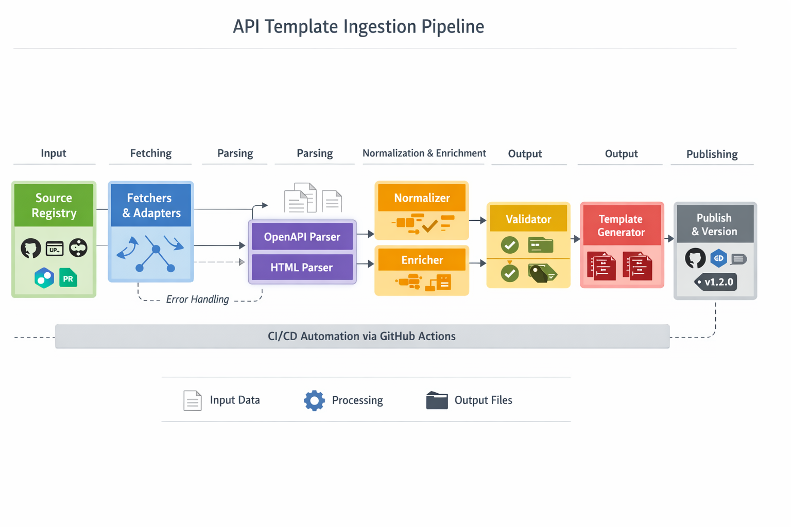
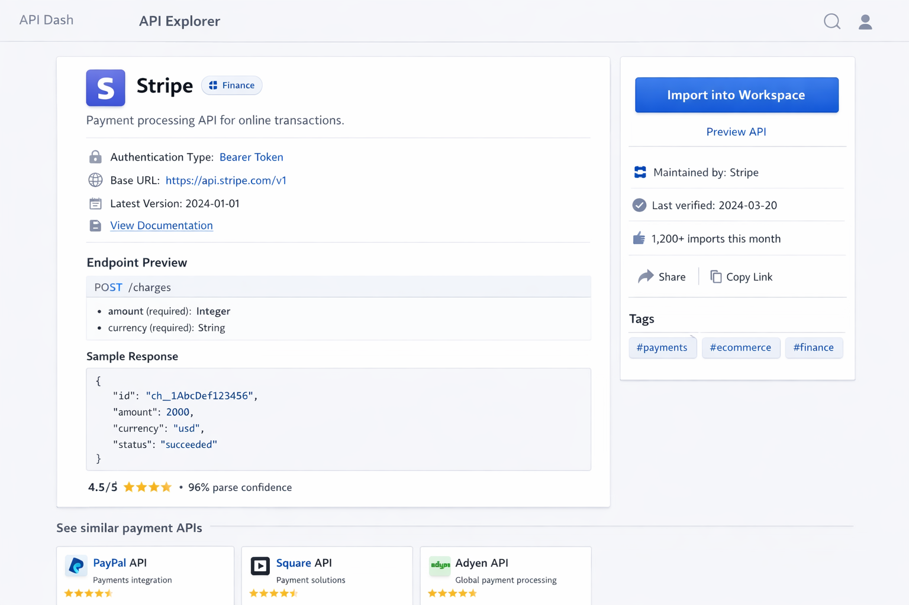
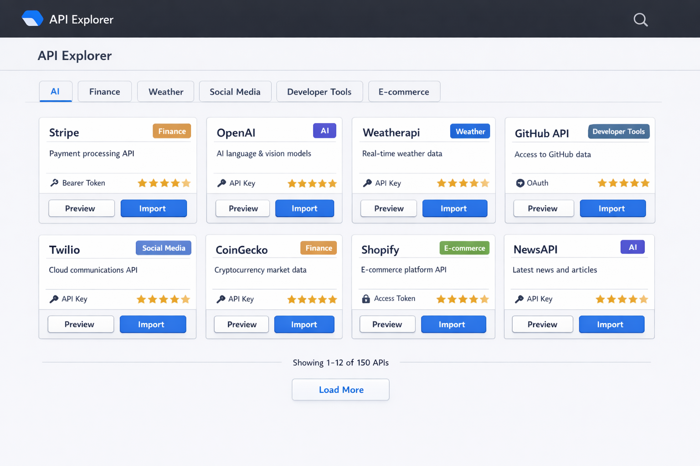
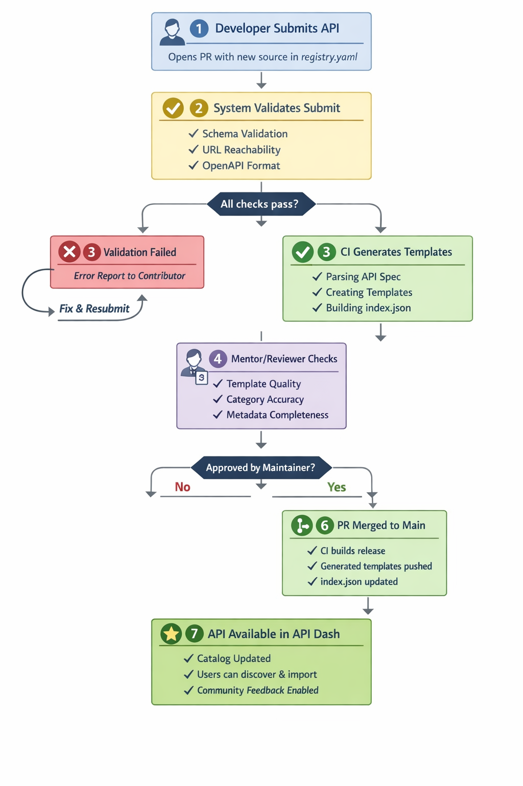

## GSoC 2026 Application - API Dash

### About

1. Full Name: Turbash Negi
2. Contact info (public email): negirawatdeepi@gmail.com
3. Discord handle in our server (mandatory): turbashnegi
4. Home page (if any): https://turbash.me
5. Blog (if any): N/A
6. GitHub profile link: https://github.com/Turbash
7. Twitter, LinkedIn:
   - LinkedIn: https://www.linkedin.com/in/turbash-negi/
   - Twitter: https://x.com/turbashnegi
8. Time zone: UTC + 5:30
9. Link to a resume (PDF, publicly accessible via link and not behind any login-wall): https://drive.google.com/file/d/1CwnN6o8FdosBl6y2lj4FmudjwhCwExKZ/view?usp=sharing

### University Info

1. University name: Jawaharlal Nehru University
2. Program you are enrolled in (Degree and Major/Minor): Bachelor of Technology in Computer Science and Engineering
3. Year: 2nd Year
4. Expected graduation date: May/2028

### Motivation & Past Experience

Short answers to the following questions (with relevant links):

1. Have you worked on or contributed to a FOSS project before? Can you attach repo links or relevant PRs?

Yes. I contributed during Hacktoberfest to OpenCodeChicago's frontend repository and received the Super Contributor badge.

Relevant PRs:
- https://github.com/OpenCodeChicago/hacktoberfest-2025-frontend/pull/195
- https://github.com/OpenCodeChicago/hacktoberfest-2025-frontend/pull/190
- https://github.com/OpenCodeChicago/hacktoberfest-2025-frontend/pull/178
- https://github.com/OpenCodeChicago/hacktoberfest-2025-frontend/pull/174
- https://github.com/OpenCodeChicago/hacktoberfest-2025-frontend/pull/96

These contributions focused on frontend fixes and feature improvements during Hacktoberfest 2025.

Alongside these OSS contributions, I've shipped production Python code that matches the API Explorer problem space: parsing unstructured input, normalizing it, categorizing intelligently, enriching metadata, and building reliable automation. My GitHub (https://github.com/Turbash) and Shawtie project reflect this execution style.

2. What is your one project/achievement that you are most proud of? Why?

**Shawtie** (100% Python, published on PyPI) is my proof of the exact workflow API Explorer needs. It takes messy, inconsistent file-system chaos and transforms it into clean, categorized, organized output.

Why this directly maps to API Explorer:
- **Multi-format parsing**: Shawtie parses images (Pillow), audio (mutagen/pydub), documents, code, archives—different sources, one normalized schema. API Explorer does this for OpenAPI + HTML specs.
- **Deterministic + AI-fallback categorization**: Shawtie uses fast heuristic rules first, falls back to LLM when confidence dips. Same strategy I'm proposing for APIs (keyword scoring + optional semantic reranking).
- **Metadata extraction & enrichment**: Shawtie extracts EXIF, audio properties, file previews. API Explorer's enrichment layer does the same for auth types, endpoints, sample values.
- **Production reliability patterns**: validation checks, history tracking, undo, dry-run mode, error handling—all patterns I'll apply.
- **Shipped to real users**: got it on PyPI, so developers actually use it.

Most proud because I went from "I don't know Linux" to shipping something production that other developers rely on. That's the same execution mindset I'm bringing to API Dash—not just code it, ship it solid and proven.

3. What kind of problems or challenges motivate you the most to solve them?

I'm most motivated by challenges that are totally new to me—where I have to dive deep to figure things out. That forced learning, where you don't have a choice but to learn, works really well for me. I learn by solving and building. The best part is when you start confused but come out the other side understanding something deeply. I'm also proud of my DSA and competitive programming journey on LeetCode and Codeforces, managing all that alongside academics, sports, and college events.

4. Will you be working on GSoC full-time? In case not, what will you be studying or working on while working on the project?

Yes, totally full-time. My university exams wrap up from May 17–23, which is right before the coding period starts. After that, I'm 100% dedicated to GSoC.

5. Do you mind regularly syncing up with the project mentors?

Not at all—I'd actually prefer it. I missed some earlier API Dash meetup calls because of university stuff, but now I really want to sync up regularly. Talking to mentors helps me learn a lot more about how to approach things and what direction makes sense for the project.

6. What interests you the most about API Dash?

API Dash solves something I *feel* inside the space I've been building in. When I made Shawtie, I learned that deterministic + AI-fallback transformation works at scale. API Explorer is that exact pattern applied to APIs: parse → normalize → categorize → enrich → export. I've already proven I can architect and ship that workflow in Python.

What excites me about API Dash specifically: the community values solid fundamentals (I see it in PRs—good testing, clear code architecture, thoughtful design decisions), the project is *real* (solving actual developer pain), and the scope of this GSoC project perfectly fits my skill set and delivery style. 

7. Can you mention some areas where the project can be improved?

I think the API Explorer itself addresses a big gap—giving users a curated library so they don't start from scratch every time. Beyond that, as the pipeline matures, quality ranking (showing which templates are actively maintained, which ones users trust most), and a sustainable way for the community to contribute new APIs would make the whole system much stronger.

8. Have you interacted with and helped API Dash community? (GitHub/Discord links)

I haven't made API Dash PRs yet, but I'm actively engaged. I joined Discord right after organizations were announced, introduced myself, and have been following discussions closely. I've been reviewing other contributors' PRs to understand expected code quality and project direction. My previous OSS collaboration experience from Hacktoberfest helps me work well in review-driven, contribution-based environments.

### Project Proposal Information

#### Proposal Title

API Explorer for API Dash: Automated OpenAPI and HTML Ingestion Pipeline with Smart Categorization, Enrichment, and One-Click Template Import

#### Abstract

API Dash users currently spend too much time discovering APIs and setting up the same request boilerplate again and again (method, URL, headers, auth, payload examples). In this project, I will build the backend automation pipeline for API Explorer so API Dash can offer a curated, searchable, import-ready API template library.

The system will ingest OpenAPI and HTML sources, parse and normalize endpoints, auto-tag categories, enrich metadata, and generate request templates directly importable into API Dash. It will include strict validation, CI automation, and a maintainable contribution workflow so the catalog can grow continuously. Optional community-facing capabilities such as ratings/reviews and GitHub-based submissions will stay as scoped extensions.

#### Detailed Description

#### 3.1 Problem Statement

Developers often start API testing from scratch even for widely used APIs. This causes:
- repeated setup effort,
- inconsistent request definitions,
- higher onboarding friction,
- and lower exploration speed.

API Explorer solves this by offering trusted, ready-to-import templates with structured metadata and strong discoverability.

#### 3.2 Project Goals

- Build a deterministic backend pipeline to ingest and transform API sources reliably.
- Support both OpenAPI (JSON/YAML) and HTML documentation extraction paths.
- Auto-categorize APIs into domains (AI, finance, weather, social, developer tools, etc.).
- Enrich each template with auth info, sample payloads, response examples, and metadata.
- Generate normalized template artifacts and a lightweight index manifest.
- Enable one-click import into API Dash workspace.
- Add quality controls (validation checks, CI gates, freshness checks).

#### 3.3 Non-Goals (for 90-hour scope)

- Training heavy ML models for categorization.
- Supporting every API documentation format in first iteration.
- Building a full social platform for reviews.

#### 3.4 High-Level Architecture

```text
Source Registry -> Fetchers -> Parsers -> Normalizer -> Validator ->
Categorizer -> Enricher -> Template Generator -> Manifest Builder -> Publish
```

Mockup: This is the architecture I intend to implement for the backend pipeline.



Pipeline components:
- Source Registry: Tracks known sources, update policy, and fetch strategy.
- Fetchers: Adapters for GitHub repos, raw URLs, aggregator feeds, and community submissions.
- Parsers:
	- OpenAPI parser for specs (preferred source)
	- HTML parser fallback for docs-only APIs
- Normalizer: Converts extracted info into a stable internal schema.
- Validator: Schema checks, required fields, URL/auth sanity, template completeness.
- Categorizer: Rule-based classifier with weighted keyword heuristics.
- Enricher: Adds auth hints, tags, docs links, version, sample values, and confidence signals.
- Generator: Emits API Dash import-ready request templates.
- Manifest Builder: Produces index.json for fast browse/search.
- Publish step: Versioned artifacts with CI report.

#### 3.5 Core Data Contracts

Internal normalized endpoint model (example):

```json
{
	"api_id": "stripe",
	"api_name": "Stripe",
	"category": "finance",
	"endpoint_id": "stripe_create_charge",
	"method": "POST",
	"url": "https://api.stripe.com/v1/charges",
	"auth": {
		"type": "bearer",
		"location": "header",
		"header_name": "Authorization"
	},
	"headers": [
		{"key": "Content-Type", "value": "application/x-www-form-urlencoded"}
	],
	"query_params": [],
	"body_example": {
		"amount": 1000,
		"currency": "usd",
		"source": "tok_visa"
	},
	"response_example": {
		"id": "ch_xxx",
		"status": "succeeded"
	},
	"source": {
		"type": "openapi",
		"url": "https://..."
	},
	"quality": {
		"parse_confidence": 0.96,
		"validated": true
	}
}
```

Manifest entry (for API Explorer listing):

```json
{
	"id": "stripe_create_charge",
	"name": "Stripe - Create Charge",
	"category": "finance",
	"auth_type": "bearer",
	"methods": ["POST"],
	"summary": "Create a charge",
	"template_url": "https://cdn.example/.../stripe_create_charge.json",
	"source_url": "https://github.com/stripe/openapi/...",
	"last_verified_at": "2026-06-01"
}
```

#### 3.6 Categorization Strategy

Phase 1 (in-scope):
- deterministic keyword and endpoint-pattern based tagging,
- weighted scoring per category,
- tie-breaker rules,
- fallback category for uncertain cases.

Phase 2 (stretch):
- optional lightweight semantic reranking for ambiguous APIs.

#### 3.7 Quality and Validation Plan

Validation checks per generated template:
- required keys present,
- valid HTTP method and URL format,
- auth section consistency,
- payload and response examples parsable,
- import contract compatibility with API Dash model.

CI outputs:
- parse success/failure report,
- categorized counts by domain,
- failed-source diagnostics,
- deterministic artifact diff summary.

#### 3.8 Integration with API Dash

- API Dash consumes index manifest for list/search.
- User opens API detail card and previews endpoint metadata.
- User clicks Import -> template maps to the request model and is inserted into the workspace.

Mockup: Intended API Explorer browse/discovery experience.



Mockup: Intended API detail page and one-click import workflow.



#### 3.9 Security and Reliability Considerations

- Do not execute remote code from source documents.
- Sanitize extracted HTML content.
- Rate-limit and retry network fetches with bounded backoff.
- Protect pipeline from malformed specs through guarded parsers.
- Keep provenance metadata for every generated template for traceability.

#### 3.10 Community Contribution Model (optional extension)

- Contributor submits source in registry format via PR.
- CI validates source and generated output.
- Reviewer approves and merge triggers publish.
- Optional rating and review metadata can be added for trust ranking.

Mockup: Intended PR-to-publish validation lifecycle.



#### 3.11 Deliverables

Mandatory deliverables:
- Working ingestion pipeline for OpenAPI + baseline HTML extraction.
- Normalized schema and template generation.
- Auto-tagging and metadata enrichment.
- Versioned manifest and template artifacts.
- API Dash import compatibility for generated templates.
- Documentation for pipeline usage and contribution workflow.

Stretch deliverables:
- Template freshness checks and quality scoring.
- Ratings/reviews metadata support.
- Community contribution automation refinements.

#### 3.12 Success Metrics

- Number of valid template artifacts generated.
- Parse success ratio across source types.
- Import success ratio into API Dash.
- Search relevance for top categories.
- Time-to-first-request improvement for new users.

### Weekly Timeline

Total scope: 90 hours (8-week small project)

#### Community Bonding (before coding)

- Finalize scope with mentors for 90-hour boundaries.
- Confirm data schema and API Dash import contract.
- Finalize source registry seed list and acceptance criteria.

#### Week 1

- Project setup, architecture finalization, and milestone lock.
- Define normalized schema and generator interfaces.
- Prepare source registry format and CI skeleton.

Deliverable:
- Design doc + schema contracts + starter pipeline skeleton.

#### Week 2

- Implement fetch adapters (GitHub repo, raw URL, aggregator).
- Add robust network handling and source provenance logging.

Deliverable:
- Source ingestion module with tests and sample fixtures.

#### Week 3

- Implement OpenAPI parser and extraction flow.
- Normalize endpoint, auth, params, and examples.

Deliverable:
- OpenAPI to normalized model conversion with validation tests.

#### Week 4

- Implement HTML extraction fallback for docs-only sources.
- Add sanitization and confidence tagging.

Deliverable:
- HTML parser baseline and merged normalized output path.

#### Week 5

- Implement categorization engine (rule-based scoring).
- Implement enrichment layer and quality indicators.
- Finalize template contract mapping for API Dash import model.

Deliverable:
- Categorized/enriched records + finalized template generation contract.

#### Week 6

- Build template generator and manifest builder.
- Add deterministic output and diff-safe generation.
- Add validation report generation baseline.

Deliverable:
- Generated templates + index manifest + baseline validation reports.

#### Week 7

- Integrate with API Dash import path and verify compatibility.
- Add integration tests for one-click import flow.
- Improve validation reports and enforce CI quality gates.
- Add maintainer/contributor documentation and troubleshooting guide.

Deliverable:
- End-to-end import flow with CI-backed validation + maintainer docs.

#### Week 8

- Stabilization, bug fixes, and mentor feedback iteration.
- Optimize parsing reliability and category accuracy.
- Validate final dataset quality and release readiness.
- Final polishing and final report/demo handover.
- Stretch goal if time permits: freshness checks or ratings/reviews metadata scaffold.

Deliverable:
- Production-ready v1 scope completion + final submission artifacts.

### Availability and Communication Plan

- Weekly sync with mentors (more often when needed).
- Mid-week async progress update with clear milestone status.
- Fast blocker escalation whenever decisions are required.

### Risk Management

- Risk: Inconsistent or malformed specs
	- Mitigation: schema guards, parser fallbacks, skip-and-report strategy.
- Risk: Categorization noise
	- Mitigation: deterministic scoring, mentor-reviewed taxonomy, test fixtures.
- Risk: Scope expansion
	- Mitigation: strict mandatory-vs-stretch prioritization.

### Post-GSoC Plan

I plan to keep contributing to API Dash after GSoC by maintaining API Explorer quality, reviewing community template submissions, improving categorization accuracy, and extending coverage to more APIs and documentation sources.