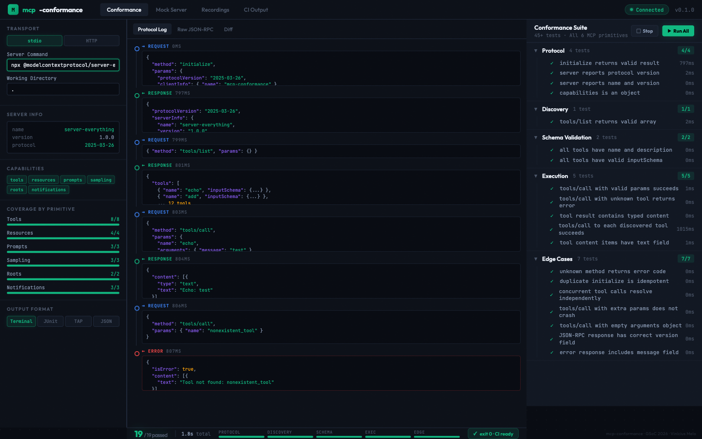

### About

1. **Full Name:** Vinícius Melo Almeida
2. **Contact:** vinimelo@riseup.net
3. **Discord:** vinimlo
4. **Home page:** —
5. **Blog:** —
6. **GitHub:** https://github.com/vinimlo
7. **LinkedIn:** https://www.linkedin.com/in/vinimlo/
8. **Time zone:** BRT (UTC-3)
9. **Resume:** [PDF](https://drive.google.com/file/d/1z9fIGaFpxUeHaWfBtjNt2oPVPaDUeJkb/view?usp=sharing)

### University Info

1. **University:** Universidade Federal da Bahia (UFBA)
2. **Program:** Bachelor's in Information Systems (Sistemas de Informação)
3. **Year:** 4th year
4. **Expected graduation:** December 2029

### Motivation & Past Experience

**1. Have you worked on or contributed to a FOSS project before?**

Yes. I contributed to [Wokwi](https://github.com/wokwi/wokwi-docs/pull/116) (documentation PR merged — added `Serial.begin` to the ESP32 WiFi guide) and [Noosfero](https://gitlab.com/noosfero/noosfero/-/merge_requests/1387) (submitted MRs for [audio playback](https://gitlab.com/noosfero/noosfero/-/merge_requests/1387) and [podcasting](https://gitlab.com/noosfero/noosfero/-/merge_requests/1306) functionality on GitLab).

I also maintain open source projects: [**galaxy-profile**](https://github.com/vinimlo/galaxy-profile) (458+ stars, GPL-3.0 — GitHub profile reimagined as a galaxy with auto-generated SVG cards) and [**tabAla**](https://github.com/vinimlo/tabAla) (Chrome extension for tab organization, Apache 2.0).

Beyond code, I coordinated the [**Festival Latino-Americano de Instalação de Software Livre (FLISOL)**](https://flisolssa.gitlab.io/) in Salvador 2018 — the largest free software event in Latin America — organizing workshops, talks, and install fests to promote free software adoption.

**2. What is your one project/achievement that you are most proud of? Why?**

My published paper at [Computer on the Beach 2023](https://periodicos.univali.br/index.php/acotb/article/view/19528) — *"IRIS: Extração, Organização e Classificação de Conteúdos do Projeto Pedagógico de Curso do Técnico em Automação Industrial"* (DOI: [10.14210/cotb.v14.p544-549](https://doi.org/10.14210/cotb.v14.p544-549)).

It taught me to take a real-world problem (students struggling to navigate course content), design a solution (automated extraction and classification using web scraping and NLP), implement it, and defend it through peer review. The discipline of academic rigor — formulating hypotheses, testing systematically, documenting results — directly shapes how I approach engineering today.

**3. What kind of problems or challenges motivate you the most?**

Problems at the intersection of developer tooling and emerging protocols. When a new technology like MCP emerges but the ecosystem tooling hasn't caught up, developers waste time on manual processes that could be automated. I'm motivated by closing that gap — building the testing, validation, and debugging tools that let developers focus on building, not fighting their tools.

This is why I co-founded [Seu AgenteIA](https://github.com/vinimlo) — to bring AI agent systems to production. And it's why MCP Testing resonates: I've experienced firsthand what it's like to build MCP-based systems without proper testing infrastructure.

**4. Will you be working on GSoC full-time?**

Part-time (~20h/week). I'll be working at my company [Rumo Tecnologias](https://rumotech.com.br) alongside GSoC. The 175-hour project scope requires ~14.6h/week over 12 weeks, which is comfortably within my availability. My work with AI systems and API integrations at Rumo keeps me close to the problems MCP Testing addresses.

**5. Do you mind regularly syncing up with the project mentors?**

Not at all — I actively prefer it. Regular check-ins help catch misalignments early and keep the project on track. I'm available for weekly syncs and responsive on Discord throughout the week.

**6. What interests you the most about API Dash?**

API Dash occupies a strategic position: it's already the tool developers use for API testing, and MCP is becoming the API layer of the AI world. Adding MCP testing capability means API Dash becomes the natural home for a developer's entire API workflow — REST, GraphQL, and now AI agent protocols.

I'm also impressed by the codebase quality: the monorepo structure with Melos, Riverpod for state management, the `genai` package abstracting multiple AI providers, and the Freezed-based immutable models. These are patterns I use in my own production systems, and it shows mature engineering.

**7. Can you mention some areas where the project can be improved?**

- **MCP support** is the most significant gap. As AI agents become mainstream, developers need first-class tooling for testing MCP servers alongside traditional APIs.
- **CI/CD integration** could be stronger — providing exportable test results in standard formats (JUnit XML, TAP) would make API Dash relevant in enterprise and automated workflows.
- **Automated regression testing** — beyond one-off API calls, developers need to save test scenarios and replay them to catch regressions after server changes.

**8. Have you interacted with and helped API Dash community?**

Yes — I joined the [Discord](https://discord.com/invite/bBeSdtJ6Ue) (#gsoc-foss-apidash channel), posted my introduction, submitted [PR #1476](https://github.com/foss42/apidash/pull/1476) with my MCP Testing idea document, and [commented on Discussion #1054](https://github.com/foss42/apidash/discussions/1054#discussioncomment-16318842) expressing interest in Idea #1.

---

### Project Proposal Information

**1. Proposal Title**

MCP Testing — Protocol-First Test Harness for MCP Servers and Clients

**2. Abstract**

The Model Context Protocol (MCP) ecosystem lacks standardized testing tooling. Developers building MCP integrations must manually craft JSON-RPC requests, cannot validate schema conformance automatically, and have no mock infrastructure for deterministic client-side testing.

This project builds a **protocol-first** testing system designed for automation from day one. The core is a conformance engine that runs headless (CLI, CI pipelines) or interactive (web UI), delivered as **three standalone packages**:

1. **`mcp-conformance`** — Schema validator, assertion framework, 45+ conformance tests covering all six MCP primitives (Tools, Resources, Prompts, Sampling, Roots, Notifications), network recording, and CLI with JUnit XML / TAP / JSON output
2. **`mcp-mock`** — Configurable mock MCP server with replay mode and failure injection
3. **MCP Testing UI** — React web interface for interactive exploration, test execution, and recording inspection

This architecture ensures every test can be automated in CI before it's ever run manually — and that the project delivers value even if the UI is the last piece to ship.

**3. Detailed Description**

## Problem

Developers building MCP integrations face four pain points:

- **No schema validation tooling.** There's no way to automatically verify that an MCP server's tool definitions conform to the spec — missing required fields, malformed JSON Schema for parameters, or invalid transport configurations go undetected until runtime.
- **Manual testing workflows.** Developers manually craft JSON-RPC requests, inspect responses by hand, and mentally track whether the server handles edge cases (malformed input, missing parameters, timeouts).
- **No conformance testing.** There's no standard suite to verify that a server correctly implements the MCP protocol lifecycle: `initialize` handshake with capability negotiation, `tools/list` discovery, `tools/call` execution, proper JSON-RPC 2.0 error codes, and transport negotiation.
- **No client-side testing support.** Applications consuming MCP servers have no mock infrastructure for deterministic testing without depending on live server availability.

## Architecture: Protocol-First, Automation-First

The key architectural decision is: **the engine is the product, the UI is a viewer.**

Every test runs headless first. The CLI is the primary interface. The web UI is an interactive explorer layered on top of the same engine. This means:

- CI integration works from Week 4 (not an afterthought)
- The project delivers value even if UI work extends
- Each package is standalone and reusable beyond API Dash

### Package 1: `mcp-conformance` (TypeScript / Node.js)

The core testing engine, published as an npm package.

**Transport Adapters:**
Abstraction layer supporting stdio and Streamable HTTP. Each adapter implements a common interface: `connect()`, `send()`, `receive()`, `disconnect()`. This isolates transport concerns from testing logic.

```
┌─────────────────────────────────────────────────┐
│              TransportAdapter                    │
│  ┌───────────────┐  ┌────────────────────────┐  │
│  │ StdioAdapter  │  │ StreamableHTTPAdapter  │  │
│  │ (subprocess   │  │ (HTTP POST + SSE       │  │
│  │  + readline)  │  │  response stream)      │  │
│  └───────────────┘  └────────────────────────┘  │
└─────────────────────────────────────────────────┘
```

**Schema Validator:**
Parses MCP server tool definitions and validates against the spec:
- Tool names, descriptions, and `inputSchema` conformance
- JSON Schema types for parameters are valid and complete
- Required vs. optional parameters are properly declared
- Capability declarations match actual server behavior

Returns structured validation results with error messages and fix suggestions, consumable both programmatically and via CLI output.

**Assertion Framework:**
Composable, protocol-based assertions inspired by testing framework patterns:

- **Protocol assertions:** Verify JSON-RPC 2.0 compliance, correct error codes (-32700, -32600, -32601, -32602), proper capability negotiation
- **Schema assertions:** Validate tool definitions, input schemas, response structures
- **Response assertions:** Content matching (contains, not_contains, regex), response timing
- **Tool call assertions:** Verify specific tools are called with expected parameters and return expected result shapes

Each assertion is a standalone function that takes traces/responses and returns pass/fail with detailed error context. This makes assertions testable, composable, and extensible without modifying the runner.

**Conformance Test Suite:**
45+ pre-built test cases covering **all six MCP primitives** plus transport, edge cases, and MCP Apps:

| Category | Tests | What they verify |
|----------|-------|-----------------|
| Transport | 5+ | stdio lifecycle, Streamable HTTP connection, graceful shutdown, reconnection |
| Protocol | 8+ | `initialize` handshake, capability negotiation, protocol version matching, JSON-RPC 2.0 compliance |
| Tools | 8+ | `tools/list` discovery, `tools/call` with valid/invalid params, error codes (-32601, -32602), schema validation |
| Resources | 4+ | `resources/list` enumeration, URI resolution, content type validation, `resources/subscribe` notification delivery |
| Prompts | 3+ | `prompts/list` discovery, argument validation (required/optional), `prompts/get` message generation with correct roles |
| Sampling | 3+ | `createMessage` request format compliance, mock LLM response handling, `includeContext` behavior, timeout handling |
| Roots | 2+ | Root boundary enforcement, `roots/list_changed` notification on root updates |
| Notifications | 3+ | `tools/list_changed` and `resources/list_changed` delivery, `progress` token tracking, event ordering, notification format (no `id` field) |
| Edge Cases | 6+ | malformed JSON, unknown methods, oversized payloads, concurrent requests, duplicate initialize idempotency |
| MCP Apps | 4+ | `ui://` resource registration, MIME type (`text/html;profile=mcp-app`), `ui/initialize` handshake, `hostContext` support, CSP declaration checks |

**Network Recording:**
Captures real MCP traffic (JSON-RPC messages) and serializes to fixture files:

```
┌──────────┐     ┌──────────────┐     ┌──────────┐
│  Client  │ ──► │  Recording   │ ──► │  Server  │
│          │ ◄── │  Proxy       │ ◄── │          │
└──────────┘     └──────┬───────┘     └──────────┘
                        │
                        ▼
                 ┌──────────────┐
                 │ fixtures/    │
                 │  session.jsonl│
                 └──────────────┘
```

Each recorded session captures: request/response pairs with timestamps, transport metadata, and sequence ordering. These fixtures feed directly into `mcp-mock` for replay.

**CLI Interface:**

```bash
# Run conformance suite against a server
npx mcp-conformance run --server "node my-server.js"

# Run against HTTP server
npx mcp-conformance run --url http://localhost:3000/mcp

# Validate schema only (no execution)
npx mcp-conformance validate --server "node my-server.js"

# Record traffic for replay
npx mcp-conformance record --server "node my-server.js" --output fixtures/

# Output formats
npx mcp-conformance run --server "..." --format junit   # JUnit XML
npx mcp-conformance run --server "..." --format tap     # TAP
npx mcp-conformance run --server "..." --format json    # JSON
```

### Package 2: `mcp-mock` (TypeScript / Node.js)

A configurable mock MCP server for client-side testing.

**Configuration-driven:**

```yaml
# mock.yaml
tools:
  - name: get_weather
    description: Get current weather for a city
    inputSchema:
      type: object
      properties:
        city: { type: string }
      required: [city]
    response:
      content:
        - type: text
          text: "72°F, sunny"

  - name: search_db
    description: Search the database
    inputSchema:
      type: object
      properties:
        query: { type: string }
    response:
      content:
        - type: text
          text: '{"results": [{"id": 1}]}'
```

**Replay mode:**
Serve recorded fixtures from `mcp-conformance record`:

```bash
npx mcp-mock --replay fixtures/session.jsonl
```

**Failure injection:**
Configurable failure modes for resilience testing:

```yaml
chaos:
  latency: 2000        # Add 2s latency to all responses
  error_rate: 0.1       # 10% of requests return errors
  timeout_tools:        # Specific tools that timeout
    - slow_search
  malformed_responses:  # Return invalid JSON-RPC
    - invalid_tool
```

**Transport support:** stdio and Streamable HTTP, matching the conformance engine.

### Package 3: MCP Testing UI (React / TypeScript)

Interactive web interface built on top of the same engine.

**Server Connection Panel:**
- Connect to any MCP server (stdio command or HTTP URL)
- Auto-discover all six primitives: tools, resources, prompts, sampling capabilities, roots, and notification subscriptions
- Display server capabilities and protocol version

**Tool Explorer:**
- Browse discovered tools with schemas rendered in readable format
- Auto-generate input forms from `inputSchema`
- Execute tool calls with custom parameters
- Inspect structured responses with syntax highlighting

**Test Runner:**
- Run full conformance suite or selected test categories
- Live pass/fail streaming during execution
- Conformance scorecard showing coverage by category
- Export results as JUnit XML, JSON, or HTML report

**Recording Viewer:**
- Inspect captured network traffic (request/response pairs)
- Timeline view with sequence ordering
- Replay controls: step through recorded sessions
- Diff view: compare two recordings side by side

## Architecture Overview

[](images/vinicius_mcp_architecture.png)

## UI Vision

[](images/vinicius_mcp_ui_mockup.png)

Proposed MCP Testing UI showing three-panel layout: server connection with capability discovery (left), JSON-RPC protocol log with message inspector (center), and conformance test runner with pass/fail results by category (right). Bottom bar shows conformance scorecard with coverage metrics. Self-contained HTML mockup available in the [PoC repository](https://github.com/vinimlo/mcp-conformance).

## Why This Architecture

1. **Standalone packages.** `mcp-conformance` and `mcp-mock` are usable without the UI — in CI pipelines, as libraries, or from the command line. This aligns with API Dash's pattern of extracting reusable packages (like `better_networking`, `curl_parser`, `genai`).

2. **De-risked timeline.** The engine delivers value from Week 4. If UI work takes longer, the core deliverables are already shipping and usable.

3. **12 incremental PRs.** Each week produces a focused, reviewable, mergeable PR — following API Dash's preference for precise, incremental contributions over monolithic changes.

4. **Recording connects everything.** `mcp-conformance` records traffic, `mcp-mock` replays it, the UI visualizes it. One concept ties all three packages together.

5. **CI-native from day one.** JUnit XML output means any CI system can consume results immediately. Not an afterthought — it's Week 4.

## Risk Mitigation

**"What if the engine takes longer than 4 weeks?"**
The transport layer and JSON-RPC client are already proven in the PoC. Weeks 1-2 are expansion of working code, not greenfield. Risk is low.

**"What if UI work extends beyond Week 12?"**
The engine is the core deliverable. By midterm (Week 4), `npx mcp-conformance run` works end-to-end with CI output. The project delivers value even if UI polish is deferred — this is why we chose protocol-first architecture.

**"What if mock server complexity grows?"**
The YAML-based configuration and replay mode are intentionally simple. Failure injection (Week 7) is the riskiest feature — if it slips, the mock server still works for basic deterministic testing.

**"What about part-time availability?"**
The 175-hour scope at ~14.6h/week over 12 weeks fits within my ~20h/week availability. Each weekly PR stands alone as a shippable increment — no big-bang delivery risk.

## Proof of Concept

I've built a working prototype of the `mcp-conformance` engine: [**github.com/vinimlo/mcp-conformance**](https://github.com/vinimlo/mcp-conformance) — [**watch the full demo**](https://asciinema.org/a/qbQRBS3CLtxvFFXW) (40s — runs against both a test fixture and the official MCP SDK reference server)

It demonstrates the core architecture — StdioTransport adapter, MCPClient, composable assertions, and CLI runner — with **19 passing conformance tests** across 5 categories (Protocol, Discovery, Schema, Execution, Edge Cases) against a real MCP server. The PoC runs in ~0.4s and exits with code 0/1 for CI integration:

```
mcp-conformance v0.1.0
Testing: npx tsx fixtures/test-server.ts

Protocol
  ✓ initialize returns valid result (355ms)
  ✓ server reports protocol version
  ✓ server reports name and version
  ✓ capabilities is an object

Discovery
  ✓ tools/list returns valid array

Schema
  ✓ all tools have name and description
  ✓ all tools have valid inputSchema

Execution
  ✓ tools/call with valid params succeeds
  ✓ tools/call with unknown tool returns error
  ✓ tool result contains typed content
  ✓ tools/call to each discovered tool succeeds
  ✓ tool content items have text field

Edge Cases
  ✓ unknown method returns error code
  ✓ duplicate initialize is idempotent
  ✓ concurrent tool calls resolve independently
  ✓ tools/call with extra params does not crash
  ✓ tools/call with empty arguments object
  ✓ JSON-RPC response has correct version field
  ✓ error response includes message field

19 passed (0.4s)
```

## Why Me

At Rumo Tecnologias and Seu AgenteIA, I build AI agent systems that rely on MCP — I've debugged JSON-RPC transport failures and capability negotiation edge cases in production. I've also designed behavior testing frameworks for AI agents (protocol-based assertions, trace collection, multi-turn state threading), which directly shaped the conformance engine architecture. The PoC's 19 passing tests against the official MCP SDK demonstrate this hands-on expertise. TypeScript, Node.js, React — the exact stack this project needs — is what I use daily.

## MCP Apps Testing

The conformance engine extends to validate [MCP Apps](https://dev.to/ashita/a-practical-guide-to-building-mcp-apps-1bfm) — rich HTML UI components served by MCP servers as sandboxed iframes in AI hosts. This incorporates patterns from the practical guide shared by mentors:

- **Resource registration:** Verify `ui://` resource URIs are correctly registered via `resources/list`, with MIME type `text/html;profile=mcp-app`
- **Tool-to-app linking:** Validate tools expose `_meta.ui.resourceUri` pointing to the correct `ui://` resource
- **Handshake compliance:** Test the `ui/initialize` → `hostContext` → `ui/notifications/initialized` lifecycle
- **Host context support:** Verify the app correctly receives and applies `hostContext` CSS variables for theme adaptation
- **CSP declarations:** Check that apps declaring external requests include proper `connectDomains` and `resourceDomains` in `_meta.ui.csp`

This ensures developers can validate their MCP Apps are correctly built before deploying to hosts like VS Code or Claude Desktop.

## Future Extensions (post-GSoC)

Security profiling (tool poisoning detection, injection vulnerability checks), extended MCP Apps testing (iframe sandbox compliance, multi-host theme validation), and SSE legacy transport support.

**4. Weekly Timeline**

| Week | Phase | Deliverable | Done when | PR |
|------|-------|-------------|-----------|-----|
| CB | Community Bonding | Dev setup, MCP spec deep dive, API Dash codebase study, architecture discussion with mentors. | Repo scaffolded with CI. Mentor-approved architecture doc. | — |
| 1 | Engine Core | Transport adapters (stdio + Streamable HTTP) + JSON-RPC client. Connect to any MCP server, send `initialize`, discover tools. | Both transports connect successfully. `initialize` handshake completes. Tool list returned. 5+ transport tests. | #1 |
| 2 | Engine Core | Schema validator + composable assertion framework. Validate tool definitions against spec, run assertions on responses. | Invalid schemas produce structured error messages. Assertions composable and independently testable. 10+ validation tests. | #2 |
| 3 | Engine Core | Conformance test suite: 45+ tests covering all 6 MCP primitives (Tools, Resources, Prompts, Sampling, Roots, Notifications), edge cases, and protocol compliance. | Suite runs against official MCP SDK reference server. All 6 primitives covered. 45+ tests pass. | #3 |
| 4 | Engine Core | CLI interface + output formats (JUnit XML, TAP, JSON, rich terminal). `npx mcp-conformance run` works end-to-end. | `npx mcp-conformance run --server "..." --format junit` produces valid JUnit XML. Exit code 0/1 for CI. GitHub Actions example workflow runs green. | #4 |
| — | **Midterm** | **Engine runs headless against any MCP server, outputs conformance report. CI-ready. 45+ tests.** | | — |
| 5 | Mock + Recording | Mock MCP server core: configurable tools with deterministic responses. `npx mcp-mock --config mock.yaml` serves responses. | Mock server starts from YAML config. Client receives configured responses. 8+ mock tests. | #5 |
| 6 | Mock + Recording | Network recording in conformance engine + replay mode in mock. Record real traffic → replay as fixtures. | `mcp-conformance record` captures session to `.jsonl`. `mcp-mock --replay` serves recorded responses. Round-trip test passes. 6+ recording tests. | #6 |
| 7 | Mock + Recording | Failure injection: latency, error responses, partial results, connection drops. Chaos testing for resilience. | Configurable chaos via YAML. Client receives injected failures. 6+ chaos tests. | #7 |
| 8 | Web UI | UI scaffold + server connection panel + tool explorer. Connect to server, browse tools/schemas, execute calls. | React app builds. Server connection works via browser. Tool schemas render. Tool calls execute and display responses. | #8 |
| 9 | Web UI | Test runner panel + conformance scorecard. Run suite from UI, view pass/fail results by category. | Tests run from UI with live streaming. Scorecard shows pass/fail by category. Export to JUnit XML works from UI. | #9 |
| 10 | Web UI | Recording viewer + replay controls. Inspect captured traffic, step through sessions, compare recordings. | Timeline view renders request/response pairs. Step-through works. Side-by-side diff displays between two recordings. | #10 |
| 11 | Web UI + MCP Apps | MCP Apps conformance tests (`ui://` validation, handshake, `hostContext`), UI polish, responsive design, user guide. | MCP Apps test category passes against sample app. UI responsive on mobile. User guide covers install → first test. | #11 |
| 12 | Final | Integration tests against 3+ real MCP servers, GitHub Actions CI workflow example, documentation, GSoC final report. | Integration tests pass against 3+ servers. CI workflow example works. Final report submitted. PR ready for review. | #12 |

**Scope Management**

- **Core (must deliver):** `mcp-conformance` engine + CLI + 45+ tests + CI output formats + `mcp-mock` with YAML config and replay.
- **Stretch (if ahead of schedule):** MCP Apps testing (W11), recording diff view (W10), failure injection (W7).
- **If behind schedule:** Web UI deferred to post-GSoC (engine + mock deliver full value headless). Failure injection simplified to latency-only. MCP Apps tests move to post-GSoC.
