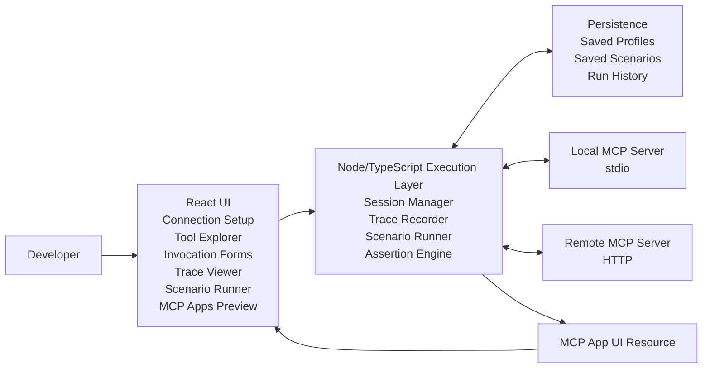
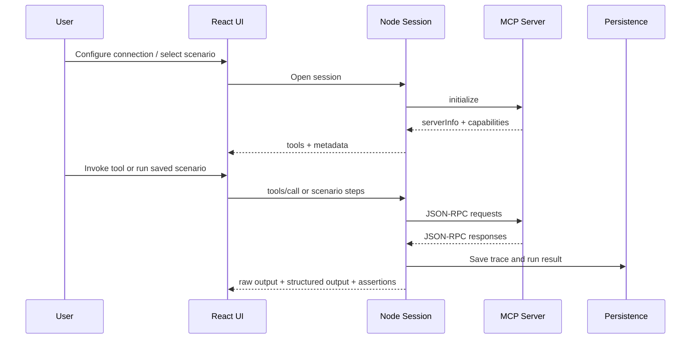
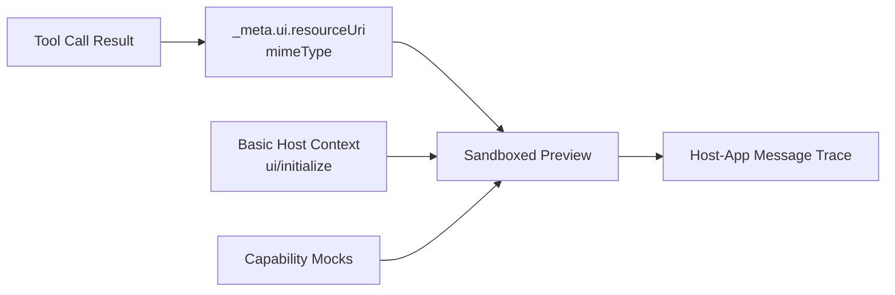

### About

1. Full Name: Yashas Bhat
2. Contact info (public email): y8bhat@gmail.com
3. Discord handle in our server (mandatory): ynbh
4. Home page (if any): https://ynbh.me
5. Blog (if any): https://www.ynbh.me/thoughts
6. GitHub profile link: https://github.com/ynbh
7. Twitter, LinkedIn, other socials: https://www.linkedin.com/in/yashasnbhat
8. Time zone: America/New_York
9. Link to a resume (PDF, publicly accessible via link and not behind any login-wall): https://drive.google.com/file/d/1hfoIhVyks8ddUEjSKQh2qEnI-B8YkyPu/view?usp=sharing

### University Info

1. University name: University of Maryland, College Park
2. Program you are enrolled in (Degree & Major/Minor): B.S. in Computer Science, Minor in Mathematics
3. Year: Junior
4. Expected graduation date: May 2027

### Motivation & Past Experience

**Have you worked on or contributed to a FOSS project before? Can you attach repo links or relevant PRs?**

Yes. I have opened PRs in public repositories, including:

- python-ai-sdk/sdk: https://github.com/python-ai-sdk/sdk/pull/4
- dubinc/dub: https://github.com/dubinc/dub/pull/130
- withfig/autocomplete: https://github.com/withfig/autocomplete/pull/1650

I also have public open-source projects:

- Canvas MCP: https://github.com/ynbh/canvasmcp
- Codexport: https://github.com/ynbh/codexport
- Testudot: https://github.com/ynbh/testudot

**What is your one project/achievement that you are most proud of? Why?**

Canvas MCP. I built it to automate my Canvas workflow and make course data usable from both an MCP server and a CLI. That meant supporting multiple auth flows, defining tool boundaries across assignments, discussions, files, grades, modules, and calendar events, and shaping responses so an agent could use them reliably. Once I started changing and adding tools, the testing gap was obvious: I could invoke them manually, but I did not have a good way to save scenarios, replay them after changes, or inspect failures across runs.

**What kind of problems or challenges motivate you the most to solve them?**

I am most motivated by developer tooling and infrastructure problems that remove repeated friction. Building Canvas MCP made that concrete. After I had the first few tools working, I could call them manually, but I could not easily save test cases, replay them after changes, or inspect failures in a structured way. MCP is already useful; what it still needs is better support for repeatable testing.

**Will you be working on GSoC full-time? In case not, what will you be studying or working on while working on the project?**

Yes. GSoC will be my primary commitment during the coding period, and I do not expect conflicting full-time work during the summer.

**Do you mind regularly syncing up with the project mentors?**

No. Regular syncs help keep scope and implementation aligned.

**What interests you the most about API Dash?**

What interests me most about API Dash is its support for saved workflows through collections and history. MCP testing needs the same primitives: saved connections, saved scenarios, replay, and run history.

**Can you mention some areas where the project can be improved?**

The biggest gap I see is repeatable MCP testing. MCP Inspector already supports connection setup, capability discovery, manual tool invocation, and log inspection, but it is still a manual debugger. It does not cover saved scenarios, replay, assertions, or per-run summaries. MCP Apps have a related gap. Real hosts can render the app and handle `ui/initialize`, `hostContext`, and capability negotiation, but they are runtime hosts, not dedicated testing harnesses. Developers still lack a standalone way to save MCP Apps scenarios, replay them, inspect traces across runs, and validate behavior in a controlled environment.

**Have you interacted with and helped API Dash community? (GitHub/Discord links)**

I have not made a public API Dash contribution yet. For this proposal, I reviewed how the project handles collections, history, and persisted developer data because those patterns map directly to saved MCP scenarios and run history. That is the part of the codebase I studied most closely.

### Project Proposal Information

**Proposal Title:** MCP Testing Workbench for API Dash

**Abstract**

I built Canvas MCP to automate my Canvas workflow, and that exposed the current gap in MCP tooling. Existing tools cover manual inspection and real host execution, but not repeatable testing. I propose an MCP Testing Workbench for API Dash. The MVP will connect to MCP servers, discover tools, render schema-driven inputs, capture JSON-RPC traces, save reusable scenarios, and rerun them with assertions. It will also include basic MCP Apps support: UI resource detection, metadata inspection, and host-app message tracing. More complete MCP Apps host behavior would come in a later phase.

**Detailed Description**

#### Problem

Current MCP tooling covers manual debugging better than repeatable testing. MCP Inspector and MCP Workbench both cover useful parts of the workflow, but neither is described as a saved-scenario test harness.

Legend: ✅ yes, 🟡 partial, ❌ no, 📝 not documented, ⏭️ later phase.

| Capability | MCP Inspector | MCP Workbench | Real MCP Apps Host | This proposal |
|---|---|---|---|---|
| Connect to local and remote servers | ✅ | 🟡 | N/A | ✅ |
| Capability discovery | ✅ | ✅ | N/A | ✅ |
| Manual tool invocation | ✅ | ✅ | N/A | ✅ |
| JSON-RPC log / trace inspection | 🟡 | ✅ | 🟡 | ✅ |
| Saved connection profiles | ❌ | ✅ | ❌ | ✅ |
| Saved scenarios | ❌ | 📝 | ❌ | ✅ |
| Replay across runs | ❌ | 📝 | ❌ | ✅ |
| Assertions on responses | ❌ | 📝 | ❌ | ✅ |
| Per-run summaries | ❌ | 📝 | ❌ | ✅ |
| Multi-step scenarios | ❌ | 📝 | ❌ | ✅ |
| Resources and prompts inspection | ✅ | ✅ | N/A | ✅ |
| Detect MCP App UI resources | 🟡 | 📝 | ✅ | ✅ |
| Render MCP App UI in sandbox | ❌ | 📝 | ✅ | ✅ |
| Trace host-app messages | ❌ | 📝 | 🟡 | ✅ |
| Validate `ui/initialize` / `hostContext` flow | ❌ | 📝 | 🟡 | ✅ |
| Capability mocking for MCP Apps | ❌ | 📝 | ❌ | ⏭️ |

I ran into this while building and using Canvas MCP. After the first few tools, the missing piece was repeatable testing across changes.

#### Proposed Solution

The MVP workbench will cover the core developer loop:

- Connect to a local stdio or remote HTTP MCP server
- Discover tools and metadata
- Render schema-driven input forms
- Invoke tools and show raw plus structured outputs
- Capture JSON-RPC traces for each run
- Save connection profiles
- Save and rerun scenarios
- Run assertions on responses

Example: run `search_courses`, assert that the call succeeds, assert that `response.courses` exists, and assert that `response.courses[0].id` is present.

After the MVP:

- Multi-step scenarios with value extraction between steps
- Per-run summaries showing whether the run passed, which steps failed, how long it took, and which assertions failed
- Richer MCP Apps support, including sandboxed preview and basic host behavior

#### Planned Scope

I would organize the implementation into four workstreams. The first three define the MVP. The fourth extends MCP Apps support after the core testing loop is stable.

##### Workstream 1: Transport and Session Lifecycle

- Stdio and HTTP connection support
- Session lifecycle management
- `initialize` and capability discovery

##### Workstream 2: Execution and Telemetry

- Tool discovery
- Schema-driven invocation
- Raw and structured response views
- JSON-RPC trace viewer
- Saved connection profiles
- Saved single-step scenarios

##### Workstream 3: Scenario Orchestration and Validation

- Assertion runner
- Multi-step scenarios
- Value extraction between steps
- Per-run summaries with timestamps, step outcomes, assertion failures, and links to saved traces

##### Workstream 4: MCP Apps Support

- Detect tools that expose UI resources
- Inspect returned UI metadata
- Trace iframe-host communication at the message level
- Render those resources in a sandboxed testing surface
- Support `ui/initialize` and basic host context handling
- Expose a simple host-capability mock layer for testing expected and rejected actions

#### Architecture

API Dash already has patterns for saved developer workflows such as collections, history, and environment variables. I would keep saved MCP connections, scenarios, and run history consistent with those patterns.

Idea #1 lists React, Node.js, and TypeScript, so I would use that stack for the testing surface and execution layer.

Overall system:

Test execution flow:

MCP Apps path:

#### Technical approach

MVP scope: transport, discovery, invocation, traces, saved profiles and scenarios, assertions, and basic MCP Apps detection. CI export and deeper MCP Apps host simulation stay out of scope.

#### Deliverables

- MCP Testing Workbench MVP
- Stdio and HTTP connection support
- Tool discovery and schema-driven invocation
- JSON-RPC trace inspection for debugging
- Saved test scenarios and reusable connection profiles
- Assertion-based test execution
- Documentation for setup and usage, plus a short architecture note
- Basic MCP Apps support in the MVP
- More complete MCP Apps host behavior if time remains after the MVP

#### Stretch goals

- Lightweight export of scenario results
- Richer diffing between two runs of the same scenario
- A small headless runner or CLI entrypoint built on the same scenario format

**Weekly Timeline**

#### Community Bonding

- Review how API Dash handles collections and history
- Review environment handling and local persistence
- Finalize the MVP boundary and milestone order with mentors
- Define the initial scenario JSON format and transport priority order

**Workstream 1: Transport and Session Lifecycle**

| Week | Target capabilities | Technical deliverables |
|---|---|---|
| 1 | Project skeleton and session interfaces | React UI shell, Node execution layer scaffold, connection screen for stdio input, transport interface, session manager interface |
| 2 | Local stdio transport | stdio adapter, process start/stop handling, timeout and error handling, `initialize`, capability discovery |
| 3 | Remote HTTP transport | HTTP transport adapter, tool explorer populated from server metadata, schema loading for UI rendering |

**Workstream 2: Execution and Telemetry**

| Week | Target capabilities | Technical deliverables |
|---|---|---|
| 4 | Dynamic invocation | Schema-driven forms, raw JSON-RPC view, structured response view, single tool execution from the UI |
| 5 | Trace capture and saved profiles | Structured trace capture for each run, persisted connection profiles |
| 6 | Single-step replay and baseline assertions | Saved single-step scenarios, replay support, assertions for status, required fields, and selected response paths |

**Workstream 3: Scenario Orchestration and Validation**

| Week | Target capabilities | Technical deliverables |
|---|---|---|
| 7 | Deeper assertions and MCP Apps metadata | Nested response assertions, MCP Apps UI resource detection, `resourceUri` and MIME type capture in traces |
| 8 | MVP stabilization | Fixes from mentor feedback and local testing, MVP setup and usage docs, example scenarios for a demo server |
| 9 | Multi-step scenarios | Ordered tool calls, value extraction, parameter injection across steps |

**Workstream 4: Run Analytics and MCP Apps**

| Week | Target capabilities | Technical deliverables |
|---|---|---|
| 10 | Run summaries and replay UX | Per-run summaries with pass/fail status, step outcomes, duration, and assertion failures; improved editor and replay flow for multi-step runs |
| 11 | MCP Apps preview and handshake | Sandboxed MCP Apps preview, `ui/initialize` handling, basic host context injection |
| 12 | Final polish | Final bug fixes, documentation pass, demo material, cleanup |
