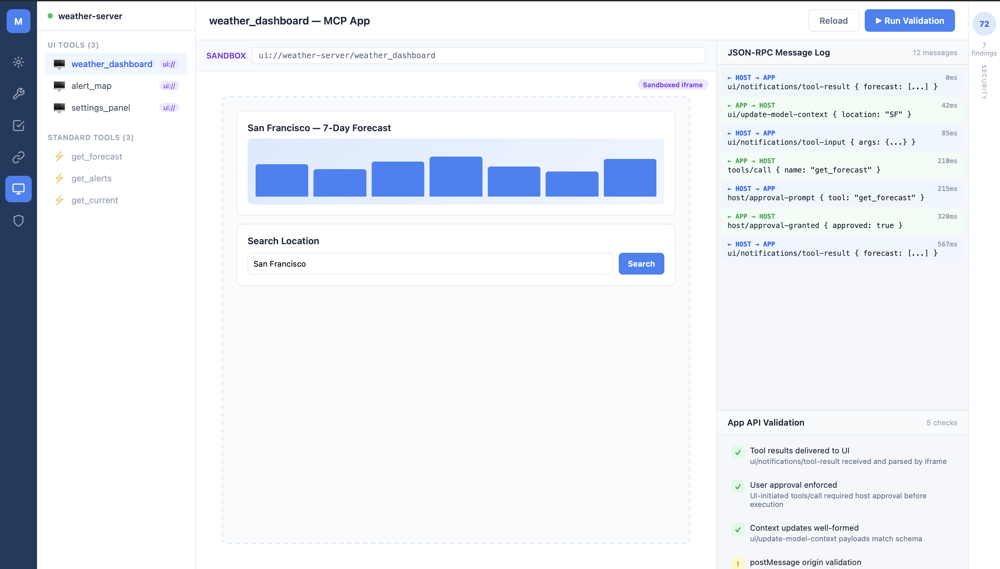

### About

1. Full Name - Yashvardhan Goel
2. Contact info (public email) - f20201377@alumni.bits-pilani.ac.in
3. Discord handle in our server (mandatory) - @frenzyScholar
4. Home page (if any) - https://yash2002vardhan.github.io
5. Blog (if any) - NA
6. GitHub profile link - https://github.com/yash2002vardhan
7. Twitter, LinkedIn, other socials - Twitter : https://x.com/goel_2002yash ; LinkedIn : https://www.linkedin.com/in/yashvardhangoel02/ 
8. Time zone - IST (GMT + 5:30)
9. Link to a resume (PDF, publicly accessible via link and not behind any login-wall) - https://drive.google.com/file/d/18zwzI0WmbJa4CXV1W5M585E7MspsIn1k/view?usp=sharing

### University Info

1. University name - BITS Pilani
2. Program you are enrolled in (Degree & Major/Minor) - Graduated
3. Year - 2025
4. Expected graduation date - Graduated

### Motivation & Past Experience

1. Have you worked on or contributed to a FOSS project before? Can you attach repo links or relevant PRs?  
Ans: I have not yet contributed to a FOSS (Free and Open Source Software) project. However, I am eager to get involved, and am looking forward to making my first contributions through GSoC and beyond.

2. What is the one project or achievement that you are most proud of? Why?  
Ans: One project I am particularly proud of is building an AI-powered assistant widget for Delphi Intelligence’s research platform. I owned the end-to-end development of the system, designing a pipeline that could continuously ingest new research articles, enable high-quality retrieval, and support cross-article querying and comparisons — a non-trivial requirement due to the need for dynamic context routing across documents. I implemented a cron-based scraping service integrated with Jina APIs for automated data ingestion, and deployed a self-hosted Milvus vector database to handle scalable semantic search. To improve retrieval quality, I built a hybrid pipeline combining BM25 and dense retrieval, augmented with an LLM-based reranker to ensure high-precision context selection. I also evaluated multiple models and optimized GPT-4.1 through prompt engineering and parameter tuning to balance latency and response quality. To enable cross-context reasoning, I designed a dynamic mapping mechanism across articles and integrated conversational memory for efficient multi-turn interactions. Additionally, I collaborated closely with the frontend to implement streaming responses, session management, and source attribution for transparency. This resulted in a system with ~1 second time-to-first-token, significantly reduced customer support queries, and successfully converted the project from a pilot into a paid deployment. I am particularly proud of this project because I was able to take a complex idea from concept to production, make key architectural decisions independently, and deliver a system that had direct business impact.

3. What kind of problems or challenges motivate you the most to solve them?  
Ans: I am especially motivated by challenges where systems have the capacity to continually improve based on feedback and use - where every interaction leads to a better, more robust result. I love building solutions that incorporate feedback loops, retrieval, or iterative refinement rather than remaining static.  
My main interest lies at the intersection of machine learning and system architecture: not just the modeling aspect, but also the choices involved in orchestrating data flow, retrieval, evaluation, and interactions between different components in a real-world pipeline. Transforming an open-ended idea into a scalable, reliable, maintainable, and extensible system is deeply satisfying to me.  
When it comes to open source, I am inspired by the prospect of building tools that are both user- and contributor-friendly - well-structured, documented, and designed so others can easily build on them.  
Overall, I am driven by opportunities that combine depth, iteration, and collaborative impact - problems where I can help create systems that become more valuable and accessible to the community over time.

4. Will you be working on GSoC full-time? In case not, what will you be studying or working on while working on the project?  
Ans: I will not be working on GSoC full-time, as I will be continuing with my day job. That said, I have experience balancing professional work with side projects and will dedicate consistent evening and weekend hours to ensure steady progress. I'll maintain clear communication with my mentor and set realistic weekly milestones to stay on track throughout the program.

5. Do you mind regularly syncing up with the project mentors?  
Ans: No, I don't mind regularly syncing up with the project mentors.
6. What interests you the most about API Dash?  
Ans: What interests me most about API Dash is how it rethinks what an API client should be. Unlike Postman or Insomnia, which have grown bloated and increasingly cloud-dependent, API Dash stays lightweight and local-first, no mandatory accounts, no subscription walls, just my data on my disk. With native multimedia response previewing: I can directly view images, PDFs, and audio responses inline. The built-in AI assistant (Dashbot) with local LLM support means I can debug requests and generate code without sending sensitive payloads to third-party services. And as a Flutter-built tool with first-class Dart code generation, it uniquely serves the cross-platform developer ecosystem. It's a tool that prioritizes developer experience and privacy over feature bloat, and that philosophy is what draws me to contribute to it.

7. Can you mention some areas where the project can be improved?  
Ans: Following are some of the improvements that can be made to the project:

- **Streaming responses for Dashbot** - Without streaming, LLM interactions feel unresponsive and impractical for real use.
- **Disappearing API keys** - A data persistence bug that directly breaks user trust and workflow.
- **Broader LLM provider support** - Limiting Dashbot to few providers restricts its usefulness; supporting Groq, OpenRouter, Mistral etc. is key for adoption.

8. Have you interacted with and helped API Dash community? (GitHub/Discord links)  
Ans: Yes, I have actively engaged with the API Dash community. I attended all the weekly sessions hosted by the project mentors, where I gained deeper insight into the project's architecture and roadmap. These sessions were particularly helpful in understanding the GSoC idea around the MCP Testing Suite. I used them to clarify my doubts, discuss implementation approaches, and align my understanding with the mentors expectations for the project.

### Project Proposal Information

1. Proposal Title : MCP TESTING AND SECURITY SUITE
2. Abstract: The MCP ecosystem currently lacks a unified tool for both functional testing and security analysis of MCP servers. The official MCP Inspector only supports basic manual tool invocation with no test suites, assertions, or saved collections. Standalone security scanners like Snyk's mcp-scan and Cisco's mcp-scanner are CLI-only and completely disconnected from functional testing. I propose building an MCP Testing & Security Suite under the API Dash umbrella - a TypeScript web application (React 19 + Mantine UI frontend, Node.js + Express backend) where developers can connect to any MCP server (stdio or Streamable HTTP), run functional test suites with assertions and chained multi-step calls, analyze security posture through pluggable analyzers (tool poisoning, injection, auth/credential checks, protocol compliance), and test MCP Apps UI resources in a sandboxed iframe environment. The core insight is that functional testing and security analysis share ~70% of the infrastructure, enabling a single unified interface that replaces the current fragmented workflow of using 3+ separate tools.
3. Detailed Description

## Problem

[MCP (Model Context Protocol)](https://modelcontextprotocol.io/) is rapidly becoming the standard API protocol for AI, the way REST and GraphQL are for traditional applications. Thousands of MCP servers now exist, but the developer tooling for testing them is fragmented:

- The official [MCP Inspector](https://github.com/modelcontextprotocol/inspector) supports basic manual tool invocation but has no test suites, no assertions, no saved collections, and no security analysis.
- Standalone security scanners like [Snyk's mcp-scan](https://github.com/invariantlabs-ai/mcp-scan) and [Cisco's mcp-scanner](https://github.com/cisco-ai-defense/mcp-scanner) can detect tool poisoning and vulnerabilities, but they're CLI-only tools completely disconnected from functional testing.
- The new [MCP Apps extension](https://blog.modelcontextprotocol.io/posts/2026-01-26-mcp-apps/) lets tools return interactive UI components rendered in sandboxed iframes, but no testing tool exists to validate UI resource rendering, postMessage-based JSON-RPC communication, or App API behavior.
- No tool today lets a developer answer both "does this MCP server work correctly?" and "is this MCP server safe to deploy?" from a single interface.

## Solution

I propose building a **web-based MCP Testing & Security Suite** under the API Dash umbrella - a unified tool where developers can connect to any MCP server, functionally test it, and analyze its security posture, all from one interface with one shared connection.

The core architectural insight is that **functional testing and security analysis share ~70% of the infrastructure** - the same MCP client connection, the same capability discovery, the same response data. The security engine is essentially a specialized set of analyzers running against the same server connection that the test engine uses. Building them as one tool is not just convenient - it's architecturally efficient.

## Engineering Differentiators

| Capability | MCP Inspector | mcp-scan / Cisco Scanner | This Project |
|---|---|---|---|
| Interactive tool invocation | ✓ | ✗ | ✓ |
| Test suites & assertions | ✗ | ✗ | ✓ |
| Chained multi-step tests | ✗ | ✗ | ✓ |
| Environment variables | ✗ | ✗ | ✓ |
| Security scanning | ✗ | ✓ (CLI only) | ✓ (integrated UI) |
| Unified functional + security view | ✗ | ✗ | ✓ |
| Visual security dashboard | ✗ | ✗ | ✓ |
| Unified server scorecard | ✗ | ✗ | ✓ |
| Report export (SARIF/JSON/PDF) | ✗ | Partial | ✓ |
| Saved connection profiles | ✗ | ✗ | ✓ |
| MCP Apps UI resource testing | ✗ | ✗ | ✓ |
| App API (postMessage) validation | ✗ | ✗ | ✓ |
| Iframe sandbox security checks | ✗ | ✗ | ✓ |

## Architecture

### Layer 1: Presentation Layer (React + TypeScript)

The frontend is built with **React 19 + Vite**, using **Mantine UI** for components and **Tailwind CSS v4** for layout utilities. Key UI modules:

- **Connection Manager** - Form-driven configuration for stdio and Streamable HTTP transports. Supports saved connection profiles persisted to browser localStorage. Transport-specific fields render conditionally (command/args/cwd/env for stdio; URL/headers/OAuth for HTTP).
- **Test Workbench** - Split-pane layout with auto-generated parameter forms (built from the tool's JSON Schema via a recursive schema-to-form renderer), a response viewer with Tree/Raw/Headers tabs, and an assertion panel. Uses **Framer Motion** for smooth panel transitions.
- **MCP Apps Tester** - For tools that return interactive UI components via the [MCP Apps extension](https://blog.modelcontextprotocol.io/posts/2026-01-26-mcp-apps/). Renders `ui://` resources in a sandboxed iframe, displays a live JSON-RPC message log of all postMessage traffic between iframe and host, and shows App API validation results (tool result delivery, UI-initiated tool call approval, model context updates).
- **Security Dashboard** - Aggregated view with a **Mantine RingProgress** score visualization, per-analyzer accordion breakdown, and a filterable findings table sortable by severity (Critical → Info). Each finding row is expandable inline to show flagged content and remediation guidance.
- **Report Generator** - Export modal supporting JSON, PDF (via browser print), and SARIF formats. SARIF output follows the [SARIF 2.1.0 schema](https://docs.oasis-open.org/sarif/sarif/v2.1.0/sarif-v2.1.0.html) for direct upload to GitHub's Security tab.

### Layer 2: Backend Services (Node.js + Express)

The backend exposes a REST API over Express with WebSocket support (via `ws`) for real-time progress streaming during long-running scans. Core routes:

| Endpoint | Method | Purpose |
|---|---|---|
| `/api/connect` | POST | Establish MCP connection (stdio spawn or HTTP handshake) |
| `/api/disconnect` | POST | Tear down active connection |
| `/api/capabilities` | GET | Return discovered tools, resources, prompts |
| `/api/invoke` | POST | Invoke a single tool with given parameters |
| `/api/test/run` | POST | Execute a test suite (ordered tool invocations + assertions) |
| `/api/test/chain` | POST | Execute a chained multi-step test with variable extraction |
| `/api/security/scan` | POST | Run selected security analyzers against the connected server |
| `/api/status` | GET | Return connection state and server info |

**Request/response validation**: Every endpoint validates input using Zod schemas imported from the shared package. A centralized error handler catches `ZodError` instances (using a name-based check to work around `instanceof` failures across npm workspace boundaries) and returns structured 400 responses with field-level error details.

**MCP Client Engine** - The shared core that wraps `@modelcontextprotocol/sdk`. It manages:
- **Connection lifecycle**: Spawn child processes for stdio transport (using Node.js `child_process.spawn` with configurable cwd and env), or establish HTTP connections for Streamable HTTP transport (with optional OAuth 2.1 bearer token injection). Backwards-compatible support for the deprecated HTTP+SSE transport.
- **Capability negotiation**: Calls `initialize` with client capabilities, then discovers server capabilities via `tools/list`, `resources/list`, and `prompts/list`. Parses JSON Schemas from tool `inputSchema` fields for form generation and validation.
- **Tool invocation**: Wraps `tools/call` with request timeout handling, response validation, and JSON-RPC message logging for debugging.
- **Connection state machine**: States are `disconnected → connecting → connected → error`, managed via an EventEmitter that the WebSocket layer subscribes to for real-time UI updates.

**MCP Apps Validation Engine** - For tools that declare `_meta.ui.resourceUri`, the engine renders `ui://` resources in a sandboxed environment, intercepts JSON-RPC messages over postMessage (including `ui/notifications/tool-result`, `ui/update-model-context`, and UI-initiated `tools/call` requests), and validates the App API contract defined by `@modelcontextprotocol/ext-apps`. It checks that tool results are correctly delivered to the UI, that UI-initiated tool calls require host approval before execution, and that `ui/update-model-context` payloads are well-formed.

### Layer 3: Pluggable Analyzer Modules

Each analyzer implements a shared `SecurityAnalyzer` interface defined in the shared package:

```typescript
interface SecurityAnalyzer {
  name: AnalyzerName;
  analyze(capabilities: ServerCapabilities, invoke?: InvokeFn): Promise<Finding[]>;
}
```

The PoC currently uses a simpler signature where `analyze` only takes `capabilities`, since the existing Tool Poisoning Detector only inspects tool descriptions and schemas. The full project extends this with an optional `invoke` parameter so that active analyzers like the Input Injection Tester can send requests to the server during analysis.

Where `Finding` is a Zod-validated structure containing `id`, `severity` (critical/high/medium/low/info), `title`, `description`, `evidence` (the flagged content), and `remediation` (actionable fix guidance).

**Analyzer 1: Tool Poisoning Detector**
Already implemented in the PoC with 10 detection rules:
- **TP-001 Instruction Injection** - Regex scan for imperative phrases in tool descriptions (e.g., "you must", "always do", "ignore previous") that attempt to manipulate LLM behavior. Pattern: `/\b(you must|always|never|ignore|override|forget)\b.*\b(instruction|rule|policy|previous)\b/i`
- **TP-002 Secrecy Language** - Detects phrases instructing the model to hide behavior ("do not tell the user", "keep this hidden"). Pattern: `/\b(do not|don't|never)\b.{0,30}\b(tell|reveal|show|mention|disclose)\b/i`
- **TP-003 Data Exfiltration** - Flags tool descriptions containing URL patterns, fetch/request references, or references to sending data externally. Scans for `https?://`, `fetch(`, `request(`, `curl`, `webhook`.
- **TP-004 Cross-Tool References** - Detects when a tool's description references other tools by name, a common technique for tool manipulation chains ("after this, call tool X with...").
- **TP-005 Scope Escalation** - Identifies descriptions requesting capabilities beyond the tool's stated purpose (filesystem access, network access, code execution keywords).
- **TP-006 Excessive Length** - Flags descriptions over 1000 characters, as attackers pad legitimate descriptions with hidden instructions.
- **TP-007 Unicode Obfuscation** - Detects homoglyph characters and zero-width characters used to hide malicious instructions from human reviewers while remaining parseable by LLMs.
- **TP-008 Base64 Content** - Scans for Base64-encoded strings in descriptions that could contain obfuscated instructions.
- **TP-009 Parameter Injection** - Checks if tool parameter descriptions contain instruction-injection patterns similar to TP-001.
- **TP-010 Shadowed Tool Names** - Detects tools whose names closely match common system tools (e.g., `read_file` vs `read_fiIe` with a capital I) using Levenshtein distance comparison.

**Analyzer 2: Auth & Credential Analyzer**
- Scans tool descriptions and parameter names for hardcoded secrets (API keys, tokens, passwords) using entropy analysis and known key format patterns (e.g., `sk-[a-zA-Z0-9]{48}` for OpenAI keys, `ghp_[a-zA-Z0-9]{36}` for GitHub tokens).
- Validates OAuth configuration when present - checks for HTTPS enforcement, token expiry headers, and proper scope declarations.
- Checks for credential-adjacent parameter names (`password`, `secret`, `api_key`, `token`) that accept plaintext string types without any security annotations.

**Analyzer 3: Protocol Compliance Checker**
- Validates the server's `initialize` response against the [MCP spec 2025-03-26](https://modelcontextprotocol.io/specification/2025-03-26/basic/transports) required fields (`protocolVersion`, `capabilities`, `serverInfo`).
- Checks that all tool `inputSchema` fields are valid JSON Schema Draft 2020-12.
- Validates that error responses use standard JSON-RPC error codes (-32700, -32600, -32601, -32602, -32603).
- Verifies transport-level compliance: correct Content-Type headers for Streamable HTTP (`application/json` for requests, `text/event-stream` for streaming responses), proper SSE event formatting.
- Checks for required capability declarations - e.g., a server that returns resources must declare `resources` in its capabilities.

**Analyzer 4: Input Injection Tester**

Tests whether a tool's parameters are vulnerable to injection attacks by sending known-bad inputs and observing how the server responds. For each tool, the analyzer reads the parameter types from the JSON Schema and sends category-specific payloads:
  - **String parameters**: SQL injection (`' OR 1=1 --`), command injection (`; ls -la /`), path traversal (`../../../etc/passwd`), and SSRF probes (`http://169.254.169.254/latest/meta-data/`) to check if user input reaches backend systems (databases, shells, filesystems, internal networks) unsanitized.
  - **Number parameters**: Edge cases like 0, -1, NaN, Infinity, and MAX_SAFE_INTEGER that commonly cause crashes or unexpected behavior when not validated.
  - **Object/array parameters**: Deeply nested structures to test for stack overflows during parsing.

The analyzer does not need the exploit to succeed - it detects vulnerability by inspecting the response for telltale signs: stack traces in error messages (information leakage), SQL error syntax (payload reached the database), file contents in the response (path traversal worked), or response times exceeding 5 seconds (time-based injection executed).

This is the only analyzer that **actively sends requests** to the server (the other four only inspect descriptions, schemas, and UI behavior). Because of this, all fuzzing is **opt-in**: the UI shows a warning before execution, lets the user select which tools to test, and previews payloads before sending. A configurable delay between requests (default 200ms) prevents overwhelming the server.

**Analyzer 5: MCP Apps Security Analyzer**

For tools that return interactive UI components via the MCP Apps extension, this analyzer checks the security surface introduced by iframe-hosted UIs:
- **Iframe sandbox attribute validation** - Checks that the sandbox attributes follow a least-privilege baseline (e.g., `allow-scripts` is present but `allow-same-origin` is not combined with `allow-scripts`, which would let the iframe escape its sandbox). Flags overly permissive configurations that could expose the host to XSS or data exfiltration.
- **postMessage origin validation** - Verifies that the host checks `event.origin` before processing incoming messages from the iframe. Missing origin validation allows any page to spoof JSON-RPC messages to the host.
- **UI-initiated tool call approval enforcement** - MCP Apps can call server tools from the UI via `tools/call` over postMessage. This check verifies that the host requires explicit approval before executing UI-initiated tool calls, preventing rogue UIs from silently invoking tools.
- **Template tampering detection** - Checks whether the UI resource content could be manipulated to inject malicious scripts or alter the intended behavior of the rendered component.

### Layer 4: Target Layer

The MCP server under test, which can be:
- **Local server** - Spawned via stdio transport. The backend uses `child_process.spawn` with the user-provided command, args, cwd, and environment variables.
- **Remote server** - Connected via Streamable HTTP transport with optional OAuth 2.1 bearer token. Supports the deprecated HTTP+SSE transport for backwards compatibility.
- **Containerized server** - For untrusted servers, users can provide a Docker image name. The backend spawns it in an isolated container with restricted network access.

## Shared Package & Type Safety

The `@mcp-suite/shared` package is the **single source of truth** for all types and validation. Every data structure is defined as a Zod schema first, with TypeScript types derived via `z.infer<>`. This means:
- All API request/response bodies are validated at 4 layers: client-side before send, server-side on receipt, on MCP response parsing, and on analyzer output.
- The client imports shared schemas directly via a Vite alias (`@mcp-suite/shared` → source `.ts` files), avoiding a separate build step during development.
- Analyzer findings, severity levels, transport types, and connection profiles all share the same Zod schemas across client and server.

Key shared schemas:
- `SeveritySchema`: `z.enum(["critical", "high", "medium", "low", "info"])`
- `AnalyzerNameSchema`: `z.enum(["tool-poisoning", "auth-credential", "protocol-compliance", "input-injection", "mcp-apps-security"])`
- `TransportSchema`: `z.enum(["stdio", "streamable-http", "sse"])`
- `FindingSchema`: Structured security finding with `id`, `analyzer`, `severity`, `title`, `description`, `evidence`, `remediation`
- `ServerScorecardSchema`: Composite score with `healthScore` (functional tests passing %), `securityScore` (weighted severity), and per-tool breakdown

## Functional Testing Engine

### Test Collections
A test collection is a named, saveable group of test cases for a specific MCP server. Each test case contains:
- **Target tool**: The tool name to invoke
- **Input parameters**: JSON object matching the tool's `inputSchema`
- **Assertions**: An ordered list of assertion rules evaluated against the response

Collections are serialized as JSON and stored in browser localStorage, with export/import as JSON files for sharing and version control. Environment variables (`{{VAR_NAME}}` syntax) can be used in parameter values, resolved at runtime from a per-collection environment map.

### Assertion Engine
Each assertion is a tuple of `(jsonPath, operator, expected)`:
- **JSON Path extraction**: Uses a lightweight JSONPath evaluator to extract values from the tool response (e.g., `$.content[0].text`, `$.isError`).
- **Operators**: `equals`, `notEquals`, `contains`, `matches` (regex), `isType` (typeof check), `greaterThan`, `lessThan`, `exists`, `notExists`, `schemaValid` (validates against a provided JSON Schema).
- **Execution**: Assertions run sequentially. Each produces a `pass`/`fail` result with the actual value for debugging. A test case passes only if all assertions pass.

### Tool Chaining (Multi-Step Tests)
A chain is an ordered sequence of steps where each step can extract variables from its response and inject them into subsequent steps:

1. **Step definition**: Each step specifies a tool name, input parameters (which can reference `$variables`), and extraction rules.
2. **Variable extraction**: After a step executes, extraction rules pull values from the response using JSON Path (e.g., `$lat ← $.results[0].latitude`). These are stored in a chain-scoped variable map.
3. **Variable injection**: Subsequent steps reference extracted variables via `$varName` in their input parameters. The engine resolves these before invocation.
4. **Execution flow**: Steps execute sequentially. If any step fails (tool error or assertion failure), the chain halts and reports which step failed and why.

Example chain: `searchCity("London")` → extract `$lat`, `$lon` → `getWeather($lat, $lon)` → assert `$.forecast[0].high isType number`.

## Security Scoring

The unified server scorecard merges functional and security results:

- **Health Score** (0–100): Percentage of functional test assertions passing across all test cases.
- **Security Score** (0–100): Starts at 100, deducted based on findings: Critical = -25, High = -15, Medium = -8, Low = -3, Info = -1. Capped at 0.
- **Per-tool breakdown**: Each tool gets its own health/security sub-score, rendered as a color-coded badge (green ≥ 80, yellow ≥ 50, red < 50) in the sidebar capability tree.
- **Overall severity distribution**: Bar chart showing count of findings per severity level.

## Report Export

The suite supports exporting unified results in multiple formats directly from the web UI:
- **JSON export**: Full scorecard + findings + test results as a structured JSON file for programmatic consumption.
- **PDF export**: Browser print-optimized report view with score summary, findings table, and test results.
- **SARIF 2.1.0 export**: Maps findings to SARIF `result` objects with `ruleId`, `message`, `level` (error/warning/note), and `locations`. Includes `tool` metadata and `invocations` for the scan run. SARIF files can be uploaded to GitHub's Security tab for visibility in pull requests.

## UI Wireframes

The interface follows a consistent four-panel layout: **Sidebar** (navigate between views), **Server Explorer** (left - connected server, discovered capabilities with pass/warn/fail status), **Workspace** (center - the active view), and a collapsible **Security Strip** (right - score and findings count at a glance).

### 1. Connection Setup


The first screen a developer sees. Select a transport (stdio or Streamable HTTP per [MCP spec 2025-03-26](https://modelcontextprotocol.io/specification/2025-03-26/basic/transports)), configure the server command, arguments, working directory, and environment variables. Recent connections are listed in the explorer for quick reconnect.

### 2. Tool Invocation


The primary testing workspace. Auto-generated parameter forms from the tool's JSON Schema, keyboard shortcuts for power users (⌘⏎ to invoke, ⌘S to save), and a response viewer with Tree/Raw/Headers tabs. The security panel collapses to a thin strip showing the score and findings count, expandable on demand.

### 3. Test Assertions


Build assertion suites per tool. Each assertion defines rules (e.g., `response.isError equals false`, `response.forecast[0].high is type number`) with pass/fail results. A summary bar shows the overall test run status with a visual progress indicator.

### 4. Tool Chaining


Chain multiple tool calls together with variable extraction. Output from one step (e.g., `$lat ← results[0].latitude`) feeds into the next step's parameters. Each step shows its status, extracted variables, and a response preview. This enables end-to-end workflow testing across multiple tools.

### 5. MCP Apps Testing



The MCP Apps testing view targets tools that return interactive UI components via the MCP Apps extension. The explorer panel lists tools that declare `_meta.ui.resourceUri`, indicating they return `ui://` resources. The center workspace renders the UI resource in a sandboxed iframe alongside a live JSON-RPC message log showing all postMessage traffic between the iframe and host - including `ui/notifications/tool-result` deliveries, `ui/update-model-context` calls, and UI-initiated `tools/call` requests. The panel also displays App API validation results - whether tool results were correctly delivered, whether UI-initiated tool calls require host approval, and whether model context update payloads are well-formed.

### 6. Security Dashboard


A dedicated security view with score banner, pluggable analyzer results (Tool Poisoning, Input Injection, Auth/Credentials, Protocol Compliance), and a filterable findings table. Selecting a finding expands inline to show the flagged content and concrete remediation guidance.

## Pain Points Addressed

This project directly addresses real-world pain points faced by MCP developers:

- **Manual-only tool invocation** with no way to save, replay, or automate → Test collections and reusable suites
- **No assertion framework** for validating responses → Assertion builder with JSON path, schema, regex matching
- **No multi-step workflow testing** for real agent scenarios → Chained tool calls with output piping
- **No environment variable support** for switching between dev/staging/prod → Env variables in collections
- **Poor debugging visibility** when things fail → Full JSON-RPC message log inspector
- **Tool poisoning attacks** via hidden instructions in tool descriptions that manipulate AI model behavior → Two-pass poisoning detector with 10 rule-based checks
- **Command/SQL injection vulnerabilities** in tool parameters due to unsanitized input reaching backend systems → Input injection tester with known attack payloads
- **Rug-pull attacks** where trusted servers are later updated with malicious code → Schema hashing and change detection between scans
- **Credential exposure** with servers relying on static API keys in plaintext configs instead of secure auth flows → Auth/credential hygiene checks
- **Protocol compliance gaps** with servers implementing outdated spec versions and missing security improvements → Validation against MCP spec 2025-03-26
- **Error message information leakage** exposing stack traces and internal paths in tool error responses → Security engine flags sensitive data in error responses
- **No MCP Apps testing tooling** - developers building tools that return interactive UI components via `ui://` resources have no way to validate rendering, postMessage communication, or App API behavior → MCP Apps Tester with iframe preview and JSON-RPC message inspector
- **postMessage injection risks** - UI resources communicating via JSON-RPC over postMessage are vulnerable to message spoofing if origin validation is missing → Automated postMessage security checks
- **Iframe sandbox misconfiguration** - overly permissive sandbox attributes can expose the host to XSS or data exfiltration → Sandbox attribute validator against least-privilege baseline
- **UI-initiated tool call approval bypass** - MCP Apps can call server tools from the UI; missing host approval lets rogue UIs execute tools silently → Host approval enforcement verification
- **Fragmented tooling** requiring 3+ separate tools for testing and security → Single unified interface
- **No unified reporting or export** across functional and security dimensions → Single server scorecard with SARIF, JSON, and PDF export from the web UI

## Tech Stack

| Component | Technology |
|---|---|
| Language | TypeScript (end to end) |
| Frontend | React 19 + Mantine UI + Tailwind CSS v4 + Recharts |
| Backend Runtime | Node.js + Express + ws (WebSocket) |
| MCP Communication | `@modelcontextprotocol/sdk` |
| MCP Apps Testing | `@modelcontextprotocol/ext-apps` |
| Schema Validation | Zod (shared package, single source of truth) |
| Animations | Framer Motion |
| Icons | Lucide |
| Report Export | JSON, PDF, SARIF 2.1.0 (from web UI) |
| Build | npm workspaces monorepo, Vite |

## Proof of Concept

A working PoC has been submitted as [PR #1331](https://github.com/foss42/apidash/pull/1331), demonstrating:
- The monorepo structure (`shared`, `server`, `client` packages)
- MCP Client Engine with stdio transport connection, capability discovery, and tool invocation
- Zod-based shared schemas as single source of truth across all packages
- Tool Poisoning Detector with all 10 detection rules implemented
- Express API with core routes (`connect`, `disconnect`, `capabilities`, `invoke`, `security/scan`, `status`)
- React frontend with Mantine UI, connection flow, and security scan visualization

## Future Scope (Beyond GSoC)

These are pain points I'm aware of but are beyond the 175-hour scope. They represent natural Phase 2 extensions:

- **CLI mode for CI/CD integration** - A headless CLI entry point (`npx mcp-suite --config suite.json`) that reads a JSON config, executes test collections and security scans, outputs SARIF/JSON, and exits with `--fail-on-severity=<level>` gating for pipeline integration
- **Docker sandbox for untrusted servers** - Spawn MCP servers in isolated containers with restricted network access, enabling safe testing of untrusted or third-party servers
- **Performance & load testing** - Simulate concurrent agent tool calls to measure latency degradation under load
- **Cross-server tool shadowing detection** - Detect when a malicious server defines tools with identical names to trusted servers
- **Behavioral drift monitoring** - Proxy mode that continuously monitors tool behavior changes at runtime
- **Full OAuth 2.1 flow testing harness** - End-to-end testing of the MCP authorization specification including dynamic client registration

## Relevant Links

- [MCP Specification (2025-03-26 - Transport Spec)](https://modelcontextprotocol.io/specification/2025-03-26/basic/transports)
- [MCP TypeScript SDK](https://www.npmjs.com/package/@modelcontextprotocol/sdk)
- [MCP Inspector](https://github.com/modelcontextprotocol/inspector)
- [SlowMist MCP Security Checklist](https://github.com/slowmist/MCP-Security-Checklist)
- [Snyk mcp-scan](https://github.com/invariantlabs-ai/mcp-scan)
- [Cisco MCP Scanner](https://github.com/cisco-ai-defense/mcp-scanner)
- [API Dash GSoC 2026 Ideas](https://github.com/foss42/apidash/discussions/1054)
- [MCP Apps Announcement](https://blog.modelcontextprotocol.io/posts/2026-01-26-mcp-apps/)
- [`@modelcontextprotocol/ext-apps` Package](https://www.npmjs.com/package/@modelcontextprotocol/ext-apps)

4. Weekly Timeline (175 Hours)

### Community Bonding Period (Pre-Week 1)
- Finalize architecture decisions with mentors (Express vs Fastify, state management approach)
- Set up CI/CD for the monorepo (lint, typecheck, test on each PR)
- Document coding conventions and contribution guidelines for the new package
- Establish weekly sync cadence and communication channels with mentors

### Week 1–2: MCP Client Engine & Connection Manager
**Deliverables**: Robust MCP client supporting all transport types; connection manager UI with saved profiles.

- Extend the PoC's `McpClientEngine` to support **Streamable HTTP** transport (HTTP POST with `Accept: text/event-stream` header, server-initiated event streams) and backwards-compatible **HTTP+SSE** transport
- Implement OAuth 2.1 bearer token injection for authenticated HTTP connections (token input in connection form, injected as `Authorization: Bearer <token>` header)
- Build the **connection state machine** (`disconnected → connecting → connected → error`) with EventEmitter-based state transitions that the WebSocket layer subscribes to for real-time UI updates
- Implement **saved connection profiles** - serialize to localStorage with transport config, env vars, and last-used timestamp; render in sidebar for one-click reconnect
- Build the capability discovery pipeline: call `tools/list`, `resources/list`, `prompts/list` after connection, parse JSON Schemas from `inputSchema` fields, render as an interactive tree in the Server Explorer sidebar
- Write integration tests against a local fixture MCP server (stdio) to validate connect → discover → invoke flow

### Week 3–4: Test Workbench - Tool Invocation & Response Viewer
**Deliverables**: Interactive tool invocation with auto-generated forms; response viewer with multiple display modes.

- Build the **recursive JSON Schema → form renderer**: given a tool's `inputSchema`, generate input fields (text for strings, number inputs, checkboxes for booleans, nested object groups, array item repeaters). Handle `$ref`, `oneOf`/`anyOf` with dropdown type selectors, `enum` with select dropdowns
- Implement the **response viewer** with three tabs: Tree (collapsible JSON tree with syntax highlighting), Raw (formatted JSON text), Headers (JSON-RPC metadata - method, id, timing)
- Build the **JSON-RPC message log inspector** - a chronological log of all messages sent/received on the MCP connection, with expand/collapse per message, search/filter by method name, and copy-to-clipboard
- Add keyboard shortcuts: `⌘⏎` to invoke, `⌘S` to save current parameters as a test case, `⌘K` to clear response
- Implement **resource reading** (`resources/read`) and **prompt rendering** (`prompts/get`) with dedicated viewer tabs
- WebSocket integration for streaming invoke progress (connection status changes, long-running tool progress)

### Week 5–6: Assertion Engine & Test Collections
**Deliverables**: Full assertion framework; saveable/replayable test collections with environment variables.

- Implement the **assertion engine**: JSONPath extractor, 10 operators (`equals`, `notEquals`, `contains`, `matches`, `isType`, `greaterThan`, `lessThan`, `exists`, `notExists`, `schemaValid`), sequential execution with per-assertion pass/fail + actual value capture
- Build the **assertion builder UI**: visual rule rows (JSON path input → operator dropdown → expected value input), add/remove/reorder assertions, inline pass/fail badges after execution
- Implement **test collections**: named groups of test cases, each containing a target tool, parameters, and assertions. CRUD operations with localStorage persistence. One-click "Run All" with progress bar and summary (X passed, Y failed)
- Add **environment variable support**: per-collection env map editor, `{{VAR_NAME}}` syntax in parameter values resolved at runtime. Built-in variables: `{{$timestamp}}`, `{{$randomInt}}`, `{{$guid}}`
- Build the **test results view**: tabular summary of all test cases with status, duration, and expandable assertion details. Failed assertions highlight the expected vs actual diff
- Export/import test collections as JSON files for sharing and version control

### Week 7: Tool Chaining & Multi-Step Tests
**Deliverables**: Chain builder UI; variable extraction and injection between steps; end-to-end workflow testing.

Tool chaining builds directly on the invocation and assertion infrastructure from Weeks 3–6, so the engine and UI can be built in a single focused week.

- Implement the **chain execution engine**: ordered step list, each step has tool name + parameters + extraction rules. Sequential execution with variable resolution before each step's invocation
- Build **variable extraction**: after each step, apply JSONPath extraction rules to the response (e.g., `$lat ← $.results[0].latitude`). Store in a chain-scoped variable map. Show extracted values in the step's result panel
- Implement **variable injection**: scan step parameters for `$varName` references, resolve from the variable map before invocation. Validate that referenced variables exist (from prior steps) at chain build time
- Build the **chain builder UI**: vertical step list with drag-to-reorder, per-step configuration panel (tool selector, parameter form with variable autocomplete, extraction rule editor), step status indicators (pending/running/passed/failed), and extracted variable badges
- Add chain-level assertions and error handling: halt on step failure, highlight failed step, show variable state at point of failure

### Week 8: MCP Apps Testing & Security
**Deliverables**: MCP Apps Tester UI; App API validation engine; MCP Apps Security Analyzer.

- Extend capability discovery to detect tools that declare `_meta.ui.resourceUri`, indicating they return `ui://` resources. Display these with a distinct icon in the Server Explorer sidebar
- Build the **MCP Apps Tester UI**: sandboxed iframe that renders the `ui://` resource, a live JSON-RPC message log showing all postMessage traffic between iframe and host (`ui/notifications/tool-result`, `ui/update-model-context`, UI-initiated `tools/call`), and an App API validation panel showing pass/fail results for each contract check
- Implement the **MCP Apps Validation Engine** on the backend: render `ui://` resources, intercept and log postMessage JSON-RPC traffic, validate that tool results are correctly delivered via `ui/notifications/tool-result`, verify `ui/update-model-context` payloads are well-formed, and check that UI-initiated `tools/call` requests require host approval
- Implement **Analyzer 5: MCP Apps Security Analyzer**: iframe sandbox attribute validation (least-privilege baseline), postMessage origin validation checks, UI-initiated tool call approval enforcement, and template tampering detection
- Write tests using a fixture MCP server that returns `ui://` resources with known good and bad configurations

### Week 9–10: Security Analyzers - Auth, Protocol, Injection
**Deliverables**: Three new analyzer modules fully integrated into the security scan pipeline.

- Implement **Auth & Credential Analyzer**:
  - Entropy analysis on string values in tool descriptions/defaults to detect hardcoded secrets (Shannon entropy > 4.5 on strings > 16 chars)
  - Known API key format regex matching (OpenAI `sk-`, GitHub `ghp_`, AWS `AKIA`, Stripe `sk_live_`, etc.)
  - Flag credential-adjacent parameter names (`password`, `secret`, `api_key`, `token`, `auth`) that accept plaintext `string` type
  - OAuth configuration validation when transport is HTTP (HTTPS enforcement, scope declarations)
- Implement **Protocol Compliance Checker**:
  - Validate `initialize` response structure against MCP spec required fields
  - Verify all tool `inputSchema` fields are valid JSON Schema
  - Check error responses use standard JSON-RPC error codes
  - Validate transport-level compliance (Content-Type headers, SSE formatting)
  - Check capability declarations match actual server behavior (e.g., server returns resources but doesn't declare `resources` capability)
- Implement **Input Injection Tester**:
  - Payload generator: SQL injection (10 payloads), command injection (8 payloads), path traversal (6 payloads), SSRF (4 payloads) - parameterized by the tool's input schema types
  - Response analyzer: regex-based detection of stack traces, SQL error messages, file system contents, timing anomalies
  - Opt-in UX: warning dialog before execution, per-tool enable/disable, payload preview before send
  - Rate limiting: configurable delay between fuzz requests (default 200ms) to avoid overwhelming the server

### Week 11: Security Dashboard, Unified Scoring & Report Export
**Deliverables**: Visual security dashboard; unified server scorecard; rug-pull detection; SARIF/JSON/PDF export.

- Build the **security dashboard UI**: score banner (RingProgress showing 0–100), per-analyzer accordion with finding counts and severity badges, filterable findings table (filter by analyzer, severity, tool name), inline finding detail expansion with evidence highlighting and remediation text
- Implement **unified server scorecard**: merge functional test results (health score = % assertions passing) and security findings (security score = 100 minus weighted deductions) into a single view. Per-tool sub-scores rendered as color-coded badges in the sidebar
- Implement **rug-pull detection**: hash all tool schemas (name + description + inputSchema) using SHA-256 on first scan, store hashes in localStorage. On subsequent scans, compare hashes and flag any changes as a new finding with severity = high, showing a diff of what changed
- Build the **severity distribution chart** using Recharts (bar chart of finding counts per severity level)
- Add **scan history**: store timestamped scan results in localStorage, show trend over last 10 scans
- Implement **SARIF 2.1.0 export**: map findings to SARIF `result` objects with `ruleId`, `message`, `level` (error/warning/note), and `locations`. Include `tool` metadata and `invocations` for the scan run. Download directly from the security dashboard
- Implement **JSON export** (full scorecard + findings + test results) and **PDF export** (browser print-optimized report view with score summary, findings table, and test results)

### Week 12: Testing, Documentation & Final Polish
**Deliverables**: Comprehensive test coverage; documentation; production-ready polish.

- Write comprehensive unit tests for all analyzers (mock MCP responses with known vulnerabilities, verify correct findings)
- Write integration tests for the full flow: connect → discover → test → scan → export
- End-to-end testing against multiple real-world MCP servers (filesystem server, GitHub server, weather server) to validate the complete workflow
- Write user documentation: README with quickstart, configuration reference, analyzer descriptions, and contribution guide
- Final UI polish: loading states, error boundaries, empty states, responsive layout, accessibility audit (keyboard navigation, ARIA labels)
