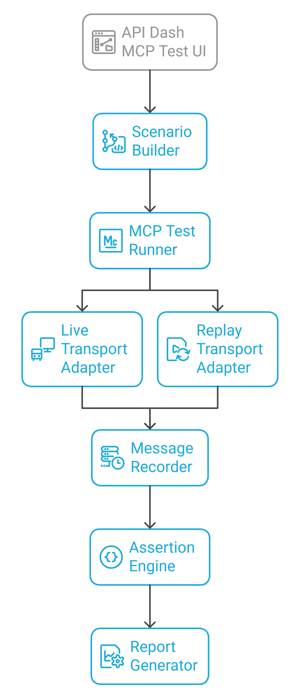

# GSoC 2026 Application: MCP Testing Workspace for API Dash

### About

1. **Full Name:** Yassine Kolsi
2. **Contact Info:** yassine.kolsi@insat.ucar.tn
3. **Discord Handle:** Yessin1928
4. **Home Page:** N/A
5. **Blog:** N/A
6. **GitHub:** https://github.com/yassinekolsi
7. **LinkedIn:** https://www.linkedin.com/in/yassine-kolsi
8. **Time Zone:** UTC+1 (CET)
9. **Resume:** https://drive.google.com/file/d/1318I6FVa90UjdjQRqb6qxJGXMoHRlk5u/view?usp=sharing

---

### University Info

1. **University:** National Institute of Applied Science and Technology (INSAT)
2. **Degree & Major:** Software Engineering
3. **Year:** 3rd Year
4. **Expected Graduation:** June 2027

---

### Motivation & Past Experience

**1. Have you worked on or contributed to a FOSS project before?**

Yes — I have 7 merged/active PRs against foss42/apidash:

| PR | Summary |
|---|---|
| [#1436](https://github.com/foss42/apidash/pull/1436) | Implemented missing `ADListTile` variants and added widget regression tests |
| [#1439](https://github.com/foss42/apidash/pull/1439) | Removed a runtime crash path in `JsonHighlight.createSpecialText` |
| [#1442](https://github.com/foss42/apidash/pull/1442) | Fixed duplicate-row filtering in `getEnabledRows` |
| [#1443](https://github.com/foss42/apidash/pull/1443) | Corrected `stripUrlParams` for query-only input |
| [#1444](https://github.com/foss42/apidash/pull/1444) | Enforced `ModelProvider` required overrides at compile time |
| [#1445](https://github.com/foss42/apidash/pull/1445) | Hardened `ConfigSliderValue.deserialize` with strict validation |
| [#1446](https://github.com/foss42/apidash/pull/1446) | Prevented out-of-range cursor crashes in autocomplete |

**2. What is your one project/achievement that you are most proud of?**

My API Dash contribution streak. In under two weeks, I identified and fixed 7 distinct reliability issues — crash paths, contract violations, and edge-case failures. Each PR included regression tests to prevent recurrence. This demonstrated exactly the skills MCP testing needs: failure analysis, deterministic behavior, and test coverage.

**3. What kind of problems or challenges motivate you the most?**

Developer tooling gaps where real-world complexity outpaces available tools. MCP is becoming the standard way AI agents discover and invoke tools, yet testing an MCP server today means hand-crafting JSON-RPC payloads and guessing which layer broke. I want to build the Postman moment for MCP, inside API Dash.

**4. Will you be working on GSoC full-time?**

Yes. I have no internship or coursework conflicts during the GSoC period and will dedicate 30–35 hours per week to this project.

**5. Do you mind regularly syncing up with the project mentors?**

Not at all. Regular sync is something I actively want. I've been following the `#gsoc-foss-apidash` Discord channel and attending community discussions. Clear feedback loops lead to better outcomes.

**6. What interests you the most about API Dash?**

Two things. First, API Dash treats the developer as the user — it's fast, local-first, and doesn't require an account to get value. Second, the timing: API Dash is at the inflection point where AI tooling (MCP, agents, model selectors) is being added on top of a solid REST/GraphQL foundation. Contributing now means shaping architecture that will matter for years.

**7. Can you mention some areas where the project can be improved?**

- **MCP testing tooling** — the biggest gap right now. No dedicated way to test MCP servers, debug transport/protocol failures, or validate MCP Apps handshakes.
- **Deterministic replay** — snapshot and replay for AI/MCP API calls would enable reliable regression testing.
- **Edge-case coverage** — timeouts, malformed responses, and partial streams are under-tested across the codebase.

**8. Have you interacted with and helped API Dash community?**

Yes — through my PR contributions ([#1436](https://github.com/foss42/apidash/pull/1436), [#1439](https://github.com/foss42/apidash/pull/1439), [#1442](https://github.com/foss42/apidash/pull/1442), [#1443](https://github.com/foss42/apidash/pull/1443), [#1444](https://github.com/foss42/apidash/pull/1444), [#1445](https://github.com/foss42/apidash/pull/1445), [#1446](https://github.com/foss42/apidash/pull/1446)) and active participation in the Discord server.

---

### Project Proposal Information

**1. Proposal Title**

MCP Testing Workspace — Full-Stack MCP Testing Workflow for API Dash

**2. Abstract**

Model Context Protocol (MCP) is emerging as the standard integration layer between AI clients and external tools. Yet MCP testing remains fragmented: teams validate behavior manually, rely on ad-hoc scripts, and lack deterministic replay for regressions. This project builds an MCP Testing Workspace inside API Dash — a structured testing workflow covering transport, protocol, and tool execution layers with schema-driven test cases, assertion matchers, and deterministic replay.

**Track:** MCP Testing  
**Difficulty:** Medium (175 hours)

---

## Detailed Description

### Problem Statement

Model Context Protocol (MCP) is emerging as the standard integration layer between AI clients and external tools. Yet MCP testing remains fragmented: many teams validate behavior manually, rely on ad-hoc scripts, and lack deterministic replay for regressions.

This causes four recurring issues:

- Protocol regressions are discovered late because compliance checks are inconsistent.
- Failures are difficult to reproduce due to nondeterministic network and server behavior.
- Edge cases such as timeouts, malformed responses, and partial streams are under-tested.
- Contributor onboarding is slower because test setup is expensive.

The goal is to make API Dash a practical MCP testing workspace where server, client, and app interactions can be authored, executed, replayed, and diagnosed with clear artifacts.

---

## Proposed Architecture

### End-to-End Flow



### Concrete Technical Decisions

**Transport (`stdio` vs `SSE`):**

- Build `stdio` first for deterministic local integration.
- Add `SSE` through the same transport interface; no runner changes required.
- Normalize all messages into one internal event format before assertions.

**Mocking the transport layer:**

- Implement `FakeTransport` with the exact adapter contract used by live transports.
- Unit tests run on `FakeTransport`; integration tests run on real MCP servers.
- Replay mode reuses captured cassettes for deterministic regression runs.

**Assertion engine:**

- Use TypeScript and `Vitest` assertion style in runner tests.
- Add MCP-specific matchers: `pathExists`, `pathEquals`, `contains`, protocol-field checks.
- Emit rich failure records: step id, matcher output, payload excerpt, timeout and retry metadata.

---

## MCP Test Case Schema

Example test-case document consumed by the runner:

```json
{
  "id": "weather-tool-smoke",
  "name": "tools/list and tools/call returns weather response",
  "transport": {
    "type": "stdio",
    "command": "node",
    "args": ["dist/server.js"]
  },
  "timeouts": { "stepMs": 2000, "suiteMs": 15000 },
  "retries": { "network": 1 },
  "steps": [
    {
      "send": {
        "jsonrpc": "2.0",
        "id": "1",
        "method": "tools/list",
        "params": {}
      }
    },
    {
      "expect": {
        "path": "$.result.tools[*].name",
        "contains": "get_weather"
      }
    },
    {
      "send": {
        "jsonrpc": "2.0",
        "id": "2",
        "method": "tools/call",
        "params": {
          "name": "get_weather",
          "arguments": { "city": "Tunis" }
        }
      }
    },
    {
      "expect": {
        "path": "$.result.content[0].text",
        "matches": "(?i).*tunis.*"
      }
    }
  ],
  "replay": {
    "record": true,
    "cassette": "weather-tool-smoke-v1.json"
  },
  "tags": ["smoke", "regression"]
}
```

---

## Implementation Plan

**Foundation and schema:**

- Define and version the MCP test-case schema.
- Add parser and validation with actionable error messages.
- Add initial server, client, and app example suites.

**Runner core and replay:**

- Implement step execution pipeline with timeout, retry, and cancel support.
- Implement message recorder and deterministic replay mode.
- Build protocol-aware assertion matchers and diagnostics.

**Transport and integration:**

- Implement `stdio` adapter and integration harness.
- Implement `SSE` adapter and parity checks.
- Implement `FakeTransport` for isolated tests.

**API Dash UX and handoff:**

- Integrate author, run, and report flows in API Dash.
- Add suite persistence and one-click rerun for regressions.
- Ship docs, examples, and contributor onboarding notes.

---

## Risks and Mitigations

| Risk | Impact | Mitigation |
|---|---|---|
| Stateful MCP servers produce order-dependent outcomes | High | Isolate each suite in a fresh process or session and add explicit setup and teardown hooks with optional reset steps. |
| Nondeterministic model outputs break strict snapshots | High | Prefer structural and path-based assertions with regex and contains checks; add normalization layer before comparison. |
| Network jitter and timeouts cause flaky tests | Medium | Add step-level timeout budgets, bounded retries, and clear failure categories: transport, protocol, or assertion. |
| Behavior drift between `stdio` and `SSE` adapters | Medium | Enforce a shared adapter contract and run identical conformance suites across both transports. |
| Schema changes create migration churn | Medium | Version schema from v1, validate at load time, and publish migration notes for breaking changes. |
| Scope pressure in a 175-hour project | Medium | Prioritize the minimum complete flow first: schema, runner, `stdio`, and reports; treat extras as stretch goals. |

---

## Weekly Timeline (175 Hours)

| Period | Phase | Key Tasks |
|---|---|---|
| Pre-GSoC | Community Bonding | Finalize scope, success criteria, and review cadence with mentors; lock initial architecture and collect reference MCP scenarios. |
| Week 1 | Schema foundation | Finalize schema fields (transport, steps, assertions, replay metadata); implement schema validator and error formatter. |
| Week 2 | Parser | Implement scenario parser and execution plan builder; add parser tests for malformed and boundary cases. |
| Week 3 | Runner core | Implement runner step executor and event lifecycle; add timeout, cancellation, and controlled retry primitives. |
| Week 4 | Assertion layer | Implement JSON-path checks, contains, regex, and equality matchers; add rich diagnostics and step-level failure traces. |
| Week 5 | `stdio` adapter | Implement `stdio` adapter and wire first real server integration tests; stabilize transport lifecycle and shutdown handling. |
| Week 6 | Recorder and replay | Implement recorder and cassette replay format; add deterministic replay tests and mismatch reporting. |
| Week 7 | `SSE` adapter | Implement `SSE` adapter with the same runner contract; execute adapter conformance tests for `stdio` and `SSE` parity. |
| Week 8 | `FakeTransport` and edge cases | Implement `FakeTransport` and fixture toolkit; add edge-case suites covering malformed responses, disconnects, and delayed replies. |
| Week 9 | API Dash UI | Integrate test creation and execution in API Dash; add report UI with grouped failures and trace drill-down. |
| Week 10 | Suite management | Add suite persistence, tagging, and one-click rerun; improve UX for flaky-test hints and error readability. |
| Week 11 | Docs and hardening | Write contributor docs, architecture notes, and example suites; harden based on mentor and community feedback. |
| Week 12 | Finalization | Final stabilization and release-quality cleanup; deliver final report, demo walkthrough, and post-GSoC roadmap. |

---

## Closing

This proposal balances architectural clarity with implementation accountability, delivering a practical, maintainable MCP testing engine for immediate use and confident extension.
