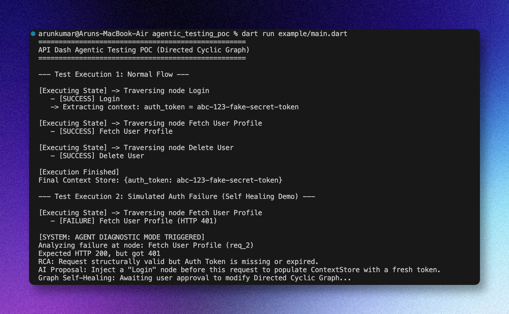
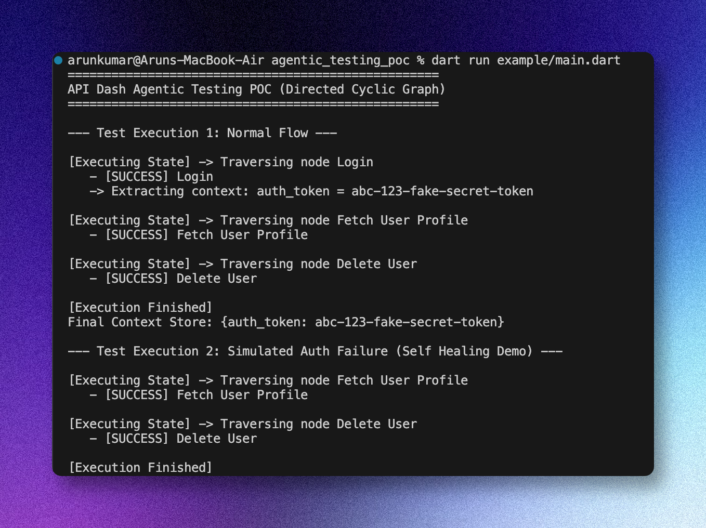

### Initial Idea Submission

Full Name: Arun Kumar (carbonFibreCode)
University name: Netaji Subhash University of Technology (NSUT) Delhi
Program you are enrolled in (Degree & Major/Minor): B.Tech & Electrical Engineering
Year: 3rd (Junior year)
Expected graduation date: May 2027

Project Title: Agentic API Testing: Directed Cyclic Workflow Graph with Active Intelligence
Relevant issues: https://github.com/foss42/apidash/discussions/1230

Idea description:

Testing APIs can be a massive headache. You have to juggle complex states, handle responses that change depending on previous requests, and figure out tricky edge cases. This proposal aims to equip API Dash with an intelligent, autonomous testing agent.

#### Addressing GSoC Objectives: An End-to-End Autonomous Layer

This idea directly tackles the tasks outlined by the mentors:

- **Understand API Specs and Workflows**: The system will automatically read OpenAPI or GraphQL schemas. Instead of making the AI guess what the API does, we build a structured map (a Directed Cyclic Graph) so the agent actually _understands_ the endpoints and how they connect.

- **Generate and Execute End-to-End Tests**: Instead of writing brittle test scripts that break constantly, we're going to use a Dart-native finite state machine to navigate the requests. This handles complex flows—like pagination loops or authenticated retries—smoothly and natively.

- **Validate Outcomes**: We'll hook this right into API Dash's core networking. It will automatically translate API specs into API Dash Assertions and run fast Javascript validations behind the scenes to verify everything works as expected.

- **Self-Healing (Continuously Improve Resilience)**: This is the coolest part. If a test fails, the agent drops into _Diagnostic Mode_. It looks at the failure, figures out the Root Cause (RCA), and suggests a fix. Did the API suddenly start requiring a new header? The agent notices, proposes a quick change, and fixes the test without you needing to dig into it.

#### Core Concept: State-Based Directed Cyclic Graph (DCG)

Asking an LLM to generate and run raw testing scripts is risky, as it tends to hallucinate or write code that breaks easily. Instead, we use the API specs to generate a **State-Based Directed Cyclic Graph**.

- **Nodes**: Think of these as the actual requests (like a GET or POST).
- **Edges**: The rules or conditions to move from one request to the next (like "proceed only if the status is 200").

We're proposing a DCG instead of a standard DAG because real-world APIs loop. You often have to poll servers or retry requests. By running this graph entirely natively in Dart using packages like [`directed_graph`](https://pub.dev/packages/directed_graph) and [`statemachine`](https://pub.dev/packages/statemachine), test execution becomes blazing fast and highly predictable.

**Why a State Machine?**
Because the state machine runs independently from Flutter UI management, tests can execute completely **headless**. That means we can run these complex automated tests purely in the terminal, integrating perfectly with CI/CD pipelines and the overarching API Dash CLI goals (Idea #6).

#### Active Intelligence & Self-Healing (Diagnostic Mode)

We want to use LLMs _strategically_. If a request fails, we don't just dump a red "FAILED" log and quit. Instead, the agent enters **Diagnostic Mode**:

- It performs a Root Cause Analysis (RCA).
- It checks the real-world context against the API document to see what changed.
- It then proposes a fix and, with a quick approval, heals the graph automatically.

#### Elevating the Developer Experience (DevX)

To make developers actually _want_ to use this, we are packing it with DevX focused features:

1. **Context Store**: A central hub that automatically holds onto things like dynamic IDs or Auth Tokens, so you never have to manually copy-paste them between requests again.
2. **Normalized Response Models**: A standard way to process API responses so the AI always gets reliable, predictable inputs to work with.
3. **Conversational Test Generation**: Just type, "Test the e-commerce checkout flow with fake credit cards," and the assistant builds out the graph of requests for you.
4. **Time-Travel Debugging**: A visual map where you can pause an execution, inspect the Context Store, manually tweak variables, and then step forward into the next API calls.
5. **Multi-Step Context Verification**: Automatically ripping out Auth tokens from a login response and injecting them into the bearer headers of everything that follows.

#### Using Existing API Dash Infra

We aren't reinventing the wheel. We're building squarely on top of API Dash:

- **Assertion Framework**: Automatically tying API specs to existing Assertion components.
- **Post-Response Scripting**: Utilizing the sandboxed JS environment for deep, native validation.
- **API Dash Core Networking**: Reusing the existing HTTP request/response dispatchers.
- **AI Orchestration (`genai` & `APIDashAgentCaller`)**: Seamlessly integrating with existing Model Context Protocols and Dashbot infra.
- **Specs & Protocols**: Native support for OpenAPI 3.0/3.1 and GraphQL schema introspection.
- **Graph & Execution Frameworks**: Fast, offline-capable Dart state-machines using (`directed_graph`, `statemachine`) so tests fly when LLMs aren't strictly needed.

Ultimately, this gives us fast, predictable execution powered purely by code, while saving the "Active Intelligence" for building the workflows and swooping in to fix things when they break.

#### Concrete Proof of Concept (POC)

To ensure the feasibility of the headless state machine execution, a native Dart POC was developed demonstrating the execution engine cleanly orchestrating a Direct Cyclic Graph of requests. The POC effectively simulates `Normal Execution` transitioning variables seamlessly across a Context Store, and `Diagnostic Mode` effectively triggering upon an unexpected simulated network failure.

