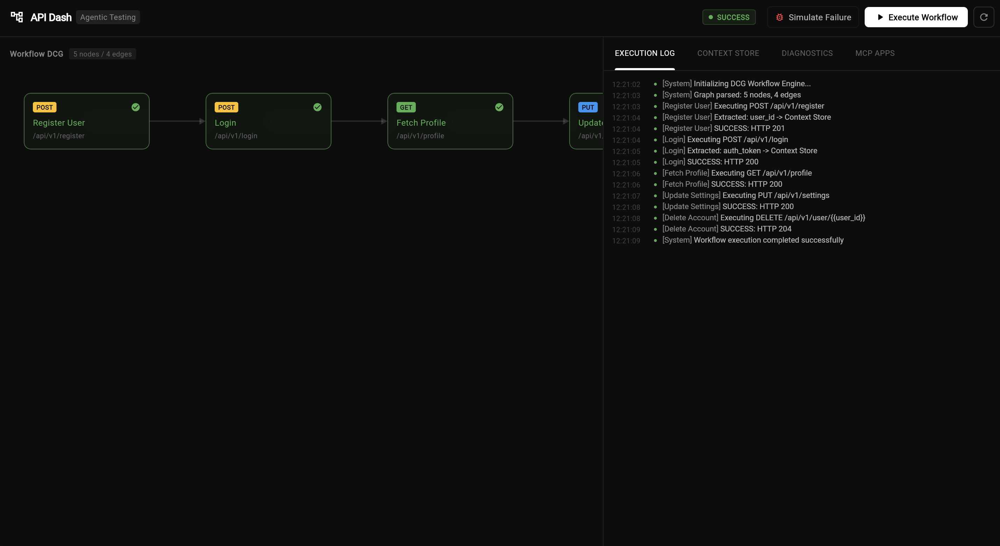

### Initial Idea Submission

Full Name: Arun Kumar (carbonFibreCode)
University name: Netaji Subhash University of Technology (NSUT) Delhi
Program you are enrolled in (Degree & Major/Minor): B.Tech & Electrical Engineering
Year: 3rd (Junior year)
Expected graduation date: May 2027

Project Title: Agentic API Testing: DCG Workflow Engine + MCP Apps Integration
Relevant issues: https://github.com/foss42/apidash/discussions/1230

Idea description:

#### The Problem

API testing today is deeply manual and fragile. Developers write static test scripts, copy-paste auth tokens between requests, and manually chain together multi-step workflows. When an API changes, even slightly, every dependent test breaks silently. The feedback loop is slow, context gets lost, and debugging multi-step flows is painful.

On the AI side, current tools generate raw `curl` commands or static code snippets. Developers have to copy these into a separate client, run the request, and paste the response back into the AI chat. This constant context-switching destroys the developer experience.

This proposal tackles both problems with a single architecture: a Dart-native Directed Cyclic Graph (DCG) workflow engine for intelligent, autonomous API testing, combined with MCP Apps that embed API Dash's visual testing capabilities directly inside AI agents.

#### Core Architecture: State-Based Directed Cyclic Graph (DCG)

Instead of asking an LLM to generate and execute raw test scripts (which leads to hallucination and brittle code), we build a structured, executable graph from API specifications.

**Nodes** represent individual API requests (GET, POST, PUT, DELETE across HTTP, GraphQL, or any protocol API Dash supports).

**Edges** carry temporal logic conditions and data dependencies, defining the rules to move from one request to the next (for example, "proceed only if status is 200" or "extract the token first").

We use a DCG specifically, not a standard DAG, because real-world APIs loop. Polling endpoints, retry logic, paginated fetches, and authentication refresh flows all require cycles. A DAG simply cannot model these naturally.

The graph runs entirely natively in Dart using the [`directed_graph`](https://pub.dev/packages/directed_graph) and [`statemachine`](https://pub.dev/packages/statemachine) packages. This keeps test execution blazing fast, fully predictable, and completely independent of any LLM during normal runs.

**Why a State Machine?**
The state machine drives execution independently from Flutter UI management. This means tests can run completely headless, making them perfect for CI/CD pipelines, terminal execution, and the broader API Dash CLI goals (Idea #6). The states are simple and powerful:

```
Initializing -> Executing -> Success
                    |
                    v
             DiagnosticMode -> Failure (or Self-Healed -> Re-Execute)
```

#### GSoC Objectives I will focus on

This architecture directly maps to what the mentors have outlined:

1. **Understand API Specs and Workflows**: The system parses OpenAPI 3.0/3.1 schemas and GraphQL introspection results to automatically construct the workflow graph. Instead of making the AI guess what an API does, we build a structured map so the agent actually understands the endpoints, their relationships, and how they connect.

2. **Generate and Execute End-to-End Tests**: The DCG engine navigates the graph through its state machine, handling complex multi-step flows like Login -> Extract Token -> Fetch Profile -> Update Settings -> Delete Account. The Context Store automatically extracts variables (auth tokens, user IDs, pagination cursors) and injects them into subsequent requests using `{{variable}}` template syntax.

3. **Validate Outcomes**: We hook directly into API Dash's existing assertion framework and post-response JavaScript sandbox. The system automatically translates API spec constraints into API Dash Assertions and runs fast validations. The focus, as the maintainer emphasized, is on correctly creating the workflow rather than just structural schema matching.

4. **Self-Healing / Continuously Improve Resilience**: This is where Active Intelligence comes in. When a test fails, the engine does not simply log "FAILED" and quit. Instead, it transitions to Diagnostic Mode.

#### Active Intelligence and Self-Healing (Diagnostic Mode)

We use LLMs strategically and sparingly. During normal execution, zero AI calls are made. The state machine handles everything natively. But when something breaks, the agent enters Diagnostic Mode:

- It performs Root Cause Analysis (RCA) by comparing the actual response against the API specification.
- It checks what changed: Did the API add a required header? Did a field name change? Is the auth token expired?
- It proposes a targeted fix to the graph (add a node, update parameters, modify an edge condition).
- With a single user approval (Human-in-the-Loop checkpoint), it self-heals the graph and re-executes.

This approach is fundamentally different from throwing the entire problem at an LLM. We invoke AI only for graph generation (from specs) and self-healing (on failure). Everything else runs as pure, optimized Dart code. This keeps costs low, latency near-zero, and execution deterministic.

#### MCP Apps Integration: API Dash Inside AI Agents

By leveraging the MCP Apps specification (as detailed in the [practical guide by Ashita Prasad mam](https://dev.to/ashita/a-practical-guide-to-building-mcp-apps-1bfm)), we can transform API Dash from a standalone client into a universal API testing plugin that lives natively inside any AI agent.

**API Dash as an MCP Server** exposes structured tools that external AI agents can call:

- `run_api_request(config)` - Execute a request through API Dash's networking layer
- `execute_workflow(graph_id)` - Run a full DCG workflow and return results
- `get_workflow_graph(spec_url)` - Generate a DCG from an API specification
- `list_workspaces()` / `search_collections()` - Query the developer's existing API collections
- `get_request_history(filters)` - Access past request/response pairs for context

**API Dash as MCP Apps** (Interactive UI surfaces in agent chat):

1. **In-Chat Workflow Graph Viewer** (`ui/workflow-graph`): When an agent generates a test workflow, instead of outputting a wall of JSON, it renders an interactive DCG visualization right in the chat. Developers can see the nodes, edges, and execution path visually.

2. **In-Chat Request Builder** (`ui/request-builder`): A functional mini-API Dash panel rendered in a sandboxed iframe. Developers can tweak headers, edit parameters, and hit "Send" without leaving their IDE.

3. **One-Click Context Bridging** (`ui/update-model-context`): After executing a request via the in-chat App, a single click pushes the live response (or just the relevant parts) back into the agent's context window. No manual copy-pasting.

4. **Visual Execution Timeline** (`tools/call` orchestration): For multi-step workflow executions, the MCP App renders a visual timeline. Developers can click into any step to inspect the exact payload sent and received. Total transparency into how the agent traversed the API graph.

5. **Host-Aware Native Styling** (`ui/initialize`): Using the MCP Apps handshake, the API Dash app dynamically inherits the host agent's theme (colors, typography, light/dark mode) so it blends perfectly into whatever environment the developer uses.

This positions API Dash as an agent-native testing platform. A developer working in Cursor or Claude Desktop can say "Test my checkout API flow" and get a live, interactive DCG visualization rendered right in their chat, with the ability to execute, inspect, and push results back into the conversation.

#### Developer Experience Features

To make this genuinely useful day-to-day, we are building these concrete DevX features:

1. **Context Store**: A central hub that automatically holds dynamic variables (auth tokens, user IDs, session cookies). No manual copy-paste between requests. The store is inspectable and editable at any point during execution.

2. **Normalized Response Models**: A standardized way to process responses across protocols (REST, GraphQL, gRPC). This gives the AI structured, predictable inputs with full context of nodes, endpoints, and metadata, preventing hallucination from raw response dumps.

3. **Conversational Test Generation**: Type "Test the e-commerce checkout flow with expired credit cards" and the assistant builds the DCG for you. The graph is always editable before execution.

4. **Time-Travel Debugging**: A visual map where you can pause execution at any node, inspect the Context Store, manually tweak variables, and then step forward. This makes debugging multi-step flows intuitive rather than painful.

5. **Human-in-the-Loop Checkpoints**: Strategic approval points at three stages: after test generation (review the graph), after execution (review failures), and before self-healing (approve graph modifications). This builds trust without slowing down the workflow.

#### Building on Existing API Dash Infrastructure

We are not reinventing the wheel. Every component is built on top of what API Dash already provides:

- **Assertion Framework**: Automatically tying API spec constraints to API Dash's existing assertion components.
- **Post-Response Scripting**: Using the sandboxed JavaScript environment for deep, native validation.
- **API Dash Core Networking** (`apidash_core`): Reusing the existing HTTP request/response dispatchers and models.
- **AI Orchestration** (`genai` and `APIDashAgentCaller`): Integrating with API Dash's existing model-agnostic AI infrastructure and Dashbot.
- **Specs and Protocols**: Native support for OpenAPI 3.0/3.1 and GraphQL schema introspection.
- **Graph and State Machine Execution**: Fast, offline-capable Dart state machines using `directed_graph` and `statemachine` so tests fly when LLMs are not needed.
- **Design System** (`apidash_design_system`): Using existing design tokens and components for consistent UI.

This gives us fast, predictable execution powered purely by code, while reserving the Active Intelligence for building workflows and swooping in to fix things when they break.

#### Concrete Proof of Concept (POC)

To validate this architecture, a native Dart POC was developed demonstrating the execution engine orchestrating a Directed Cyclic Graph of requests. The POC runs inside the API Dash app itself, reusing its core infrastructure, and includes:

1. An interactive DCG workflow graph visualization where nodes represent API requests and edges show the execution flow with conditions.
2. A live state machine execution engine that highlights the currently executing node and animates transitions.
3. A Context Store panel showing variables being extracted and injected across requests in real-time.
4. Diagnostic Mode triggering on simulated failures, with RCA analysis and self-healing proposals.
5. An MCP Apps concept panel demonstrating how the workflow graph would appear embedded inside an AI agent's chat interface.




