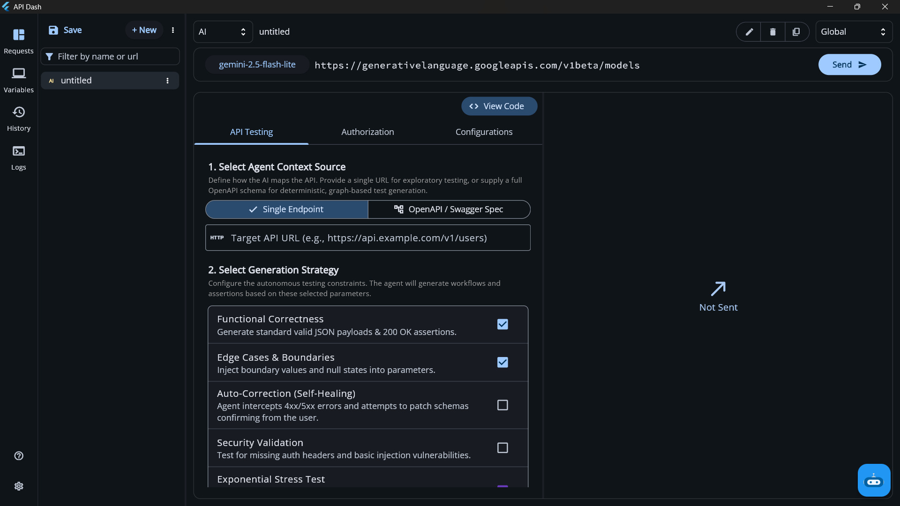
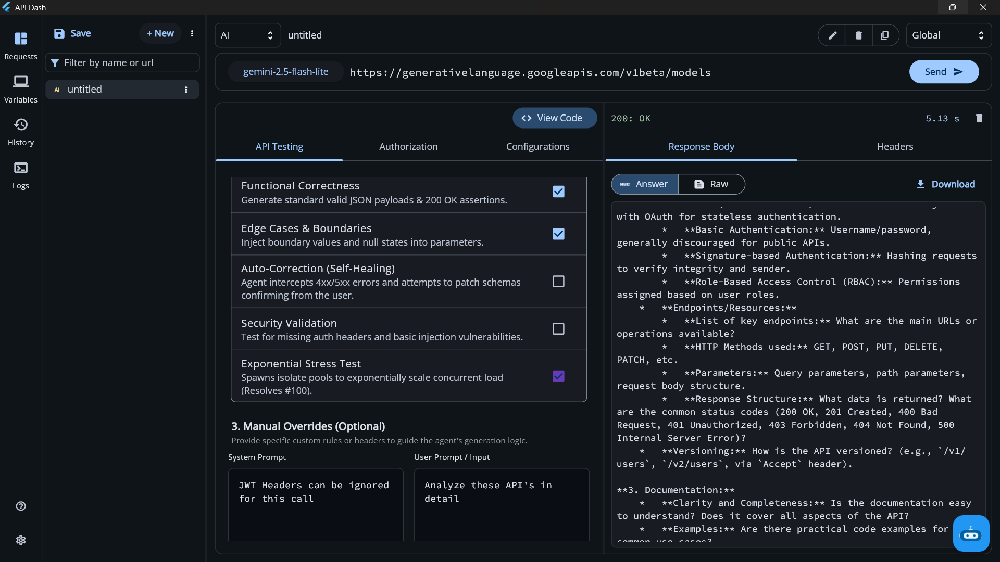
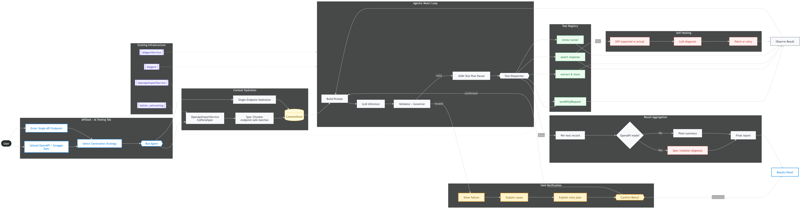

### Initial Idea Submission

* Full Name: Anshul Prakash
* University name: Manipal Institute of Technology, Bengaluru 
* Program you are enrolled in (Degree & Major/Minor): B.Tech. in Computer Science and Engineering
* Year: 2nd
* Expected graduation date: July 2028

* Project Title: Agentic API Testing
* Relevant issues: [[Issue#100](https://github.com/foss42/apidash/issues/100)]

## Idea description: Agentic API Testing Workflow for API Dash

Hey everyone, I've been working on a design for integrating an Agentic API Testing workflow directly into API Dash.

The core philosophy behind this architecture is strict separation of concerns: the AI handles reasoning and test planning, while all actual network execution and assertion validation is handled deterministically by Dart. This prevents the agent from hallucinating network calls and ensures the testing remains reliable and observable.

Here is a breakdown of how the workflow is structured:

### 1. Setting the Agent's Context
In the new AI Testing tab, users can define the scope of the test generation using two methods:

- Single API Endpoint: The user inputs the method, URL, headers, and an optional body. This is built for rapid, exploratory testing and quick validations.

- OpenAPI / Swagger Spec: Users can upload a local JSON or YAML schema (which will require adding the file_picker dependency). This enables deterministic, schema-driven test generation across a broader API surface.

### 2. Generation Strategies
Users configure how the agent should approach the testing. These strategies are injected into the agent’s system prompt and include:

- Functional Correctness (Validating standard 200 OKs and JSON payloads)

- Edge Cases & Boundaries (Injecting nulls, boundary values, etc.)

- Security Validation (Missing auth headers, basic injection)

- Exponential Stress Testing (Tying into Issue [[Issue#100](https://github.com/foss42/apidash/issues/100)])

### 3. Context Hydration & Batching
To prevent blowing up the LLM's context window—especially with massive OpenAPI specs—the schema is bifurcated into smaller, logical batches. The agent processes each chunk independently, generating sample payloads, parameter combinations, and test cases directly derived from the schema.

At this stage, the AI outputs a strictly typed JSON plan containing the endpoints to call, expected status codes, and assertion intent. No network requests are made by the AI.

### 4. Deterministic Execution via Dart
This is where the agent hands off to our existing Dart infrastructure.

The generated JSON plan is parsed and executed using API Dash's existing network layer (e.g., the better_networking implementation). Dart fires the HTTP requests, captures the real-world latency, headers, and response bodies, and packages the results into a new JSON object representing the ground truth.

### 5. The Agentic Feedback Loop
The execution results feed back to the agent. On failure, the agent diagnoses whether the API itself changed or whether the test expectation was wrong - these are different situations and I treat them differently. Before any correction is applied, the system shows the user exactly what failed, what the agent thinks caused it, and what fix it's proposing. The user confirms. Only then does anything change. A hard circuit breaker caps the maximum iterations to prevent runaway token spend.

### 6. Local Stress Testing (Issue #100)
If the user enables stress testing, we completely bypass the AI for the actual load generation. We spin up Dart isolates to execute concurrent requests, progressively scaling the load to measure p95/p99 latency and error rates locally. The AI only steps back in at the end to interpret the final performance metrics and summarize the bottlenecks.

### Final Output
Once the loop resolves, API Dash renders a human-readable UI report showing functional summaries, pass/fail breakdowns, and performance metrics, while keeping the raw data exportable.

***I'm uploading UI mockups to better demonstrate my thinking*** 

***Also the Workflow Design***

