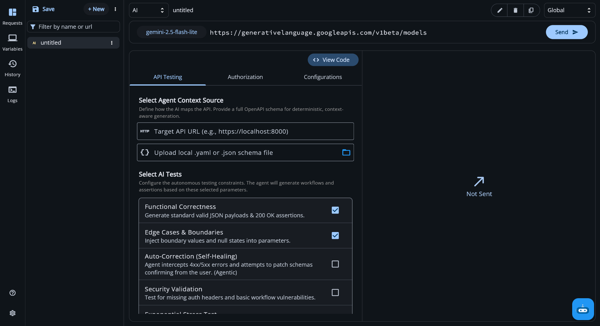
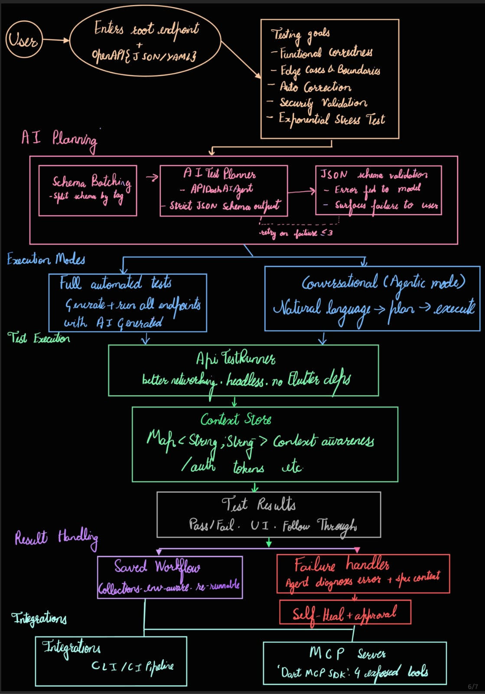

# Initial Idea Submission [Updated]

- Name: Anshul Prakash
- University: Manipal Institute of Technology, Bengaluru
- Program: B.Tech. in Computer Science and Engineering
- Year: 2nd Year
- Expected Graduation: July 2028

- Portfolio: [anshulprakash.tech](https://anshulprakash.tech)


### Project Title: Agentic API Testing Engine for API Dash

#### Relevant Issues: 
- Issue [#100](https://github.com/foss42/apidash/issues/100), 
- Discussions [#1230](https://github.com/foss42/apidash/discussions/1230)


### Working Prototype
I built a working version of the execution engine described below and integrated it directly into the API Dash codebase.

Repository: [APIDash_AgenticAPITesting](https://github.com/TheAnshulPrakash/APIDash_AgenticAPITesting)

There are 2 video demos attached in the PR description. They show the engine running against a local FastAPI server demonstrating functional tests passing, the agent self-correcting a 422 failure on retry, and the conversational(agentic) mode working end to end.

The agentic conversational mode currently uses a local Ollama instance for the prototype due to API credit limits, but is designed to swap in APIDashAIAgent/genai in the actual implementation.

 


### Idea Description
I’ve been using APIDash for a while, and one thing that still feels missing is an AI-powered, agentic testing layer. At the moment, the AI features mainly help with things like analyzing faults or explaining responses, but APIDash does not yet have an AI-driven automated test generator that can understand an OpenAPI specification, retrieve sample or custom data, and systematically test all the endpoints defined in it.

What I want to build is a testing engine that makes this automatic. The idea is not to bolt something new onto API Dash but to build it on top of what's already there - better_networking, the genai package, APIDashAIAgent, Dashbot's request infrastructure. All of that exists. I just want to wire it together into something that can actually test an API end to end with least human involvement.

### One Rule Everything Follows
>*The AI figures out what to test. Dart does the testing.*

This matters because if you let the LLM make HTTP calls directly it starts making things up like endpoints that don't exist, responses it invented, tests that "pass" against fabricated data. The fix is keeping them separate. The AI outputs a JSON test plan. Dart executes it and shows it in APIDash UI beautifully. The AI never touches the network. 

### How It Actually Works


- Giving the agent context -
The user pastes an endpoint base URL and uploads an OpenAPI/Swagger spec as .json or .yaml. The spec path is where this gets genuinely useful because the agent can read the whole API surface instead of working from a single endpoint.

- Before anything generates, the user picks which strategies to run. These go straight into the agent's system prompt as constraints:

- Functional correctness: does the API return what it says it will

- Edge cases: nulls, empty fields, missing required params, boundary values

- Self-healing: if something breaks, the agent proposes a fix and waits for approval before changing anything

- Security: missing auth, basic injection patterns

- Stress testing: Dart isolates, concurrent load, resolves Issue #100

### The schema batching problem
Real OpenAPI specs are long. Some are thousands of lines. Sending all of it into one LLM call in one shot makes the output noticeably worse and sometimes just fails or making the AI hallucinate on generalized data. So I will split the spec into batches by resource or tag, process each independently, and merge the results into one plan. The agent works on smaller chunks and the final plan is actually coherent.

#### What the agent outputs
The agent is told to return only valid JSON matching a strict schema. 
Something like:
```json
{
  "tests": [
    {
      "name": "Create user with valid payload",
      "method": "POST",
      "path": "/users",
      "body": { "email": "{{test_email}}", "name": "Test User" },
      "expected_status": 201,
      "requires_auth": false,
      "extract_to_env": { "id": "created_user_id" }
    }
  ]
}
```
Before execution I validate this against a schema. If it fails I send the specific error back to the model and ask it to fix that field. Three retries max currently. If it still can't produce valid output I surface that to the user and stop, saving the user from just burning tokens.

### Running the tests

The validated plan goes to ApiTestRunner which uses better_networking under the hood. It runs each test in order, captures real response times and status codes, and logs results live. There's a ContextStore — just a Map<String, String> — that holds things like auth tokens pulled from earlier responses and injects them into later requests. So a login -> fetch profile -> delete account flow works without the user manually copying anything between steps.

#### When something fails
The agent gets the failure details, the original test case, and the spec section that test came from. It tells you whether the test expectation was wrong or whether the API actually changed, those are different problems and deserve different responses. Whatever it suggests, the user sees it first and approves before the plan updates. Hard limit of three diagnostic iterations per test before the user is asked for inputs.

#### Agent-inferred chains
Currently the user defines what gets tested. But given a proper OpenAPI spec the agent should be able to look at security definitions, path parameter relationships, and resource dependencies and say "these three endpoints form a meaningful workflow." `POST /auth/login` obviously has to come before `GET /users/me`. `DELETE /users/{id}` needs a user that was just created. The agent should figure this out from the spec, propose the chains, and let the user confirm or change them. That's what makes it actually agentic rather than just AI-assisted.

- Conversational mode: There's a second way to interact with this. Instead of generating a full suite upfront, the user types something like "try to borrow a book"(shown in demo) and the agent plans one request analyzing the schema, executes it, reads what came back, and decides what to do next. 
It's grounded strictly in the uploaded spec, it can't call something that isn't defined there and informs the user accordingly.
 When it gets a 422 it reads the actual validation error, fixes its parameters based on the schema, and retries. Three attempts max then it explains clearly what it couldn't figure out.

 How it looks in the demo
 
 
 Automatic Correction of data
 
 
 Passing NULL on explicitly being mentioned as not allowed 
 

- Stress testing
When this mode is on, the AI is completely out of the picture for load generation. Dart isolates handle it, progressively scaling concurrent requests, measuring p95/p99 latency, tracking error rates. All local. The AI comes back at the end to read the aggregated numbers and explain where things started degrading.

- Saving Test Workflows
Right now in the prototype test plans are ephemeral, user generates, runs and done. That's not how anyone actually works. A workflow like "checkout flow with auth" should be saveable inside API Dash's existing collection system, sitting right next to regular requests. Re-runnable any time, exportable with the collection, environment-aware. The test plan as a first-class entity, not a temporary artifact.

- Running Without the UI
The `ApiTestRunner` class I wrote has no Flutter dependencies. It takes a plan and a URL and runs. I did this on purpose because a test suite you can only trigger by opening a desktop app isn't very useful in a real pipeline.
The plan is to expose this through API Dash's CLI so something like:
bash apidash test run --collection "checkout-flow" --env staging


returns structured JSON output with pass/fail exit codes that any CI system can consume.

---

### MCP

The GSoC brief specifically asks about MCP and I think it's the most interesting part of this whole proposal.

Here's how I'm thinking about it. The `ApiTestRunner` already works headlessly. It takes a plan and runs real HTTP requests against a real server and returns real results. Right now the only thing that can call it is the Flutter UI. MCP changes that.

The idea is to run a small MCP server alongside API Dash that exposes the testing engine as callable tools. The four tools I'd expose:
```
run_test_suite - takes a collection name and environment, runs it, returns results

generate_test_plan - takes an OpenAPI spec URL or content, returns a test plan JSON

explain_failure - takes a test result object, returns diagnosis and proposed fix  

get_collection - returns the saved test workflows available in the workspace
```
What this unlocks is that any MCP-compatible client like Claude Desktop, Cursor, a custom agent can now say "run the auth tests" with minimal configurations and API Dash fires real requests against the actual API and returns real pass/fail data.

Concretely, a developer working in Cursor could say "check if the login flow still works after my refactor" and Claude would call `run_test_suite` through MCP, get back the actual test results from API Dash, and explain what failed and why, all without leaving the editor.

For implementation I'd use the `Dart MCP SDK`. The server maps incoming tool calls to the methods that already exist in ApiTestRunner. The execution logic doesn't change at all, MCP is just a new entry point into it. I haven't built this yet because I wanted to make sure the execution layer was solid first. This is what I'm thinking to tackle in the second half of the GSoC timeline after the core engine and persistence layer are stable.

### What I'm Building On
Rather than starting from scratch this builds directly on what GSoC '25 produced:

- better_networking for all HTTP execution
- APIDashAIAgent and genai as the base for the test planning agent
- collectionStateNotifierProvider for state, keeping everything in Riverpod
Dashbot's sendRequest() for failure explanation dialogs


After a run: pass/fail per test, response times, extracted context variables, any proposed fixes. Exportable as JSON for pipelines.

### On the Prototype
I built the prototype before writing this. I wanted to know the architecture actually works before proposing it. The repo and video are linked above. The things I was most uncertain about was token propagation across chained requests and the conversational retry loop, both work against a real server.


### Prior Contributions to *APIDash*

- [#1139 fix: prevent invalid text selection crash in environment field](https://github.com/foss42/apidash/pull/1139)
- [#1079 fix: validate endpoint URL and fix BoundedTextField memory leak](https://github.com/foss42/apidash/pull/1079) :