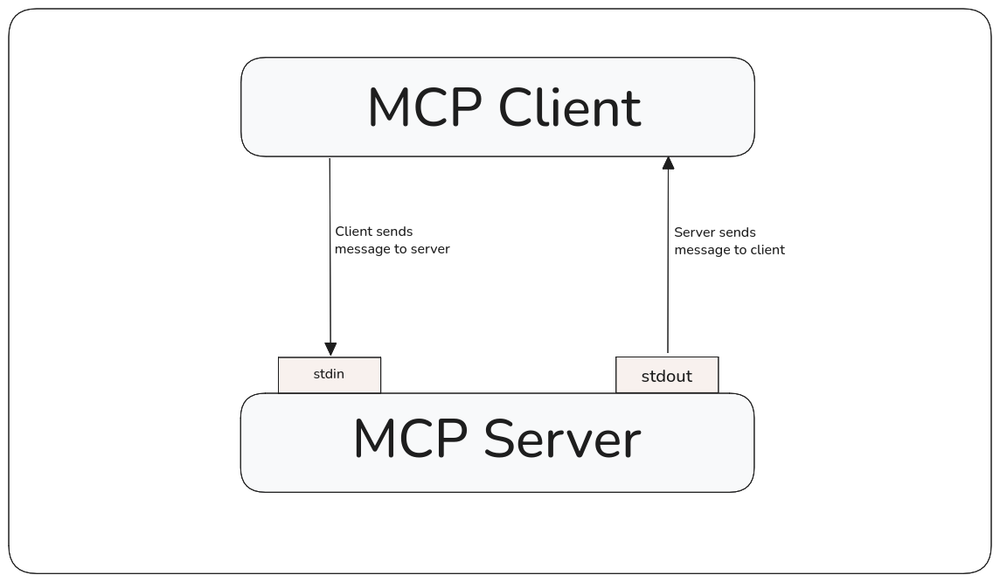
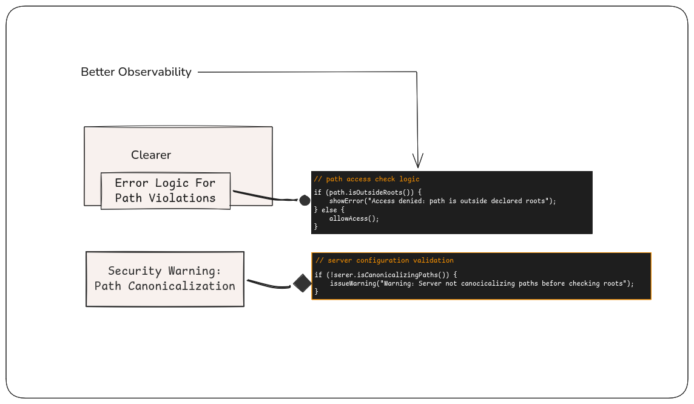
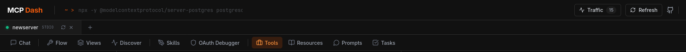

### Initial Idea Submission

  

Full Name: Gaurav Kumar
University name: R.N.S Institute Of Technology, Bangalore
Program you are enrolled in: B.E in Computer Science and Engineering
Year: 2nd
Expected graduation date: 2028

Project Title: MCP Testing
Relevant issues: #1225
  
Idea description:

The Model Context Protocol (MCP) is a standard for connecting AI applications to external systems. It can be your local file on your computer or may be a tool or a prompt you specifically designed for your work.
To connect and communicate with client and server MCP uses transports such as STDIO, or Streamable-HTTP and JSON-RPC respectively.

 
### My aim to strengthen the MCP developer experience by providing:

**1.Better observability-** 
The current validation error maps to *raw message* which makes difficult to understand the error and worsens the user experience.
 e.g. 
`MCP error -32602: Input validation error: Invalid arguments
for tool create_task: [{"origin":"string","code":"too_small",
"minimum ":1,"inclusive":true,"path":["title"],"message":
"Too small: expected string to have >=1 characters"}]`

If you look at the output it's ask for *expected string to have >=1 character* to execute the tool but a better version can be something like this- *"title" cannot be empty*.
so, instead of getting output like “regex mismatch at index 4” or “invalid enum value,” ....etc the tool can provide a more readable version such as *“email format is invalid”* or *“priority must be one of: low, med, high,”* **making issues faster to understand and fix.**

This same principle applies to roots: instead of a generic file error, show a vlaid error message. Also make sure tool can show warning if the server is not canonicalizing paths before checking roots (a common security error that SDK of MCP does not catch automatically.

**2.Improving the User Experience-** One should be able to test multiple server rapidly and effectively. I found currently testing multiple number of server at once is difficult as it create confusion if there are same tool names, it breaks the workflow. Also, adding new server is time consuming by getting to the server section and adding the new server with **arg** and **command** but to handle this better I've designed a command palette where developer can just paste the address of their server and it's fetches automatically it's arguments and type of the server and connect it immediately without loosing the previous connection and work smoothly and also handle the scenarios that affects the workflows. 
Also, since I'm trying to load multiple server simultaneously I make sure developer can able to switch b/w server in less than a seconds and it is expected to work like a browser tabs.

**3.Extended Traffic Controller-** The purpose is to capture the logs with progress token and handle way better than existing history or traffic handler by parsing the MCP communication between client and server. 
It can be able to fetch the history of requests and responses between client and server in better and structured form. It helps developer to find more info while testing the server capabilities and understanding better what exactly went wrong, which field failed and why. 

    client sends _meta.progressToken in the request | server sends progress with progress token
    
e.g: It can be timeout, auth-error, mismatching of schema, also getting the counting of similar failure and how often it happens.
*This feature is designed  to be work like a docker container so when it is being used the container is up and feature should be working but once its done, it should automatically save the information and stop utilizing the resources.*

**5. Scenario Workflow -**  Design a scenario workflow to streamline the execution and validation of testing scenarios. It enables developers to trigger specific test suites using tool name selectors, or any other to  monitor real-time execution results, and systematically diagnose failures.
It can work by integrating validation checks and environment variable verification.

Raw Structure -

    {
    "id": "step2",
    "type": "tool_call",
    "tool": "get_sum",
    "args": {
    "task_id": "{{steps.step1.result.content[0].text | jsonpath: $.id}}"
    },
    "dependsOn": ["step1"]
    }

e.g- **Scenario:** A developer selects the `get-sum` tool and triggers the workflow. The system should able to generates test cases, runs them, and shows results live:

    Test Case 1: {
      "a": 10,
      "b": 2
    }
    Expected: Valid JSON with numbers
    Result: {
      "result": The sum of 10 and 2 is 12
    }
    Status: PASSED
    
    Test Case 2: {
      "a": 5,
      "b": "x"
    }
    Expected: Valid JSON with numbers
    Result: {
      "error": {
        "code": -32602,
        "message": "Invalid type for b: expected number, got string"
      }
    }
    Status: FAILED - Invalid type for b: expected number, got string
    
    Test Case 3: {}
    Expected: Valid JSON with numbers
    Result: {
      "error": {
        "code": -32602,
        "message": "Missing required arguments"
      }
    }
    Status: FAILED -Missing required arguments

    

**4.Automatic test generation & executions-**

-   This features contain an executable script that automatically discovers all available tools from a server reads it's schema, and then proceed to generates valid JSON inputs.
    
-  An example if I would like to show-`get-sum` tool requires two integer arguments,  and with auto mode it will create test cases with appropriate values, invoke the tool, and validate the responses smoothly.

-   Tests can be run sequentially or batched too, and results can be exported for CI/CD to catch schema drift and regressions early.
   
- Also, the system can be integrated with LLMs to suggest additional edge‑cases or to handle more complex scenarios.

-    The tool can warn developers if their server is not canonicalizing paths before checking roots, which is a common security mistake that the MCP SDK does not catch automatically.

**5.Forward‑compatible protocol testing –** Making the tool future ready by supporting testing of upcoming MCP versions & MCP based protocols like Machine Payments Protocol, so developers can validate compatibility and catch breaking changes as soon as possible.

