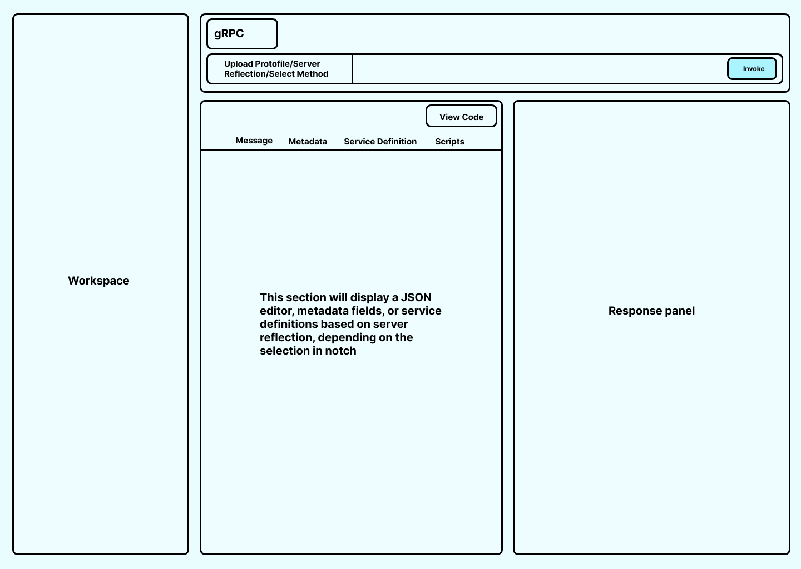
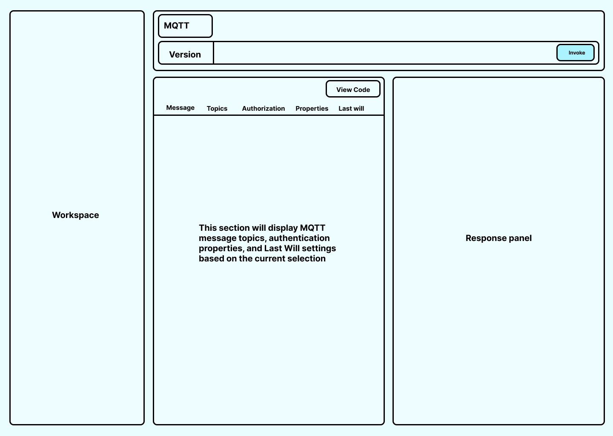
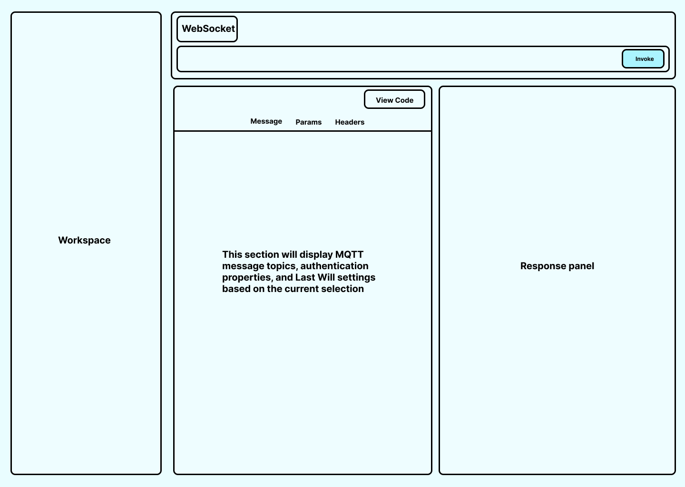

#  Initial Idea Submission

- **Full Name**: Hemanth Krishnakumar
- **University name**: Amrita Vishwa vidhyapeetham, Amritapuri
- **Program you are enrolled in**: Btech in Computer Science
- **Year**: 4th Year
- **Expected graduation date**: May 2026

# Project Title: gRPC, MQTT and WebSocket Support (Idea 7).

Relevant issues: 
- #14 (gRPC)
- #115 (MQTT)
- #15 (WebSocket)

## Overview
This project aims to extend API Dash by introducing robust support for gRPC, WebSockets, and MQTT, further strengthening its multi-protocol capabilities.

Each protocol will be implemented using an architecture that aligns with API Dash’s interactive UI design and real-time visualization capabilities.

## Implementation Plan 

### 1. gRPC Integration

#### Approach
- Use `grpcurl` as a managed Linux subprocess for executing RPC calls.
- Dynamically construct grpcurl commands based on:
    - Selected service and method.
    - User-provided request body.
    - Metadata headers.
```
grpcurl -plaintext \
  -d '{"id":"prod_123"}' \
  localhost:50051 \
  ecommerce.EcommerceService/GetProduct
```
- Capture stdout and stderr streams for display on the response panel in the dashboard.

#### Custom Proto Parser
A custom .proto parser will be implemented to enable dynamic service discovery.

It will:
- Read and analyze .proto files uploaded by the user.
- Extract:
    - Services
    - RPC methods
    - Request and response message types
- Allow users to dynamically select methods from the UI.
- Automatically generate request body templates based on message definitions.

This removes the need for precompiled stubs and makes gRPC interaction fully dynamic inside API Dash.

#### Features
- Unary RPC
- Server streaming
- Client streaming
- Bidirectional streaming
- Metadata headers
- Secure / insecure connections (TLS support)
- Multiple concurrent connections

### 2. Websocket Integration.
WebSocket support will be implemented natively using Dart.

#### Approach
- Use web_socket_channel for connection management
- Maintain a dedicated `WebSocketChannel` instance per connection.
- Use Dart Streams to listen to incoming messages via `channel.stream`
- Send outgoing messages through `channel.sink.add()`
- Support multiple simultaneous WebSocket connections.

#### Features
- Connect / disconnect to WS and WSS endpoints
- Connection state tracking (connecting, connected, closed, error)
- Support for:
    - Text payloads.
    - JSON messages.
    - Binary data.
- Real-time send and receive interface
- Message logging with timestamps

### 3. MQTT Integration.

MQTT support will be implemented using Dart’s mqtt_client package.

#### Approach
- Establish MQTT broker connections using Dart’s mqtt_client package over:
    - TCP
    - Secure TCP
    - WebSocket transport

- Allow configurable client parameters such as:
    - Client ID
    - Keep-alive interval
    - Clean session flag

- Implement dynamic topic subscription management: 
    - Subscribe / unsubscribe at runtime.
    - Support wildcard topics (+, #)

- Route incoming messages through a structured handler that:
    - Extracts topic, payload, QoS, and retain flag.
    - Streams messages to the UI in real time.
    - Logs messages with timestamps for filtering and debugging.

### 4. Mockups

#### gRPC

#### MQTT

#### WebSocket


## Expected Outcome
- API Dash will support gRPC, WebSockets, and MQTT within a unified interface.
- Developers will be able to test RPC, streaming, and publish-subscribe APIs in real time.
- The platform will support multiple concurrent connections with structured logging and dynamic configuration.
