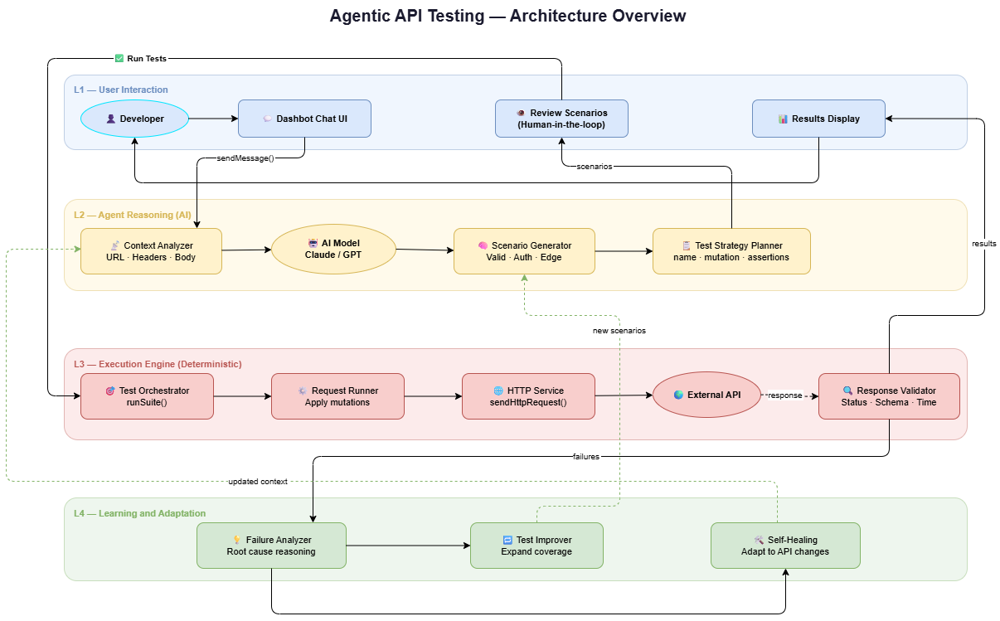

# GSoC Initial Idea Submission

**Full Name:** Aanish Bangre
**University:** Sardar Patel Institute of Technology
**Program:** B.Tech in Computer Science
**Year:** 3rd Year
**Expected Graduation:** August 2027

---

## Project Title

**Agentic API Test Suite Engine with Deterministic Execution Foundation**

**Relevant Issue:** [#1158](https://github.com/foss42/apidash/issues/1158)

---

## Problem Statement

API Dash is a powerful tool for designing and sending API requests, but it currently lacks a structured way to **run tests as cohesive suites**. While Dashbot can generate test ideas, there is no dedicated engine that automatically generates test variations, executes them, and provides structured results.

Developers are left writing tests manually and have no way to validate API robustness directly within API Dash.

---

## Proposed Solution

Introduce an **Agentic API Test Suite Engine** that transforms API Dash into a structured testing platform — without breaking existing architecture.

The core idea: a developer simply asks Dashbot *"Test this API"*, and the system handles everything — from understanding the API to generating scenarios, executing them, and reporting results.

The system is built around a clear principle:

> **AI reasons. Deterministic engine executes.**

---

## High-Level Architecture



```
User Prompt (Dashbot Chat)
        ↓
  Agent Reasoning Layer
  (Context → Scenarios → Strategy)
        ↓
  Human Review
  (Approve before execution)
        ↓
  Deterministic Execution Engine
  (Orchestrate → Mutate → Execute → Validate)
        ↓
  Learning & Adaptation Layer
  (Failure Analysis → Self-Healing → Improved Coverage)
        ↓
  Results displayed in Dashbot
```

---

## Key Components

### Layer 1 — Deterministic Execution Engine
The foundation. A rule-based engine that generates and runs test cases **without AI involvement**, ensuring reliability and reproducibility.

- `RuleEngine` — mutates requests (missing auth, malformed body, empty params, etc.)
- `TestOrchestratorService` — runs test suites sequentially
- `TestEvaluator` — validates responses against expectations
- Reuses existing `sendHttpRequest()` infrastructure

### Layer 2 — AI Reasoning (Dashbot Integration)
The intelligence layer. Dashbot analyzes API context and generates a structured test strategy.

- Reads URL, method, headers, body, and history
- Generates named scenarios with expected outcomes
- Detects multi-step workflows (e.g. Login → Cart → Checkout → Payment)
- Returns scenarios as `ChatActions` for developer review

### Layer 3 — Learning & Adaptation
Makes the system truly agentic over time.

- Explains why tests fail
- Suggests new scenarios to improve coverage
- Detects API schema drift and proposes test updates (self-healing)

---

## Integration with Dashbot

The system integrates naturally into the existing Dashbot architecture — no major rewrites needed.

New additions:
- `ChatMessageType.generateApiTests`
- `generateApiTestScenariosPrompt` in `PromptBuilder`
- `lib/services/testing/` module (new, isolated)

Everything else — `ChatViewmodel`, `sendHttpRequest()`, `Repository` — is **reused as-is**.

---

## Example Interaction

```
Developer:  "Test this API endpoint"

Dashbot:    Generated scenarios:
            • Valid request
            • Missing authentication
            • Malformed JSON body
            • Missing query parameters

            [Run Tests]

Results:    Baseline request         ✅ PASS
            Missing authentication   ✅ PASS
            Malformed JSON body      ❌ FAIL
            Missing query parameters ✅ PASS

            Total: 4 | Passed: 3 | Failed: 1
```

---

## Implementation Phases

**Phase 1 — Deterministic Engine**
`RuleEngine`, `TestOrchestratorService`, `TestEvaluator`, structured models (`TestCase`, `TestResult`), unit tests.

**Phase 2 — Dashbot Integration**
New prompt types, AI scenario generation, results displayed in chat.

**Phase 3 — Agentic Enhancements**
Workflow testing, failure analysis, self-healing suggestions.

---

## Why This Approach

- **Reliable** — execution never depends on AI output
- **Non-disruptive** — reuses existing API Dash infrastructure
- **Extensible** — security, performance, and contract testing can be added later
- **Human-in-the-loop** — developers review before anything runs

---

## Expected Outcome

API Dash evolves from a request exploration tool into a **comprehensive AI-assisted API testing platform** where developers can validate, analyze, and continuously improve their APIs — all from a single chat message.