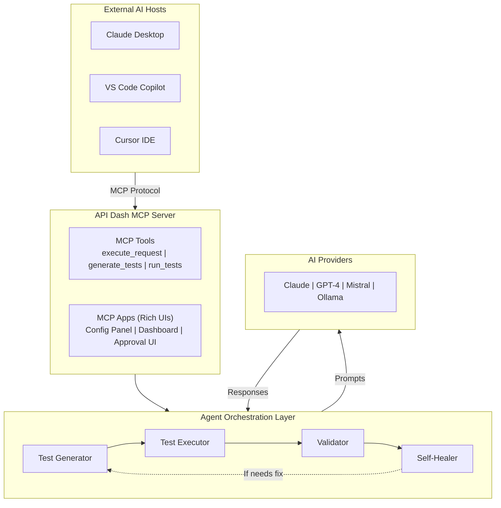
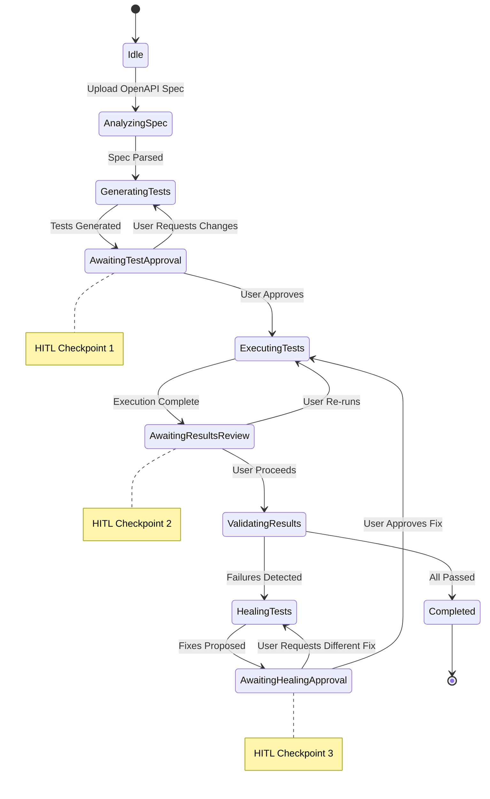
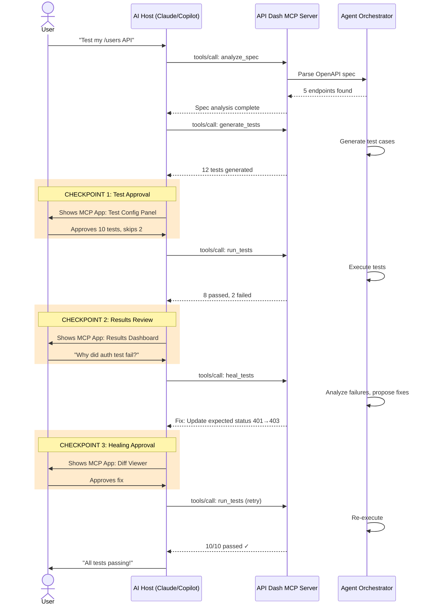
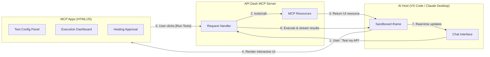
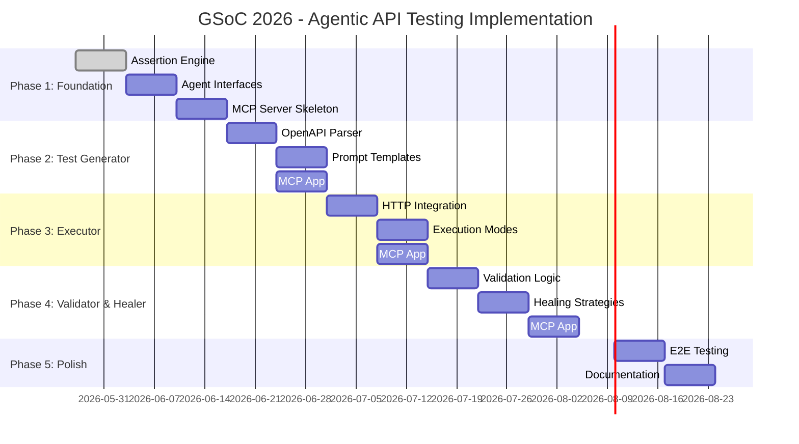
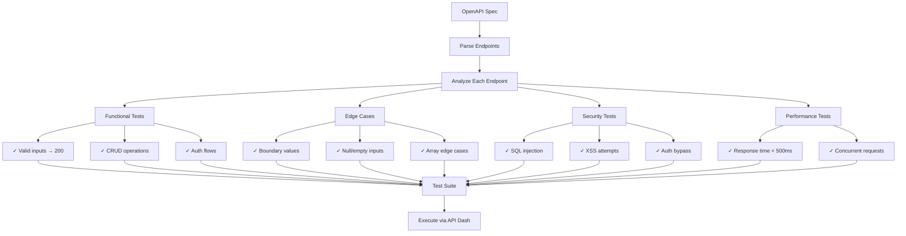
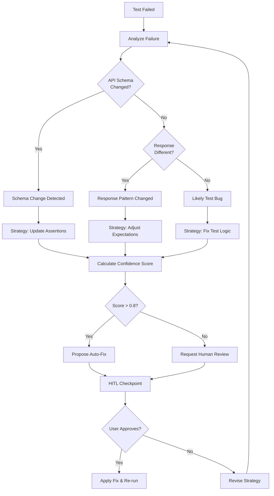

### Initial Idea Submission

**Full Name:** Aditya Suhane
**University name:** Gyan Ganga Institute of Technology and Sciences
**Program you are enrolled in (Degree & Major/Minor):** Bachelor of Technology in Computer Science Engineering (Data Science)
**Year:** 4th
**Expected graduation date:** June 2026

**Project Title:** Agentic API Testing with MCP Apps Integration

**Relevant issues:**
- [#100 - Stress Testing](https://github.com/foss42/apidash/issues/100)
- [#96 - API Test Automation](https://github.com/foss42/apidash/issues/96)
- [#1158 - GSoC 2026 Idea #4](https://github.com/foss42/apidash/issues/1158)

---

## Idea Description

### The Vision: API Dash as an AI Testing Platform

My proposal transforms API Dash from a standalone API client into an **AI-accessible testing platform** through MCP (Model Context Protocol) integration. External AI agents (Claude Desktop, VS Code Copilot, Cursor) can orchestrate API testing workflows through API Dash without users leaving their preferred environment.

```
┌─────────────────────────────────────────────────────────────────┐
│                    External AI Hosts                             │
│  ┌──────────┐  ┌──────────┐  ┌──────────┐  ┌──────────┐       │
│  │ Claude   │  │ VS Code  │  │  Cursor  │  │  Custom  │       │
│  │ Desktop  │  │ Copilot  │  │   IDE    │  │  Agents  │       │
│  └────┬─────┘  └────┬─────┘  └────┬─────┘  └────┬─────┘       │
│       │             │             │             │               │
│       └─────────────┴──────┬──────┴─────────────┘               │
│                            │ MCP Protocol                       │
└────────────────────────────┼────────────────────────────────────┘
                             │
┌────────────────────────────▼────────────────────────────────────┐
│                   API Dash MCP Server                            │
│  ┌─────────────────────────────────────────────────────────┐   │
│  │                    MCP Tools                             │   │
│  │  • execute_request  • generate_tests  • run_tests       │   │
│  │  • analyze_spec     • get_collection  • validate_results│   │
│  └─────────────────────────────────────────────────────────┘   │
│  ┌─────────────────────────────────────────────────────────┐   │
│  │                 MCP Apps (Rich UIs)                      │   │
│  │  • Test Configuration Panel  • Results Dashboard        │   │
│  │  • Approval Checkpoints      • Self-Healing Review      │   │
│  └─────────────────────────────────────────────────────────┘   │
└────────────────────────────┬────────────────────────────────────┘
                             │
┌────────────────────────────▼────────────────────────────────────┐
│                 Agent Orchestration Layer                        │
│         (LangGraph-style State Machine + HITL Checkpoints)      │
│  ┌──────────┐  ┌──────────┐  ┌──────────┐  ┌──────────┐       │
│  │Test Gen  │─▶│ Executor │─▶│Validator │─▶│ Healer   │       │
│  │  Agent   │  │  Agent   │  │  Agent   │  │  Agent   │       │
│  └──────────┘  └──────────┘  └──────────┘  └──────────┘       │
└─────────────────────────────────────────────────────────────────┘
```

### Why MCP Apps? (My Unique Angle)

Most agentic testing proposals focus only on the agent logic. I propose integrating **MCP Apps** - rich, interactive UI components that render inside AI hosts:

| Feature | Without MCP Apps | With MCP Apps |
|---------|------------------|---------------|
| Test approval | Text-only in chat | Interactive checklist UI |
| Results review | JSON dump | Visual dashboard with charts |
| Self-healing | Accept/reject text | Side-by-side diff viewer |
| Configuration | Manual prompting | Form-based config panel |

**Example: Test Approval Checkpoint**
```
User in Claude Desktop: "Test my authentication API"

Claude: "I've generated 8 test cases for /api/auth/*"
        [MCP App: Interactive Test Review Panel]
        ┌─────────────────────────────────────────┐
        │ Generated Tests                    [✓] All │
        │ ┌─────────────────────────────────────┐ │
        │ │ [✓] Valid login credentials         │ │
        │ │ [✓] Invalid password                │ │
        │ │ [✓] Missing auth header             │ │
        │ │ [ ] SQL injection attempt           │ │
        │ │ [✓] Rate limiting (10 req/sec)      │ │
        │ └─────────────────────────────────────┘ │
        │        [Run Selected] [Regenerate]      │
        └─────────────────────────────────────────┘
```

### Core Architecture: Hybrid Approach

I follow the hybrid architecture specified in the project requirements:

#### High-Level Architecture



#### Agent Workflow State Machine



#### Human-in-the-Loop Flow



#### MCP Apps Integration



**1. LangGraph-Style Agent Orchestration**
- State machine managing workflow transitions
- Conditional routing (skip healing if all tests pass)
- Shared context across agent nodes
- Cyclic flows for iterative refinement

**2. MCP Integration for AI Flexibility**
- Multi-model support (Claude, GPT-4, Mistral, Ollama)
- Users choose preferred AI provider
- Cost optimization (cheap models for simple tasks)
- Local LLMs for privacy-sensitive testing

**3. Human-in-the-Loop Checkpoints**
- After test generation → User approves/edits tests
- After execution → User reviews failures
- Before healing → User confirms proposed fixes

### Implementation Strategy

#### Timeline (12 Weeks)



#### Test Generation Strategy



#### Phase 1: Foundation (Weeks 1-3)
- Implement assertion engine (I've already prototyped this with 15 passing tests)
- Create agent base interfaces and state machine
- Set up MCP server skeleton with stdio/HTTP transport

#### Phase 2: Test Generation Agent (Weeks 4-5)
- OpenAPI/Swagger spec parsing
- Prompt templates for test types (functional, edge, security)
- First MCP App: Test Configuration Panel
- Human checkpoint: Test approval UI

#### Phase 3: Test Executor Agent (Weeks 6-7)
- Integration with API Dash's existing HTTP client
- Sequential/parallel execution modes
- Second MCP App: Execution Progress Dashboard
- Human checkpoint: Results review UI

#### Phase 4: Validator & Self-Healer (Weeks 8-10)
- Validation logic with severity scoring
- Healing strategies (adjust expectations, fix requests, report bugs)
- Third MCP App: Healing Approval Panel
- Confidence scoring for proposed fixes

#### Self-Healing Logic



#### Phase 5: MCP Apps & Polish (Weeks 11-12)
- Complete MCP Apps with sandboxed iframes
- End-to-end testing across AI hosts
- Documentation and examples
- Performance optimization

### What I've Already Built

To demonstrate my capability, I've been contributing to API Dash:

**1. Assertion Framework (Prototyped)**
- 5 assertion types: statusCode, responseTime, bodyJson, bodyText, header
- 10 operators: equals, contains, greaterThan, exists, etc.
- JSON path navigation: `user.orders[0].items[1].price`
- 15 comprehensive test cases passing

**2. Testing Documentation (PR #1248 - Open)**
- Added Testing and Assertions guide to scripting documentation
- 10+ real-world examples covering common patterns
- Demonstrates understanding of existing post-response scripting

**3. APIDashAgentCaller Tests (PR #1223 - Open)**
- Added test coverage for existing agentic services
- Shows familiarity with the AI integration architecture

### Why This Approach Works

**Separation of Concerns:**
- AI handles reasoning and test planning
- Dart handles deterministic HTTP execution
- MCP Apps handle human interaction
- No AI hallucination of network calls

**Incremental Value:**
- Each phase delivers usable functionality
- MCP server useful even without full agent system
- Assertion engine standalone package

**Real-World Usability:**
- Users stay in their preferred AI environment
- Rich UIs for complex decisions
- Clear audit trail of agent actions

### Technical Differentiators

| Aspect | My Approach | Why It Matters |
|--------|-------------|----------------|
| **MCP Apps** | Rich interactive UIs | Better UX than text-only |
| **Platform model** | API Dash as MCP server | External agents can use it |
| **Working code** | Assertion framework built | Proof of execution ability |
| **Layered design** | Deterministic + AI | Reliable, testable, trustworthy |

### References

- [MCP Specification](https://modelcontextprotocol.io/docs)
- [MCP Apps Documentation](https://modelcontextprotocol.io/docs/concepts/mcp-apps)
- [LangGraph Concepts](https://langchain-ai.github.io/langgraph/)
- [API Dash Scripting Guide](https://github.com/foss42/apidash/blob/main/doc/user_guide/scripting_user_guide.md)

---

**Contact:** [GitHub: @adityasuhane-06](https://github.com/adityasuhane-06)
