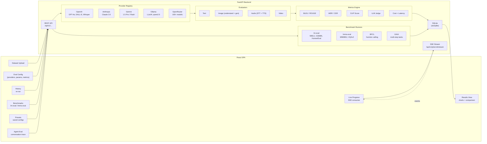
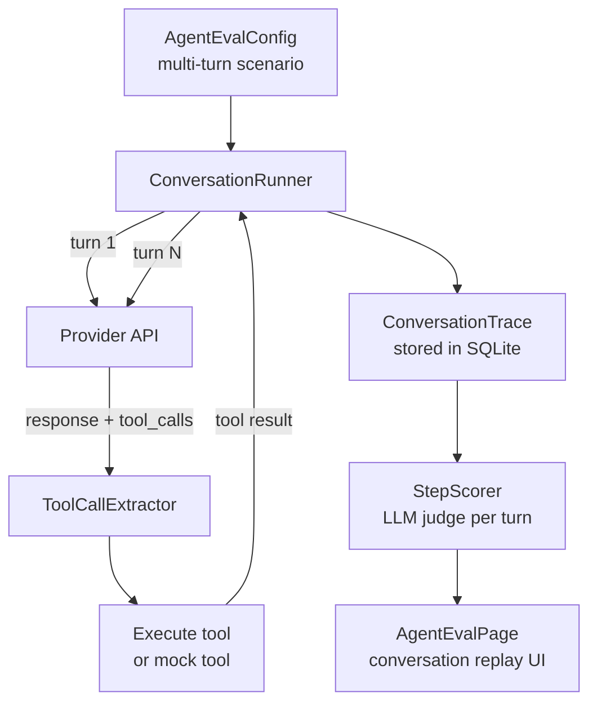

# GSoC 2026 Application — Ahmed Fikri Mahmoud

## Multimodal AI and Agent API Evaluation Framework

---

## About

|               |                                     |
| ------------- | ----------------------------------- |
| **Full Name** | Ahmed Fikri Mahmoud                 |
| **Email**     | dev.fikrii@gmail.com                |
| **Discord**   | ahmed.fikri                         |
| **GitHub**    | https://github.com/Fikri-20         |
| **LinkedIn**  | https://linkedin.com/in/ahmed-fikri |
| **Time zone** | Africa/Cairo (UTC+2)                |

---

## University Info

|                         |                            |
| ----------------------- | -------------------------- |
| **University**          | Mansoura University, Egypt |
| **Degree**              | B.Sc. Computer Engineering |
| **Year**                | 4th Year                   |
| **Expected Graduation** | July 2026                  |

---

## Motivation & Past Experience

### 1. Have you worked on or contributed to a FOSS project before?

Yes. Here are the contributions that are most relevant to this project:

**Jenkins — plugin-modernizer-tool** ([PRs](https://github.com/jenkins-infra/plugin-modernizer-tool/pulls?q=is%3Apr+author%3AFikri-20))

I contributed 5 merged PRs fixing issues in the Python reporting scripts:

- [#1653](https://github.com/jenkins-infra/plugin-modernizer-tool/pull/1653) — Fix string concatenation bug in `validate_metadata.py`
- [#1654](https://github.com/jenkins-infra/plugin-modernizer-tool/pull/1654) — Add JSON summary report output to `generate_reports.py`
- [#1655](https://github.com/jenkins-infra/plugin-modernizer-tool/pull/1655) — Replace bare `except` with `except Exception`
- [#1656](https://github.com/jenkins-infra/plugin-modernizer-tool/pull/1656) — Handle invalid JSON files gracefully
- [#1658](https://github.com/jenkins-infra/plugin-modernizer-tool/pull/1658) — Add Ruff linter for Python scripts

I also filed [issue #1660](https://github.com/jenkins-infra/plugin-modernizer-tool/issues/1660) identifying a JGit resource leak and submitted [PR #1661](https://github.com/jenkins-infra/plugin-modernizer-tool/pull/1661) fixing it in the Java `GHService` layer.

**MCPJam/inspector** — [PR #663](https://github.com/MCPJam/inspector/pull/663): Fixed a layout issue in the ToolsSidebar component. Merged.

**Multimodal AI Eval PoC** — I built a full-stack proof-of-concept for this exact GSoC project. It is working locally with a FastAPI backend and React frontend. Details in the proposal section below.

---

### 2. What project are you most proud of?

**Innova Content Pipeline** — a block-based editorial platform I built solo for my EdTech startup.

It is in production and used daily by my team at Innova. What I built:

- Block-based document editor with 5 content templates (quiz, learning-path, reference-guide, parent-manual, fellow-manual)
- Express + MongoDB backend with JWT auth, refresh token rotation, role-based access control
- Admin dashboard with user management, session tracking, activity analytics
- PDF export pipeline via Puppeteer Core + serverless function
- Auto-save every 3 seconds with metadata sync
- Curriculum JSON import with specialized export layouts

I designed and built the entire thing from database schema to block editor architecture. It is not a side project — it is a production system with real daily users.

---

### 3. What kind of problems motivate you?

Problems where fragmented tooling forces developers to use three different tools for one workflow. That is exactly what the current state of AI API evaluation looks like: CLI harnesses for benchmarks, vendor dashboards for single-provider testing, custom scripts for anything multimodal. None of them talk to each other.

I want to build the unified interface where you upload a dataset, pick providers, hit run, and see a side-by-side comparison — regardless of whether the input is text, an image, audio, or video.

Technically, I enjoy building async systems that handle concurrency cleanly, and designing abstractions that make adding the tenth provider as easy as adding the second.

---

### 4. Will you be working on GSoC full-time?

I will be working on GSoC alongside my startup (Innova). I plan to dedicate **30 hours per week** to this project during the coding period, and continue my startup work alongside it. I have been managing both for months and my output at Innova has not slipped — I can handle parallel workloads.

---

### 5. Do you mind regularly syncing with mentors?

No. I have already been doing it. I attended the Weekly Connect call, asked clarifying questions in Discord about provider architecture and multimodal priorities, and incorporated that feedback into this proposal and the POC design.

---

### 6. What interests you most about API Dash?

API Dash solves the "unified API interface" problem for HTTP testing. This project extends exactly that philosophy into AI evaluation: the same dataset, the same prompt, sent to multiple providers, with results compared side by side. It is the same workflow — configure, run, compare, export — applied to a more complex domain.

What I specifically find compelling is that it opens the door for developers who do not want to use vendor dashboards or learn CLI harnesses. A researcher or engineer who just wants to know "is GPT-4o or Gemini better at reading my invoice images?" should not need to write Python scripts to find out.

---

### 7. Areas where the project can be improved

**For the Multimodal AI Evaluation Framework (this project):**

- **Local model priority**: Ollama should be a first-class provider, not an afterthought. The UI should guide users through `ollama pull llava` the same way it guides them through entering an API key.
- **Multimodal as core**: Image, audio, and video should not be bolt-on features. The dataset schema and the metric system should treat them as first-class input types from day one.
- **Onboarding**: The first-run experience should be zero-friction — sample datasets bundled, provider health shown on the home page, clear error messages when something is not configured.
- **Preset system**: Pre-built evaluation configurations (e.g., "Compare vision models on VQA") so a new user can run a meaningful evaluation in under a minute.

**For API Dash core (Flutter app):**

- Request history search and filtering would improve workflows for users with large collections.
- An AI provider plugin architecture would allow the Flutter app to benefit from the same provider abstractions this project builds.

---

### 8. Have you interacted with the API Dash community?

Yes, through Discord:

- Participated in a [GSoC 2026 discussion](https://discordapp.com/channels/920089648842293248/920089648842293251/1485154000587194398) on the framework architecture
- Asked [clarifying questions](https://discordapp.com/channels/920089648842293248/920089648842293251/1485255346216767598) about provider integration priorities
- Attended the [Weekly Connect call](https://discordapp.com/channels/920089648842293248/940195305620664330/1485928614527635506) to discuss mentor expectations

---

## Project Proposal

### 1. Title

**Multimodal AI and Agent API Evaluation Framework**

---

### 2. Abstract

AI API evaluation is fragmented. Developers who want to compare providers across text, image, audio, or video need CLI harnesses (lm-eval), vendor dashboards, and custom metric scripts — none of which share results or speak the same format.

I will build a web-based evaluation platform that integrates directly with API Dash. The user uploads a dataset, selects providers and parameters, and hits run. The system fans out to multiple providers concurrently, streams live progress via SSE, scores each response with modality-appropriate metrics (BLEU, WER, CLIP, LLM-judge), and displays side-by-side comparison results with cost and latency tracking. Results are persisted in SQLite and exportable as CSV or JSON.

The architecture is a **FastAPI backend + React SPA frontend**. The backend handles provider abstraction, async job execution, metric computation, and SSE streaming. The frontend handles dataset upload, evaluation configuration, live progress display, and result visualization.

I have already built a working proof-of-concept implementing the core of this — the POC design, provider system, and evaluator structure informed this proposal directly.

---

### 3. Detailed Description

#### 3.1 The Problem

Developers building with AI APIs face three related problems:

**Fragmented tooling.** lm-harness and lighteval are CLI-only and require scripting expertise. Vendor dashboards (OpenAI Playground, Anthropic Console) are locked to a single provider. There is no tool that sends the same input to three providers and shows a side-by-side metric comparison.

**Multimodal blind spots.** Text evaluation is well-supported. Image, audio, and video evaluation require separate pipelines per modality. Most "multimodal" tools treat text as primary and add other modalities as edge-case handlers.

**No cost-performance visibility.** Developers cannot easily compare accuracy-per-dollar across providers. The trade-off between GPT-4o, Gemini Flash, and a local LLaVA model running in Ollama is guesswork without tooling that tracks token cost and latency alongside accuracy.

---

#### 3.2 Architecture



**Data flow:**

1. User uploads a dataset (CSV/JSON with rows of inputs and expected outputs) and configures the evaluation (providers, models, temperature, system prompt, which metrics to run).
2. The backend creates a job, fans out to all selected providers concurrently via `asyncio`.
3. Progress is streamed to the frontend via SSE as each item completes.
4. When all providers finish, evaluators score each response. Results are persisted to SQLite.
5. The results page shows per-provider metric scores, latency, cost, and a side-by-side item view.

---

#### 3.3 Backend — Provider System

Each provider implements the `ProviderAdapter` base class:

```python
class ProviderAdapter(ABC):
    @abstractmethod
    async def complete_text(self, request: TextRequest) -> TextResponse: ...

    @abstractmethod
    async def understand_image(self, request: ImageRequest) -> TextResponse: ...

    @abstractmethod
    async def transcribe_audio(self, request: AudioRequest) -> TextResponse: ...

    @abstractmethod
    async def describe_video(self, request: VideoRequest) -> TextResponse: ...
```

Providers implemented: **OpenAI** (GPT-4o, DALL-E 3, Whisper API), **Anthropic** (Claude 3.5 Sonnet), **Google Gemini** (1.5 Pro, Flash, Flash-2.0), **Ollama** (LLaVA for vision, qwen2.5 for text, Whisper for audio — local-first), **OpenRouter** (100+ models via one API key).

The registry pattern lets new providers be added without touching existing code — only a new file that implements the interface and a single registration line.

---

#### 3.4 Backend — Job Executor

The `JobExecutor` is the async core:

```python
async def run_job(job_id: str, config: EvalConfig) -> None:
    providers = [registry.get(p) for p in config.providers]
    async with asyncio.TaskGroup() as tg:
        for item in config.dataset:
            for provider in providers:
                tg.create_task(
                    evaluate_item(job_id, item, provider, config.metrics)
                )
```

- **Fan-out**: all provider × dataset item combinations run concurrently.
- **SSE streaming**: each completed item emits a progress event immediately.
- **Cancellation**: jobs can be cancelled; the executor checks a cancellation flag between items.
- **Retry**: transient errors (rate limits, network timeouts) retry with exponential backoff up to 3 times before marking the item as failed.

---

#### 3.5 Backend — Evaluators and Metrics

**Evaluators by modality:**

| Modality            | Input            | Output             | Evaluator                     |
| ------------------- | ---------------- | ------------------ | ----------------------------- |
| Text completion     | prompt           | text response      | `TextEvaluator`               |
| Vision QA           | image + question | text answer        | `ImageUnderstandingEvaluator` |
| Image generation    | text prompt      | generated image    | `ImageGenerationEvaluator`    |
| Audio STT           | audio file       | transcription text | `AudioSTTEvaluator`           |
| Audio TTS           | text             | audio file         | `AudioTTSEvaluator`           |
| Video understanding | video + question | text answer        | `VideoEvaluator`              |

**Metrics by category:**

| Category      | Metrics                                           | When Used                                                              |
| ------------- | ------------------------------------------------- | ---------------------------------------------------------------------- |
| Text accuracy | Exact Match, BLEU, ROUGE-L                        | Text completion, STT transcription                                     |
| Acoustic      | WER (Word Error Rate), CER (Character Error Rate) | STT evaluation                                                         |
| Vision        | CLIP Score                                        | Image generation, visual grounding                                     |
| Judge-based   | LLM Judge (GPT-4o as judge)                       | All modalities — catches semantic correctness that string metrics miss |
| Cost          | Per-token USD (using provider pricing tables)     | All evaluations                                                        |
| Latency       | TTFT (time to first token), total time            | All evaluations                                                        |

All metrics implement a `Metric` base class with a `compute(prediction, reference, **kwargs) -> float` signature. Adding a new metric means implementing this interface — nothing else needs to change.

---

#### 3.6 Backend — Benchmark Runners

For running standard benchmarks against AI providers (rather than custom datasets):

| Runner                    | Benchmarks                                              | What It Tests                          |
| ------------------------- | ------------------------------------------------------- | -------------------------------------- |
| **lm-evaluation-harness** | MMLU, GSM8K, ARC, HellaSwag, HumanEval, MBPP, BBH, MATH | Text/LLM reasoning and knowledge       |
| **lmms-eval**             | MMMU, VQAv2, ScienceQA, MME, Video-MME                  | Vision-language understanding          |
| **BFCL**                  | Berkeley Function Calling Leaderboard                   | Tool-use and function calling accuracy |
| **GAIA**                  | General AI Assistants                                   | Real-world multi-step tasks            |

Benchmark runners are optional dependencies — `lm-eval` and `lmms-eval` are only imported if the user actually runs a benchmark. The core evaluation pipeline works without them installed.

---

#### 3.7 Backend — Storage

SQLite via `aiosqlite`. Schema:

```
jobs            — id, status, config_json, created_at, updated_at
job_results     — job_id, provider, item_idx, response_json, metrics_json, cost, latency
datasets        — id, name, modality, row_count, file_path, created_at
presets         — id, name, description, config_json, is_builtin
agent_traces    — job_id, provider, turn_idx, role, content, tool_calls_json
benchmark_runs  — id, runner, task, provider, score, created_at
```

Schema migrations handled by a lightweight version table — the app checks the current version on startup and applies pending migrations in order.

---

#### 3.8 Frontend Architecture

Built with React 18 + TypeScript + Vite + Tailwind CSS.

**Pages:**

| Page             | Route          | Purpose                                                   |
| ---------------- | -------------- | --------------------------------------------------------- |
| HomePage         | `/`            | Provider status cards, quick actions, recent jobs         |
| EvalPage         | `/eval`        | Dataset upload, provider selection, parameter config, run |
| ResultsPage      | `/results/:id` | Per-provider metrics, side-by-side item view, export      |
| HistoryPage      | `/history`     | Past jobs, filter by modality/status, re-run              |
| BenchmarksPage   | `/benchmarks`  | Run lm-eval / lmms-eval / BFCL / GAIA                     |
| PresetsPage      | `/presets`     | Create, edit, apply saved evaluation configs              |
| AgentEvalPage    | `/agent-eval`  | Conversation trace viewer, step scoring                   |
| OnboardingWizard | `/onboarding`  | First-run setup: provider keys + health check             |

**Key components:**

| Component            | Responsibility                                                          |
| -------------------- | ----------------------------------------------------------------------- |
| `FileUpload`         | Drag-and-drop dataset upload, preview first 5 rows, validate schema     |
| `ProviderSelector`   | Multi-select providers with model dropdown per provider                 |
| `MetricSelector`     | Checkboxes to enable/disable metrics; tooltip explaining each           |
| `LiveProgress`       | SSE consumer, progress bar per provider, live log stream                |
| `ComparisonTable`    | Side-by-side: input, expected output, each provider's response + scores |
| `MetricChart`        | Bar chart (provider scores), box plot (score distribution), cost pie    |
| `ConversationTrace`  | Visual playback of agent multi-turn dialogue with tool call inspector   |
| `ExportPanel`        | CSV and JSON export of filtered results                                 |
| `ProviderStatusCard` | Health check per provider on home page                                  |
| `PresetSelector`     | One-click preset application on EvalPage                                |

---

#### 3.9 Agent Evaluation

Agent evaluation adds multi-turn dialogue recording on top of the existing evaluation pipeline:



Each turn is stored with role, content, and tool call data. The `StepScorer` uses an LLM judge to score individual reasoning steps. The `ConversationTrace` component lets users replay the dialogue turn by turn, inspect tool calls, and see where reasoning diverged between providers.

BFCL integration provides standardized function-calling test cases. GAIA provides real-world multi-step task scenarios.

---

#### 3.10 Proof of Concept

I built a working POC before writing this proposal to validate the architecture and make sure the approach is feasible. The POC is in the `poc/` directory and implements:

- **Providers**: OpenAI, Anthropic, Gemini, Ollama, OpenRouter, Whisper — all via the `ProviderAdapter` interface
- **Evaluators**: `text_eval.py`, `image_understanding.py`, `image_generation.py`, `audio_stt.py`, `audio_tts.py`, `video_understanding.py`
- **Metrics**: BLEU, WER/CER, LLM judge, cost tracking
- **Job execution**: async fan-out with SSE streaming
- **Storage**: SQLite via `aiosqlite`
- **Frontend pages**: HomePage, EvalPage, ResultsPage, HistoryPage, BenchmarksPage — React 18 + TypeScript + Tailwind

The GSoC project will productionize this POC: complete the dataset upload UI, add the preset system, agent evaluation, onboarding flow, full test coverage, and documentation.

---

#### 3.11 Mentor Guidance Incorporated

This proposal reflects direct feedback from the API Dash mentors:

- **Ankit (core mentor)**: Local models via Ollama and OpenRouter should be first-class, not optional. The onboarding wizard and error messages reflect this — e.g., if Ollama is not running, the UI shows `ollama serve` as the fix, not a generic connection error.
- **Ankit (core mentor)**: Multimodal data (images, audio, video) must be core priority, not bolt-on. The dataset schema, evaluator system, and metric engine treat all modalities equally.
- **Ashita (co-mentor)**: Break the implementation plan into specific, actionable tasks. The weekly timeline below is task-level, not goal-level.

---

### 4. Weekly Timeline

> The POC already implements the provider system, most evaluators, SSE streaming, SQLite persistence, and the core frontend pages. The timeline focuses on production hardening, the features not yet in the POC (presets, agent eval, onboarding), full test coverage, and documentation.

#### Phase 1 — Production Hardening & Dataset System (Weeks 1–3, 90h)

**Week 1 (28h) — Environment + Error Handling**

| Task      | Hours   | Description                                                                                                                                            |
| --------- | ------- | ------------------------------------------------------------------------------------------------------------------------------------------------------ |
| T1.1      | 4h      | Fork API Dash, set up dev environment, verify POC runs end-to-end                                                                                      |
| T1.2      | 4h      | Review POC codebase, document gaps vs production requirements                                                                                          |
| T1.3      | 6h      | Add comprehensive error handling across all 6 provider adapters — no bare `except`, structured `ProviderError` with provider name and original message |
| T1.4      | 6h      | Add request validation middleware: check required fields, type coercion, parameter ranges (temperature 0–2, max_tokens > 0)                            |
| T1.5      | 8h      | Add dataset preview API (`GET /api/v1/datasets/:id/preview`) returning first 5 rows with detected schema                                               |
| **Total** | **28h** |                                                                                                                                                        |

**Week 2 (30h) — Test Suite + Actionable Errors**

| Task      | Hours   | Description                                                                                                                                                                                                                      |
| --------- | ------- | -------------------------------------------------------------------------------------------------------------------------------------------------------------------------------------------------------------------------------- |
| T2.1      | 10h     | Pytest suite for all 6 provider adapters: mock the HTTP calls, assert request shape, assert response parsing, assert error propagation                                                                                           |
| T2.2      | 8h      | Pytest suite for all 6 evaluators and 5 metric classes: unit test each `compute()` method with known inputs/outputs                                                                                                              |
| T2.3      | 6h      | Actionable error messages throughout: "Ollama not running — run `ollama serve` to start it", "Invalid API key format for OpenAI — keys start with `sk-`", "Dataset missing `expected_output` column — required for BLEU scoring" |
| T2.4      | 6h      | API key validation on save: format check + a lightweight test call (list models) to confirm the key works before it is stored                                                                                                    |
| **Total** | **30h** |                                                                                                                                                                                                                                  |

**Week 3 (32h) — Dataset Upload UI + Benchmark Expansion**

| Task      | Hours   | Description                                                                                                                                                     |
| --------- | ------- | --------------------------------------------------------------------------------------------------------------------------------------------------------------- |
| T3.1      | 8h      | Complete dataset upload backend: `POST /api/v1/datasets` with multipart support, schema validation, row count limit (10,000), storage to `artifacts/` directory |
| T3.2      | 6h      | Dataset upload frontend: drag-and-drop zone, progress bar, cancel, schema error display, preview table of first 5 rows                                          |
| T3.3      | 4h      | Dataset management: list (`GET /api/v1/datasets`), delete (`DELETE /api/v1/datasets/:id`), used-by check before delete                                          |
| T3.4      | 6h      | Multimodal dataset support: rows can have `image_path`, `audio_path`, `video_path` fields alongside text; backend detects modality from schema                  |
| T3.5      | 8h      | Integrate lmms-eval: MMMU, VQAv2, ScienceQA via the `BenchmarkRunner` interface (same pattern as existing lm-eval integration)                                  |
| **Total** | **32h** |                                                                                                                                                                 |

---

#### Phase 2 — New Features (Weeks 4–7, 140h)

**Week 4 (36h) — Preset System**

| Task      | Hours   | Description                                                                                                                                                                                                                                                                                           |
| --------- | ------- | ----------------------------------------------------------------------------------------------------------------------------------------------------------------------------------------------------------------------------------------------------------------------------------------------------- |
| T4.1      | 8h      | Design and implement `presets` SQLite table: id, name, description, config_json (providers, models, params, metrics, dataset_id), is_builtin. Migration script.                                                                                                                                       |
| T4.2      | 10h     | Preset CRUD API: `POST /api/v1/presets`, `GET`, `PUT`, `DELETE`. Import/export as JSON.                                                                                                                                                                                                               |
| T4.3      | 8h      | Built-in presets seeded on first run: "Quick Text Compare" (GPT-4o vs Gemini Flash, BLEU + LLM judge), "Vision QA" (GPT-4o vs LLaVA, CLIP + LLM judge), "Audio STT" (Whisper API vs Ollama Whisper, WER), "Code Generation" (GPT-4o vs Claude, LLM judge), "MMLU Reasoning" (benchmark runner preset) |
| T4.4      | 10h     | Preset selector UI on EvalPage: dropdown with name + description, one-click apply populates all config fields, "Save current as preset" button                                                                                                                                                        |
| **Total** | **36h** |                                                                                                                                                                                                                                                                                                       |

**Week 5 (36h) — Agent Evaluation Foundation**

| Task      | Hours   | Description                                                                                                                                                                           |
| --------- | ------- | ------------------------------------------------------------------------------------------------------------------------------------------------------------------------------------- |
| T5.1      | 8h      | Agent evaluation data model: `ConversationTurn` (role, content, tool_calls, timestamp), `ToolCall` (name, arguments, result), `AgentTrace` (list of turns, final answer, step scores) |
| T5.2      | 10h     | `ConversationRunner`: iterates multi-turn scenarios, stores each turn in `agent_traces` table, handles tool call injection (mock tool results for benchmark scenarios)                |
| T5.3      | 8h      | BFCL integration: Berkeley Function Calling Leaderboard test cases loaded via the benchmark runner interface. Supports simple, parallel, nested, and irrelevance categories.          |
| T5.4      | 10h     | Conversation replay UI: `ConversationTrace` component with turn-by-turn navigation, role labels (user/assistant/tool), tool call inspector panel showing name + arguments + result    |
| **Total** | **36h** |                                                                                                                                                                                       |

**Week 6 (36h) — Agent Scoring + Visualizations**

| Task      | Hours   | Description                                                                                                                                                                                 |
| --------- | ------- | ------------------------------------------------------------------------------------------------------------------------------------------------------------------------------------------- |
| T6.1      | 10h     | `StepScorer`: LLM-judge prompt that evaluates each reasoning step in a conversation trace. Scores: correctness, tool-use appropriateness, answer quality. Stores per-turn scores in SQLite. |
| T6.2      | 8h      | Metric selection UI: checkboxes per metric with tooltip explanation. "Why this metric?" tooltip explains what each metric measures and when it is appropriate.                              |
| T6.3      | 8h      | GAIA integration: general assistant benchmark tasks (file reading, web lookup stubs, math), routed through the conversation runner                                                          |
| T6.4      | 6h      | Aggregate statistics view on ResultsPage: mean, median, std dev, min/max per metric per provider. Score distribution histogram per provider.                                                |
| T6.5      | 4h      | Fix and test concurrent execution under load: run 5 providers × 100-item dataset and verify SSE delivery, no dropped events, correct final counts                                           |
| **Total** | **36h** |                                                                                                                                                                                             |

**Week 7 (32h) — Visualizations + Export**

| Task      | Hours   | Description                                                                                                                                                                               |
| --------- | ------- | ----------------------------------------------------------------------------------------------------------------------------------------------------------------------------------------- |
| T7.1      | 10h     | Comparison charts: grouped bar chart (providers as groups, metrics as bars), box plot (score distribution per provider, shows outliers), radar chart (multi-metric view) — using Recharts |
| T7.2      | 8h      | Cost breakdown: per-provider pie chart (USD spent), stacked bar (tokens in / tokens out per item), cost-per-accuracy scatter plot                                                         |
| T7.3      | 8h      | CSV export: one row per dataset item × provider, columns for all metric scores, response text, latency, cost                                                                              |
| T7.4      | 6h      | JSON export: full job object including config, per-item results, aggregate stats, model metadata — for programmatic access                                                                |
| **Total** | **32h** |                                                                                                                                                                                           |

---

#### Phase 3 — Polish & Documentation (Weeks 8–12, 120h)

**Week 8 (26h) — UI/UX Polish**

| Task      | Hours   | Description                                                                                                                                                                                 |
| --------- | ------- | ------------------------------------------------------------------------------------------------------------------------------------------------------------------------------------------- |
| T8.1      | 8h      | Responsive design: tablet breakpoints for EvalPage (config panel collapses to drawer), mobile breakpoints for ResultsPage (table becomes card list)                                         |
| T8.2      | 6h      | Dark mode consistency: audit all components, fix hardcoded colors, use Tailwind `dark:` variants throughout                                                                                 |
| T8.3      | 6h      | Loading skeletons for all async data (HistoryPage list, ResultsPage charts, PresetsPage grid)                                                                                               |
| T8.4      | 6h      | Empty states: EvalPage with no dataset ("Upload a dataset to get started"), HistoryPage with no jobs ("No evaluations yet — start one on the Eval page"), each with a call-to-action button |
| **Total** | **26h** |                                                                                                                                                                                             |

**Week 9 (26h) — Onboarding + First-Run Experience**

| Task      | Hours   | Description                                                                                                                                                                                                            |
| --------- | ------- | ---------------------------------------------------------------------------------------------------------------------------------------------------------------------------------------------------------------------- |
| T9.1      | 8h      | Onboarding wizard: step 1 (which providers?), step 2 (enter API keys with format validation + test call), step 3 (Ollama setup check with `ollama serve` prompt if not running), step 4 (success + start evaluating)   |
| T9.2      | 8h      | Sample datasets bundled: 10-item text dataset (translation), 10-item image dataset (VQA), 5-item audio dataset (STT), 5-item video dataset (frame Q&A). Available from the dataset upload page under "Browse samples". |
| T9.3      | 5h      | Quick-start overlay for first-time users: 4-step guide shown once on first visit, dismissible, accessible from the `?` button                                                                                          |
| T9.4      | 5h      | Context-sensitive help tooltips throughout: metric names, provider capabilities, parameter explanations — all with a small `ⓘ` icon                                                                                    |
| **Total** | **26h** |                                                                                                                                                                                                                        |

**Week 10 (28h) — Integration Testing**

| Task      | Hours   | Description                                                                                                                                                         |
| --------- | ------- | ------------------------------------------------------------------------------------------------------------------------------------------------------------------- |
| T10.1     | 10h     | End-to-end test: upload dataset → configure eval → run → verify results in SQLite and on ResultsPage. Cover text, image, and audio modalities.                      |
| T10.2     | 10h     | Multi-provider concurrency test: 3 providers × 50-item dataset — verify all 150 results arrive, no race conditions in SSE delivery, correct per-provider aggregates |
| T10.3     | 8h      | Large dataset test: 1,000-item text dataset — verify streaming stays live throughout, cancellation stops new work immediately, memory usage stays bounded           |
| **Total** | **28h** |                                                                                                                                                                     |

**Week 11 (20h) — Documentation**

| Task      | Hours   | Description                                                                                                                                                           |
| --------- | ------- | --------------------------------------------------------------------------------------------------------------------------------------------------------------------- |
| T11.1     | 8h      | Comprehensive README: installation, quick start (5 steps to first evaluation), all config options, troubleshooting section for common errors                          |
| T11.2     | 6h      | User guide with step-by-step tutorials and screenshots: "Run your first text evaluation", "Compare image understanding across GPT-4o and LLaVA", "Run MMLU benchmark" |
| T11.3     | 6h      | FastAPI auto-generated docs already available at `/docs` — add example request/response bodies to all endpoints via Pydantic `model_config` with `json_schema_extra`  |
| **Total** | **20h** |                                                                                                                                                                       |

**Week 12 (20h) — Developer Guide + Final Polish**

| Task      | Hours   | Description                                                                                                                                                                                                                                |
| --------- | ------- | ------------------------------------------------------------------------------------------------------------------------------------------------------------------------------------------------------------------------------------------ |
| T12.1     | 6h      | Developer guide: how to add a new provider (implement `ProviderAdapter`, register in registry, add API key to config), how to add a new metric (implement `Metric.compute()`, register in `MetricRegistry`), how to add a benchmark runner |
| T12.2     | 6h      | Final bug fixes and edge-case handling based on integration testing findings                                                                                                                                                               |
| T12.3     | 8h      | Demo video or GIF walkthrough: onboarding → upload dataset → run multi-provider eval → compare results → export                                                                                                                            |
| **Total** | **20h** |                                                                                                                                                                                                                                            |

**GRAND TOTAL: 350 hours**

---

### 5. Deliverables Summary

**After Phase 1 (Week 3):**

- All 6 provider adapters with structured error handling and test coverage
- Request validation middleware
- Pytest suites for providers, evaluators, and metrics
- Actionable error messages for all common failure modes
- Complete dataset upload UI (drag-and-drop, preview, validation)
- Multimodal dataset support
- lmms-eval integration (MMMU, VQAv2, ScienceQA)

**After Phase 2 (Week 7):**

- Preset system (CRUD, built-in presets, selector UI)
- Agent evaluation: conversation runner, BFCL + GAIA integration, step scoring
- Conversation trace replay UI
- Metric selection UI with explanations
- Comparison charts (bar, box plot, radar, cost pie)
- CSV and JSON export

**After Phase 3 (Week 12):**

- Responsive design (tablet + mobile)
- Onboarding wizard with provider health checks
- Bundled sample datasets for 4 modalities
- Full integration test suite
- Comprehensive README, user guide, developer guide
- FastAPI endpoint documentation with examples
- Demo video/GIF

---

### 6. Risk Mitigation

| Risk                                                | Likelihood | Impact | Mitigation                                                                                                          |
| --------------------------------------------------- | ---------- | ------ | ------------------------------------------------------------------------------------------------------------------- |
| Provider API rate limits during multi-provider eval | Medium     | Medium | Exponential backoff with jitter; per-provider concurrency limits configurable                                       |
| Large dataset memory issues                         | Medium     | High   | Stream rows from disk (generator-based), process in chunks of 50                                                    |
| Ollama not installed / not running                  | High       | Low    | Clear error with exact command; home page shows provider health status upfront                                      |
| lm-eval / lmms-eval dependency conflicts            | Medium     | Medium | Optional dependencies via `pip install apidash-eval[benchmarks]`; core works without them                           |
| Agent eval scope creep                              | High       | High   | Agent eval is scoped to BFCL + GAIA + conversation replay — no open-ended multi-tool orchestration in this proposal |
| Provider API breaking changes                       | Low        | Medium | Adapter pattern isolates vendor code; tests catch regressions against mocked responses                              |

---

### 7. Communication Plan

- **Daily**: push commits to GitHub, update PR description with what changed
- **Weekly**: Discord update in the API Dash server summarizing completed tasks and blockers
- **Bi-weekly**: mentor sync call for feedback and direction
- **Phase boundaries**: milestone demo (screen recording) at end of each phase

---

## Why I Am the Right Person

I have already built the core of this system. The POC in `poc/` has the provider system, all evaluators, SSE streaming, SQLite persistence, and the frontend pages. It was not built to impress a committee — it was built to prove the architecture works before I committed to proposing it.

Beyond the POC, I have shipped production systems with the same stack: async Python backends, React frontends, SQLite persistence, GitHub Actions CI. I work in this environment daily at Innova.

The specific skills this project needs — provider abstraction design, async job execution, SSE streaming, multimodal metric implementation — are exactly what I built in the POC. There is no ramp-up time on the architecture.

---

## Availability

**30 hours per week** from May 25 to August 24, 2026. Available for daily async communication and weekly video syncs.

---

_Ahmed Fikri Mahmoud — March 2026_
