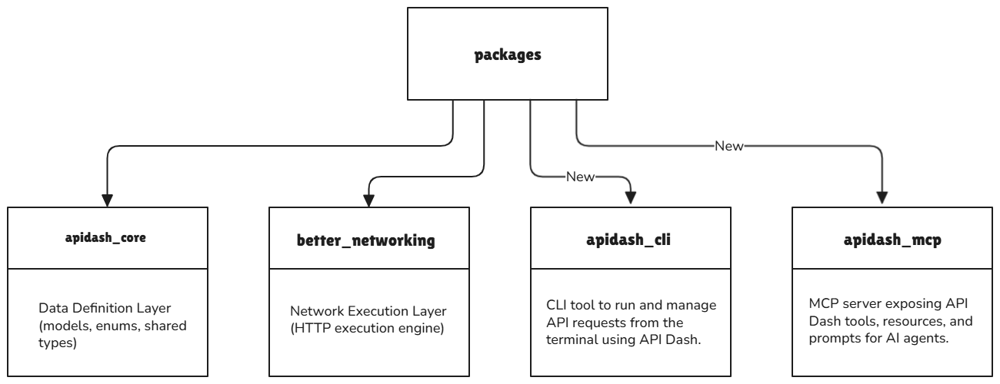
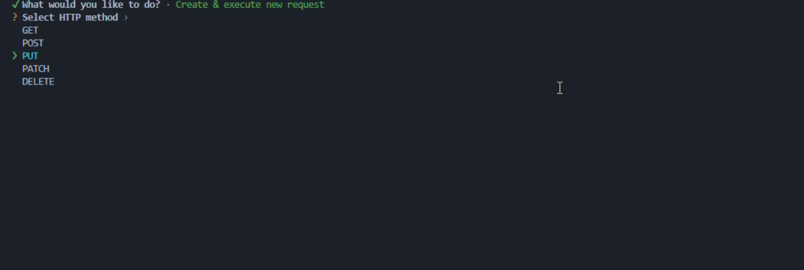

# Initial Idea Submission

---

## Personal Information

| Field | Details |
|---|---|
| **Full Name** | Bhavesh Mahesh More |
| **University** | Vishwakarma Institute of Technology, Pune |
| **Program** | B.Tech in Artificial Intelligence and Data Science (AI & DS) |
| **Year** | 2nd Year |
| **Expected Graduation** | 2028 |

---

## Project Information

**Project Title:** CLI & MCP Support for API Dash

**Relevant Discussion:** [#1228 - Idea #6](https://github.com/foss42/apidash/discussions/1228)

---

## Idea Description

### Executive Summary

This proposal introduces a **headless execution layer for API Dash** - a CLI tool and MCP server that allow developers to use their saved API requests and execute new requests outside the GUI. By introducing `apidash_cli` and `apidash_mcp` packages and using the existing `better_networking` package as the core HTTP execution layer, both the CLI and MCP server can reuse the exact same HTTP models, execution logic, and response handling that the desktop app uses - without code duplication, without creating unnecessary new packages, and without compromising the desktop app's functionality.

The key architectural decision is **extending and refactoring what exists** rather than creating new packages. This maximizes code reuse while minimizing maintenance burden.

---

## Problem Statement

API Dash is a powerful API testing client built entirely in Flutter and Dart. Developers can craft, save, and organize API requests in a beautiful GUI - but those saved requests are locked inside the Flutter app. Many developers prefer working directly inside their IDE rather than opening a separate application.

**The gap:** Developers currently cannot:

- Run a saved or new request from the terminal or through an MCP Server
- Execute requests in an AI agent's context (Claude, Copilot, Cursor)
- Use API Dash as a headless tool in server environments

**The solution:** A CLI and MCP server that read/write from the same Hive storage the desktop app uses, executing requests with the exact same HTTP logic, environment variable resolution, and response handling.

---

**Proposed Structure:**



---

## Section 1 - `apidash_cli` Package

`apidash_cli` is a pure Dart command-line interface that allows users to access API Dash features headlessly from the terminal.

**Architecture Diagram:**


---

### 1. Terminal (Entry Point)

The user invokes the CLI from their terminal. This is the `main()` entry point of the Dart executable. It receives raw `List<String> args` and passes them into the `apidash_cli` service pipeline.

### 2. Command Parser

Uses the Dart `args` package to define all commands, subcommands, flags, and options. It converts raw `argv` into a structured `ArgResults` object and validates that required arguments and flag combinations are present before anything executes.

```dart
ArgResults parse(List<String> args) {
  final parser = ArgParser()
    ..addCommand('run')
    ..addCommand('exec')
    ..addCommand('list')
    ..addCommand('env')
    ..addOption('method', abbr: 'm', defaultsTo: 'GET')
    ..addOption('url', abbr: 'u')
    ..addOption('environment', abbr: 'e', defaultsTo: 'Global')
    ..addOption('format', abbr: 'f', defaultsTo: 'table',
        allowed: ['table', 'json', 'yaml'])
    ..addOption('name', abbr: 'n')
    ..addFlag('verbose', abbr: 'v', defaultsTo: false);

  return parser.parse(args);
}
```

Example terminal usage:

```bash
apidash exec "https://api.example.com/users" --method=POST --verbose
```

### 3. Command Dispatcher

Takes the parsed `ArgResults` and routes execution to the correct handler based on the command/subcommand. It acts as a **router**, it doesn't execute business logic itself, it just decides _who_ should handle this command.

```dart
switch (results.command?.name) {
  case 'run':
    RunCommand(results).execute();
    break;
  case 'exec':
    ExecCommand(results).execute();
    break;
  case 'list':
    ListCommand(results).execute();
    break;
  case 'env':
    EnvCommand(results).execute();
    break;
}
```

### 4. Service Layer

The **Service Layer** handles data access and utility operations, preventing command logic from becoming tightly coupled with storage or file handling.

Responsibilities:

- Provides **Hive services** (load/save requests, collections)
- Handles **environment variable** resolution (e.g. `{{BASE_URL}}`)
- Performs **file operations** (reading request bodies from files, etc.)
- Provides output formatting

Typical services:

```
hive_service.dart
file_service.dart
environment_service.dart
formatter_service.dart
```

Example:

```dart
// Load a saved request from Hive by id
Future<HttpRequestModel?> getRequest(String id) async {
  return HiveService.getRequest(id);
}

// Resolve environment variables in a URL
String resolveEnv(String input, String envName) {
  final Map<String, String>? env = HiveService.getEnvironment(envName);
  if (env == null || env.isEmpty) return input;
  final regex = RegExp("{{(${env.keys.join('|')})}}");

  return input.replaceAllMapped(
    regex,
    (match) {
      final key = match.group(1)?.trim() ?? '';
      return env[key] ?? '{{$key}}';
    },
  );
}

// Read request body from file
static Future<String?> readBodyFromFile(String path) async {
  final file = File(path);
  return file.existsSync() ? await file.readAsString() : null;
}
```

### 5. Hive Storage

API Dash uses **Hive** as its storage for persisting requests and environments. The CLI reuses this same storage layer. meaning any request saved in the GUI is available in the CLI too, and vice versa.

```dart
final dataBox = await Hive.openBox('apidash-data');
final envBox = await Hive.openBox('apidash-environments');
```

#### Hive Storage Path Resolution

The CLI must locate the Hive database written by the desktop app. Since `shared_preferences` is a Flutter plugin and unavailable in a **pure Dart CLI**, the CLI needs an alternative method to resolve the Hive storage location. Two approaches are possible:

---

**Approach A - Environment Variables**

The CLI resolves the workspace path using environment variables via `dart:io`. The selected workspace path is stored in a persistent environment variable `APIDASH_WORKSPACE_PATH` whenever it is configured. Both the CLI and MCP server then read this variable at startup to locate the Hive storage, avoiding any dependency on Flutter plugins.

```dart
import 'dart:io';

String? resolveWorkspacePath() {
  switch (Platform.operatingSystem) {
    case 'windows':
      return Platform.environment['APIDASH_WORKSPACE_PATH_WINDOWS']
          ?? Platform.environment['APIDASH_WORKSPACE_PATH'];

    case 'linux':
      return Platform.environment['APIDASH_WORKSPACE_PATH_LINUX']
          ?? Platform.environment['APIDASH_WORKSPACE_PATH'];

    case 'macos':
      return Platform.environment['APIDASH_WORKSPACE_PATH_MACOS']
          ?? Platform.environment['APIDASH_WORKSPACE_PATH'];

    default:
      return Platform.environment['APIDASH_WORKSPACE_PATH'];
  }
}
```

This keeps the CLI **pure Dart**, avoids Flutter dependencies, and allows users or CI environments to explicitly configure the workspace location.

---

**Approach B - CLI Configuration File**

The workspace path is stored in a simple configuration file instead of relying on environment variables. The CLI reads this file at startup and uses the stored path to locate the Hive database.

```json
{
  "workspace_path": "/Users/user/Library/Application Support/apidash"
}
```

```dart
import 'dart:io';
import 'dart:convert';

String? resolveWorkspacePathFromConfig() {
  final configFile = File('<config path>');

  if (!configFile.existsSync()) return null;

  final config = jsonDecode(configFile.readAsStringSync());
  return config['workspace_path'];
}
```

---

### 6. Core Libraries

These are the underlying packages the Executor depends on to actually send HTTP requests:

- **`apidash_core`** - provides `HttpRequestModel`, `HttpResponseModel`, and all core data models shared with the GUI
- **`better_networking`** - handles actual HTTP execution (supports REST, multipart, etc.)

By reusing these packages, the CLI stays in perfect sync with the GUI's behavior - same models, same networking logic.

```dart
// apidash_core model reuse
final request = HttpRequestModel(
  url: 'https://api.example.com/users',
  method: HTTPVerb.get,
);

// better_networking for execution
final response = await BetterNetworking.sendRequest(request);
```

### 7. Executor

The **Executor** is the core orchestration layer sitting between the command layer and the networking engine. After the Dispatcher routes to it, the Executor:

1. Calls the **Service Layer** to load Hive data and resolve environments
2. Builds the final `HttpRequestModel`
3. Sends it via `better_networking`
4. Passes the raw response to the **Response Processor**

```dart
class Executor {
  static Future<void> executeRequest(ArgResults args) async {
    final url = ServiceLayer.resolveEnv(
      args['url'],
      args['env'] ?? 'Global',
    );

    final request = HttpRequestModel(
      url: url,
      method: HTTPVerb.values.byName(args['method'].toLowerCase()),
    );

    final rawResponse = await BetterNetworking.sendRequest(request);
    await ResponseProcessor.process(rawResponse, verbose: args['verbose']);
  }
}
```

For **collection execution**, the executor runs requests sequentially:

```dart
Future<List<HttpResponseModel>> executeCollection(
  CollectionModel collection, {
  String envName = 'Global',
  bool verbose = false,
}) async {
  final List<HttpResponseModel> collectionResponses = [];

  for (final req in collection.requests) {
    final resolvedUrl = ServiceLayer.resolveEnv(req.url, envName);
    final request = req.copyWith(url: resolvedUrl);

    final rawResponse = await BetterNetworking.sendRequest(request);
    await ResponseProcessor.process(rawResponse, verbose: verbose);

    collectionResponses.add(rawResponse);
  }

  return collectionResponses;
}
```

### 8. Response Processor

The **Response Processor** is a **shared component** used by both `apidash_cli` and `apidash_mcp`. It lives in `apidash_core` so neither consumer needs to duplicate normalization logic.

Responsibilities:

- Normalize responses
- Extract metadata
- Redact sensitive headers (e.g. `Authorization`, `x-api-key`) before output
- Prepare data for formatting

This ensures the output layer receives **consistent structured data**.

---

### Collections

A **collection** is a JSON file containing multiple API requests grouped together so they can be executed sequentially as a single workflow from the CLI.

Developers can create a **`.apidash` workspace folder** in their project to store collection files. Instead of manually selecting and running requests one by one, they can execute an entire set of API tests directly from the terminal.

> **Security note:** To prevent API keys from being committed to Git, the CLI supports `.env` files in the working directory to override `{{variables}}` securely.

```
.apidash/
 ├── user-tests.json
 ├── auth-tests.json
 └── order-tests.json
```

Example execution:

```bash
apidash run .apidash/user-tests.json
```

#### Collection JSON Schema

```json
{
  "name": "User Tests",
  "version": "1.0",
  "requests": [
    {
      "id": "req_001",
      "name": "Get All Users",
      "url": "{{BASE_URL}}/users",
      "method": "GET",
      "headers": [
        { "name": "Accept", "value": "application/json" }
      ],
      "body": null
    },
    {
      "id": "req_002",
      "name": "Create User",
      "url": "{{BASE_URL}}/users",
      "method": "POST",
      "headers": [
        { "name": "Content-Type", "value": "application/json" }
      ],
      "body": "{\"name\": \"Alice\", \"email\": \"alice@example.com\"}"
    }
  ]
}
```

> **Design decision:** The CLI reuses the existing API Dash request format rather than introducing a new schema. This allows collections to remain consistent and easily portable.

---

## CLI Commands

### `apidash run` - Execute a collection

```bash
apidash run collection.json
apidash run collection.json --request=<name/id>
apidash run collection.json --env=<environment>
apidash run collection.json --format=table|json|yaml
apidash run collection.json --verbose
```

**What it does:**
- Loads a collection from a JSON file
- Executes requests in sequence
- Resolves `{{environment variables}}` from the given environment (default: Global)
- Runs a specific request from the collection with `--request`
- Outputs in table, JSON, or YAML format

---

### `apidash exec` - Execute a single ad-hoc request

```bash
apidash exec "https://api.example.com/users" --method=GET
apidash exec "https://api.example.com/users" --method=POST --body='{"name":"Alice"}'
apidash exec "https://api.example.com/users" --header="Accept: application/json"
apidash exec "https://api.example.com/users" --name=<n> --env=<environment>
apidash exec "https://api.example.com/users" --format=table|json|yaml --verbose
```

**What it does:**
- Executes the request and saves it to Hive with `--name` (if provided, the request is persisted in Hive storage under that name, making it available in the GUI and via `apidash list`)
- Resolves `{{environment variables}}` from the given environment (default: Global)
- Outputs in table, JSON, or YAML format

---

### `apidash list` - List saved requests

```bash
apidash list
apidash list collection.json
apidash list collection.json --format=table|json|yaml
```

**What it does:**
- `apidash list` with no arguments - lists all requests stored in Hive (synced from the GUI)
- `apidash list collection.json` - lists all requests in the given collection file
- Outputs in table, JSON, or YAML format

---

### `apidash env` - Environment management

```bash
apidash env list                           # list all environments by name
apidash env list <environment>             # list all key-value variables in a named environment
apidash env create <name>
apidash env delete <name>
apidash env set <environment> <key> <value>
```

**What it does:**
- `apidash env list` - lists all environment names (e.g. `Global`, `Staging`, `Production`)
- `apidash env list <environment>` - lists all key-value variable pairs inside the named environment
- `apidash env create <name>` - creates a new empty environment
- `apidash env delete <name>` - deletes an environment
- `apidash env set <environment> <key> <value>` - sets a variable in the given environment

---

## Interactive Mode

Interactive mode allows the CLI to guide the user through request execution when required arguments are not provided. Instead of displaying a static help message, the CLI presents a step-by-step terminal interface.

Each CLI command has its **own interactive workflow**, allowing users to complete the command through selections and prompts.

**`apidash run` interactive flow:**
```
1. Select a collection file from the `.apidash` workspace.
2. Choose an environment (default: Global).
3. Select output format (table / JSON / YAML).
4. Execute the collection.
```

**`apidash exec` interactive flow:**
```
1. Enter the request URL.
2. Select HTTP method (GET, POST, PUT, DELETE, etc.).
3. Add headers or request body if needed.
4. Execute the request.
```

**`apidash list` interactive flow:**
```
1. Choose data source (Hive storage or collection file).
2. Select output format (table / JSON / YAML).
3. Display the available requests.
```



**Implementation approaches:**

| Approach | Description | Trade-off |
|---|---|---|
| **A - `interact` package** | Arrow-key selection, polished terminal UX. 263k downloads, verified publisher. | Last updated 3 years ago - stable but potentially unmaintained |
| **B - Plain `dart:io`** | Numbered list selection | Zero external dependency |

---

## Output Formats

`apidash_cli` supports multiple output formats using the **Strategy Pattern**, allowing new formats to be added without modifying existing code.

```dart
abstract class BaseFormatter {
  void output(HttpResponseModel response, HttpRequestModel request);
}

class TableFormatter   extends BaseFormatter { }
class JsonFormatter    extends BaseFormatter { }
class VerboseFormatter extends BaseFormatter { }
```

---

## CLI Packages

| Package | Purpose |
|---|---|
| [mason_logger](https://pub.dev/packages/mason_logger) | Colorful, structured CLI logging |
| [args](https://pub.dev/packages/args) | Command-line argument parsing |
| [interact](https://pub.dev/packages/interact) | Interactive terminal prompts |

---

## Section 2 - Refactoring `better_networking` to Support Pure Dart

#### Why This is Needed

`apidash_cli` and `apidash_mcp` are **pure Dart packages**. Currently `better_networking` imports Flutter in three files, which prevents a pure Dart package from depending on it.

| File | Import | Used For |
|---|---|---|
| `lib/services/http_client_manager.dart` | `flutter/foundation.dart` | `kIsWeb` |
| `lib/utils/auth/auth_utils.dart` | `flutter/foundation.dart` | `debugPrint` |
| `lib/utils/auth/oauth2_utils.dart` | `flutter_web_auth_2` | Mobile OAuth2 browser flow |


---

**Fix 1 - Replace `kIsWeb` with a native Dart compile-time check:**

```dart
const bool kIsWeb = bool.fromEnvironment('dart.library.js_interop');
```

When compiled for the web, `dart.library.js_interop` is available and returns `true`. On native platforms it evaluates to `false`.

---

**Fix 2 - Replace `debugPrint` with `dart:developer`:**

```dart
import 'dart:developer' as developer;

void handleAuth() {
  developer.log('OAuth token received', name: 'AuthUtils');
}
```

---

**Fix 3 - Remove `flutter_web_auth_2` by splitting OAuth responsibilities by platform:**

- **Desktop and CLI** both use the localhost callback server flow - pure Dart, no Flutter needed. This flow stays inside `better_networking` as-is.
- **Mobile** is the only platform that needs `flutter_web_auth_2`, and it only ever runs inside the Flutter app. So `frontend` handles the mobile browser/web-view flow and hands the captured callback URI to `better_networking` to continue the token exchange.

**Result:**
- `better_networking` becomes **pure Dart** - owns the token exchange, request signing, and all OAuth business logic
- CLI works - no Flutter dependency
- Desktop works - same localhost flow as before
- Mobile works - `frontend` does the platform-specific browser part, `better_networking` does the rest
- Zero duplication of OAuth business logic

> **Mental model:** `better_networking` owns the token exchange. `frontend` owns the mobile browser UX.

---

## Section 3 - `apidash_core` Usage in CLI

`apidash_core` provides the foundational data models that both `apidash_cli` and `apidash_mcp` depend on. Rather than defining CLI and MCP specific request and response models, both new packages import directly from `apidash_core`.

**Key models used:**

| Model | Purpose |
|---|---|
| `HttpRequestModel` | URL, method, headers, body, auth |
| `HttpResponseModel` | Status code, headers, response body |
| `NameValueModel` | Headers and query params |
| `AuthModel` | Authentication configuration |
| `EnvironmentModel` | Variable substitution |

---

## Section 4 - `apidash_mcp` Package

`apidash_mcp` is the Model Context Protocol server for API Dash. It exposes API Dash capabilities as MCP tools so AI clients (Claude Desktop, VS Code Copilot, Cursor) can list requests, run them, inspect responses, and generate code - all without opening the GUI.


---

### Layer 1 - Transport Layer

Manages the communication channel between the MCP server and any agent client. The primary transport is **stdio** (standard input/output), which is the default for locally-run MCP servers. An optional HTTP/SSE transport can be supported for remote agent access.

```dart
final server = McpServer(
  Implementation(name: 'apidash_mcp', version: '1.0.0'),
  options: ServerOptions(
    capabilities: ServerCapabilities(
      tools: ServerCapabilitiesTools(),
      resources: ServerCapabilitiesResources(),
      prompts: ServerCapabilitiesPrompts(),
    ),
  ),
);

final transport = StdioServerTransport();
await server.connect(transport);
```

### Layer 2 - MCP Protocol Layer

Implements the core MCP protocol methods that every compliant MCP server must expose the **handshake and lifecycle** of the MCP session, including request ID tracking and cancellation signals. This layer knows nothing about API Dash internals. it only speaks JSON-RPC and delegates to the layer below.

```dart
// initialize handshake
server.onInitialize((params) async {
  return InitializeResult(
    serverInfo: Implementation(name: 'apidash_mcp', version: '1.0.0'),
    capabilities: server.options.capabilities,
  );
});

// tools
server.onListTools((params) async {
  return ListToolsResult(tools: CapabilityRegistry.getAllTools());
});

// resources
server.onListResources((params) async {
  return ListResourcesResult(
    resources: CapabilityRegistry.getAllResources(),
  );
});

// prompts
server.onListPrompts((params) async {
  return ListPromptsResult(
    prompts: CapabilityRegistry.getAllPrompts(),
  );
});
```

### Layer 3 - Capability Registry Layer

This is where **what API Dash  can do** is declared. It registers all MCP capabilities - Tools, Resources, and Prompts along with their input schemas, descriptions, and handler references.

- A **Tool** is something an agent can _call_ (like sending a request)
- A **Resource** is something an agent can _read_ (like a saved collection)
- A **Prompt** is a pre-built template the agent can use

Example:

```dart
// Tool registration
server.addTool(
  'exec_request',
  description: 'Execute a saved or ad-hoc HTTP request and return the response',
  inputSchema: {
    'type': 'object',
    'properties': {
      'url':     {'type': 'string'},
      'method':  {'type': 'string',
        'enum': ['GET', 'POST', 'PUT', 'DELETE', 'PATCH']},
      'headers': {'type': 'object'},
      'body':    {'type': 'string'},
    },
    'required': ['url', 'method'],
  },
  handler: ApplicationLayer.handleExecRequest,
);

// Resource registration
server.addResource(
  uri: 'apidash://requests/{id}',
  name: 'Saved request',
  description: 'API request saved in API Dash',
  handler: ApplicationLayer.handleReadCollections,
);

// Prompt registration
server.addPrompt(
  name: 'test_endpoint',
  description: 'Generate a test plan for an API endpoint',
  handler: ApplicationLayer.handleTestEndpointPrompt,
);
```

### Layer 4 - Application Layer

Acts as a bridge connecting the MCP world and the API Dash domain. When a tool/resource/prompt call arrives, this layer **converts the raw MCP parameters into proper API Dash models** like `HttpRequestModel`, resolves environments, and loads saved data from Hive storage, then passes it to the Execution Layer.

Example:
```dart
class ApplicationLayer {
  Future<CallToolResult> handleExecRequest(
    CallToolRequest request
  ) async {
    final params = request.arguments;

    final httpModel = HttpRequestModel(
      url: params['url'],
      method: HTTPVerb.values.byName(
        (params['method'] as String).toLowerCase()
      ),
      headers: parseHeaders(params['headers']),
      body: params['body'],
    );

    return await ExecutionLayer.execute(httpModel);
  }
}
```

### Layer 5 - Execution Layer

Performs the actual API operation by delegating to **`better_networking`** and other shared API Dash packages. By reusing the same execution engine as the GUI and CLI, the MCP server guarantees **identical behavior across all three interfaces**.


```dart
class ExecutionLayer {
  Future<CallToolResult> execute(HttpRequestModel model) async {
    try {
      final response = await BetterNetworking.sendRequest(model);
      return ResultLayer.format(response);
    } catch (e) {
      return ResultLayer.formatError(e.toString());
    }
  }
}
```

### Layer 6 - Response Processor

Normalizes all outputs into **MCP-compliant structured responses** before they travel back through the protocol layer to the agent. It also handles sensitive data redaction (e.g. stripping auth tokens from response headers before sending to an agent) and ensures errors are returned in a format the agent can reason about.

Example:

```dart
class ResultLayer {
  static CallToolResult format(HttpResponseModel response) {
    final body = prettyPrint(response.body);
    return CallToolResult(
      content: [
        TextContent(
          text: 'Status: ${response.statusCode}\n$body'
        ),
      ],
      isError: response.statusCode >= 400,
    );
  }

  CallToolResult formatError(String message) {
    return CallToolResult(
      content: [TextContent(text: 'Error: $message')],
      isError: true,
    );
  }

  // Redact sensitive headers before returning to agent
  static Map<String, String> redactHeaders(Map<String, String> headers) {
    const sensitive = ['authorization', 'x-api-key', 'cookie'];
    return headers.map((k, v) =>
      MapEntry(k, sensitive.contains(k.toLowerCase()) ? '[REDACTED]' : v)
    );
  }
}
```

---

## MCP Tools

### Request Tools

| Tool | Description |
|---|---|
| `list_requests` | List all saved requests from Hive storage |
| `get_request` | Get full request details - headers, body, auth, params |
| `exec_request` | Execute a saved or ad-hoc request |
| `exec_collection` | Execute a full collection of requests in sequence |

### Environment Tools

| Tool | Description |
|---|---|
| `list_environments` | List all environments |
| `get_environment_variables` | List name-value pairs from a given environment (default: Global) |

### Import Tools

| Tool | Description |
|---|---|
| `import_postman` | Import a Postman collection |
| `import_insomnia` | Import an Insomnia collection |
| `import_curl` | Parse a cURL command into a request |

### Code Generation Tools _(from `apitoolgen` package)_

| Tool | Description |
|---|---|
| `generate_code` | Generate a code snippet in a target language |
| `generate_test` | Generate a test case for a request |

---

## MCP Resources

**Request Resources** - expose saved requests as readable resources AI agents can inspect without executing.

**Environment Resources** - expose environment configurations so AI agents understand what variables are available.

---

## MCP Prompts

**Debugging API Prompt** - gives an AI agent the context needed to debug a failing request (request details, response, error).

**API Testing Prompt** - generates test assertions from a request and its expected response.

---

## MCP Server Configuration

Once `apidash_mcp` is published, users configure it in their AI client by pointing the client at the Dart executable.

**Claude Desktop** (`~/Library/Application Support/Claude/claude_desktop_config.json`):

```json
{
  "mcpServers": {
    "apidash": {
      "command": "dart",
      "args": ["run", "apidash_mcp"]
    }
  }
}
```

**VS Code Copilot** (`.vscode/mcp.json` in the workspace root):

```json
{
  "servers": {
    "apidash": {
      "type": "stdio",
      "command": "dart",
      "args": ["run", "apidash_mcp"]
    }
  }
}
```

After adding the config, the agent can immediately call tools like `exec_request` or read resources like `apidash://requests/{id}` in its context window.

---

## MCP Packages

[mcp_dart](https://pub.dev/packages/mcp_dart) - Dart package for building MCP servers and clients that communicate with AI tools using the Model Context Protocol.