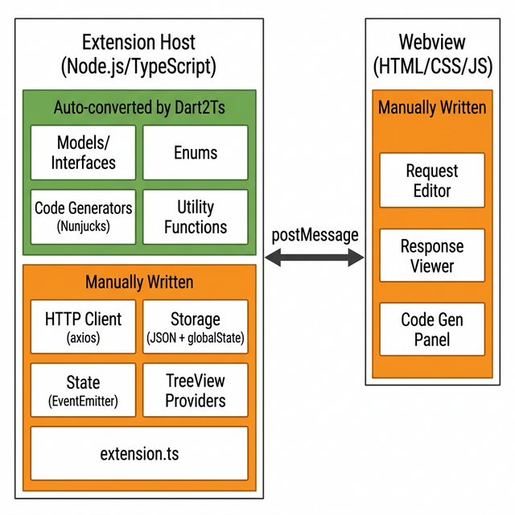

### Initial Idea Submission

**Full Name:** Deep Buha  
**University name:** Indian Institute of Technology, Gandhinagar  
**Program you are enrolled in (Degree & Major/Minor):** B.Tech, Computer Science and Engineering  
**Year:** 2nd Year  
**Expected graduation date:** 2028

**Project Title:** VS Code Extension for API Dash  
**Relevant issues:** No existing GitHub issue, this is a new idea proposal.

- Built a working PoC: [apidash-vscode](https://github.com/DeepBuha06/APIDASH-Extension)
- Demo video: [Watch here](https://youtu.be/zzto-fWGIdE)


---

## Idea Description

### Problem

API Dash only exists as a standalone Flutter desktop app. Developers have to leave their editor every time they want to test an API. VS Code holds 74% market share among developers, and tools like Thunder Client and REST Client show there's real demand for in-editor API clients.

### Approach(preferable)

This project has two parts: a **Dart-to-TypeScript converter tool** that automates porting API Dash's business logic, and the **VS Code extension** itself built from the converter's output.


---

### Part 1: Dart2Ts Converter Tool

API Dash's codebase is well-separated. Models, enums, codegen templates, parsers, and utilities live in `packages/seed`, `packages/apidash_core`, `packages/better_networking`, and `lib/codegen`, all independent of Flutter UI. This means we can port the logic to TypeScript without touching the UI layer.

The converter is a Dart program that uses the official `analyzer` package to parse `.dart` files into an AST (Abstract Syntax Tree), walks each node, and outputs `.ts` files. Using the AST means the converter actually understands the code structure. For example, it knows `String` in `String url` is a type (convert it to `string`) but `String` in `myStringBuilder` is part of a variable name (leave it alone). Regex can't make that distinction.


**7 Converter Modules:**

| Module | What It Converts | How It Works |
|---|---|---|
| Type Converter | `String` to `string`, `List<T>` to `T[]`, `Map<K,V>` to `Record<K,V>` | Lookup table with ~20 type mappings |
| Enum Converter | Dart enums to TypeScript string enums | Reads AST `EnumDeclaration` nodes |
| Freezed Model Converter | `@freezed` classes to TS classes with `copyWith()`, `toJson()`, `fromJson()` and computed getters | Detects `@freezed`, extracts factory params, converts all 20 getters in `HttpRequestModel` using mapping tables |
| Extension Method Converter | Dart extensions to standalone utility functions, rewrites call sites across codebase | Reads `ExtensionDeclaration`, then finds and rewrites every call like `obj.method()` to `method(obj)` |
| Function Converter | Named params, return types, method calls in body | Applies mapping tables: `.contains()` to `.includes()`, `.isNotEmpty` to `.length > 0`, `.any()` to `.some()`, etc. |
| Template String Converter | `"""..."""` / `'''...'''` / `r'...'` to JS backtick literals | Direct syntax swap |
| Import Remapper | `package:jinja` to `nunjucks`, `package:http` to `axios`, skip `dart:io` | Reads from a YAML config file |

The converter's core is about 65 pattern-matching rules spread across these modules. When the AST tells the converter "this is a method call `.contains()`", it looks up the rule and outputs `.includes()`. When it sees "this is a property access `.isNotEmpty`", it outputs `.length > 0`. That's all it does: pattern match and replace, but with full context from the AST.

I traced all 20 computed getters in `HttpRequestModel` (the most complex model in the codebase) and confirmed every single one can be handled by these rules. For example:

```dart
get hasFormData => kMethodsWithBody.contains(method) && formDataMapList.isNotEmpty
```
becomes:
```typescript
get hasFormData() { return kMethodsWithBody.includes(this.method) && this.formDataMapList.length > 0; }
```

**What gets auto-converted:**

| Source | Files | Output |
|---|---|---|
| `packages/seed/lib/models/` | 3 | `src/models/seed.ts` |
| `packages/better_networking/lib/models/` | 7 | `src/models/networking.ts` |
| `packages/apidash_core/lib/models/` | 4 | `src/models/core.ts` |
| `lib/codegen/**/` | 30+ | `src/codegen/**/*.ts` |
| `packages/*/lib/extensions/` | 2 | `src/utils/*.ts` |
| `packages/*/lib/utils/` | 5 | `src/utils/*.ts` |
| All `consts.dart` | 3 | `src/consts.ts` |

About 55-60 files total, producing ~3000+ lines of TypeScript.

**Why build a converter instead of rewriting manually?** Two reasons. First, it saves time since 70% of the work is automated. Second and more importantly, when the main API Dash repo adds a new codegen language or updates a model, we just re-run the converter and get updated TypeScript instantly.

---

### Part 2: VS Code Extension

The extension runs in two environments: the Extension Host (Node.js) for logic, and the Webview (browser-like panel) for UI. They communicate via `postMessage`.



**What comes from the converter (auto-converted):**

| Component | Source |
|---|---|
| Models, Enums, Interfaces | seed, apidash_core, better_networking |
| Code Generators (30+ languages) | `lib/codegen/` via Nunjucks (same `{{ }}` syntax as Jinja, templates port as-is) |
| Utility Functions | `packages/*/utils/` |

**What we write from scratch (VS Code has no Dart equivalent for these):**

| Component | Technology | Why This Choice |
|---|---|---|
| HTTP Client | axios | Handles multipart uploads, request cancellation (`AbortController`), auth interceptors. Alternatives: node-fetch (no interceptors), got (Node-only, larger API), built-in fetch (no cancel, no progress) |
| Storage | JSON files + `globalState` | Each Hive "box" maps to a JSON file on disk. Zero npm dependencies. Alternatives: SQLite (overkill), IndexedDB (browser-only, dies when Webview closes) |
| State Management | `vscode.EventEmitter` + class | Same pattern as Riverpod's `notifyListeners`, but built into VS Code API. Alternatives: RxJS (heavy, 30KB), Zustand (React-focused) |
| Webview UI | Raw HTML/CSS/JS | No build step, fast load. Thunder Client uses the same approach. Alternatives: React (45KB, overkill), Svelte (good but adds build complexity) |
| Sidebar | VS Code TreeView API | Shows collections, environments, history in the sidebar |
| Entry Point | `activate()` / `deactivate()` | VS Code extension lifecycle |

---

### Timeline (175 hours over 12 weeks)

| Week | Focus | Deliverables |
|------|-------|-------------|
| 1 | Converter Foundation | Dart2Ts project scaffold, `analyzer` integration, AST visitor, Type Converter, Enum Converter |
| 2 | Converter Core | Freezed Model Converter (factory params + computed getters), Extension Method Converter (call site rewriting) |
| 3 | Converter Complete | Function Converter, Template String Converter, Import Remapper, run on full API Dash codebase and verify output |
| 4 | Extension Scaffold | `yo code` scaffold, `package.json`, Activity Bar icon, plug in converter output, verify it compiles |
| 5 | Core Services | HTTP client (axios), Storage service (JSON + globalState), unit tests for both |
| 6 | Sidebar | TreeView for collections (create, rename, delete, reorder requests), environment TreeView, commands |
| 7 | Request Editor | Webview panel with URL bar, method dropdown, Send button, params/headers/body tabs, theme via CSS variables |
| 8 | Response Viewer | Status badge, response time, headers, syntax-highlighted body (highlight.js), raw/preview toggle |
| 9 | Code Generation | Wire up all 30+ Nunjucks generators, code gen panel in Webview (language picker, copy button) |
| 10 | Import + Environments | cURL import (`curlconverter`), Postman import, environment variables with `{{variable}}` substitution |
| 11 | History + Polish | Request history with date grouping, keyboard shortcuts (Ctrl+Enter to send), status bar, error handling |
| 12 | Testing + Release | Unit tests (Mocha), integration tests, docs, package as `.vsix`, marketplace prep |

---

### Technical Dependencies

| Package | Purpose |
|---------|---------|
| [`analyzer`](https://pub.dev/packages/analyzer) | Parses Dart code into AST for the converter |
| [`nunjucks`](https://www.npmjs.com/package/nunjucks) | Template engine (same syntax as Jinja) |
| [`axios`](https://www.npmjs.com/package/axios) | HTTP client |
| [`highlight.js`](https://www.npmjs.com/package/highlight.js) | Syntax highlighting in response viewer |
| [`curlconverter`](https://www.npmjs.com/package/curlconverter) | cURL command parser |
| [`@vscode/test-electron`](https://www.npmjs.com/package/@vscode/test-electron) | Extension integration testing |

---

### What I've Done So Far

- Forked the repo, set up the dev environment, run the app on Windows, and went through the entire codebase
- Studied the monorepo structure and how `seed`, `apidash_core`, `better_networking`, `curl_parser` depend on each other
- Traced all 20 computed getters in `HttpRequestModel` to confirm each one maps to the converter's pattern rules
- Compared alternatives for every technology choice (template engine, HTTP client, storage, UI, state management) with pros and cons
- Designed the full converter architecture with 7 modules and ~65 mapping rules
