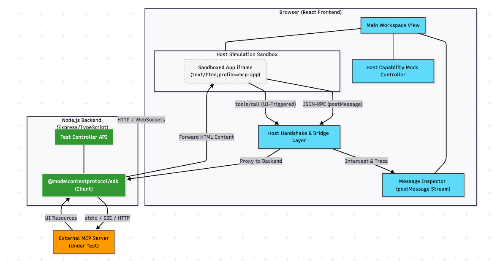

### Initial Idea Submission

**Full Name:** Ikeoffiah Pius  
**University name:** Federal University of Technology Owerri  
**Program you are enrolled in (Degree & Major/Minor):** B.Tech  
**Year:** Graduated  
**Expected graduation date:** 2019  

**Project Title:** MCPApps Tester — A Dedicated Testing & Debugging Environment for MCP Apps  
**Relevant issues:** https://github.com/foss42/apidash/discussions/1225  

## Idea description

This proposal introduces **MCPApps Tester**, a dedicated web-based testing and debugging environment for **MCP Apps**. While other proposals focus on testing standard MCP backend primitives (Tools, Resources, Prompts), this project specifically addresses a major gap in the ecosystem: the lack of tooling to validate the rich, interactive UI extensions of MCP servers.

By building this suite using **React, Node, and TypeScript**, the project aligns with the core MCP developer ecosystem and the specific tech stack preferences mentioned in the official GSoC discussion.

---

## Problem Statement

MCP Apps allow MCP servers to deliver **interactive, sandboxed iframe-based UIs** (like forms or data visualizations) directly to AI hosts. Developers building these MCP Apps currently face severe testing roadblocks:

1. **No Sandbox Testing Harness:** The `ui/initialize` handshake, host capability discovery, and context updates cannot be tested with traditional MCP testing tools.
2. **Opaque iframe Communication:** MCP Apps communicate with hosts via `postMessage`. Debugging this JSON-RPC stream requires a live AI host (like VS Code Insiders); there is no standalone developer tool to inspect these messages.
3. **Untested UI-to-Backend Tool Calls:** When a user clicks a button inside the MCP App, it can trigger `tools/call` to the server. This UI-initiated execution path is invisible to standard tool-testing CLI scripts.
4. **No Capability Mocking:** MCP Apps invoke host capabilities like `open_link`, `add_message_to_chat`, or `resize_iframe`. Developers cannot currently mock these to test how their UI degrades when a host rejects a capability.

---

## Proposed Solution: MCPApps Tester (React/Node Suite)

A standalone web application that acts as a **simulated MCP host environment** capable of loading, rendering, and comprehensively testing MCP Apps.

### Core Architecture

**Architecture Description:**
The system is built as a **React + Express** application that bridges the developer and any MCP server:
1. **React Frontend:** Provides a "Sandbox Loader" for the MCP App iframe and a real-time "Message Inspector" to visualize JSON-RPC traffic.
2. **Host Simulation Layer:** Intercepts `postMessage` calls from the sandboxed iframe, simulating the handshake and host capabilities (`open_link`, etc.).
3. **Node/TypeScript Backend:** Uses the official `@modelcontextprotocol/sdk` to connect to the MCP server (via stdio or SSE), fetches UI resources, and forwards tool calls initiated from the UI.

---

## Key Features

### Feature 1 — MCP App Discovery & Loader
Connect to any MCP server and auto-discover tools with UI bindings (`_meta.ui.resourceUri`). It fetches the HTML resource and renders it in a spec-compliant sandboxed iframe.

### Feature 2 — Simulated Host & Handshake
The suite implements the full MCP Apps host protocol, handling the `ui/initialize` handshake and responding with configurable `hostContext` and capabilities.

### Feature 3 — Bidirectional Message Inspector
A live, filterable stream of every `postMessage` exchanged between the host and the MCP App iframe. This makes the opaque communication layer completely transparent for debugging.

### Feature 4 — Host Capability Mocking
A UI panel to pre-configure how the simulated host responds to capability calls. Developers can test "Auto-Allow" or "Auto-Deny" scenarios to ensure their UI handles host restrictions gracefully.

### Feature 5 — UI-to-Backend Tool Tracing
When a user interacts with the rendered MCP App (e.g., clicking "Submit"), the suite traces the resulting `tools/call` all the way to the backend MCP server and back, providing end-to-end visibility.

### Feature 6 — Automated Protocol Compliance Checker
A suite of automated checks to verify the MCP App follows the specification (handshake timing, MIME types, CSP safety, and JSON-RPC 2.0 validity).

---

## Implementation Plan & Milestones

### Milestone 1 — MCP App Loader & Handshake Foundation
- Setup Node/TS backend with the official MCP SDK.
- Implement UI resource fetching and sandboxed iframe rendering.
- Complete the host handshake protocol (`ui/initialize`).

### Milestone 2 — Message Inspector & Mock Layer
- Build the React Message Inspector to visualize `postMessage` traffic.
- Implement the Host Capability Mocking panel.
- Support forwarding UI-initiated `tools/call` to the server.

### Milestone 3 — Compliance Engine & Saved Scenarios
- Build the automated compliance checker with 8+ protocol checks.
- Implement a format for saving and replaying test scenarios.
- Add support for exporting test traces as JSONL.

### Milestone 4 — UI Polish & Documentation
- Refine the React interface for a professional developer experience.
- Finalize documentation, compliance scorecards, and demo examples.

