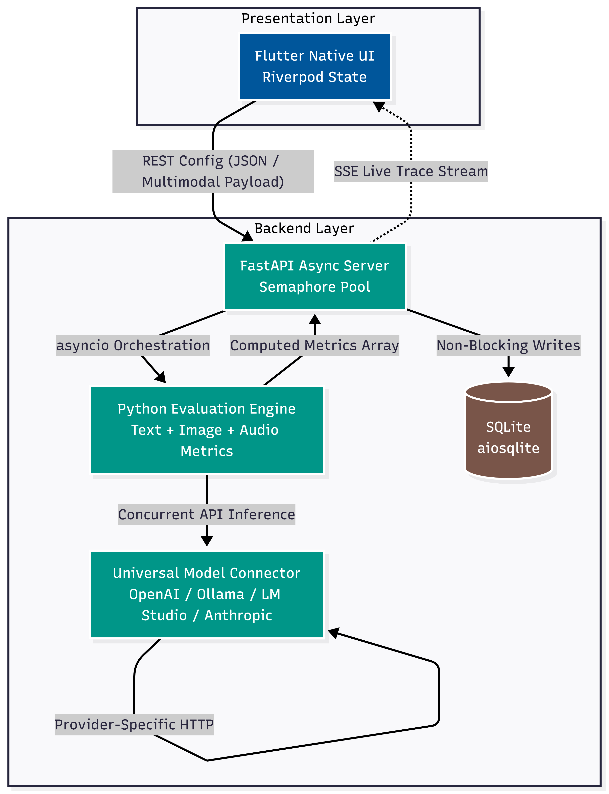
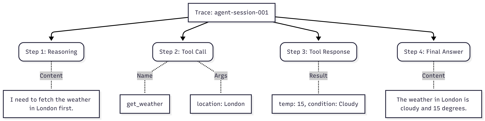

# **API Dash: Multimodal AI & Agent API Evaluation Framework**

## **1. PERSONAL INFORMATION**

- **Full Name:** Karim Yasser Ali Azab
- **Contact Info:** [karimmyasserr@gmail.com](mailto:karimmyasserr@gmail.com)
- **Discord Handle:** `karimmyasser`
- **GitHub Profile:** [karimmyasserr](https://github.com/karimmyasser)
- **LinkedIn:** [karimmyasserr](https://linkedin.com/in/karimmyasserr)
- **Time Zone:** UTC+2 (Egypt)
- **Resume:** [Resume Link](https://drive.google.com/file/d/1u2vo_rTsctQiH9rx5_oAJSKXCZcBOFbr/view)

## **2. UNIVERSITY INFORMATION**

- **University Name:** Cairo University
- **Program Enrolled In:** Bachelor of Computer Engineering
- **Year:** 3rd Year (Pre-final Year)
- **Expected Graduation Date:** 2027

---

## **3. MOTIVATION & PAST EXPERIENCE**

### **3.1 Have you worked on or contributed to a FOSS project before?**

Yes, my active foray into Free and Open Source Software (FOSS) has begun directly with API Dash. I have already started engaging with the codebase, understanding the state management, and submitting Pull Requests:

- **[PR #1317 (Open)] Add Custom AI Model:** I implemented the ability for users to add custom AI models directly within the AI Model Selector dialog, resolving the related tracking issue. This required updating `dialog_add_ai_model.dart` to handle data contracts and refreshing the local Provider state.
- **[PR #1314 (Closed — Scope Refinement)] URL API Type Auto-Detection:** I built a comprehensive auto-detection engine that parses user-entered URLs and automatically switches the API request mode (REST / GraphQL / AI). I wrote regex-based signal detection in `api_type_utils.dart`, wired manual override configurations into Riverpod, and wrote the respective unit tests.

Even if these initial PRs are early proposals, diving into the API Dash repository to build these features has given me a strong, hands-on understanding of the project's state management, UI architecture, and contribution guidelines. I am highly motivated to make a lasting impact on how developers test AI models globally through this GSoC project.

### **3.2 What is your one project/achievement that you are most proud of? Why?**

The project I am most proud of is **iSupply**, a comprehensive Pharmacy POS and Management System, which ultimately **won first place in a 30+ team hackathon and earned me a full-time position offer.** I engineered the entire solution end-to-end, utilizing **Flutter** for a responsive, cross-platform frontend and **Supabase (PostgreSQL) alongside an offline MySQL server** for a robust backend.

_Why I am proud of it:_
It was a significant technical challenge that required me to bridge backend complexity with frontend simplicity under strict hackathon time constraints. It had to handle real data seamlessly, teaching me how to rapidly optimize complex SQL queries and design an intuitive UI that non-technical staff could use flawlessly.

_Other notable achievements include winning **1st place** in the ODC x INSTANT AI Hackathon by engineering a 3D brain tumor segmentation pipeline with PyTorch and FastAPI._

### **3.3 What kind of problems or challenges motivate you the most to solve them?**

I am deeply motivated by challenges surrounding **Developer Tooling (DevTools), System Architecture, and Workflow Automation**. Experience with low-level systems (cmpsh) and ML pipelines fuels my passion for developer-centric infrastructure like Docker or Postman. I enjoy solving:

1. **Performance Bottlenecks:** Designing efficient systems, such as optimizing a 3D medical imaging pipeline by 40x or implementing paginated lists for Flutter apps to handle thousands of products without locking the UI.
2. **Abstraction Design:** Building unified interfaces that abstract complex logic, like creating self-healing multi-agent execution loops for divergent AI APIs via LangGraph.
3. **State Management:** Elegantly handling asynchronous data flows and offline synchronization in Flutter using tools like Riverpod and Bloc to ensure maintainable architectures.

### **3.4 Will you be working on GSoC full-time?**

Yes, I will dedicate significant time to this project. During the Community Bonding period and the very first weeks of coding, I will be wrapping up my university term, but my schedule allows for consistent, daily contributions. Once my summer vacation begins, I will transition to working strictly full-time (40+ hours/week) exclusively on API Dash without any academic distractions.

### **3.5 Do you mind regularly syncing up with the project mentors?**

I consider communication to be the most critical component of a successful project. I am highly proactive in providing updates and seeking feedback. Since the API Dash team uses **Discord**, I am extremely comfortable using it for daily asynchronous updates. I am also readily accessible via **email** or **LinkedIn**, and I am more than happy to join weekly or bi-weekly video calls with mentors to review code, discuss architectural pivots, and plan upcoming milestones.

### **3.6 What interests you the most about API Dash?**

API Dash stands out in the crowded API client space because of its commitment to speed and resource efficiency. The decision to build it natively using Flutter / Dart—bypassing the heavy RAM requirements of Electron or Chromium wrappers used by industry alternatives like **Postman** and **Insomnia**—makes it incredibly snappy and lightweight. Furthermore, this Flutter foundation allows API Dash to boast unmatched **cross-platform mobile compatibility** (iOS/Android), providing on-the-go API testing capabilities that heavy desktop-bound competitor frameworks simply cannot support. Finally, I am incredibly excited by API Dash's forward-looking roadmap. The platform's ambition to embrace modern paradigms by supporting complex **Agentic AI testing**, alongside protocols like **WebSockets** and **gRPC**, perfectly aligns with my own technical interests in building next-generation developer tools.

### **3.7 Can you mention some areas where the project can be improved?**

While API Dash is exceptionally fast, evaluating its official ROADMAP and issue tracker reveals several exciting avenues for major enhancements:

- **Alternative Protocol Support (Issues #14, #15, #116):** As real-time applications and microservices grow, extending API Dash beyond standard HTTP/REST to fully support `gRPC`, `WebSockets`, and `Server-Sent Events (SSE)` would make it a complete testing powerhouse.
- **API Workflow Builder (Issue #120):** Currently, requests are mostly isolated. Creating a visual or scriptable workflow builder that chains requests together (e.g., passing a token from an Auth request directly into a restricted Data fetch) would vastly increase utility for complex enterprise integrations.
- **AI & Agentic Evaluation:** As Generative AI scales rapidly, standard "Request → JSON Response" testing is no longer sufficient. Developers need a way to benchmark 1,000+ dynamic AI prompts against LLMs simultaneously to calculate accuracy and BLEU scores, rather than just testing a single manual `POST` request. Moreover, multimodal AI—models that generate images, audio, and complex structured outputs—demands new evaluation primitives entirely beyond what current API clients offer.

---

## **4. LITERATURE REVIEW & RESEARCH FOUNDATION**

To ground this proposal in the current state of the art, I synthesized key findings from **seven recent peer-reviewed papers** and **Stanford's graduate-level LLM Evaluation curriculum** (CME295). These foundational sources directly drive our architectural decisions.

### **4.1 Agent Evaluation & Diagnostic Limitations**

Recent survey papers (arXiv:2503.12687, arXiv:2601.01743) establish that agent evaluation is fundamentally harder than standalone LLMs due to long-horizon credit assignment and hidden token costs. Furthermore, diagnostic frameworks like **TopoBench** (arXiv:2603.12133) emphasize that granular failure analysis is far more actionable than binary pass/fail metrics. This research directly motivates our **Agent Trace Viewer** (Section 6.6) for step-by-step credit assignment and our **Cost vs. Latency Profiler** (Section 6.8).

### **4.2 Multi-Expert Grading & LLM-as-Judge Robustness**

Relying on single-metric evaluation or unprotected LLM judges often leads to missed quality dimensions (**SPEED**, arXiv:2509.20097) and adversarial reward hacking (arXiv:2603.12246). Similarly, **BEHELM** (arXiv:2601.21070) exposes the risks of data leakage in non-standardized evaluation pipelines. These peer-reviewed findings, alongside bias taxonomies from **Stanford CME295**, validate our **Plugin-Based Extensibility** for multi-expert scoring, **Structured Output Validation**, and standardized ingestion pipelines.

### **4.3 Run-Centric Multimodal Platform Design & Dual-Metric Evaluation (MUSE)**

_"MUSE: A Run-Centric Platform for Multimodal Unified Safety Evaluation"_ (arXiv:2603.02482, Duke University / Virtue AI, 2025) is the most directly relevant prior work to this proposal. Three of its innovations deeply shape our architecture:

**1. Run-Centric Architecture:** MUSE organizes evaluations as persistent "run" entities anchoring all inputs, outputs, and artifacts—directly inspiring our **run-centric SQLite schema**.

**2. Cross-Modal Payload Pipeline:** Validates our multimodal dataset schema (Section 6.3) that unifies text, image, and audio under a single format.

**3. The Fatal Flaw of Binary Metrics:** MUSE proves binary pass/fail collapses a rich behavioral spectrum into a single number. For multimodal tasks, an image capturing 80% of a prompt is not equivalent to a blank output. This framework replaces binary scoring with a **MUSE-inspired Five-Level Quality Taxonomy** applied uniformly across all modalities:

| Level | Label              | Text Eval                      | Image Generation Eval                 | Audio Eval                     |
| ----- | ------------------ | ------------------------------ | ------------------------------------- | ------------------------------ |
| 5     | **Full Match**     | Exact/semantic answer          | Prompt fully realized in image        | Perfect transcription          |
| 4     | **Partial Match**  | Correct but verbose            | Main subject correct, details missing | Minor word errors              |
| 3     | **Indirect Match** | Topically relevant, not direct | Loosely related scene                 | Intelligible but wrong content |
| 2     | **Mismatch**       | On-topic but wrong             | Wrong subject / style                 | Clearly wrong transcription    |
| 1     | **Non-Responsive** | Refused / empty                | Blank, filtered, or corrupted output  | Silent / unintelligible        |

From this taxonomy, two complementary scores are derived — directly mirroring MUSE's **dual-metric framework** — applied consistently regardless of modality:

- **Hard Score:** % of items at Level 5 (Full Match only).
- **Soft Score:** % of items at Level 4 or 5 (Full + Partial Match).
- **Gray Zone Width (GZW):** `Soft Score − Hard Score`. A high GZW on image generation means the model understands prompts but lacks fidelity; on transcription it flags recognizable-but-imprecise ASR. Far more actionable than a single accuracy number across all modalities.

### **4.4 Research Summary & Gap Analysis**

| Research Theme         | Key Source(s)                      | Identified Tooling Gap                                                                       | Our Framework's Solution                              |
| ---------------------- | ---------------------------------- | -------------------------------------------------------------------------------------------- | ----------------------------------------------------- |
| Agent Evaluation       | arXiv:2503.12687, arXiv:2601.01743 | Existing tools lack granular step-by-step credit assignment for multi-turn loops.            | Agent Trace Viewer, Cost Profiler                     |
| Multi-Expert & Judges  | arXiv:2509.20097, arXiv:2603.12246 | Single-metric pass/fail scores miss critical nuances and are vulnerable to judge bias.       | Plugin multi-metric scoring, Multi-judge comparison   |
| Diagnostic & SE Gaps   | arXiv:2603.12133, arXiv:2601.21070 | Current benchmarks are monolithic; failure modes are hard to isolate without proper logging. | Diagnostic filtering, Validated dataset ingestion     |
| Run-Centric Multimodal | arXiv:2603.02482 (MUSE)            | Tools focus only on text, lacking mechanisms to grade generated multimedia artifacts.        | Five-level taxonomy, Hard/Soft Score, Gray Zone Width |

---

## **5. PROJECT TITLE: Multimodal AI & Agent API Evaluation Framework**

### **5.1 Abstract**

As developers rapidly integrate AI APIs, existing evaluation tools remain overwhelmingly text-centric. This proposal builds an **end-to-end Multimodal AI Evaluation Platform**—heavily inspired by the **MUSE** (Multimodal Unified Safety Evaluation) framework—as a standalone companion project to API Dash.

Our core architectural philosophy is that **multimodal evaluation (image, audio, and cross-modal routing) is the primary focus.** For standard text comprehension and reasoning tasks, rather than reinventing the wheel, the Python backend acts as a GUI orchestrator that heavily leverages and **wraps industry-standard frameworks like `lm-evaluation-harness` and `lighteval`**.

Where this platform truly innovates is in **Generation Evaluation**: introducing MUSE-inspired cross-modal payload delivery, VLM-as-a-Judge pipelines, and Inter-Turn Modality Switching (ITMS) to test whether safety and alignment hold across modality boundaries. The system provides a unified Native Flutter dashboard treating text, image, and audio endpoints (OpenAI-compatible, LM Studio, Ollama, Anthropic) as equal priorities.

### **5.2 Proof of Concept (The MVP)**

To prove the technical feasibility of this architecture, **I have already built a Minimum Viable Product (MVP)** of this exact stack prior to this proposal.

- **The MVP Repository** validates the zero-config `SQLite` tracking, the `FastAPI` orchestration, and the `Flutter` frontend currently communicating via **Server-Sent Events (SSE)** streams.
- During GSoC, the goal is not to "prototype," but to fully mature this MVP into a production-ready, standalone AI evaluation platform. We will deepen the SSE integration using API Dash's native `better_networking` architecture, wrap standard benchmarks (`lm-harness`, `lighteval`), introduce a dedicated **Agent Trace Viewer**, and—most crucially—extend the evaluation pipeline from text-only to **image and audio modalities** as first-class citizens.

> **[MVP Demonstration Video](https://github.com/user-attachments/assets/f2740e60-8feb-4904-aabe-5a292b989fbd)**

https://github.com/user-attachments/assets/f2740e60-8feb-4904-aabe-5a292b989fbd

> _A short video walkthrough demonstrating the end-to-end MVP flow: configuring an API provider, launching a dataset evaluation, observing SSE log streaming, and viewing the final metrics._
> **Note:** I've reviewed the [AI policy](https://github.com/foss42/apidash/discussions/1055). While I leveraged AI assistance to accelerate development under time pressure, I have a solid grasp of all implemented concepts. I'm comfortable explaining and defending any design decisions or technical choices made here.

### **5.3 Integration Strategy: Why Native Flutter Beats Web-Wrappers**

By strictly building this framework as a **Native Flutter frontend** paired with a Python backend, we guarantee:

1. **Architectural Flexibility (Merge vs Standalone):** The Dashboard can seamlessly be merged into the main API Dash codebase as a dedicated tab. Building it in Native Flutter gives API Dash the ultimate flexibility to choose either path without maintaining two completely fragmented UI codebases.
2. **Unified Theming & Providers:** We can inherently share API Dash's existing Riverpod state management, HTTP interceptors, and custom Glassmorphism themes directly.
3. **Workspace Deep Integration:** Developers will be able to export an API Dash workspace, and our Evaluation Dashboard will instantly parse the native `HttpRequestModel` JSON to populate the testing environment—ensuring API keys and prompts stay entirely secure on the local host.
4. **True Native Multiplatform Support:** By writing the UI natively in Flutter, the evaluation dashboard gains instant, out-of-the-box compatibility with macOS, Windows, Linux, Android, and iOS—perfectly mirroring API Dash's current ubiquitous platform reach.

### **5.4 Integration with Existing Frameworks (lm-evaluation-harness & lighteval)**

Rather than building a text evaluation framework from scratch, a major technical pillar of this project is to build seamless GUI wrappers around **`lm-evaluation-harness`** and **`lighteval`**. These industry-standard frameworks are exceptional at evaluating text reasoning and standard NLP benchmarks. The FastAPI backend will serve as an orchestration layer, allowing users to configure, trigger, and visualize `lm-harness` and `lighteval` suites directly from the Flutter dashboard.

> **The Multimodal Gap:** While we deeply integrate `lm-harness` and `lighteval` for text, they are fundamentally built for **Understanding Evaluation** (`Text-In → Text-Out`). They grade a model's _comprehension_, not its _generation_ of non-text artifacts.

| Tool                      | Architecture                              | How Our Framework Employs or Extends It                                          |
| ------------------------- | ----------------------------------------- | -------------------------------------------------------------------------------- |
| **lm-evaluation-harness** | `Text-In → Text-Out` (NLP Understanding)  | **Wrapped by our backend** to execute standard NLP benchmarks with a visual GUI. |
| **lighteval**             | `Text-In → Text-Out` (Understanding Eval) | **Wrapped by our backend** for fast, local LLM evaluation metrics.               |
| **Our Native Framework**  | `Text-In → Image/Audio-Out` (Generation)  | Fills the multimodal gap using a **MUSE-inspired** VLM-as-a-Judge pipeline.      |

**Our unique contribution:** We provide a **visual, GUI-first** dashboard that heavily wraps `lm-harness`/`lighteval` for text benchmarks, while introducing a completely parallel **multimodal evaluation engine** for generation tasks. No existing tool offers a native UI combining standard text benchmark wrappers with real-time SSE streaming and MUSE-inspired multimodal dataset management.

### **5.5 Scope Prioritization (MoSCoW)**

> **Key correction from mentor feedback:** Multimodal evaluation (text, image, audio) is a **core project requirement**, not a stretch goal. All endpoint types (OpenAI-compatible, Ollama, LM Studio, Anthropic-compatible) are **equal priority**.

| Priority                   | Features                                                                                                                                                                                                                                                                                                | Rationale                                                 |
| -------------------------- | ------------------------------------------------------------------------------------------------------------------------------------------------------------------------------------------------------------------------------------------------------------------------------------------------------- | --------------------------------------------------------- |
| **Must Have**              | Core evaluation pipeline (FastAPI + SQLite), SSE log streaming, Dataset CRUD + preview (JSON, CSV, JSONL, PDF, image, audio), Model config management for all endpoint types, Text evaluation (exact match, BLEU, ROUGE), Results dashboard (accuracy, latency, per-item table), Result CSV/JSON export | Minimum standalone product that delivers end-to-end value |
| **Must Have**              | **Multimodal evaluation pipeline**: image generation evaluation (CLIP similarity, FID), audio evaluation (WER — Word Error Rate, CER), multimodal input support (image+text, audio+text prompts)                                                                                                        | Core project requirement per project specification        |
| **Should Have**            | Agent Trace Viewer (multi-turn trace UI), **Comprehensive GUI Wrappers for `lm-harness` & `lighteval`**, Universal endpoint connector, **Automated Red-Teaming & ITMS** (MUSE's Inter-Turn Modality Switching)                                                                                          | Core technical differentiators                            |
| **Could Have**             | Plugin-based scoring extensibility, Cost vs. Latency Profiler chart, Structured output (JSON/Regex) validation                                                                                                                                                                                          | High-impact features if timeline permits                  |
| **Won't Have (this GSoC)** | Reverse tunneling (ngrok/Cloudflare) UI integration, Localhost auto-detection, Mobile-optimized UI                                                                                                                                                                                                      | Documented as future work for post-GSoC contributions     |

> The **Must Have** items constitute the core GSoC deliverable. **Should Have** items are stretch goals for the second half of the coding period. Everything else is explicitly deferred.

---

## **6. DETAILED ARCHITECTURE & TECHNICAL IMPLEMENTATION**

### **6.1 System Architecture Overview**



1. **User Input (Flutter Web/Desktop UI):** User defines API credentials, parameters, benchmark dataset selection, and modality (text / image / audio).
2. **Job Dispatch:** Flutter sends an HTTP POST request to the local Python FastAPI Engine.
3. **Async Orchestrator (FastAPI + SQLite):** Saves the job state to SQLite via `aiosqlite` and dispatches the execution task.
4. **Universal Model Connector:** All endpoint types (OpenAI, Ollama, LM Studio, Anthropic) are handled by a single `UniversalConnector` that normalizes provider-specific schemas into a common format.
5. **Python Evaluation Engine:** Handles text normalization and exact/BLEU/ROUGE matching for text; CLIP similarity and FID for image generation; WER/CER for audio transcription — using `asyncio` concurrency.
6. **SSE Streaming:** FastAPI pushes live logs and progress percentages to the Flutter UI via Server-Sent Events.
7. **Result Analysis:** Flutter fetches consolidated SQLite results and renders leaderboards and charts.

### **6.2 The Universal Model Connector**

A central design goal is ensuring all endpoint types have **equal priority and architectural symmetry**. Rather than treating OpenAI as the primary adapter and others as edge cases, the `UniversalConnector` uses a provider-agnostic protocol:

```python
from typing import Protocol, Dict, List, Any, Literal

Modality = Literal["text", "image", "audio"]

class ModelConnector(Protocol):
    async def invoke(
        self,
        inputs: List[Dict[str, Any]],   # Normalized input: {modality, content, ...}
        parameters: Dict[str, Any]
    ) -> List[Dict[str, Any]]:           # Normalized output: {modality, content, latency_ms, ...}
        ...

class OpenAIConnector:
    """Handles: OpenAI, any OpenAI-compatible endpoint (LM Studio, Ollama via /v1/)"""
    def __init__(self, base_url: str, api_key: str, model: str): ...
    async def invoke(self, inputs, parameters) -> List[Dict]: ...

class OllamaConnector:
    """Handles: Ollama native /api/chat endpoint"""
    def __init__(self, base_url: str, model: str): ...  # No API key required
    async def invoke(self, inputs, parameters) -> List[Dict]: ...

class AnthropicConnector:
    """Handles: Anthropic Claude API (/v1/messages schema)"""
    def __init__(self, api_key: str, model: str): ...
    async def invoke(self, inputs, parameters) -> List[Dict]: ...
```

- **OpenAI-compatible endpoints** (including LM Studio and Ollama's `/v1/` mode) share the same `OpenAIConnector` with configurable `base_url`.
- **Ollama native endpoint** uses its own `OllamaConnector` targeting the `/api/chat` schema.
- **Anthropic** uses its own `AnthropicConnector` targeting the `/v1/messages` schema.
- All connectors normalize outputs to the same internal schema before the evaluation engine processes them.

### **6.3 Multimodal Evaluation Pipeline**

This is a primary objective of the project. The pipeline must handle all combinations of inputs and outputs across text, image, and audio modalities.

#### **6.3.1 Supported Modality Combinations**

| Input Modality | Output Modality | Example Use Case                                 | Evaluation Metrics                                      |
| -------------- | --------------- | ------------------------------------------------ | ------------------------------------------------------- |
| Text           | Text            | Standard LLM chat completions                    | Exact Match, BLEU, ROUGE, Semantic Similarity           |
| Text           | Image           | Image generation (DALL-E, Stable Diffusion APIs) | CLIP Similarity Score, FID (Fréchet Inception Distance) |
| Text           | Audio           | Text-to-Speech APIs                              | MOS estimation, audio format validation                 |
| Image + Text   | Text            | Vision LLMs (GPT-4o vision, LLaVA)               | Exact Match, BLEU, LLM-as-Judge                         |
| Audio + Text   | Text            | Audio transcription (Whisper API)                | WER (Word Error Rate), CER (Character Error Rate)       |
| PDF / JSON     | Text            | Document QA, structured extraction               | Exact Match, JSON Schema Validation                     |

#### **6.3.2 Dataset Schema for Multimodal Evaluation**

The dataset ingestion pipeline handles multimodal datasets via a unified JSON schema:

```json
{
  "modality": "image_generation",
  "items": [
    {
      "input": {
        "type": "text",
        "content": "A photorealistic sunset over the Nile river"
      },
      "expected_output": {
        "type": "image_reference",
        "clip_description": "A warm-toned sunset scene with a wide river and palm trees"
      }
    }
  ]
}
```

For audio evaluation:

```json
{
  "modality": "audio_transcription",
  "items": [
    {
      "input": {
        "type": "audio",
        "file_path": "samples/clip_001.wav"
      },
      "expected_output": {
        "type": "text",
        "content": "The quick brown fox jumps over the lazy dog"
      }
    }
  ]
}
```

#### **6.3.3 The Evaluation Architecture: Two Distinct Pipelines**

The core innovation of this framework is recognizing that evaluation must be split into two fundamentally different pipelines based on the task type:

**Pipeline A — Standard Understanding Evaluation (Wrappers for `lm-harness` & `lighteval`):**  
For standard text reasoning and NLP comprehension tasks, the framework relies entirely on **`lm-evaluation-harness`** and **`lighteval`**. The backend exposes `lm_harness_adapter.py` and `lighteval_adapter.py` to trigger these existing frameworks as subprocesses, pipe their output into our SQLite schema, and render the results dynamically in the Flutter UI.

**Pipeline B — Generation & ITMS Evaluation (MUSE-Inspired Backbone):**  
Because standard understanding tools have no mechanism to grade _generated_ images or audio, the framework introduces a **MUSE-inspired Multi-Turn Generation pipeline**. It supports **Inter-Turn Modality Switching (ITMS)**—cycling across text, audio, and image delivery mid-conversation to test alignment erosion—and a **VLM-as-a-Judge** grading pipeline. The flow is:

1. The Flutter UI sends a prompt to the backend.
2. The backend calls the Image/Audio Generation API and receives the generated artifact.
3. The backend sends _both the original prompt and the generated artifact_ to a strong VLM judge (configurable: GPT-4o, Claude 3.5, or a local Ollama vision model).
4. The VLM scores the artifact on axes like **prompt alignment**, **aesthetic quality**, and **harmful content absence**, returning a structured JSON score.
5. The score is persisted to SQLite and surfaced in the API Dash results dashboard.

```python
# services/vlm_judge.py — Generation Evaluation via VLM-as-a-Judge
async def grade_generated_image(
    prompt: str,
    image_bytes: bytes,
    judge_connector: ModelConnector
) -> dict:
    """Sends the prompt + generated image to a VLM judge for scoring."""
    grading_prompt = (
        f'You are a strict evaluator. Rate the following image on a scale of 0-10 '
        f'for prompt alignment.\nOriginal Prompt: "{prompt}"\n'
        f'Return JSON: {{"prompt_alignment": <0-10>, "rationale": "<str>"}}'
    )
    response = await judge_connector.invoke(
        inputs=[{"type": "text", "content": grading_prompt},
                {"type": "image_bytes", "content": image_bytes}],
        parameters={"response_format": "json_object"}
    )
    return json.loads(response[0]["content"])
```

**Python Evaluation Modules by Modality:**

- **Image/Audio Evaluation (`media_eval.py`):** Native parsing for WER/CER (audio) and CLIP similarity (image). Employs **VLM-as-a-Judge** for generation tasks, adhering to the MUSE Five-Level Quality Taxonomy.
- **Standard Text Benchmarks (`adapter_service.py`):** Dedicated wrapper modules (`lm_harness_adapter.py`, `lighteval_adapter.py`) treating these external frameworks as first-class citizens, bridging their standard CLI outputs into our real-time streaming UI format.
- **Red-Teaming Engine (`itms_runner.py`):** Executes MUSE's Inter-Turn Modality Switching and multi-turn adversarial loops (Crescendo/PAIR).

### **6.4 Agent Trace Design**

Testing an AI Agent is fundamentally different from testing an LLM. Agents perform loops: `Think → Call Tool → Observe → Repeat`. Evaluating them requires solving the **long-horizon credit assignment problem**—pinpointing exactly which step in a multi-step chain caused a downstream failure.

#### **6.4.1 Proposed Agent Trace Architecture**

Rather than requiring users to deeply instrument their agents, the framework exposes a **lightweight `/trace` HTTP endpoint** where agent loops can `POST` their intermediate steps. This design is intentionally framework-agnostic: it works with LangChain, LangGraph, AutoGen, or any custom loop.

_Trace Step Schema:_

```json
{
  "session_id": "agent-session-001",
  "step_index": 2,
  "step_type": "tool_call",
  "content": {
    "tool_name": "get_weather",
    "arguments": { "location": "London" },
    "result": { "temp": 15, "condition": "Cloudy" }
  },
  "latency_ms": 342,
  "timestamp": "2025-07-14T10:23:11Z"
}
```

Supported `step_type` values: `reasoning`, `tool_call`, `tool_response`, `final_answer`, `error`.

#### **6.4.2 Agent Evaluation Metrics**

- **Task Completion Rate:** Did the agent produce a final answer matching the expected output?
- **Step Efficiency:** How many tool calls were needed vs. what the optimal trace would require?
- **Error Recovery:** Did the agent gracefully handle a tool returning an error?
- **Credit Assignment:** The trace tree UI allows developers to pinpoint which exact step caused a downstream failure.

_Trace Data Structure:_



_UI Implementation:_ An **Expandable Tree View** in Flutter renders multi-turn JSON logs. Developers can collapse "tool calls" to quickly read the reasoning trace, or expand them to debug malformed tool schemas.

### **6.5 The Dependency-Lite Python Execution Engine**

A major constraint discussed by the community (#1136, #1226) is avoiding heavy dependencies (like Redis, Celery) that would bloat API Dash.

#### **6.5.1 Python FastAPI Orchestrator**

- **FastAPI Core:** A lightweight, async REST server managing HTTP routing and subprocess orchestration via `asyncio.create_subprocess_exec`.
- **Zero-Config State Tracking:** We use `SQLite` and `SQLAlchemy`. The database file resides in the user's application data directory, requiring absolutely no external database containerization.

_SQLite Schema Detail:_


- **Intelligent Rate Limiting:** A `Governor` loop using `asyncio.Semaphore` pauses and retries batches with exponential backoff on `HTTP 429`, guaranteeing large evaluations do not instantly fail.

### **6.6 Real-time Log Streaming via SSE (Leveraging API Dash's Native Architecture)**

Evaluating a model against a dataset of 5,000 rows might take an hour. Standard REST APIs will timeout, and WebSockets require complex two-way message handling.

_Solution:_ **Server-Sent Events (SSE)**.

Rather than building a custom SSE client from scratch, this framework directly integrates with API Dash's existing unified streaming architecture. By studying the `better_networking` package and `CollectionStateNotifier`, the evaluation runner will utilize this exact elegant pattern:

1. **Unified Request Model:** The evaluation job is initiated via the `streamHttpRequest` function. By passing `isStreaming: true` to the `RequestModel`, SSE is treated simply as an HTTP stream content-type rather than a separate protocol constraint.
2. **Chunk Accumulation:** As evaluation events stream in from the FastAPI backend, the Riverpod worker listens to the `StreamedResponse`, accumulating chunks dynamically into the `sseOutput` list.
3. **Reactive GUI:** A dedicated `StateNotifierProvider` tracks this `sseOutput` list. The live terminal UI uses `ListView.builder` to reactively render incoming server events with auto-scroll and update the progress indicator without rebuilding the entire screen widget tree, ensuring 60 FPS performance.

### **6.7 Tabbed Evaluation UX (Flutter)**

#### **Tab 1: Execution & Configuration**

- **Provider & Endpoint Selection:** Dropdowns for endpoint type (OpenAI-compatible, Ollama native, LM Studio, Anthropic), with model name and base URL fields.
- **Modality Selection:** Radio buttons to select the evaluation modality (text, image, audio), which dynamically adapts the dataset preview and metrics UI.
- **Generation Parameters:** Sliders for `Temperature`, `Top-P`, `Max Tokens`.
- **Dataset Ingestion UI:**
  - Drag-and-drop zone for `.json`, `.csv`, `.jsonl`, `.pdf`, image files, and audio files.
  - Remote Fetch: Input for a raw GitHub URL or HuggingFace Dataset ID.
  - Data Preview: A mini `DataTable` that preemptively parses the first 5 rows to ensure column mapping is correct before wasting API credits.
- **Live SSE Terminal:** A `ListView.builder` rendering incoming server events with auto-scroll.
- **Live Progress Ring:** A dynamic `fl_chart` radial gauge showing `Completed / Total Tasks`.

#### **Tab 2: Analysis & Visualization**

- **Aggregated Metric Cards:** Average Latency (ms), Total Token Cost ($), **Hard Score** (Full Match only), **Soft Score** (Full + Partial Match), and **Gray Zone Width** (`Soft − Hard`) — the GZW card tells developers at a glance whether their model is "almost right" vs. fundamentally wrong, far more actionable than a single accuracy number. Modality-specific primary metric shown alongside (CLIP Score for image, WER for audio).
- **Performance Graphs:** Response latency charts, score distribution histograms by level (Full / Partial / Indirect / Mismatch / Non-Responsive), and per-turn convergence charts for agent evaluations via `fl_chart`.
- **Side-by-Side Response Grid:** Paginated table: `Input | Expected Output | Actual Output | Level | Hard ✓ | Soft ✓ | Latency`.
- **Modality-specific visualization:** For image evaluation, the grid renders the generated image thumbnail alongside the reference CLIP description. For audio, a waveform preview is shown.
- **Granular Filtering:** Filter by quality level (e.g., show only Level 3 "Indirect Match" rows to find near-misses), or sort by score/latency.
- **Result Export:** One-click CSV/JSON export including all five-level labels.

### **6.8 Plugin-Based Benchmark Extensibility**

Developers can define custom evaluation logic by uploading a simple Python script defining:

1. `Dataset Loader`: How to read custom CSV/JSONL/image/audio data, with built-in schema validation.
2. `Prompt Formatter`: How to inject data rows into prompt templates.
3. `Scoring Function`: Python logic comparing `expected` vs `actual` (exact match, regex, CLIP score, WER, or VLM-as-a-Judge). All scoring functions are written in pure Python, consistent with `lmms-eval`, `lm-evaluation-harness`, and `lighteval` conventions.

---

## **7. ANTICIPATED CHALLENGES & RISK MITIGATION**

1. **Multimodal Artifact Storage:**
   - _Risk:_ Storing and serving binary assets (generated images, audio clips) alongside SQLite metadata without bloating the local database.
   - _Mitigation:_ Binary artifacts are stored as files in a structured directory (`artifacts/{run_id}/{item_id}/`). SQLite stores only file paths and metadata. A cleanup policy auto-deletes artifacts older than a configurable retention period.

2. **Memory Bloating from 10,000+ Row Logs:**
   - _Risk:_ Rendering thousands of SSE `data:` events simultaneously will crash the Flutter UI thread on low RAM devices.
   - _Mitigation:_ Heavy use of Flutter's `ListView.builder` to only render on-screen logs. For persistent historical logs, `Hive` `LazyBox` streams metrics from disk rather than holding them in memory.

3. **Python Concurrency & Performance:**
   - _Risk:_ Python's GIL may limit CPU-bound parallelism for very large metric computation batches.
   - _Mitigation:_ The evaluation workload is overwhelmingly I/O-bound (API calls dominate). Python's `asyncio` handles I/O-bound concurrency extremely well. For CPU-intensive metric computation (CLIP, FID), we can leverage `concurrent.futures.ProcessPoolExecutor` to bypass the GIL if needed.

4. **API Rate Limit Bans:**
   - _Risk:_ Firing 500 requests per second at any provider will result in immediate `HTTP 429` blocks or account bans.
   - _Mitigation:_ The Python Orchestrator relies on a strict `asyncio.Semaphore(max_concurrent_requests)` pool, paired with a Jittered Exponential Backoff algorithm to gracefully retry failed requests.

5. **CLIP/FID Dependency Size:**
   - _Risk:_ Loading `transformers` and PyTorch for CLIP scoring adds ~2GB of optional dependencies.
   - _Mitigation:_ Image evaluation dependencies are isolated into an optional `extra` install group (`pip install ai-eval-framework[image]`). The core backend runs without them—image evaluation features are simply disabled and the UI indicates missing dependencies.

---

## **8. TESTING & QUALITY ASSURANCE**

- **Unit Testing:** Riverpod Notifiers verified via `flutter test`. Python comparison, image scoring, and audio scoring functions verified via `pytest` against golden datasets for each modality.
- **Integration Testing:** Ensuring the FastAPI SQLite state updates accurately reflect in the Riverpod UI state. Using `integration_test` to simulate "Run Benchmark" and validating the final `fl_chart` renders.
- **Mocked CI/CD:** Since we cannot expose premium API keys in GitHub Actions, the FastAPI backend will feature a `MockConnector` that simulates LLM latency and outputs for all modalities, allowing the entire pipeline to be tested in CI without spending API credits.

---

## **9. STANDALONE PROJECT FOLDER STRUCTURE**

```text
ai_eval_framework/
│── docker-compose.yml                  # One-click deployment
│
│── backend/                            # FastAPI + SQLite Backend
│   ├── pyproject.toml
│   ├── app/
│   │   ├── main.py                     # Entry point & SSE endpoints
│   │   ├── models.py                   # SQLAlchemy mappings & Pydantic validation
│   │   ├── routers/                    # Endpoints (datasets.py, models.py, evaluations.py, traces.py)
│   │   └── services/
│   │       ├── connector.py            # UniversalConnector (OpenAI, Ollama, LM Studio, Anthropic)
│   │       ├── comparison.py           # Text comparison & metrics
│   │       ├── image_eval.py           # CLIP similarity, FID scoring
│   │       ├── audio_eval.py           # WER, CER scoring
│   │       ├── eval_runner.py          # Core async orchestrator (routes to correct eval module)
│   │       └── dataset_service.py      # Multimodal schema validation for uploads
│   └── artifacts/                      # Binary artifact storage (images, audio)
│
│── frontend/                           # Standalone Flutter Dashboard
│   ├── pubspec.yaml
│   ├── lib/
│   │   ├── app/                        # Main router and theming
│   │   ├── models/                     # Data classes modeling DB outputs
│   │   ├── services/                   # Dio-based HTTP & SSE clients
│   │   ├── providers/                  # Riverpod State Management
│   │   └── presentation/
│   │       ├── screens/
│   │       │   ├── dataset_screen.dart      # Multimodal data ingest views
│   │       │   ├── evaluation_screen.dart
│   │       │   └── results_screen.dart      # fl_chart display matrices
│   │       └── widgets/
│   │           ├── live_sse_terminal.dart
│   │           ├── agent_trace_tree.dart
│   │           └── multimodal_result_card.dart  # Renders image/audio/text results
```

---

## **10. MILESTONES AND WEEK-WISE TIMELINE (Approx. 350 Hours)**

My academic semester concludes in early June, allowing me to transition to full-time (40+ hours/week) development.

### **Phase 0: Community Bonding Period (May 1 - May 24)**

- Study API Dash's existing Flutter architecture, focusing on HTTP requests and API key management.
- Finalize the exact multimodal JSON Schema data contracts between the Python Backend and Flutter UI with mentors.
- Research `lmms-eval`, `lm-harness`, and `lighteval` benchmark architectures. Specifically map which tools cover _understanding_ evaluation (`Multimodal-In → Text-Out`) vs. _generation_ evaluation (`Text-In → Image/Audio-Out`) to finalize the dual-pipeline strategy with mentors.
- Review Python backend packaging and Docker deployment strategies.

### **Phase 1: Backend Core & Universal Connector (May 25 - June 7)**

- **Week 1 (May 25 - May 31) - Harden MVP & API Contracts**
  - Refactor MVP: enforce consistent code style, add docstrings, structure into `routers/` and `services/`.
  - Finalize Pydantic request/response schemas (`schemas.py`) supporting all modalities and all endpoint types.
  - Write `pytest` validation tests for all schema edge cases.

- **Week 2 (June 1 - June 7) - Universal Connector & SSE**
  - Implement `connector.py` with the `UniversalConnector` supporting OpenAI-compatible, Ollama native, LM Studio, and Anthropic schemas.
  - Develop the **Server-Sent Events (SSE)** endpoint. Handle graceful stream closures and sudden client disconnects.
  - Write `pytest` scripts verifying the SSE stream pushes events sequentially.

### **Phase 2: Multimodal Evaluation Engine (June 8 - June 21)**

- **Week 3 (June 8 - June 14) - Multimodal Media Evaluation (MUSE Generation Pipeline)**
  - Build `media_eval.py`: Native parsing for WER/CER (audio) and CLIP similarity (image).
  - Build the **VLM-as-a-Judge** pipeline to enforce the MUSE Five-Level Quality Taxonomy.
  - Write `pytest` tests verifying generation scoring schemas.

- **Week 4 (June 15 - June 21) - Benchmark Wrappers & ITMS**
  - Build `adapter_service.py`: Implement `lm_harness_adapter.py` and `lighteval_adapter.py` to bridge external NLP frameworks into the SQLite schema.
  - Build `itms_runner.py`: Implement the Inter-Turn Modality Switching multi-turn orchestration loop.
  - Finalize dataset ingestion pipelines for JSON, CSV, JSONL, image files, audio files, and HuggingFace URLs.

### **Phase 3: Flutter Dashboard Development (June 22 - July 5)**

- **Week 5 (June 22 - June 28) - Config Panels & Multimodal Dataset UI**
  - Initialize the standalone Flutter repository using Riverpod.
  - Develop the **Configuration Panel UI**: endpoint type selector, model fields, base URL, modality radio buttons.
  - Build the **Multimodal Dataset Preview** widget supporting text/image/audio file previews.

- **Week 6 (June 29 - July 5) - SSE Terminal & API Dash Streaming Integration**
  - Integrate `streamHttpRequest` from the `better_networking` package to handle SSE chunk accumulation.
  - Bridge the accumulation listener into a Riverpod `StateNotifier` tracking the custom `sseOutput` list.
  - Build the **Live Terminal View** with `ListView.builder` for performant auto-scrolling.
  - Validate end-to-end flow for text, image, and audio evaluation modalities.

### **Phase 4: Analysis Dashboard & Agent Trace Viewer (July 6 - July 19)**

- **Week 7 (July 6 - July 12) - Metrics Dashboard & Midterm Evaluation**
  - _(Midterm Deadline: July 10)_ Implement the **Analysis Tab** with modality-appropriate metric cards.
  - Integrate `fl_chart` for latency charts, score distributions, and the multimodal result grid.
  - **Midterm Deliverable:** Full end-to-end pipeline for all three modalities with SSE streaming and results dashboard, verified by mentor demo.

- **Week 8 (July 13 - July 19) - Agent Trace Viewer**
  - Build the **Agent Trace Storage Engine**: POST endpoint for external agents to emit step-by-step traces.
  - Add agent evaluation metrics (Task Completion Rate, Step Efficiency, Error Recovery) to the backend.
  - Develop the **Expandable Tree Widget** in Flutter to recursively render multi-turn JSON logs.

### **Phase 5: Advanced Features & Optimization (July 20 - August 2)**

- **Week 9 (July 20 - July 26) - Plugin Extensibility & Cost Profiler**
  - Implement the **Plugin Architecture** enabling custom Python scoring functions.
  - Build the **Cost/Latency Profiler** charting component for simultaneous model comparisons.
  - Implement Structured Output (JSON/Regex) validation in the evaluation engine.

- **Week 10 (July 27 - August 2) - Stabilization**
  - Performance optimization: audit Flutter state management for frame drops on large datasets.
  - Thorough manual testing with varied multimodal dataset formats.

### **Phase 6: Testing, Documentation & Final Submission (August 3 - August 24)**

- **Week 11 (August 3 - August 9) - Automated Testing**
  - Write comprehensive `pytest` backend tests covering: text comparison, image scoring, audio scoring, agent trace storage, and SQLite concurrency.
  - Write core `flutter_test` widget tests for the Tabbed UI and multimodal result card.

- **Week 12 (August 10 - August 16) - Documentation**
  - Produce comprehensive Markdown guides: How to configure an evaluation job by modality, how to ingest multimodal datasets, how to send custom Agent Traces, and how to write custom scoring plugins.
  - Clean up codebase, resolve linting warnings, prepare final Pull Request.
  - Provide an **Integration Guide** detailing how the API Dash core repository can cleanly import these Flutter views.

- **Final Week (August 17 - August 24)**
  - **Final Deliverable:** Complete standalone application with: (1) Multimodal dataset management (text, image, audio, PDF, JSON), (2) Universal endpoint connector (OpenAI-compatible, Ollama, LM Studio, Anthropic), (3) Async evaluation runner with SSE streaming, (4) Text metrics (BLEU, ROUGE, Exact Match), Image metrics (CLIP), Audio metrics (WER, CER), (5) Results dashboard with charts, filtering, and export, (6) Agent Trace Viewer, (7) Docker one-click deployment, (8) Comprehensive documentation, (9) Video demo.
  - Submit final work product, video demo, and GSoC report.

---

## **11. WHY YOU SHOULD ACCEPT MY PROPOSAL**

### **The Perfect Skill Alignment**

This project sits at the exact intersection of my core competencies: **Backend Engineering (Python/FastAPI)**, **Advanced Flutter UI Development**, and **AI/ML system design**.

While many developers specialize entirely in frontend or entirely in backend engineering, my experience building complex ML pipelines (such as my hackathon-winning brain tumor segmentation engine using PyTorch and FastAPI) and full-stack Flutter systems (iSupply) proves my capability to bridge both environments seamlessly. I am intimately familiar with Dart asynchronous operations, Riverpod state management, FastAPI microservices, and system-level performance optimizations.

Most importantly, **I have already proven my capability to execute this vision by building the functional Minimum Viable Product (MVP)** prior to standard coding periods. This is not a theoretical proposal—the core architecture is already validated.

### **Understanding The Constraints**

My proposal directly addresses the core constraints of this project:

1. **Multimodal as a Core Requirement:** Image and audio evaluation metrics (CLIP, FID, WER, CER) are first-class deliverables, not afterthoughts.
2. **Equal-Priority Endpoints:** The `UniversalConnector` architecture treats OpenAI-compatible, Ollama, LM Studio, and Anthropic endpoints as equal citizens with a shared interface.
3. **Dependency-Lite Design:** Optional heavy dependencies (PyTorch for CLIP) are isolated into install extras. The core backend runs lean, consistent with API Dash's philosophy.
4. **Standalone Architecture:** Built as a separate project to avoid instant monorepo bloat, but designed for seamless future Flutter integration.
5. **SSE for UI Responsiveness:** Long-running multimodal evaluations stream live progress, keeping the UI perfectly responsive regardless of benchmark duration.

### **Commitment to the FOSS Ethos**

GSoC is not merely a summer internship to me; it is the launchpad for my long-term involvement in the open-source community. API Dash is an incredible piece of software that I intend to use in my own professional workflows. I am highly driven by meticulous documentation and writing self-explanatory code. If selected, I am committed to delivering an AI API Evaluation Framework that is scalable, multimodal-native, and fundamentally robust—ensuring API Dash remains the premier lightweight API client for the AI era.

---

## **12. MORE ABOUT ME**

I'm **Karim Yasser**, a highly driven third-year Computer Engineering student at Cairo University. With over 2 years of professional experience across mobile and web development (Flutter, React Native), AI/ML integration, and robust backend engineering (FastAPI, Python, SQL), I am passionate about tackling complex system architecture problems.

### **Core Competencies & Skills**

- **Languages:** Python, Dart, Kotlin, TypeScript, JavaScript, SQL, C++, Rust.
- **Frameworks & Tools:** Flutter, React Native, FastAPI, Jetpack Compose, LangChain, LangGraph, Docker, Supabase, MLflow, Hugging Face, Neo4j.
- **AI & Data Science:** LLMs, Agentic Workflows, Deep Learning (CNNs), 3D Medical Image Segmentation, Random Forest, Feature Engineering, MLops.
- **Software Engineering Models:** Clean Architecture, SOLID Principles, MVVM design pattern, and Offline-first Architecture.

### **Relevant Experience & Achievements**

- **Agentic AI Trainee (Orange Digital Center):** Gained hands-on experience building AI agents using LLMs and the LangChain ecosystem. Built a LangGraph-based conversational AI agent with autonomous SQLite error recovery, and another agent interacting dynamically with a Neo4j Knowledge Graph.
- **Lead Developer & Hackathon Winner (iSupply):** Secured 1st place in a major hackathon out of 30+ teams. I engineered a complete offline-first Pharmacy POS system using Flutter and Supabase, managing over 1,000 products through optimized database synchronization.
- **Top 1 AI Hackathon Winner (BioMedIAMBZ):** Won 1st place in the ODC x INSTANT AI Hackathon by engineering a 3D brain tumor segmentation pipeline using PyTorch and FastAPI, with a React Native frontend showing a 40x faster preprocessing pipeline.
- **Data Science Trainee (DEPI):** Completed an intensive IBM Data Scientist certification and successfully deployed end-to-end ML pipelines with MLflow.
- **Session Lead & Instructor:** Led structured technical sessions for Udacity (Digital Egypt Cubs Initiative) and instructed over 30 students in Flutter development for IEEE Cairo University Student Branch, consistently earning a 90% satisfaction rate.

I actively participate in hackathons and deep technical challenges because I love transforming intricate concepts—like a 5-Stage Pipelined Processor, LangGraph Agent logic, or AI Evaluation metrics—into tangible, high-performance systems. I am excited to bring this level of dedication, technical depth, and rigorous testing mindset to API Dash.
