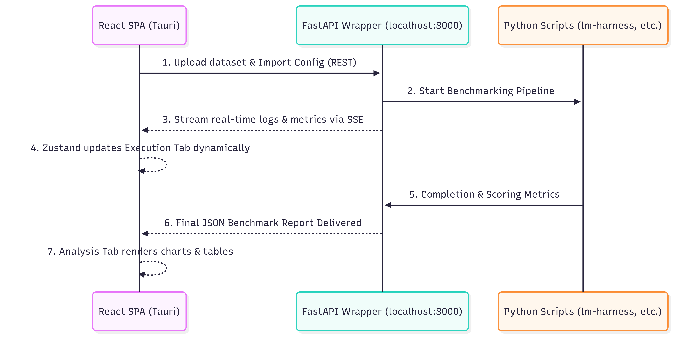
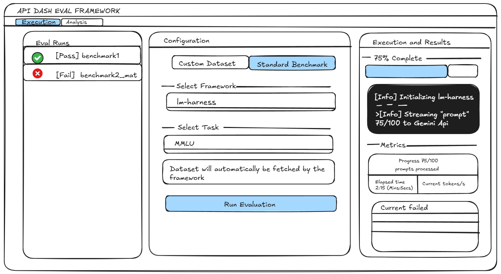

### Initial Idea Submission

**Full Name:** Lokesh Parasa  
**University name:** Manipal Institute of Technology  
**Program you are enrolled in (Degree & Major/Minor):** B.Tech in Computer and Communication Engineering  
**Year:** 2nd Year  
**Expected graduation date:** 2028  

**Project Title:** Local-First Desktop Architecture for Multimodal AI Eval Framework (Idea #2)  
**Relevant issues:** Relates to #1054  

### Idea description:

I propose a local-first, decoupled architecture for the Multimodal AI and Agent API Eval Framework, designed to align directly with API Dash's zero-config desktop philosophy.

While the GSoC idea lists React, Node.js, and TypeScript, requiring users to run `npm run dev` to start a local web server breaks the standard desktop experience. Instead of a Node server, I suggest bundling a **React (Vite) Single Page Application** inside a native **Tauri** wrapper. This frontend will communicate with a **FastAPI (Python)** backend (bundled via PyInstaller) that executes the underlying Python evaluation scripts (e.g., `lm-harness`, `lighteval`).

#### Why a React Subsystem + Tauri? (The Lightweight Companion)
API Dash is a lightweight, native Flutter app. To handle the complex data-visualization requirements of AI evaluations without bloating the main app, this framework will act as a **specialized companion subsystem**. 

Packaging the React SPA with **Tauri** strictly avoids the heavy RAM overhead associated with Electron/Chromium bundles. This provides a standard double-click desktop executable that can handle React's heavy data rendering while maintaining API Dash's low-resource profile.

* **Tabbed UI Architecture:** Evaluations take time. The **Execution Tab** focuses entirely on live SSE streaming logs and progress metrics to prevent UI freezing. Once the run finishes, the **Analysis Tab** handles the heavy rendering components (category bar charts, failure triage tables).

#### Architectural Justification: Learning from GSoC 2025
This architecture solves specific constraints documented in past API Dash development cycles:

1. **Bypassing the Flutter Reflection Limit:** Manas noted in GSoC 2025 that Dart lacks full runtime reflection for dynamically rendering complex UI from LLM outputs. Server-Driven UI (Stac) struggled with massive JSON payloads, causing UI crashes. Moving the data-visualization layer to React bypasses these SDUI limitations, allowing us to render large data tables and charts safely.
2. **Streaming & SSE:** Manas implemented Server-Sent Events (SSE) in the core networking package because AI responses need streaming. A standard REST call for a 1,000-prompt benchmark will inevitably time out. Using FastAPI to stream execution logs back to the React UI via SSE keeps the app responsive (managed via Zustand).
3. **Respecting Mobile & Native Constraints:** The `flutter_rust_bridge_experiment.md` document showed that compiling native C/Rust binaries (like `libxml2`) for mobile targets is highly problematic and breaks the iOS/Android build pipeline. Isolating the heavy Python AI evaluation scripts in a local FastAPI server protects the core Flutter app's mobile compatibility.
4. **Privacy-First Local Execution:** Since API Dash is a privacy-first client, this architecture runs entirely on the developer's local machine. Proprietary test datasets and API keys never leave the host environment.

#### Proposed Architecture Flow & UI Mockup

#### Integration Strategy: The API Dash JSON Contract
Users shouldn't have to duplicate their API keys, headers, or parameters between the main app and the eval framework. 

Developers will export their workspace directly from the API Dash desktop app. The Tauri app will parse the resulting `HttpRequestModel` JSON to instantly populate the testing environment with the correct target URLs, auth headers, and system prompts.

This keeps the heavy Python execution decoupled, respects local-first privacy, and uses native bundling to deliver a stable UI. I look forward to your feedback.