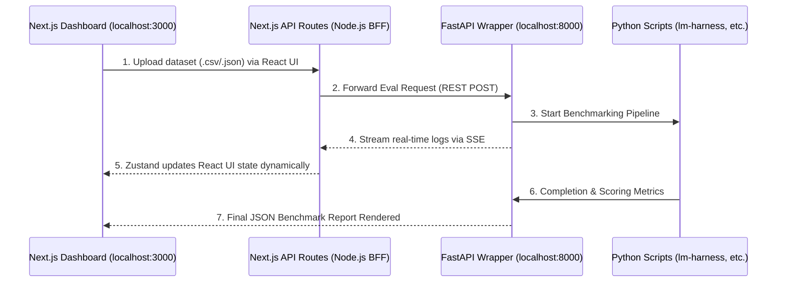

### Initial Idea Submission

**Full Name:** Lokesh Parasa  
**University name:** Manipal Institute of Technology  
**Program you are enrolled in (Degree & Major/Minor):** B.Tech in Computer and Communication Engineering  
**Year:** 2nd Year  
**Expected graduation date:** 2028  

**Project Title:** Local-First Next.js Architecture for Multimodal AI Eval Framework (Idea #2)  
**Relevant issues:** N/A (Greenfield Web Architecture)  

### Idea description:

To build a robust, scalable Multimodal AI and Agent API Eval Framework, I propose a decoupled, local-first web architecture. While the GSoC idea lists React, Node.js, and TypeScript, I propose unifying these using **Next.js** as the core framework. This will serve as the heavy data-visualization dashboard, interfacing with a **FastAPI (Python)** wrapper around underlying Python evaluation frameworks (e.g., `lm-harness`, `lighteval`, or custom benchmark scripts).

#### Why Next.js? (Unifying React and Node.js)
Instead of building a separate React Single Page Application (SPA) and a separate Node.js Express backend, Next.js provides a unified TypeScript environment perfectly suited for this tool. 
* **The BFF (Backend-for-Frontend) Pattern:** Next.js API Routes (Node.js) allow us to securely handle local file parsing, middleware, and API key management without exposing logic or secrets to the client-side browser.
* **Complex Data Rendering:** React's virtual DOM is purpose-built for rendering the massive, deeply nested JSON benchmarking results and evaluation trace logs that AI frameworks generate.

#### Architectural Justification: Learning from GSoC 2025
This decoupled, web-based approach directly addresses several architectural constraints identified during previous API Dash development cycles:

1. **Bypassing the Flutter Reflection Limit:** During GSoC 2025, Manas noted that Dart lacks full runtime reflection for dynamically rendering complex UI from LLM outputs. Relying on Server-Driven UI (Stac) led to issues where massive JSON payloads caused context-window clipping and visual crashes. By moving the heavy data-visualization of the Eval Framework entirely to React (Next.js), we bypass these SDUI limits and can natively, safely render massive data tables, interactive charts, and markdown.
2. **Streaming & SSE:** Manas successfully integrated Server-Sent Events (SSE) into the core API Dash networking package because AI responses require streaming. This Next.js architecture heavily adopts that philosophy. Standard REST calls for running 1,000-prompt AI benchmarks will inevitably time out the browser. Innstead, our FastAPI engine will stream execution logs back to Next.js via SSE, keeping the UI responsive via state managers like Zustand.
3. **Respecting Mobile & Native Constraints:** The historical attempt to embed native Rust code (`flutter_rust_bridge_experiment.md`) proved that compiling heavy non-Dart binaries for mobile targets (iOS/Android) is highly problematic. Keeping Python evaluation scripts completely isolated in a local FastAPI web server protects the core Flutter app from heavy dependencies.
4. **Privacy-First Local Execution:** API Dash is strictly a privacy-first client. Therefore, this Next.js dashboard (`localhost:3000`) and the FastAPI wrapper (`localhost:8000`) will be designed to run entirely on the developer's local machine. This ensures proprietary test datasets never leave the local environment. Furthermore, running FastAPI on port `8000` safely avoids conflicting with the `8080-8090` range Udhay established for local OAuth callback servers.

#### Proposed Architecture Flow

Integration Strategy: The API Dash JSON Contract
To ensure a frictionless developer experience, users should not have to manually re-enter their AI API keys, headers, or parameters into the web dashboard.

The Next.js app will implement an Export/Import Contract. Developers will export their workspace from the API Dash desktop app. The Next.js Node backend will natively parse this HttpRequestModel JSON to instantly populate the web testing environment with the correct target URLs, auth headers, and system prompts, ready for mass evaluation.

This architecture ensures the heavy Python execution remains strictly decoupled, respects API Dash's privacy-first nature by running locally, and leverages Next.js to deliver a resilient, modern UI. I look forward to your feedback on this integration approach!