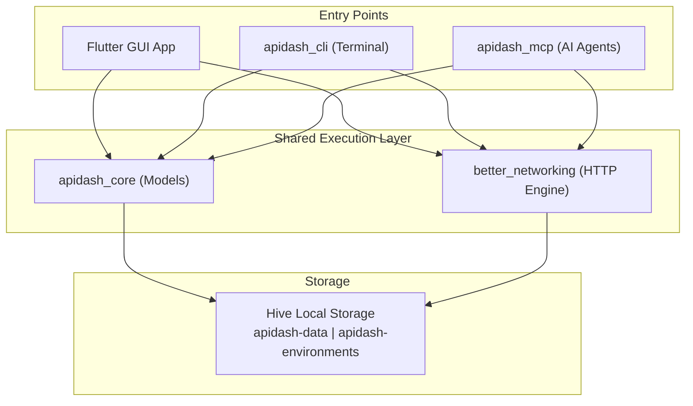

### Initial Idea Submission

Full Name: Luxshan Thavarasa
University name: University of Moratuwa, Sri Lanka
Program you are enrolled in (Degree & Major/Minor): BSc Eng Hons, Computer Science & Engineering
Year: Graduated (May 2025)
Expected graduation date: May 2025

Project Title: CLI & MCP Support for API Dash
Relevant issues: [#1228 - Idea #6: CLI & MCP Support](https://github.com/foss42/apidash/discussions/1228)

---

## Idea Description

### The Problem

Right now, everything great about API Dash lives inside the Flutter GUI. If you're a developer who works mostly in the terminal, runs things through CI pipelines, or uses AI coding assistants like Claude Desktop or Cursor — you're out of luck. You have to open the app every time. There's no way to fire off a saved request from a script or let an AI agent browse your collections.

### What I Want to Build

Two new packages — **`apidash_cli`** and **`apidash_mcp`** — that bring API Dash's core features to the terminal and to AI agents.

- **`apidash_cli`**: Run requests, manage collections, handle environments, import from Postman/cURL, and generate code — all from the command line.
- **`apidash_mcp`**: An MCP server that lets AI assistants (Claude Desktop, VS Code Copilot, Cursor) directly execute requests, read your collections, and help debug APIs.

Both reuse `apidash_core` and `better_networking` under the hood, so behavior stays consistent whether you're using the GUI, the CLI, or talking to an AI agent.

### Why Me?

I've spent a lot of time in the MCP ecosystem already:

- I built and published [mcp-lint](https://github.com/Luxshan2000/mcp-lint) — a linter for MCP servers with 23 rules covering protocol compliance, schema validation, security, and performance. To build something that checks *other people's* MCP servers, I had to really understand the spec inside and out.
- I also built [FastMCP File Server](https://github.com/Luxshan2000/fastmcp-file-server) — an MCP server with 20+ tools, multi-transport support (stdio, HTTP, ngrok), and tiered access control. It's on PyPI and has 6 stars on GitHub.

Professionally, I work as a software engineer building agentic AI applications — so I see firsthand how AI agents interact with tools and what makes a good tool interface vs. a frustrating one.

I've also published research at COLING 2025 and NAACL 2025 (NLP and speech AI), so I'm comfortable working at the intersection of AI and developer tooling.

---

## Architecture

The idea is simple: the GUI, CLI, and MCP server are just three different doors into the same room.



---

## Part 1: `apidash_cli`

### Commands

| Command | What it does |
|---------|-------------|
| `apidash request <url>` | Fire off an HTTP request from the terminal |
| `apidash collection list` | See all your saved collections/requests |
| `apidash collection run <id>` | Run a collection or a specific saved request |
| `apidash env list` | List environments and their variables |
| `apidash import <file>` | Import from Postman, Insomnia, cURL, or HAR |
| `apidash codegen <id> --lang=python` | Generate integration code for a saved request |

### Design Choices

**Pure Dart, no Flutter.** The `better_networking` package currently imports `flutter/foundation.dart` and `flutter_web_auth_2`, which makes it impossible to use from a headless Dart app. I'll refactor these out:

- Swap `kIsWeb` for `bool.fromEnvironment('dart.library.js_interop')` (pure Dart equivalent)
- Replace `debugPrint` with `dart:developer` log
- Split `flutter_web_auth_2` behind a platform interface — mobile OAuth stays in the Flutter app, CLI uses the existing localhost callback flow

**Workspace discovery without Flutter plugins.** Since `shared_preferences` won't work in pure Dart, the CLI finds the Hive database via: `--workspace` flag > `APIDASH_WORKSPACE` env var > `~/.config/apidash/config.json` > default platform path.

**CI/CD-friendly.** Every command supports `--output json` and uses proper exit codes (0 = success, 1 = API error, 2 = CLI error, 3 = network error), so you can plug it into GitHub Actions or any pipeline.

### Quick Examples

```bash
# Simple request
$ apidash request https://api.example.com/users --method POST \
  --header "Content-Type: application/json" \
  --body '{"name": "Alice"}'

# Run a saved collection against staging
$ apidash collection run "User Tests" --env staging --output json

# Generate Python code for a saved request
$ apidash codegen req_abc123 --lang python --lib requests
```

---

## Part 2: `apidash_mcp`

An MCP server that exposes API Dash to AI assistants via stdio transport (what Claude Desktop, Cursor, and VS Code all expect).

### Tools

| Tool | Description |
|------|-------------|
| `execute_request` | Run a saved or ad-hoc HTTP request |
| `list_requests` | List all saved requests |
| `run_collection` | Execute an entire collection |
| `import_curl` | Parse a cURL command into a request |
| `generate_code` | Generate integration code |
| `manage_environment` | List/set/delete environment variables |

### Resources

| URI | Description |
|-----|-------------|
| `apidash://requests` | All saved requests (browsable context for the AI) |
| `apidash://requests/{id}` | Individual request details |
| `apidash://environments` | All environments and their variables |
| `apidash://history` | Recent request/response history |

### Prompts

| Prompt | Description |
|--------|-------------|
| `debug_api` | Feeds the AI a failing request + response for analysis |
| `test_endpoint` | Generates test assertions for an endpoint |
| `explain_response` | Explains an API response in plain language |

After connecting, you can just tell your AI assistant something like *"run my login request and check if the token is still valid"* — and it'll actually do it.

---

## The Prerequisite: Making `better_networking` Pure Dart

This has to happen first, and it benefits the whole project — not just CLI/MCP.

| File | What's wrong | Fix |
|------|-------------|-----|
| `http_client_manager.dart` | Imports `flutter/foundation.dart` for `kIsWeb` | Use `bool.fromEnvironment('dart.library.js_interop')` |
| `platform_utils.dart` | Same `kIsWeb` issue | Same fix |
| `handle_auth.dart` | Uses `debugPrint` from Flutter | Use `dart:developer` log |
| `oauth2_utils.dart` | Imports `flutter_web_auth_2` | Split behind a platform interface |

---

## Timeline (8 Weeks / ~90 Hours)

| Week | Focus | What Gets Done |
|------|-------|---------------|
| **Bonding** | Get oriented | Deep-dive codebase, align scope with mentors |
| **1** | `better_networking` refactoring | PR: remove Flutter deps, all existing tests still pass |
| **2** | CLI skeleton + `request` command | `apidash request <url>` works from terminal |
| **3** | Remaining CLI commands | `collection`, `env`, `import`, `codegen` all working |
| **4** | MCP server + first tool | MCP server responds to `execute_request` via stdio |
| **5** | Full MCP tool suite | All 6 tools working, tested with MCP Inspector |
| **6** | Resources + prompts + real integration | End-to-end with Claude Desktop / VS Code |
| **7** | Testing | Unit + integration tests, >80% coverage |
| **8** | Polish + docs | READMEs, config guides, native binaries, demo |

---

## What Makes This Proposal Different

1. **I've already shipped MCP tools.** [mcp-lint](https://github.com/Luxshan2000/mcp-lint) and [FastMCP File Server](https://github.com/Luxshan2000/fastmcp-file-server) are published, used, and demonstrate that I know the protocol well enough to lint other people's servers. Building one for API Dash is a natural next step.
2. **I can validate my own work.** I'll use `mcp-lint` to check the MCP server I build — protocol compliance from day one.
3. **The refactoring benefits everyone.** Making `better_networking` pure Dart unlocks headless usage for the whole project, not just this feature.
4. **CI/CD is a first-class concern.** Proper exit codes, JSON output, pipeline-friendly design.
5. **Practical MCP prompts.** Not just tools — the prompts make AI assistants genuinely useful for API debugging workflows.
