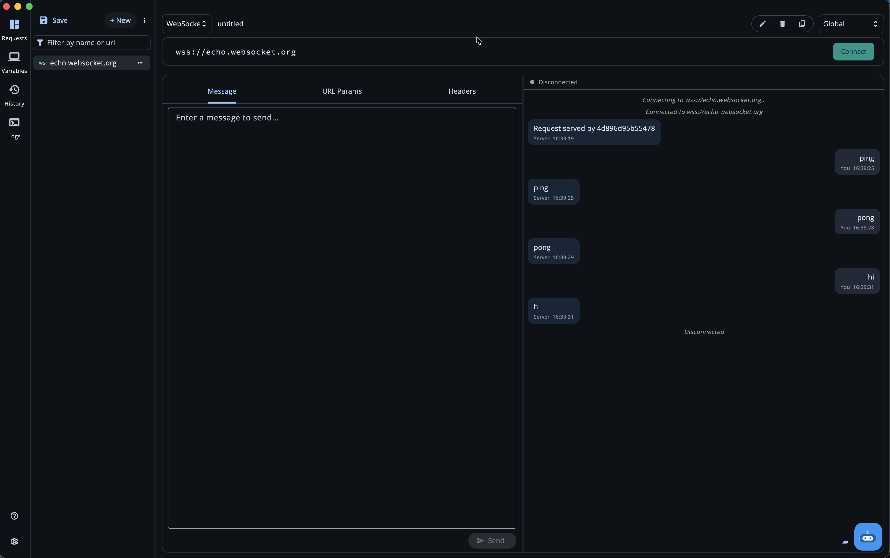
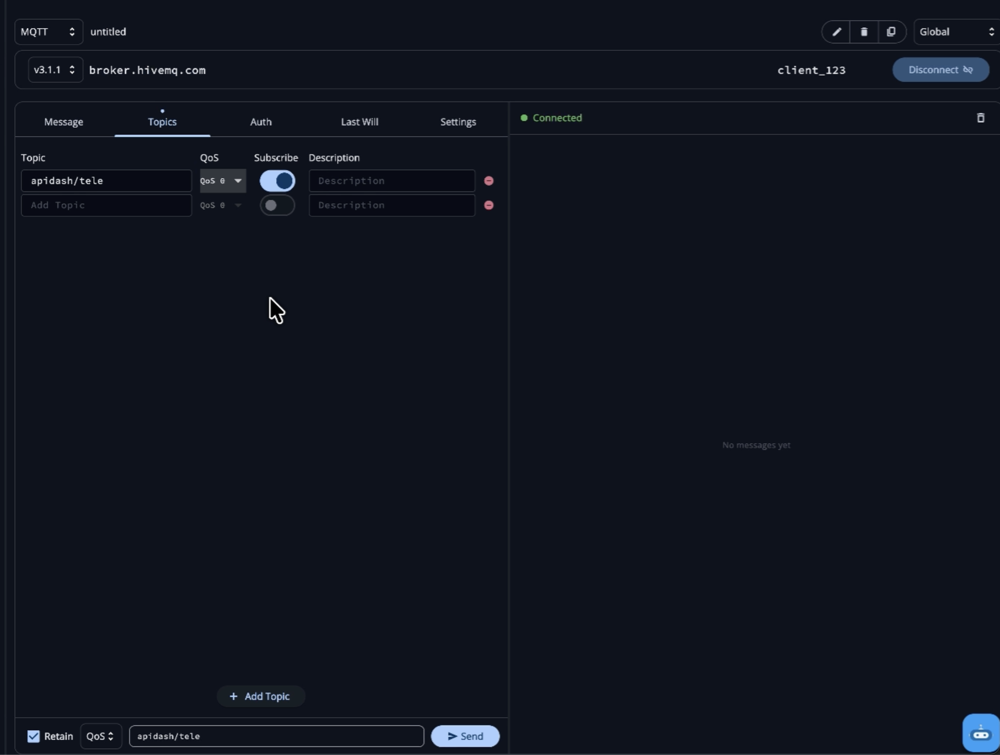
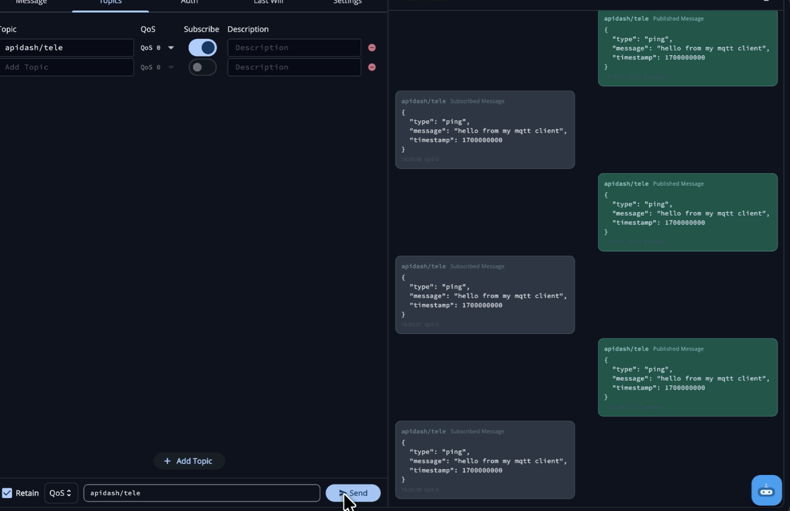
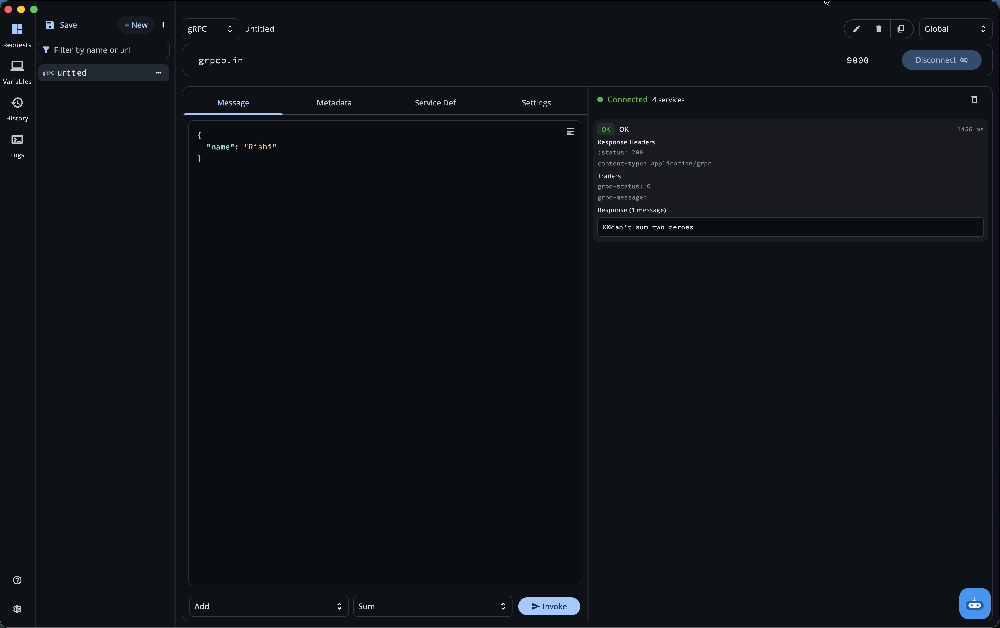
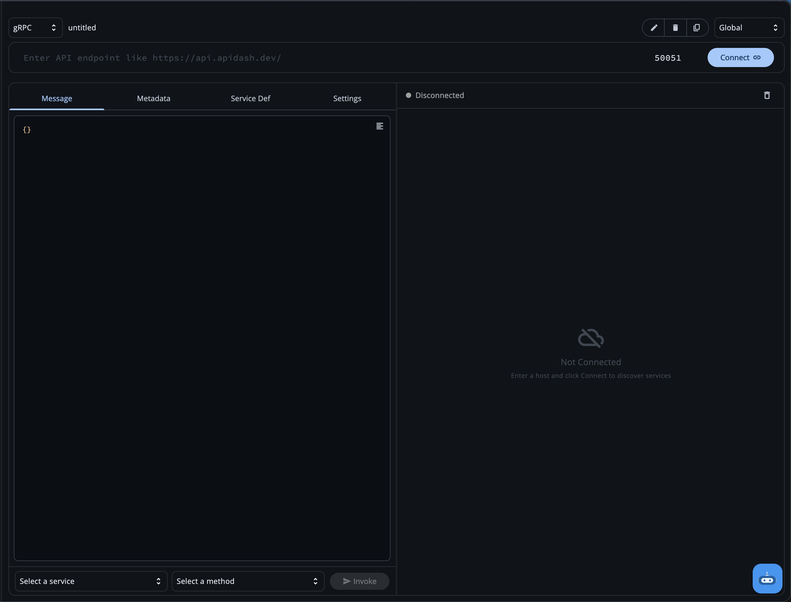

### Initial Idea Submission

**Full Name:** Rishi Ahuja  
**University name:** National Institute of Technology, Jalandhar  
**Program you are enrolled in (Degree & Major/Minor):** Bachelor of Technology, Information Technology  
**Year:** Sophomore  
**Expected graduation date:** August 2028  

**Project Title:** WebSocket, MQTT & gRPC — First-Class Protocol Support for API Dash  
**Relevant issues:** [#15](https://github.com/foss42/apidash/issues/15) (WebSocket), [#115](https://github.com/foss42/apidash/issues/115) (MQTT), [#14](https://github.com/foss42/apidash/issues/14) (gRPC)

---

## Idea Description

### The Problem

API Dash handles REST and GraphQL well, but a growing share of real-world APIs speak different protocols: **gRPC** (Kubernetes, microservice meshes, ML serving), **WebSocket** (real-time dashboards, chat, collaborative editors), and **MQTT** (IoT sensors, smart home, telemetry). Developers testing these systems today bounce between Postman, grpcurl, MQTTX, and wscat — there's no single open-source, cross-platform desktop client that handles all of them with a unified UX.

This project adds first-class support for all three protocols in API Dash — each with its own transport service, data model, Riverpod state layer, and UI pane, all following the same layered architecture the codebase already uses for REST.

| Protocol | Primary Domain | Wire Format | Connection Model | Spec |
|----------|---------------|-------------|-----------------|------|
| WebSocket | Real-time apps, live data | Frames over TCP | Persistent, full-duplex | [RFC 6455](https://datatracker.ietf.org/doc/html/rfc6455) |
| MQTT | IoT, telemetry, edge devices | Binary packets over TCP | Persistent, pub/sub via broker | [OASIS v3.1.1](https://docs.oasis-open.org/mqtt/mqtt/v3.1.1/os/mqtt-v3.1.1-os.html) |
| gRPC | Microservices, ML serving, K8s | Protobuf over HTTP/2 | Persistent, multiplexed | [gRPC/HTTP2](https://github.com/grpc/grpc/blob/master/doc/PROTOCOL-HTTP2.md) |

---

### Working Proof of Concept

Before writing this, I built a **working PoC covering all three protocols** — verified against real servers (echo.websocket.org, broker.hivemq.com, grpcb.in). The fork implements the full end-to-end flow for each protocol.

**Fork:** [RishiAhuja/apidash](https://github.com/RishiAhuja/apidash/tree/feat/grpc-support)

#### Video Walkthrough

https://github.com/user-attachments/assets/63516dee-221d-40a8-8841-821325021229

Individual protocol demos:

**WebSocket**

https://github.com/user-attachments/assets/1b736f8b-b870-4230-a222-a7a30739f854

**MQTT**

https://github.com/user-attachments/assets/acfb61c5-61e4-4a5b-b8a4-81e5926bf739

**gRPC**

https://github.com/user-attachments/assets/4fedf065-138d-4836-a56f-e1074233e640

---

### High-Level Architecture

All three protocols follow the **same layered pattern** API Dash already uses for REST:


Each protocol gets a dedicated request model (not reusing HttpRequestModel — which was the failure point in previous PRs), and Riverpod family providers keyed by request ID so tab-switching preserves state.

---

## 1. WebSocket

**Issue:** [#15](https://github.com/foss42/apidash/issues/15) — oldest open feature request (April 2023). Five previous PRs were blocked by state persistence loss on tab switching.

I'm already familiar with WebSocket internals — I previously read through the entire [RFC 6455](https://datatracker.ietf.org/doc/html/rfc6455) (every section: opening handshake, base framing protocol, masking algorithm, control frames, close semantics) and wrote a [25-minute blog post](https://rishia.in/blogs/you-dont-know-websockets-yet) breaking it all down. That spec-level understanding paid off practically. When I first implemented the connect flow, messages I sent immediately after connecting were silently vanishing — the send was succeeding but the server never saw them. It took me a while to realize what was happening: `web_socket_channel` returns from `connect()` immediately, while the TCP+TLS+HTTP upgrade handshake (RFC 6455 §4) is still in progress. I was writing to a channel that wasn't open yet. Once I understood the handshake is a distinct phase, I looked for a way to wait for it and found `channel.ready`. That one `await` fixed it.

### Implementation

**Transport — `WebSocketManager`** (in `packages/better_networking/`): Global singleton managing connections keyed by request ID. Awaits `channel.ready` before emitting connected status, listens on `channel.stream` for incoming frames, catches errors and `onDone` as typed `WsMessage` events.

```dart
final channel = WebSocketChannel.connect(uri, protocols: null);
await channel.ready;  // Wait for handshake to complete (RFC 6455 §4)
_channels[requestId] = channel;
```

**State — `WsStateNotifier`**: Riverpod `StateNotifier` wrapping the manager. Subscribes to the broadcast stream *before* calling `connect()` — I learned this the hard way when early status messages (like the initial `connected` event) were getting dropped because the listener wasn't set up yet. Messages tracked as immutable list so Riverpod detects state changes.

**UI — Chat-style message feed**: Sent messages right-aligned, received left-aligned, status centered, errors in red. Request pane reuses existing `EditRequestURLParams` and `EditRequestHeaders` widgets — I realized the WebSocket handshake *is* an HTTP upgrade request, so the existing REST widgets map directly onto it. No new widgets needed for that.



### Why Previous PRs Failed & How This Fixes It

Previous attempts ([#210](https://github.com/foss42/apidash/pull/210), [#215](https://github.com/foss42/apidash/pull/215), [#555](https://github.com/foss42/apidash/pull/555), [#1003](https://github.com/foss42/apidash/pull/1003), [#1017](https://github.com/foss42/apidash/pull/1017)) lost connection state when switching tabs. My implementation uses **Riverpod family providers keyed by request ID** — the connection, messages, and input state all survive tab switches because they live in the provider tree, not in widget state.

---

## 2. MQTT

**Issue:** [#115](https://github.com/foss42/apidash/issues/115) (Feb 2024). PR [#258](https://github.com/foss42/apidash/pull/258) was closed due to state persistence failure and reusing the HTTP request model. PR [#864](https://github.com/foss42/apidash/pull/864) remains a draft.

I first used MQTT while building a robot controller for a [robowar competition](https://en.wikipedia.org/wiki/Robot_combat) at college — sending joystick commands from a phone to an ESP32 over WiFi via a public broker. That was a surface-level encounter (fire-and-forget QoS 0 on a single topic), so for this project I went significantly deeper into the [MQTT v3.1.1 OASIS spec](https://docs.oasis-open.org/mqtt/mqtt/v3.1.1/os/mqtt-v3.1.1-os.html) and wrote a planning document before writing any code — mapping every MQTT concept to the `mqtt_client` Dart package's API.

Reading the spec also surfaced details that directly shaped implementation. The CONNACK return codes section (§3.2.2.3) specifies that code 4 is "bad username or password" and code 5 is "not authorized" — easy to confuse from the outside. I mapped all five codes to human-readable messages in the service layer so users get specific errors instead of a generic "connection refused". Another non-obvious behavior I ran into: `client.updates` is `null` until the client is fully connected. I had wired up the message listener right after calling `connect()`, before the connection was confirmed, and incoming messages were silently dropping. The fix was gating the listener behind a `MqttConnectionState.connected` check.

### Core Concepts Implemented

- **Pub/Sub via broker** with all three **QoS levels** (0: at-most-once, 1: at-least-once, 2: exactly-once)
- **Retained messages** — last-known-value pattern for new subscribers
- **Clean Session** — fresh vs. resumed session state
- **Last Will and Testament (LWT)** — broker publishes a configurable message if client disconnects ungracefully
- **Authentication** — username/password with environment variable support
- **Topic wildcards** — `+` (single level) and `#` (multi-level)


### Implementation

**Transport — `MqttClientManager`** (in `packages/better_networking/`): Factory-with-registry pattern (`getOrCreate(requestId)` / `remove(requestId)`). Builds `MqttConnectMessage` from config, handles clean session, auth, and LWT. Listens to `client.updates` only after confirming `MqttConnectionState.connected`.

**Data Model — `MqttRequestModel`**: Dedicated model (not reusing HTTP) storing broker URL, port, client ID, MQTT version, auth credentials, keep-alive, clean session, LWT config, and a list of `MqttTopicModel` subscriptions with individual QoS levels.

**State — Split family providers**: Separate providers for connection state, message feed, and each publish-form field. This means the QoS dropdown doesn't rebuild the payload editor when it changes.

**UI — Five-tab request pane**:

| Tab | Purpose |
|-----|---------|
| **Message** | JSON/plain text editor for publish payload |
| **Topics** | Subscription table with live subscribe/unsubscribe toggles per topic |
| **Auth** | Username + password with env var support |
| **Last Will** | LWT topic, message, QoS, retain toggle |
| **Settings** | Port, keep-alive, clean session, MQTT version |

A bottom publish bar (`[Retain] [QoS dropdown] [topic] [Send]`) keeps publish controls always visible.





### MQTT v5 — Planned

v5 adds shared subscriptions, user properties, request/response correlation, and enhanced reason codes. The `MqttVersion` enum is already in place; implementation is planned for early GSoC weeks after discussing UX implications with mentor.

---

## 3. gRPC

**Issue:** [#14](https://github.com/foss42/apidash/issues/14) (April 2023). No PR has ever reached a working implementation — the combined scope of reflection, protobuf encoding, streaming, and UI blocked every attempt.

gRPC was the protocol I was least familiar with going in. I'd worked with [serverpod](https://pub.dev/packages/serverpod) in Flutter before — similar RPC-over-binary-serialization pattern — but the actual wire format, HTTP/2 framing, and protobuf encoding were all new to me. I started by reading the [gRPC spec](https://grpc.io/docs/what-is-grpc/core-concepts/), the [Protocol Buffers encoding guide](https://protobuf.dev/programming-guides/encoding/), and the [gRPC over HTTP/2 spec](https://github.com/grpc/grpc/blob/master/doc/PROTOCOL-HTTP2.md). How gRPC messages are length-prefixed inside HTTP/2 DATA frames felt abstract at first — it only clicked when I was debugging a broken encode and traced the failure back to a wrong wire type corrupting the length prefix. Reading the spec didn't feel wasted after that.

### What's Implemented

**All four gRPC call types:**

| Call Type | Client Sends | Server Sends |
|-----------|-------------|--------------|
| Unary | 1 message | 1 message |
| Server streaming | 1 message | N messages |
| Client streaming | N messages | 1 message |
| Bidirectional | N messages | N messages |

**Server Reflection** — runtime service/method discovery without needing `.proto` files. Sending requests like "list all services" or "give me the schema for X" requires Dart stubs generated from Google's official `reflection.proto` and `descriptor.proto` — and no pub.dev package ships them (I confirmed this by grepping the `grpc` package cache for `ServerReflectionClient`, which returned empty). So I copied the two official proto files, ran `protoc --dart_out=grpc` against them, and packaged the output as a local monorepo package (`packages/grpc_reflection/`).

**Dynamic Protobuf Encoder/Decoder** — since API Dash doesn't have compiled `.proto` files (users type JSON, we have the runtime descriptor from reflection), I wrote a custom `jsonToProtobuf` encoder handling all 15 protobuf field types:
- **Varints** (wire type 0): int32, uint32, sint32 (ZigZag), int64, uint64, sint64 (ZigZag), bool, enum
- **Fixed-width** (wire types 1 & 5): float, double, fixed32, sfixed32, fixed64, sfixed64
- **Length-delimited** (wire type 2): string, bytes, nested messages

**`.pb` file import** as alternative to server reflection for production servers with reflection disabled.

**`GrpcTypeRegistry`** — runtime type resolution for nested messages and enums during encoding/decoding.


### Key Technical Challenges Solved

**1. The Dual-Channel Problem:** The first major bug I hit wasn't in my code at all — it was a protocol-level interaction I hadn't anticipated. gRPC Server Reflection uses a bidi-streaming RPC. After I finished reading the services list and cancelled that stream, Dart sends an HTTP/2 `RST_STREAM` frame. Some servers (including `grpcb.in`) treat that as severe enough to send `GOAWAY` back — which kills the *entire* HTTP/2 connection, not just that one stream. So reflection would succeed, I'd see all the services, and then the actual RPC call would fail with a connection error because the shared channel had been nuked. Once I traced the sequence of HTTP/2 frames to figure out what was happening, the fix was clear: **separate ephemeral channel** for reflection only, shut it down cleanly after discovery, then open a fresh main channel for actual calls.

**2. Wire Type Bug:** Most of my debugging time went into the protobuf encoder. The core issue: protobuf uses the wire type (embedded in each field's tag) to know how many bytes to read — wrong wire type means wrong byte count, and every subsequent field is at the wrong offset. The whole message becomes garbage. My initial encoder mapped `FIXED32`/`SFIXED32` to varint wire type (0) instead of 32-bit fixed wire type (5). The server expected 4 bytes, got a varint, and the frame was corrupted from that point on. I spent a while trying to make the `protobuf` package's `CodedBufferWriter` work dynamically (it's designed for generated code), and eventually gave up and wrote the wire format directly using raw `ByteData`. Once I did that, all 15 field types fell into place correctly.

**3. Raw Bytes Channel Trick:** The Dart `grpc` package expects compiled `ClientMethod<Req, Res>` types with pre-generated serializers. Since we're building messages dynamically, I declared `ClientMethod<List<int>, List<int>>` with identity functions — handling protobuf encoding ourselves before handing to the channel. Same approach as `grpcurl`.

**4. Stale Closure & Reconnection Bugs:** Two reconnect bugs took a while to track down. The port field's `onChanged` callback was closing over the request model captured at build time — when `connectGrpc()` cleaned up and wrote back a parsed host:port, then the user edited the port, `copyWith` was being called on the stale snapshot and reverting the host. Fixed by reading state fresh inside the callback. Separately, disconnect-then-reconnect was returning the old broken channel from the singleton map — fixed by calling `remove()` before creating a new manager. And there was an obvious-in-hindsight one: I had `useTls: true` and `port: 443` as defaults. Almost every development gRPC server, including the one I was testing against, runs cleartext h2c. Every single connection was silently failing until I flipped the defaults.



### gRPC UI

Request pane with four tabs: **Message** (JSON body → protobuf), **Metadata** (gRPC headers), **Service Definition** (service/method browser), and **Settings** (TLS, reflection toggle, .pb import). Response pane streams incoming messages as separate timestamped cards.



---

### Key Design Decisions

- **Dedicated request models per protocol** — not reusing `HttpRequestModel` (was the root cause of failure in previous MQTT/WS PRs)
- **Riverpod family providers keyed by request ID** — connection state survives tab switching
- **Transport layer in `packages/better_networking/`** — keeps protocol logic out of the main app, following the existing monorepo pattern
- **`grpc_reflection` as a local monorepo package** — cleanly encapsulates the generated protobuf stubs for reflection
- **`.pb` binary import over `.proto` text parsing** — simpler, more reliable, avoids maintaining a proto text parser

---

## About Me

I'm a sophomore in IT at [NIT Jalandhar](https://www.nitj.ac.in/). I've been writing Flutter since v2→v3 and built [FernKit](https://fernkit.in/) — a UI toolkit rendering pixel-by-pixel for Linux and WASM, with its own CLI, networking layer, and TTF text rasterizer in C++.

**Professional:** Flutter at [Stack Wealth](https://stackwealth.in/) (YC S21), AI infra at [Annam.ai](https://www.annam.ai/) (IIT Ropar), DevOps at [Zenbase Technologies](http://silentninja.tech) (Singapore). Research paper published at ICLR 2026 TSALM Workshop, another under review at IJCAI 2026 ([rishia.in/research](https://rishia.in/research)).

**Blog:** [rishia.in/blogs](https://rishia.in/blogs) — 11 in-depth technical posts, including a [deep dive into WebSocket internals](https://rishia.in/blogs/you-dont-know-websockets-yet) after reading the full RFC.  
**GitHub:** [RishiAhuja](https://github.com/RishiAhuja)  
**Discord:** rishi_2220
