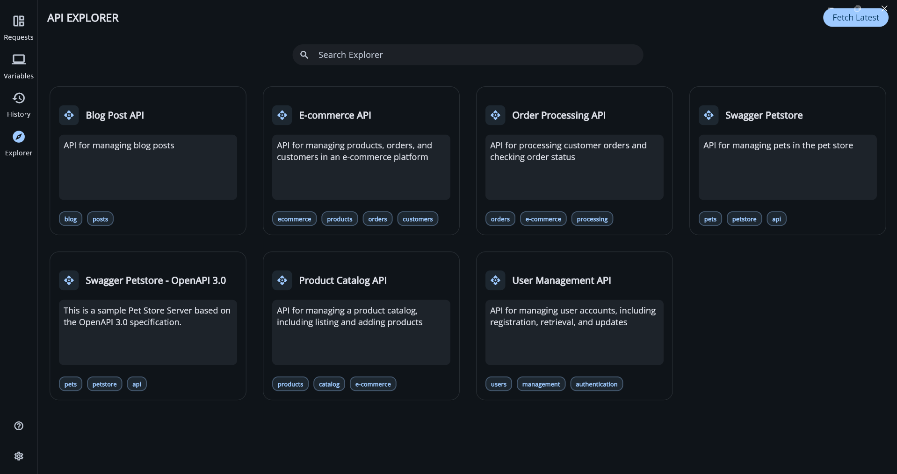
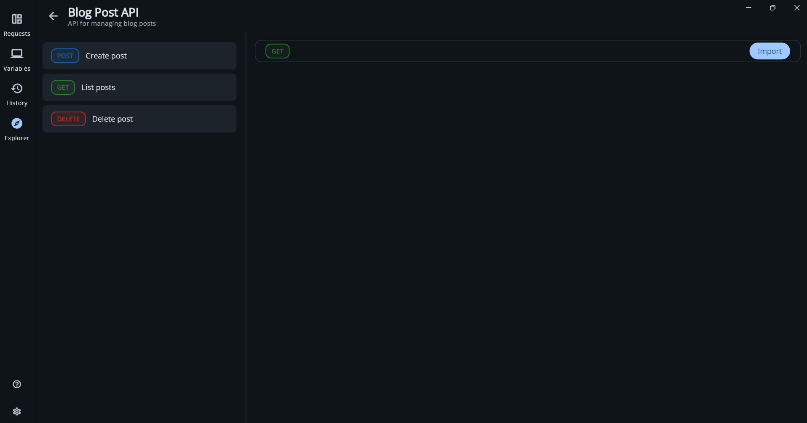
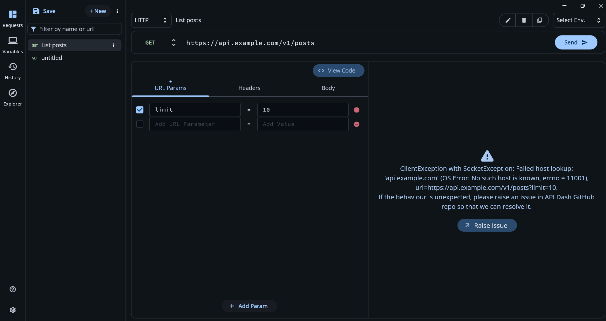

### Initial Idea Submission

**Full Name:** Rithara Kithmanthie Edirisinghe  
**University:** University of Moratuwa, Sri Lanka  
**Program:** Bachelor of Science Honours in Information Technology  
**Year:** 3rd Year  
**Expected Graduation:** 2027  

---

### Project Title: API Explorer — Automation Pipeline & Backend Infrastructure

**Relevant Issues & PRs:**
- Issue: [API Explorer #619](https://github.com/foss42/apidash/issues/619)
- Prior Work: [Initial API Explorer Feature Implementation #837](https://github.com/foss42/apidash/pull/837)

---

### Current State Analysis

Before drafting this proposal, I cloned PR #837, resolved version 
incompatibilities with the current main branch, and ran the Explorer 
locally to understand exactly what has been built and what is missing.

**The Explorer UI loads with mock template cards:**



**What PR #837 successfully delivers:**
- A functional Explorer UI with a responsive card grid layout
- Detail view with split-pane showing endpoints and method chips
- Import-to-workspace functionality integrated with Riverpod state
- Basic GitHub template fetching and Hive-based local caching
- Core data models (`ApiTemplate`, `Info`) using `apidash_core`

**What is missing — identified from running the code locally:**

The detail pane fails to render request details in certain templates, 
leaving the description view empty:



More critically, all template data uses placeholder URLs. When imported 
and executed, requests fail with `Failed host lookup: 'api.example.com'` 
because the URLs are not real:



This is the core problem the automation pipeline solves — replacing 
hand-written fake templates with real, verified API data sourced 
automatically from public OpenAPI specifications.

---

### Proposed Solution

I propose building the complete backend automation pipeline and infrastructure 
that transforms API Explorer from a UI prototype into a production-ready feature.

#### 1. OpenAPI Automation Pipeline (Python)

A Python-based pipeline that ingests OpenAPI 3.x and Swagger 2.0 specs and 
outputs `ApiTemplate`-compatible JSON files ready for the Flutter UI to consume.

**Data sources:**
- **APIs.guru** — a machine-readable directory of 1,500+ public OpenAPI specs, 
  queryable via `https://api.apis.guru/v2/list.json`
- **Official spec repositories** — Stripe (`github.com/stripe/openapi`), 
  GitHub REST API, Twilio, SendGrid and other widely-used APIs
- **Community submissions** — PR-based contributions to a dedicated template 
  repository

**Pipeline stages:**
```
OpenAPI Spec (YAML/JSON)
        ↓
   [1. Parse]
   Extract endpoints, methods, parameters,
   auth schemes, descriptions
        ↓
   [2. Auto-Tag]
   Keyword-based classifier assigns categories
   (AI, finance, weather, DevTools, social etc.)
        ↓
   [3. Enrich]
   Extract auth headers, sample request payloads,
   expected response schemas
        ↓
   [4. Output]
   ApiTemplate-compatible JSON file
```

#### 2. Auto-Tagging Engine

A rule-based classifier that reads API titles and descriptions and assigns 
relevant category tags automatically. For example:

- Keywords like "payment", "invoice", "transaction" → `finance`
- Keywords like "weather", "forecast", "climate" → `weather`  
- Keywords like "model", "completion", "embedding" → `ai`
- Keywords like "repository", "pipeline", "deploy" → `devtools`

This can be extended to an ML-based classifier in future iterations.

#### 3. Enrichment Layer

Extracts actionable information from OpenAPI specs to pre-fill templates:

- **Authentication** — detects API key, Bearer token, OAuth2 schemes and 
  pre-populates the correct headers (e.g. `Authorization: Bearer YOUR_TOKEN`)
- **Sample payloads** — pulls `example` fields from request body schemas
- **Expected responses** — extracts response schemas and example responses 
  for the preview pane

#### 4. Community Contribution Infrastructure

A dedicated GitHub repository (`apidash-api-templates`) structured as:
```
templates/
  ai/
    openai.json
    gemini.json
  finance/
    stripe.json
    paypal.json
  weather/
    openweathermap.json
  ...
```

With a GitHub Actions workflow that automatically validates every submitted 
template JSON against the `ApiTemplate` schema on PR submission — ensuring 
quality without manual review of every file.

#### 5. Flutter UI Completion

- Wire up the existing search bar with actual filtering logic against 
  title, description, and tags
- Add a horizontal category filter chip row above the grid 
  (All / AI / Finance / Weather / DevTools / Social)

---

### About Me

**GitHub:** [github.com/rithakith](https://github.com/rithakith)  

**Portfolio:** [rithara.dev](https://rithara.dev)  

**LinkedIn:** [linkedin.com/in/ritharak](https://linkedin.com/in/ritharak)

**Medium:** [medium.com/@ritharaedirisinghe](https://medium.com/@ritharaedirisinghe)
