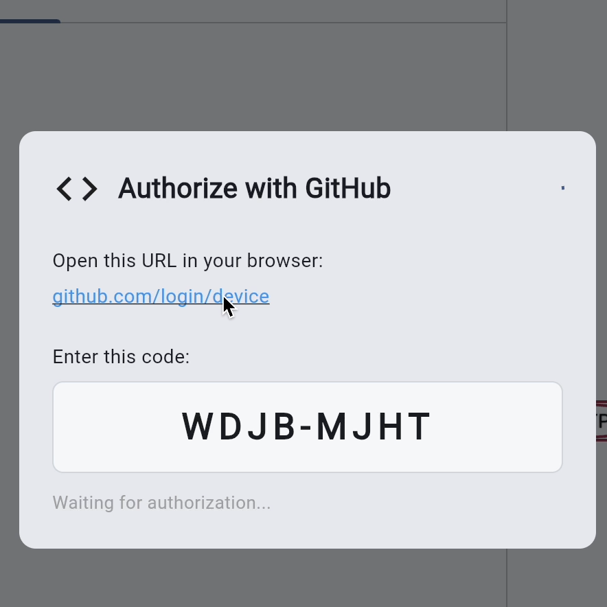
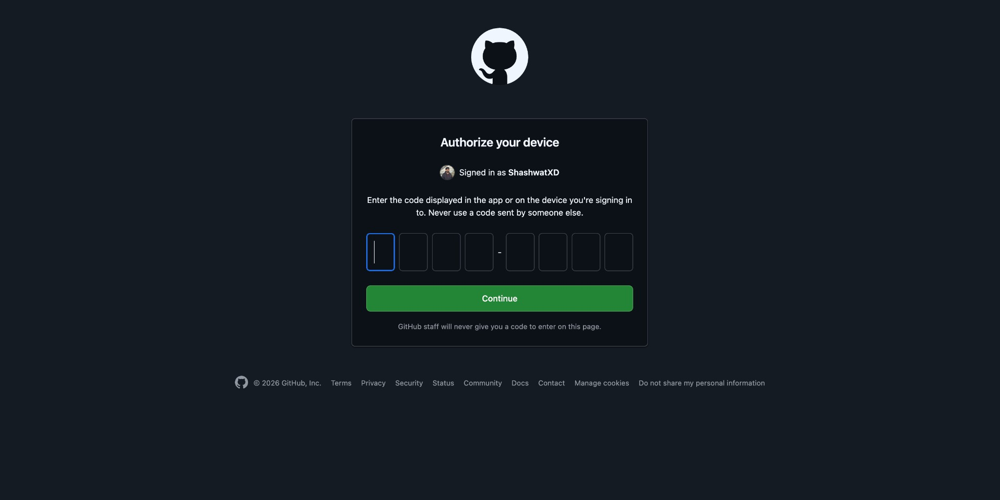
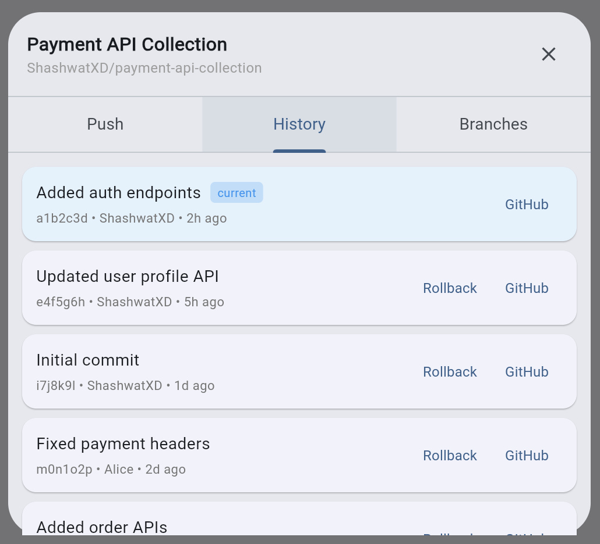
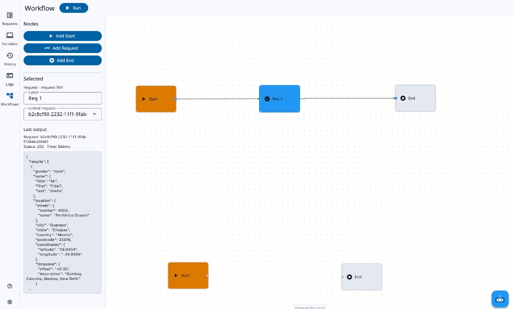
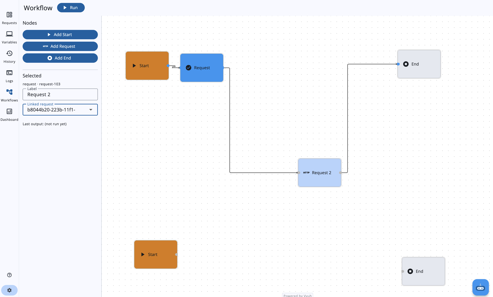
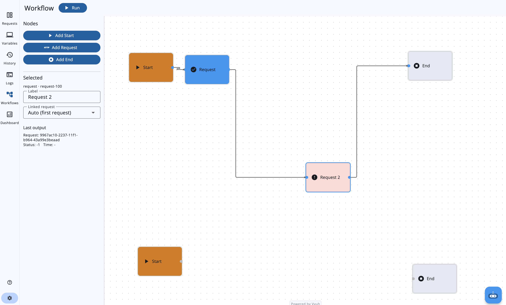
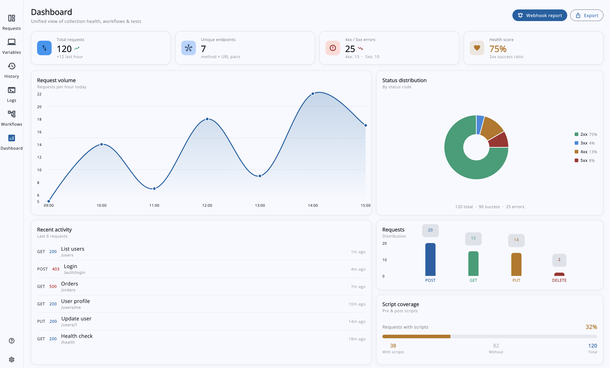

### Initial Idea Submission

**Full Name:** Shashwat Pratap Singh

**University name:** APJ Abdul Kalam University (AKTU)

**Program you are enrolled in (Degree & Major/Minor):** Bachelor of Technology

**Year:** 3rd year

**Expected graduation date:** 2027

**Project Title:** Git Support, Visual Workflow Builder & Collection Dashboard

**Relevant Issues:** [#502](https://github.com/foss42/apidash/issues/502), [#120](https://github.com/foss42/apidash/issues/120)
**Discussion:** [#1054 — Idea #3](https://github.com/foss42/apidash/discussions/1054)

---

## Idea Description

### Approach

This project has three pillars: **Git Support**, **Workflow Builder**, and **Collection Dashboard**.

---

#### 1. Git Support — Every Collection Gets a GitHub Button

Currently API Dash has no collection concept — all requests live in a single flat list in `CollectionStateNotifierProvider`. The first step is introducing a `CollectionModel` that groups requests into named collections. Each collection maps to one GitHub repository — connect a collection and you version-control it, import a repo and you get a teammate's entire collection.

**Design principle:** Hive is the single source of truth. There are no local Git repos, no on-disk files to sync, no file watchers. Everything goes through the GitHub REST API over HTTPS, which means Git Support works identically on macOS, Windows, Linux, Android, iOS, and web.

**Why a serialization layer is needed:** Hive stores data in a proprietary binary format — not human-readable or diffable. Every request is serialized to JSON before push, and deserialized on pull or rollback. GitHub sees readable JSON; the app keeps using Hive locally.

**How it works in the UI:**

A new collection dropdown sits above the sidebar's request list. Each collection has a GitHub icon button with two states:

- **Not connected** — Local-only. Clicking opens **Connect to GitHub**: user types a repo name and clicks Connect. On first use, the app shows a short code and opens github.com/login/device — user enters it, authorizes, and the app picks up the token. API Dash creates the repo, serializes requests to JSON, and pushes the first commit.

*In-app auth dialog: device code + link to github.com/login/device*

*User enters code in browser*

- **Connected** — The collection is linked to a GitHub repo. Clicking the button opens a **Git panel** with three tabs:
  - **Commit & Push** — Lists added, modified, or deleted requests since last push. User reviews changes, writes a commit message, and pushes. API Dash serializes to JSON, creates blobs and a tree, commits, and fast-forwards the branch — one atomic operation.
  - **History** — Scrollable list of commits. Each row shows message, author, timestamp. Click any commit for **one-click rollback**: API Dash fetches that commit's tree, deserializes, and replaces the collection in Hive.
  - **Branches** — Lists remote branches. User can switch, create from current HEAD, or delete.

*Connected state: commit history with one-click rollback*

**Import from GitHub** (from the collection dropdown) lets the user paste a repo URL — API Dash fetches the tree, deserializes, and creates a new local collection.

**How it works:**

A `GitHubApiAdapter` class handles all GitHub communication using the GitHub REST API.

- **Authentication:** App shows a short code and opens github.com/login/device; user enters it and authorizes. App polls until done. Token stored in `flutter_secure_storage`. One-time; all later operations use the saved token.

- **Push:** Serialize to JSON → create blobs → create tree → create commit → update branch ref. One atomic commit.

- **Pull / Rollback / Branch switch:** Same flow — fetch tree at commit, get blobs, deserialize to `RequestModel`, replace collection in Hive.

- **Commit history:** API returns log with message, author, date, SHA. Tapping a commit triggers rollback.

- **Branches:** List, create, switch, delete via GitHub API.

**Example — How Alice, Bob, and Carol collaborate:**

Alice has 15 requests in her "Payment API" collection. She clicks **Connect to GitHub**, enters a repo name, authorizes via device flow. API Dash serializes to JSON, creates an atomic commit, pushes to `main`. She shares the repo URL.

Bob pastes Alice's repo URL into **Import from GitHub**. API Dash fetches the tree, deserializes, creates a "Payment API" collection — 15 requests in his sidebar. He edits one, opens the Git panel, and pushes.

Carol has the collection connected. She sees Bob's commit in History, clicks it to pull. Later she rolls back: clicks the previous commit — collection reverts to Alice's version.

The key insight: the user never thinks about blobs, trees, or API calls. They think about their collection. GitHub is just a button that lets them share it, version it, and roll back with one click and it works on every platform.

---

#### 2. Workflow Builder — Chain Requests into Executable Flows

The Workflow Builder gets its own item in the nav rail (alongside Requests, Variables, History, etc.). It uses a visual canvas where users drag and connect nodes to build API workflows.

**What a workflow looks like:**

A workflow is a graph of connected nodes. Each node represents one step:

- **Request node** — linked to an existing request from the collection. When the workflow runs, it sends that request and captures the response.
- **Condition node** — checks something about the previous response (for example, was the status code 200?). It branches the flow into yes and no paths.
- **Transform node** — takes data from a previous response and passes it to the next request (for example, extract a login token and set it as a header for the next call).
- **Delay node** — pauses for a specified duration before continuing.

The screen is a split-view: Users add nodes from a palette, drag them around the canvas, and draw connections between them.

**POC screenshots (current implementation):**

*Initial workflow: Start → Request → End. The selected Request node is linked to an existing collection request and shows a small “Last output” preview (status/time/body snippet).*

*Editing the workflow: add a second Request node, connect it into the graph, and run the workflow to execute multiple requests in sequene.*

*Debuggability: the “Last output” preview on each Request node makes it obvious **which API step stopped/faulted** (status + short response body)*

**How execution works:**

When the user clicks Run, an execution engine walks the graph from the first node. For each node, it sends the request (or evaluates the condition, or applies the transform), updates the node's status on the canvas in real-time (pending to running to success or failed), and moves to the next node. The user watches the workflow progress live — each node lights up as it completes.

Data flows between nodes through a shared context. A login node's response can feed into a transform node that extracts a token, which then gets injected as a header into the next request node. This lets users build realistic multi-step API flows like authenticate, fetch user, fetch orders.

**Example — A login-then-fetch flow:**

A user has three requests: POST /auth, GET /users/me, and GET /orders. They create a workflow: first node is POST /auth. A condition node checks if the response is 200. If true, a transform node extracts the auth token from the response body. Then GET /users/me runs with that token as a Bearer header. Another transform extracts the user ID, and finally GET /orders/{userId} runs. The user clicks Run and watches each node light up as it succeeds.

A user describes a workflow in natural language (for example, Login, then if successful fetch the user profile, then fetch their orders) and DashBot generates the workflow structure, placing the right nodes on the canvas with proper connections. Since DashBot already has action schemas for the app, this would be a new action type.

---

#### 3. Collection Dashboard — Visualize API Health at a Glance

The Dashboard also gets its own nav rail item. It aggregates data from the existing request history (API Dash already stores every sent response) and presents it visually:

- **KPI cards** — total requests sent, average response time, success rate, number of environments configured
- **Response time trend** — a line chart showing response times over time, helping users spot performance regressions
- **Status code distribution** — a pie or bar chart breaking down 2xx, 3xx, 4xx, 5xx responses
- **Method distribution** — a visual breakdown of GET, POST, PUT, DELETE requests in the collection
- **Webhook reporting** — configure a webhook URL to send dashboard metrics to Slack or a CI/CD pipeline for automated monitoring

All data is derived from what API Dash already stores — no new data collection needed. Charts are rendered with fl_chart (7K+ likes, MIT license), the most popular Flutter charting library.

**POC screenshot (current implementation):**

*Collection Dashboard POC: KPI strip, request-volume line chart, status-code pie chart, recent activity list, method distribution bars, and script coverage bar — all themed to match API Dash and ready to be wired to live metrics.*

### Timeline (175 hours over 12 weeks)

| Week | Focus | Deliverables |
|------|-------|-------------|
| 1-2 | Git Foundation | CollectionModel + collection dropdown UI, GitHub OAuth, GitHubApiAdapter (push: blobs → tree → commit → update ref), Connect to GitHub dialog |
| 3-4 | Git Features | Commit history view with one-click rollback, branch list/create/switch, Import from GitHub, pull (fetch tree → replace Hive collection) |
| 5-6 | Workflow Foundation | Data models, canvas integration, node types (Request, Condition, Transform, Delay), save/load |
| 7-8 | Workflow Execution | Execution engine, real-time status on canvas, data passing between nodes |
| 9 | Workflow Advanced | AI workflow generation |
| 10-11 | Dashboard | KPI cards, response time trend, status code distribution, method breakdown, webhook reporting |
| 12 | Testing and Polish | Unit tests, integration tests, documentation, bug fixes |

---

### Technical Dependencies

| Package |
|---------|
| [`vyuh_node_flow: ^0.27.3`](https://pub.dev/packages/vyuh_node_flow)
| [`fl_chart: ^1.1.1`](https://pub.dev/packages/fl_chart) 
| [`flutter_secure_storage`](https://pub.dev/packages/flutter_secure_storage)

