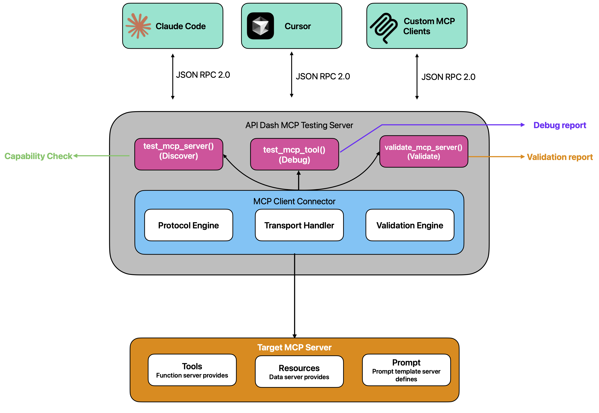
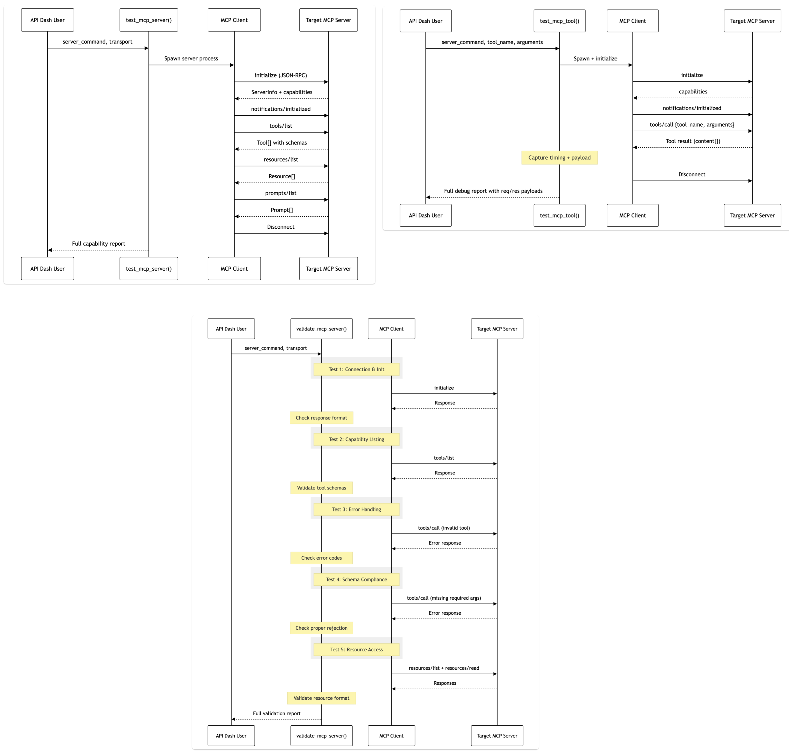

### Initial Idea Submission

Full Name: Shreyansh Jain

University name: SRM IST

Program you are enrolled in (Degree & Major/Minor): BTech Computer Science Major

Year: Third Year

Expected graduation date: 2027

Project Title: MCP Testing

Relevant issues: https://github.com/foss42/apidash/discussions/1054

Idea description:

## Problem

The [Model Context Protocol (MCP)](https://modelcontextprotocol.io) is rapidly becoming the standard API layer for AI agents — defining how they discover, understand, and interact with tools, data, and software systems. With hundreds of MCP servers emerging across the ecosystem, developers face a critical gap: **there is no comprehensive, API-first tool to test, debug, and validate MCP server and client implementations.**

Current solutions have significant limitations:

| Tool | Limitation |
|------|-----------|
| **MCP Inspector** | GUI-only, manual testing, no programmatic API, no CI/CD integration |
| **mcp-validation** | CLI-only, validation-focused, no interactive debugging |
| **Claude Desktop DevTools** | Locked to Claude ecosystem, no cross-platform support |

API Dash already excels at testing REST and GraphQL APIs. This project extends that capability to the **MCP ecosystem** — building the "Postman for MCP" within API Dash.

## Proposed Solution

Build an **MCP Testing Toolkit** as a set of MCP tools within API Dash that enables developers to programmatically test and debug any MCP server or client. The tools themselves are exposed via MCP, meaning **any LLM client (Claude, VS Code, Cursor) can invoke them** — making this the first AI-native MCP testing solution.

### Core Capabilities

**1. Server Discovery (`test_mcp_server`)** — Connect to any MCP server via stdio or SSE, perform the full initialization handshake, and return a complete capability map (tools, resources, prompts) with connection timing.

**2. Tool Debugging (`test_mcp_tool`)** — Invoke any tool on a target MCP server with custom arguments and capture the **full JSON-RPC 2.0 request/response cycle** — raw payloads, timing breakdowns, and error details. This is the core debugging capability that no existing tool exposes programmatically.

**3. Protocol Validation (`validate_mcp_server`)** — Run an automated 10-point compliance suite against any MCP server:

| # | Validation Check |
|---|-----------------|
| 1 | Initialize handshake — valid `ServerInfo` and capabilities |
| 2 | Protocol version negotiation |
| 3 | Tool listing — valid JSON Schema for `inputSchema` |
| 4 | Tool execution — proper `content[]` response format |
| 5 | Error handling — invalid tool returns JSON-RPC error |
| 6 | Error handling — missing required args returns error |
| 7 | Resource listing — valid URIs and metadata |
| 8 | Resource reading — content with correct `mimeType` |
| 9 | Prompt listing — valid prompt definitions |
| 10 | Graceful shutdown — clean disconnect |

### What Makes This Different

Unlike existing tools, this approach is:

- **Programmatic** — Tools are invoked via MCP, not a browser GUI. LLM agents can auto-test servers.
- **Debuggable** — Full req/res JSON-RPC payload capture, not just pass/fail results.
- **Cross-platform** — Works from any MCP client (Claude Code, VS Code, Cursor, custom clients).
- **Integrated** — Part of the API Dash ecosystem alongside REST and GraphQL testing.
- **CI/CD Ready** — Results are structured JSON, suitable for automated pipelines.

## Architecture

The system has three layers:

**Testing Tools Layer** — The three MCP tools (`test_mcp_server`, `test_mcp_tool`, `validate_mcp_server`) exposed via FastMCP.

**MCP Client Connector** — The core engine that connects to target servers. Handles:
- Process spawning for stdio transport
- HTTP connections for SSE/Streamable HTTP transport
- JSON-RPC 2.0 message framing and protocol state machine
- Parallel validation check execution

**Transport Layer** — Supports stdio (primary) and SSE (secondary) to connect to any MCP server regardless of how it's deployed.



### Implementation Structure

```
packages/apidash_mcp/src/apidash_mcp/
├── server.py              # FastMCP entry point
├── tools/
│   ├── request.py         # send_request (existing)
│   └── testing.py         # test_mcp_server, test_mcp_tool, validate_mcp_server
└── mcp_client/            # Client engine for connecting to target servers
    ├── connector.py       # Spawn & connect (stdio/SSE)
    ├── protocol.py        # JSON-RPC 2.0 message framing
    └── validators.py      # Protocol compliance checks
```

The `mcp_client/` module is the heart of this project — an MCP client implementation that connects to and communicates with **any external MCP server**. It will use the official `mcp` Python SDK for transport handling.

## Tech Stack

| Component | Technology |
|-----------|------------|
| MCP Framework | FastMCP (Python 3.10+) |
| MCP Client | `mcp` Python SDK |
| Transport | stdio (primary), SSE (secondary) |
| Testing | `pytest` + `pytest-asyncio` |
| Distribution | PyPI (`apidash-mcp`) |

## Sequence Diagrams


