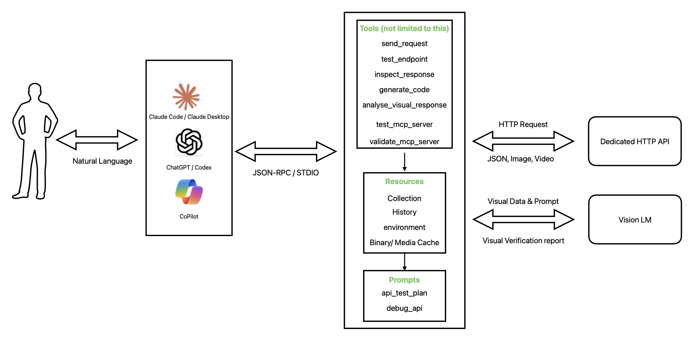

### Initial Idea Submission

Full Name: Shreyansh Jain

University name: SRM IST

Program you are enrolled in (Degree & Major/Minor): BTech Computer Science Major

Year: Third Year

Expected graduation date: 2027

Project Title: MCP Testing

Relevant issues: https://github.com/foss42/apidash/discussions/1054

Idea description:

The Model Context Protocol (MCP) is rapidly becoming the standard API layer for AI agents defining how they discover, understand, and interact with tools, data, and software systems, much like REST or GraphQL do for traditional applications. As platforms like Anthropic's Claude Code, OpenAI's Codex, and Microsoft's Copilot continue to evolve, they increasingly demand standardized access to external environments, making MCP support essential for modern developer tools.

API Dash is a powerful, AI-powered, open-source, cross-platform API Client that helps developers easily create & customize HTTP and GraphQL API requests, visually inspect responses, and generate API integration code. However, it currently lacks MCP support, which limits its integration with AI-native platforms like Claude Code and Claude Desktop.

**Proposed Solution:**

I propose building an MCP server for API Dash using **Python** and **FastMCP** that will allow users to interact with the application through natural language via any MCP-compatible client. The server will expose API Dash's core capabilities including both **REST and GraphQL** support — as MCP tools, resources, and prompts.

**Core Tools(Not limited to this):**
- `send_request` — Send HTTP and GraphQL requests (GET, POST, PUT, DELETE, PATCH for REST; query/mutation for GraphQL) with full control over headers, body, and content type, returning the response along with status, headers, body, and timing metadata.
- `test_endpoint` — Validate REST and GraphQL API behavior by testing endpoints against expected status codes and response body content, returning pass/fail results with details.
- `inspect_response` — Perform deep response analysis including status, timing, headers, body schema inference, and response size.
- `generate_code` — Generate API integration code for a given request in multiple languages (Python, JavaScript, Dart, cURL, etc.).

**Collection & Environment Management:**
- `save_to_collection` — Save API requests to named collections for organized management.
- `run_collection` — Execute all requests in a collection sequentially with environment variable support.
- `import_collection` — Import collections from Postman, Insomnia, OpenAPI, or HAR formats.

**AI-Powered Testing & Debugging:**
- `api_test_plan` — Generate comprehensive API test plans covering happy paths, error handling, edge cases, authentication, and rate limiting.
- `debug_api` — Analyze API request/response pairs and suggest fixes for issues.

**Multimodal Analysis:**

`analyze_visual_response` — A specialized tool that detects if an API response contains media (Image/Video). It uses vision-capable LLMs to verify if the generated media matches the prompt or schema.

`ocr_validation` — For APIs returning documents/PDFs, this tool extracts text to validate content against expected business logic.

`media_metadata_inspector`— Analyzes binary data for images and videos to verify resolution, encoding, and frame rates via standard libraries like Pillow.

**MCP Server Testing:**
- `test_mcp_server` — Connect to any MCP server and discover its capabilities (tools, resources, prompts).
- `test_mcp_tool` — Invoke and test specific tools on external MCP servers.
- `validate_mcp_server` — Validate an MCP server against the protocol specification, checking capability negotiation, tool schemas, and error handling.

This meta-testing capability directly strengthens the MCP Developer ecosystem, which is the core objective of this project.

**End User Experience:**

Users will be able to connect the MCP server to Claude Desktop, Claude Code, or any MCP-compatible platform using a simple configuration:

```json
{
  "mcpServers": {
    "apidash": {
      "command": "uvx",
      "args": ["apidash-mcp"]
    }
  }
}
```

Once connected, users can interact with API Dash entirely through natural language sending requests, testing endpoints, managing collections, generating code, and even testing other MCP servers, all from within their preferred AI platform.

**Tech Stack:** Python 3.10+, FastMCP, httpx, pytest

**Security Note:** To ensure safe handling of sensitive API keys and binary data, the server will utilize local environment variable encryption and a self-clearing binary cache to prevent data leaks during multimodal analysis.

**Architecture:**


