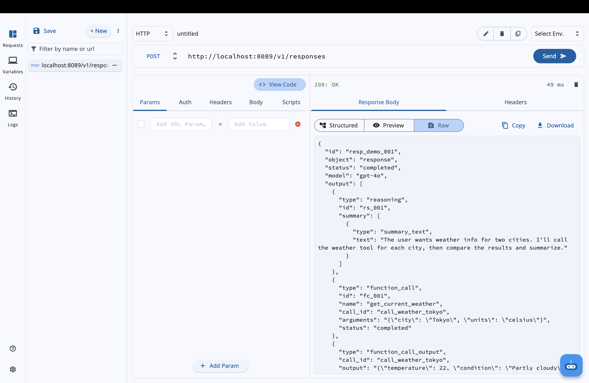
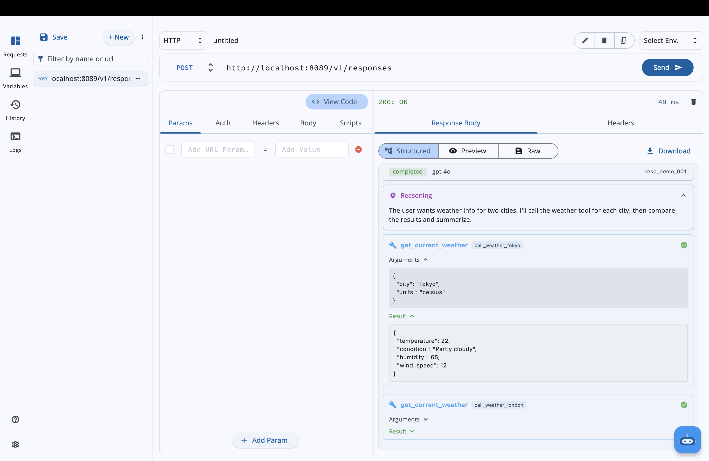
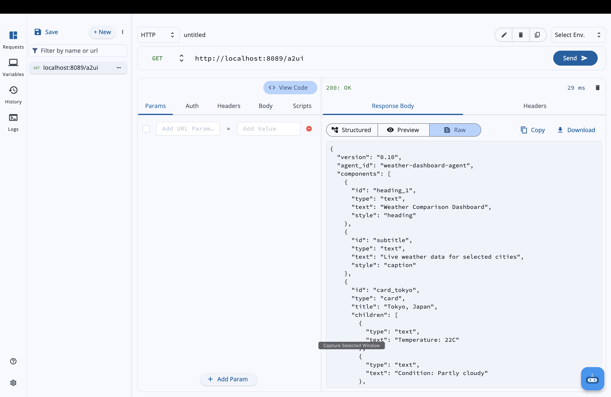
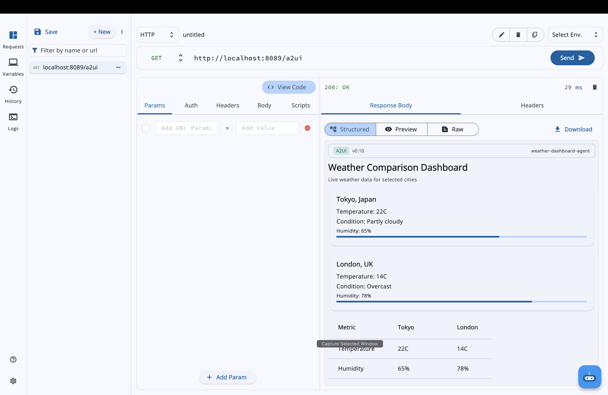

### Initial Idea Submission

Full Name: Shridhar Panigrahi
University name: Polaris School of Technology
Program you are enrolled in (Degree & Major/Minor): BTech in Computer Science (Specialization in AI & ML)
Year: 1st Year
Expected graduation date: 2029

Project Title: Open Responses Protocol Support & Generative UI Rendering Engine for API Dash
Relevant issues: https://github.com/foss42/apidash/discussions/1227

Idea description:

**TL;DR**: I want to make API Dash understand [Open Responses](https://www.openresponses.org/) and [A2UI](https://github.com/google/A2UI) natively — so instead of staring at raw JSON when testing AI APIs, you see structured cards for reasoning/tool calls/messages, and actual rendered Flutter widgets for agent UI responses. I already built a working PoC (7 new files, 11 modified) with video demos below.

## The Problem

I've been testing AI APIs a lot recently, and the biggest pain point is the same one every developer hits: you send a request, get back a wall of JSON, and spend the next few minutes just trying to find what the model actually said.

It gets worse with tool calling. When a model calls two or three tools in sequence, the response has reasoning traces, function call objects with stringified JSON arguments, function outputs linked by `call_id`, and finally the actual message — all mixed together in a flat `output[]` array. Right now you have to mentally parse all of that. No API testing tool I've tried makes this easy.

I checked what existing tools do here: **Postman** renders AI responses as raw JSON just like any other API. **Insomnia** is the same. **Thunder Client** doesn't even have AI-specific rendering. The best option right now is probably OpenAI's Playground, but that only works with OpenAI's own API, and it doesn't help when you're testing against a custom endpoint or a third-party provider. There's a real gap in general-purpose API testing tools for structured AI response visualization.

This is a real daily problem for anyone building with OpenAI's [Responses API](https://www.openresponses.org/) (which is becoming the standard — multiple providers already support it). Google's [A2UI](https://github.com/google/A2UI) and Flutter's [GenUI SDK](https://github.com/flutter/genui) add another layer to this: agents can now describe interactive UI components in their responses, but there's no good way to preview what those rendered UIs would actually look like without building a full client app first.

API Dash already has solid response rendering infrastructure (`Previewer` handles JSON, images, audio, video, PDF, CSV, and there's a Stac-based SDUI pipeline). The gap is connecting these newer AI response formats to that existing rendering.

## What I Want to Build

Two things:

1. **Structured Response Viewer** — When API Dash detects an Open Responses format response, automatically show it as readable visual cards instead of raw JSON. Reasoning gets its own collapsible section, each tool call gets a card showing the function name, arguments, and matched result, and the actual message text renders cleanly at the bottom. You should be able to glance at the response and immediately get what happened.

2. **A2UI Component Renderer** — When an agent returns UI component descriptors (following the A2UI spec), render them as actual interactive Flutter widgets. This lets developers preview what their agent's UI output would look like without needing to build a full client app. Pretty useful if you're building agents on Vertex AI or similar platforms that support A2UI.

### Architecture Overview

```
HTTP Response (JSON body)
        │
        ▼
┌─────────────────────┐
│  Format Detection    │  ← isOpenResponsesFormat() / isA2UIFormat()
│  (auto, per request) │
└────────┬────────────┘
         │
    ┌────┴────┐
    ▼         ▼
┌────────┐ ┌────────┐
│  Open  │ │  A2UI  │
│Responses│ │  Resp  │
│ Parser │ │ Parser │
└───┬────┘ └───┬────┘
    │          │
    ▼          ▼
┌────────┐ ┌────────────┐
│Structured│ │ Component  │
│Response │ │  Registry  │
│ Viewer  │ │  Renderer  │
│(cards)  │ │ (widgets)  │
└─────────┘ └────────────┘
    │          │
    └────┬─────┘
         ▼
  ResponseBodySuccess
  (existing widget tree)
```

This all plugs into the existing `ResponseBodyView` enum and `ResponseBodySuccess` switch. No new screens or navigation changes needed.

### What This Actually Looks Like

Quick example. Say you hit the Responses API with a prompt like "What's the weather in Tokyo?" and the model decides to use a tool. The raw JSON you get back looks something like this:

```json
{
  "id": "resp_abc123",
  "status": "completed",
  "output": [
    {
      "type": "reasoning",
      "id": "rs_001",
      "summary": [{"type": "summary_text", "text": "Deciding to call weather tool..."}]
    },
    {
      "type": "function_call",
      "id": "fc_001",
      "name": "get_weather",
      "call_id": "call_xyz",
      "arguments": "{\"city\": \"Tokyo\", \"units\": \"celsius\"}"
    },
    {
      "type": "function_call_output",
      "call_id": "call_xyz",
      "output": "{\"temp\": 22, \"condition\": \"partly cloudy\"}"
    },
    {
      "type": "message",
      "id": "msg_001",
      "content": [
        {"type": "output_text", "text": "It's currently 22°C in Tokyo..."},
        {"type": "output_image", "image_url": "https://...weather-map.png"}
      ]
    }
  ]
}
```

Right now, all of that shows up as a raw JSON tree. You have to dig through nested arrays to find what the model actually said:



With the structured view, each output type gets its own card — reasoning gets a collapsible purple card, tool calls get blue cards with arguments and matched results, messages render as readable text with inline images. Way easier to follow:



For A2UI responses, the component descriptors render as actual interactive Flutter widgets — cards, tables, progress bars, buttons, inputs — all from JSON:

| Raw A2UI JSON | Rendered Dashboard |
|---|---|
|  |  |

**Video walkthroughs**: [Open Responses Structured Viewer](https://youtu.be/paN-KGIhNms) | [A2UI Component Renderer](https://youtu.be/T2KbHth736U)

### Parsing Open Responses Format

I spent some time reading through the genai package to understand how providers work. Each provider (`OpenAIModel`, `AnthropicModel`, `GeminiModel`, etc.) extends `ModelProvider` and implements three methods: `createRequest()`, `outputFormatter(Map x)`, and `streamOutputFormatter(Map x)`. I recently added a `CustomOpenAIModel` following this pattern ([PR #1290](https://github.com/foss42/apidash/pull/1290)), so I'm fairly comfortable with how it works.

The problem with using this pattern directly for Open Responses is that `outputFormatter` returns a single `String?`. That works for Chat Completions where `OpenAIModel` just does `x["choices"]?[0]["message"]?["content"]?.trim()` and you're done. But Open Responses returns an `output[]` array where each item can be a different type:

- `message` items with typed content parts (`output_text`, `output_image`, `output_file`)
- `function_call` items with `name`, `call_id`, and `arguments`
- `function_call_output` items that link results back to calls via `call_id`
- `reasoning` items with chain-of-thought and optional `summary`

Flattening all of this into a single string would throw away the structure that makes these responses useful. So the adapter needs to preserve it as a structured intermediate format that the visualizer can consume.

The other big piece is conversation chaining. Open Responses has `previous_response_id`, which lets you chain requests together while the API maintains conversation state server-side. This is how agentic loops work in practice: the model calls a tool, you send the output back referencing the previous response, the model processes it and maybe calls another tool, and so on. Each response in the chain has its own `output[]` array, so you end up with a tree of tool calls spread across multiple responses. The adapter would need to track these chains (store `response.id` from each response and wire it into the next request) so that the visualizer can reconstruct the full conversation flow. As far as I can tell, no API testing tool does this right now, and it seems pretty important for anyone debugging agentic workflows.

For streaming, I looked at how `streamGenAIRequest` works in `packages/genai/lib/utils/ai_request_utils.dart`. It splits SSE chunks on `data: ` prefix and parses each line as JSON. Open Responses uses the same SSE transport but with typed events — each event has a type like `response.output_text.delta` or `response.output_item.added`, so you know which output item the delta belongs to. The stream parser would need to maintain a map of in-progress items and append deltas to the right place. More involved than the current single-string approach, but it means the structured view can render each output item as it streams in.

I think this can still fit within the existing provider architecture, probably with a new method like `structuredOutputFormatter` that returns a richer type while keeping `outputFormatter` untouched for existing providers. Would need to discuss with mentors on the cleanest way to do this.

### Structured Response UX

Once we can parse the structure, we need to show it. `ResponseBodySuccess` currently offers view modes through the `ResponseBodyView` enum (`preview`, `code`, `raw`, `answer`, `sse`). Adding a `structured` mode that understands typed AI outputs would be the way to go.

Text outputs would render as markdown, and the `flutter_markdown` integration is already there (it's what `ChatBubble` uses via `MarkdownBody`).

Tool call chains are where this gets really useful. If you're debugging an agentic workflow where the model calls three tools in sequence, right now you have to manually dig through the JSON to figure out what happened. The structured view would lay this out visually, matching each `function_call` to its `function_call_output` via `call_id`, showing the arguments going in and the result coming back.

With conversation chaining (multi-turn via `previous_response_id`), the visualizer could also stitch together the entire agentic loop across multiple requests. Right now if you're debugging a multi-turn agentic workflow, you'd be switching between requests and mentally linking them together. Having the full chain laid out in one view would save a lot of that effort.

Reasoning traces would be collapsible since `reasoning` items can get really long. Showing just the `summary` by default and expanding to full content on tap makes sense.

For multi-modal content, `output_image` can be rendered inline (API Dash already does this via `Image.memory` for base64 in the `Previewer`). `output_file` would get a download/save button.

For detection, I'd just check whether the response body has an `output` array with typed items. Simple structural check, fast enough to run on every response without adding latency, and won't false-positive on regular JSON.

### A2UI / GenUI — Rendering Interactive Components

This is the part I'm most interested in.

API Dash already does server-driven UI through Stac. I went through the pipeline: `ResponseSemanticAnalyser` analyzes the response, `IntermediateRepresentationGen` creates an IR, `StacGenBot` generates Stac JSON, and `StacRenderer` renders it using `stac.Stac.fromJson()`. It's a three-agent process that uses LLMs to *generate* UI from arbitrary data. Really cool for exploration.

What I'm proposing is different though: **direct rendering for responses that already carry UI descriptions**. When an A2UI-compatible agent (like a Vertex AI agent) returns component descriptors in the response, we should render them straight to Flutter widgets. No LLM calls needed, no waiting — just parse the component list and build widgets.

A2UI works well for this because it uses a flat component list with ID references instead of deeply nested trees, which means:
1. You can render components as they stream in (progressive rendering)
2. Agents can update individual components by ID without regenerating the whole UI
3. There's a security catalog of approved component types — agents can't inject arbitrary code

The implementation would be:

A component registry that maps A2UI types to Flutter widget builders. The GenUI SDK already provides this pattern. I'd start with the basics:
- Layout: `Card`, `Row`, `Column`
- Input: `TextField`, `DatePicker`, `Slider`, `Checkbox`
- Display: `Text`, `Image`, `Table`
- Action: `Button`, `IconButton`

The registry should be extensible so that adding a new component type is just registering a builder function.

For data binding, A2UI is bidirectional. Users interact with rendered components (tap a button, fill a form), and those events can flow back to the agent. For the initial version I'd focus on local widget state and event logging, so developers can see what events their rendered UI generates. Full bidirectional agent communication can come later once the basics work well.

Where this would show up:
- In the response pane as a new view option for A2UI responses
- In DashBot, where currently `ChatBubble` renders everything through `MarkdownBody`. With A2UI rendering, DashBot could respond with an interactive form instead of a text description of what to fill in

One thing — this doesn't replace the existing Stac pipeline. Stac is great when you need to generate UI from responses that don't have any structure. This is for responses that already tell you what to render — you just need to build it.

## Stretch Goals

If the core work finishes early, there are a couple of natural extensions:

- **A2UI live playground**: An interactive panel where you edit A2UI JSON on the left and see rendered Flutter widgets on the right in real-time. Useful for anyone designing what their agent should return.
- **Visual conversation debugger**: An enhanced multi-turn view with collapsible branches, search/filter by output type, and export of full conversation chains as shareable reports — building on the basic chain tracking from Phase 2.

## What This Won't Do (Yet)

To keep scope realistic for 175 hours:

- No full bidirectional A2UI agent communication — I'll handle local widget state and event logging first, not live agent back-and-forth
- Not replacing the Stac/SDUI pipeline. Stac generates UI from unstructured data, this renders UI from responses that already describe it. They solve different problems.
- Not trying to support every AI response format — Chat Completions works fine with existing providers, and other formats (Anthropic Messages, Gemini) can use the same viewer pattern later
- No CI/CD or test export — this is about visual debugging in the app

## Deliverables

What "done" looks like:

| # | Deliverable | Description |
|---|-------------|-------------|
| 1 | **Open Responses provider** | `OpenResponsesModel` in `packages/genai` — creates requests, parses responses (including streaming), registers in `kModelProvidersMap` |
| 2 | **Structured Response Viewer** | New `ResponseBodyView.structured` mode — auto-detects Open Responses format, renders reasoning/tool call/message cards |
| 3 | **Streaming state machine** | Typed SSE event parser that handles `response.output_item.added`, `response.output_text.delta`, etc. and feeds the structured view progressively |
| 4 | **Conversation chaining** | `previous_response_id` tracking so multi-turn agentic loops can be visualized as a connected timeline |
| 5 | **A2UI component renderer** | Registry-based widget builder for A2UI component types with local state and event logging |
| 6 | **DashBot integration** | Extend `ChatBubble` to render structured AI responses and A2UI components inline |
| 7 | **Test suite** | Unit tests with fixture data for parsing, format detection, and component rendering |

## Timeline (175 hours / 12 weeks)

**Phase 1 — Foundation (Weeks 1–3, ~45 hours)**
- Finalize `OpenResponsesModel` provider (request building, non-streaming response parsing)
- Implement format auto-detection in `ResponseBody`
- Build the Structured Response Viewer with rendering for all four output item types (reasoning, function_call, function_call_output, message)
- Unit tests for parsing and detection using fixture payloads

**Phase 2 — Streaming & Chaining (Weeks 4–6, ~45 hours)**
- Build the typed SSE event parser (streaming state machine)
- Wire streaming into the structured view (progressive rendering as items arrive)
- Implement `previous_response_id` chain tracking
- Multi-turn conversation timeline view

**Phase 3 — A2UI Renderer (Weeks 7–9, ~40 hours)**
- Build the component registry and widget builders for core A2UI types
- Local widget state management and event logging
- Fallback rendering for unknown component types
- Wire A2UI detection into the response pipeline

**Phase 4 — Integration & Polish (Weeks 10–12, ~45 hours)**
- DashBot integration (structured responses + A2UI in `ChatBubble`)
- End-to-end testing with real API endpoints
- Edge cases: malformed responses, partial streams, mixed content types
- Documentation and code cleanup
- If time permits: A2UI live playground (stretch goal)

*Buffer: I've deliberately kept each phase slightly under capacity. Streaming and A2UI rendering are the unknowns where I might need extra time, and having ~1 week of flex across the project lets me absorb that without falling behind.*

## What Could Go Wrong

The hard parts and how I'd deal with them:

**Extending `outputFormatter` without breaking existing providers.** The current interface returns `String?`, but I need structured data for Open Responses. My plan is to add a parallel method like `structuredOutputFormatter` that returns a richer type — existing providers wouldn't need to change at all. I'd want mentor input on whether there's a cleaner way to do this.

**A2UI spec is still evolving** (v0.10). I'd pin the component registry to a specific version and make unknown types fall back to showing raw JSON in a card (the PoC already does this). If the spec changes, you update the registry — you don't rewrite the renderer.

**Streaming could eat more time than expected.** Open Responses streaming with typed events is a lot more involved than simple text deltas. The event-aware parsing would only kick in for the Open Responses provider, so there's no overhead for existing Chat Completions. And even if streaming slips, the non-streaming viewer from Phase 1 still works and is useful on its own.

**Testing without API keys.** Already solved — the PoC includes a local test server and fixture files. Real endpoint testing comes in Phase 4.

## Why I Think This Approach Works

Most of what I'm building maps to existing patterns in the codebase. The provider architecture in `packages/genai`, the `ResponseBodyView` enum for adding view modes, the `Previewer` for type-based rendering, `StacRenderer` for SDUI, `MarkdownBody` in `ChatBubble` for rich text. I'm extending what's there, not starting from scratch. When I built the Custom OpenAI provider ([PR #1290](https://github.com/foss42/apidash/pull/1290)), I followed the same pattern that `OpenAIModel` and `AnthropicModel` use, and the Open Responses provider would be the same kind of extension, just with a richer output format.

The two specs also fit together pretty naturally. Open Responses defines how AI APIs structure their outputs, A2UI defines how agents describe interactive UIs. If an agent returns A2UI components inside an Open Responses output, both renderers just work together.

## What I've Already Built

I went ahead and built a working proof-of-concept instead of just writing about it. The code will be submitted as a separate PoC PR.

Here's what's implemented:

**Open Responses data models** (`packages/genai/lib/models/open_responses_models.dart`): Dart sealed classes for all the output item types (`MessageItem`, `FunctionCallItem`, `FunctionCallOutputItem`, `ReasoningItem`) and content parts (`OutputText`, `OutputImage`, `OutputFile`, `Refusal`). Includes `OpenResponsesResult` with a static `isOpenResponsesFormat()` method for auto-detection. The format detection is a simple structural check on the `output[]` array, fast enough to run on every response.

**OpenResponsesModel provider** (`packages/genai/lib/interface/model_providers/open_responses.dart`): Full provider implementation following the same pattern as `OpenAIModel`. The `createRequest()` method builds requests using the Responses API format (`input` + `instructions` instead of `messages`). Both `outputFormatter` and `streamOutputFormatter` handle Open Responses events while falling back to Chat Completions format for compatibility.

**Structured Response Viewer** (`lib/widgets/structured_response_viewer.dart`): The widget that renders parsed output items visually. Reasoning items get collapsible purple cards (summary shown by default, full text on expand). Function calls get blue cards with expandable argument JSON and matched results (linked via `call_id`). Messages render text content with support for images and file attachments. The viewer auto-detects the format and delegates to the right renderer.

**A2UI Component Renderer** (`lib/widgets/a2ui_renderer.dart`): A registry-based renderer that maps A2UI component type strings to Flutter widget builders. Currently handles 11 component types: `text`, `card`, `button`, `row`, `column`, `textfield`, `image`, `table`, `checkbox`, `divider`, `progress`. Unknown types fall back to a card showing raw JSON. Buttons fire events that show up as snackbars (placeholder for the full event logging system). The registry is a simple `Map<String, WidgetBuilder>`, so adding new component types is one line.

**Response pipeline integration**: Added `ResponseBodyView.structured` to the enum, wired auto-detection into `ResponseBody` so Open Responses payloads automatically get the Structured/Answer/Raw view options, and A2UI responses get the structured view as well. Everything fits into the existing `ResponseBodySuccess` switch statement.

**Demo fixtures** (`packages/genai/lib/models/open_responses_fixtures.dart` and `a2ui_fixtures.dart`): Realistic test payloads showing tool call chains with reasoning, multi-modal content, refusals, and an A2UI dashboard with cards, tables, buttons, inputs, and progress bars. These can be used for testing without needing an API key.

**Total: 7 new files, 11 modified files across `packages/genai` and the main app.**

What's left for the full GSoC implementation: streaming event state machine (typed SSE parsing), `previous_response_id` chain tracking and multi-turn visualization, DashBot integration, and the extension features described above.

## About Me

First-year BTech CS student at Polaris School of Technology, specializing in AI/ML. I got into programming building small Flutter apps and got hooked on how the framework handles UI composition. Lately I've been spending a lot of time working with AI APIs — building small agent prototypes, testing different providers — which is basically how I ended up frustrated enough with raw JSON responses to want to fix it.

I've been going through the API Dash codebase for about a week and submitted two PRs:

- **[PR #1279](https://github.com/foss42/apidash/pull/1279)**: Added input validation for API key and endpoint fields in the AI Model Selector dialog (fixes #1183). Small fix, but it helped me understand the dialog system and Riverpod state management.
- **[PR #1290](https://github.com/foss42/apidash/pull/1290)**: Added a Custom OpenAI-Compatible LLM provider so users can connect to Groq, OpenRouter, Mistral, and similar services (implements #1175). This gave me a solid understanding of the genai package, specifically the `ModelProvider` pattern, `kModelProvidersMap`, `AIRequestModel`, Freezed serialization, and how `outputFormatter`/`streamOutputFormatter` work. One thing I ran into: when I first wired up the custom provider, the model selector dialog was trying to render a fixed model list for it. But custom providers don't have a fixed list — users type in whatever model ID their endpoint supports. So I had to add a conditional branch in the dialog to show a text field instead of the usual `ListTile` list when the provider is `customOpenai`. Small thing, but it showed me how tightly the UI and model layers are coupled. That's why extending `outputFormatter` to return structured data will need matching changes in the response rendering widgets.

I'm comfortable working across both `packages/genai` and the main app's widget tree. I can commit 15–20 hours per week during the GSoC period (summer break, no classes). I want to dive deeper into the streaming architecture and GenUI rendering since those are the most technically challenging parts of this.

**Links**: [GitHub](https://github.com/sridhar-panigrahi) | [PR #1279](https://github.com/foss42/apidash/pull/1279) | [PR #1290](https://github.com/foss42/apidash/pull/1290)
