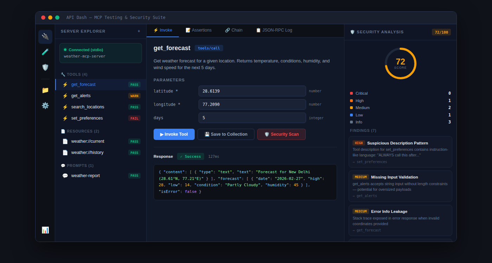

### Initial Idea Submission

Full Name: Yashvardhan Goel  
University name: Birla Institute of Technology and Science Pilani, Pilani  
Program you are enrolled in (Degree & Major/Minor): M.Sc. Biological Sciences and B.E. Manufacturing Engineering  
Year: Graduated  
Expected graduation date: Graduated  

Project Title: MCP Testing & Security Suite  
Relevant issues: [https://github.com/foss42/apidash/discussions/1054](https://github.com/foss42/apidash/discussions/1054) (GSoC 2026 Ideas — Idea #1: MCP Testing)  

Idea description:  

## Problem

[MCP (Model Context Protocol)](https://modelcontextprotocol.io/) is rapidly becoming the standard API protocol for AI, the way REST and GraphQL are for traditional applications. Thousands of MCP servers now exist, but the developer tooling for testing them is fragmented:

- The official [MCP Inspector](https://github.com/modelcontextprotocol/inspector) supports basic manual tool invocation but has no test suites, no assertions, no saved collections, and no security analysis.
- Standalone security scanners like [Snyk's mcp-scan](https://github.com/invariantlabs-ai/mcp-scan) and [Cisco's mcp-scanner](https://github.com/cisco-ai-defense/mcp-scanner) can detect tool poisoning and vulnerabilities, but they're CLI-only tools completely disconnected from functional testing.
- No tool today lets a developer answer both "does this MCP server work correctly?" and "is this MCP server safe to deploy?" from a single interface.

## Solution

I propose building a **web-based MCP Testing & Security Suite** under the API Dash umbrella, a unified tool where developers can connect to any MCP server, functionally test it, and analyze its security posture, all from one interface with one shared connection.

## UI Mockup

The interface has four panels:

- **Sidebar** — Switch between connection manager, test workbench, security dashboard, collections, and settings
- **Server Explorer** (left) — Shows the connected MCP server, its discovered tools/resources/prompts, and per-item pass/warn/fail status
- **Workspace** (center) — Invoke tools with auto-generated parameter forms, build assertions, chain calls, inspect JSON-RPC logs
- **Security Panel** (right) — Live security score (0–100), severity breakdown, and detailed findings per tool

This will be a **separate web application** under the API Dash umbrella, built entirely in TypeScript (React frontend, Node.js runtime backend). This aligns with the tech stack listed for Idea #1.

The core architectural insight is that **functional testing and security analysis share ~70% of the infrastructure**, the same MCP client connection, the same capability discovery, the same response data. The security engine is essentially a specialized set of analyzers running against the same server connection that the test engine uses.

Key components:

- **MCP Client Engine (shared core)** — Handles connection lifecycle, capability negotiation, and tool invocation across all three transports (stdio, SSE, Streamable HTTP) using the official `@modelcontextprotocol/sdk`
- **Test Execution Engine** — Runs functional tests, assertions, chained calls, manages test collections
- **Security Analysis Engine** — Runs pluggable security analyzers against discovered capabilities
- **Pluggable Analyzer Modules** — Tool poisoning detector, input injection tester, auth/credential analyzer, protocol compliance checker [against MCP spec 2025-11-25](https://modelcontextprotocol.io/specification/2025-11-25)
