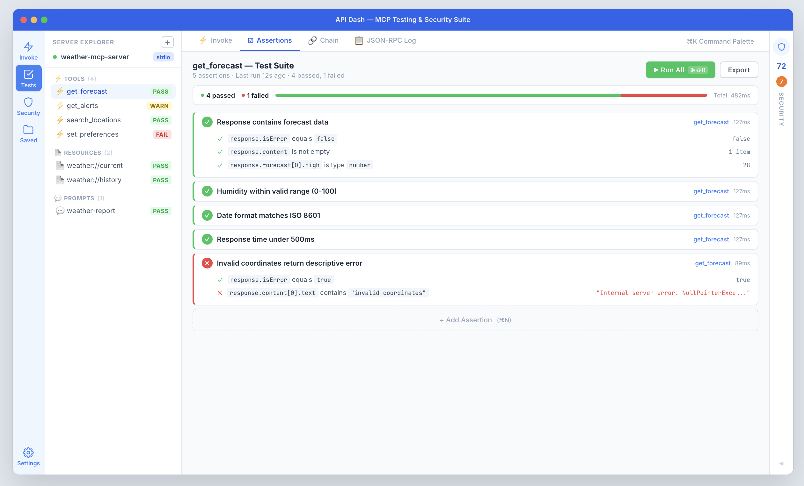

### Initial Idea Submission

Full Name: Yashvardhan Goel  
University name: Birla Institute of Technology and Science Pilani, Pilani  
Program you are enrolled in (Degree & Major/Minor): M.Sc. Biological Sciences and B.E. Manufacturing Engineering  
Year: Graduated  
Expected graduation date: Graduated  

Project Title: MCP Testing & Security Suite  
Relevant issues: [https://github.com/foss42/apidash/discussions/1054](https://github.com/foss42/apidash/discussions/1054) (GSoC 2026 Ideas — Idea #1: MCP Testing)  

Idea description:  

## Problem

[MCP (Model Context Protocol)](https://modelcontextprotocol.io/) is rapidly becoming the standard API protocol for AI, the way REST and GraphQL are for traditional applications. Thousands of MCP servers now exist, but the developer tooling for testing them is fragmented:

- The official [MCP Inspector](https://github.com/modelcontextprotocol/inspector) supports basic manual tool invocation but has no test suites, no assertions, no saved collections, and no security analysis.
- Standalone security scanners like [Snyk's mcp-scan](https://github.com/invariantlabs-ai/mcp-scan) and [Cisco's mcp-scanner](https://github.com/cisco-ai-defense/mcp-scanner) can detect tool poisoning and vulnerabilities, but they're CLI-only tools completely disconnected from functional testing.
- No tool today lets a developer answer both "does this MCP server work correctly?" and "is this MCP server safe to deploy?" from a single interface.

## Solution

I propose building a **web-based MCP Testing & Security Suite** under the API Dash umbrella, a unified tool where developers can connect to any MCP server, functionally test it, and analyze its security posture, all from one interface with one shared connection.

## UI Wireframes

The interface follows a consistent four-panel layout: **Sidebar** (navigate between views), **Server Explorer** (left — connected server, discovered capabilities with pass/warn/fail status), **Workspace** (center — the active view), and a collapsible **Security Strip** (right — score and findings count at a glance).

### 1. Connection Setup

The first screen a developer sees. Select a transport (stdio or Streamable HTTP per [MCP spec 2025-03-26](https://modelcontextprotocol.io/specification/2025-03-26/basic/transports)), configure the server command, arguments, working directory, and environment variables. Recent connections are listed in the explorer for quick reconnect.

### 2. Tool Invocation

The primary testing workspace. Auto-generated parameter forms from the tool's schema, keyboard shortcuts for power users (&#8984;&#9166; to invoke, &#8984;S to save), and a response viewer with Tree/Raw/Headers tabs. The security panel collapses to a thin strip showing the score (72) and findings count (7), expandable on demand.

### 3. Test Assertions

Build assertion suites per tool. Each assertion defines rules (e.g., `response.isError equals false`, `response.forecast[0].high is type number`) with pass/fail results. A summary bar shows the overall test run status with a visual progress indicator.

### 4. Tool Chaining

Chain multiple tool calls together with variable extraction. Output from one step (e.g., `$lat ← results[0].latitude`) feeds into the next step's parameters. Each step shows its status, extracted variables, and a response preview. This enables end-to-end workflow testing across multiple tools.

### 5. Security Dashboard

A dedicated security view with score banner, pluggable analyzer results (Tool Poisoning, Input Injection, Auth/Credentials, Protocol Compliance), and a filterable findings table. Selecting a finding expands inline to show the flagged content and concrete remediation guidance.

This will be a **separate web application** under the API Dash umbrella, built entirely in TypeScript (React frontend, Node.js runtime backend). This aligns with the tech stack listed for Idea #1.

The core architectural insight is that **functional testing and security analysis share ~70% of the infrastructure**, the same MCP client connection, the same capability discovery, the same response data. The security engine is essentially a specialized set of analyzers running against the same server connection that the test engine uses.

Key components:

- **MCP Client Engine (shared core)** — Handles connection lifecycle, capability negotiation, and tool invocation across both standard transports (stdio, Streamable HTTP) as defined in [MCP spec 2025-03-26](https://modelcontextprotocol.io/specification/2025-03-26/basic/transports), with backwards-compatible support for the deprecated HTTP+SSE transport, using the official `@modelcontextprotocol/sdk`
- **Test Execution Engine** — Runs functional tests, assertions, chained calls, manages test collections
- **Security Analysis Engine** — Runs pluggable security analyzers against discovered capabilities
- **Pluggable Analyzer Modules** — Tool poisoning detector, input injection tester, auth/credential analyzer, protocol compliance checker [against MCP spec 2025-03-26](https://modelcontextprotocol.io/specification/2025-03-26)
