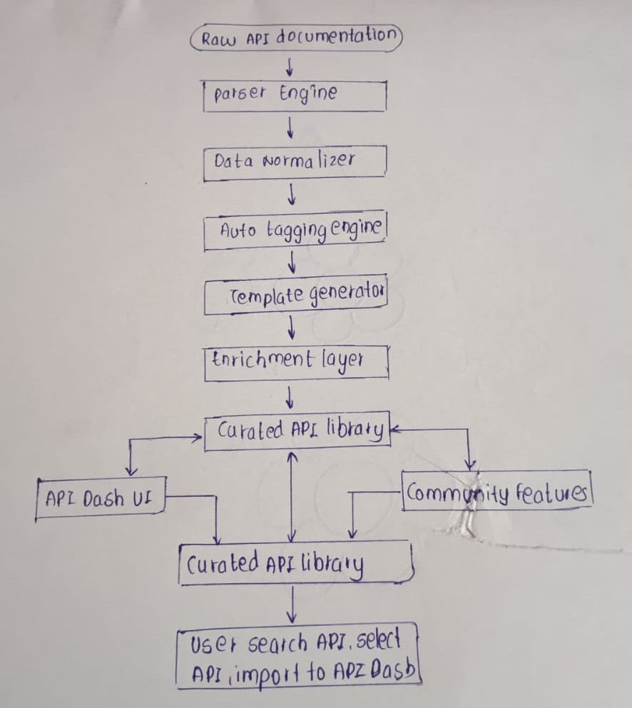
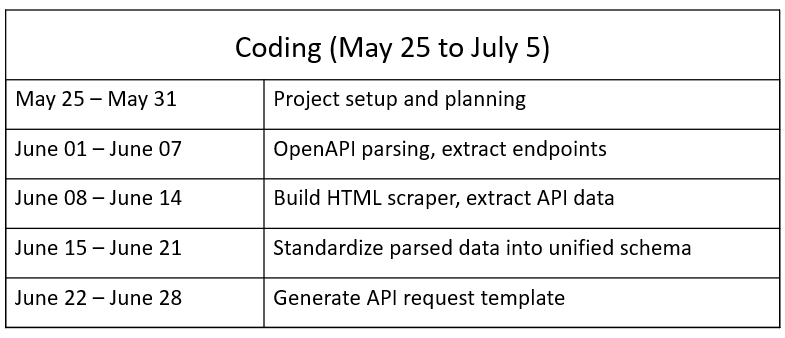
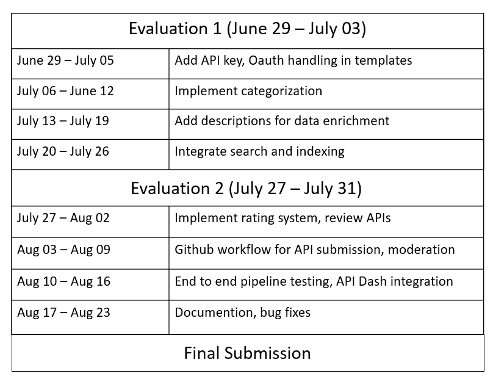

### About ###

    Name             : Chaitanya Shivram Parab

    Time Zone        : India Standard Time(IST), UTC+5:30

    Email            : cparab02@gmail.com

    Phone            : +91- 8698474185

    Course           : Bachelor’s of Engineering, Computer Science

    University       : Mumbai University

    Country          : India

    GSoC Fulltime    : No, After mid May I will be fulltime available till June 30, after July 01 my
                       college academics might start so thereby I will give my 28 hours/week to my project.     
                        
    Obligations      : None

    Links		     : [LinkedIn]  (https://www.linkedin.com/in/chaitanya-parab/)
                       [Github]    (https://github.com/Chaitanya-Parab) 
 

### Why API Dash? ###

I’m passionate about building tools that improves users workflows. API Dash stands out to go beyond a traditional API client by integrating support for AI API’s, multimodal evaluation and agentic features. From my experience building web applications I’ve often faced challenges in discovering API’s and manually configuring requests but API Dash has made it more simple and easy. This is why the idea of a curated API library to make user easily search, categorize, one- click import resonates me to solve the real world problems. API Dash tech stack aligns well with my skills, while also giving me the opportunity to grow in backend automation. Contributing here allows me to build impactful features that enhance user’s experience at scale.

### The Project: API Explorer ###

a. The Synopsis:

     This project aims to enhance the API Dash user experience introducing a curated API library powered by an automated backend pipeline.The system will enable developers to discover, search and directly import APIs into their workspace with minimal setup.

b. What it means to accomplish?  

     1. Fully Functional Automation Pipeline: End-to-end system that ingests API
    docs and outputs structured API data.
     2. API Template Generation: Ready-to-use API requests.
     3. Intelligent Categorization: APIs automatically tagged into domains.
     4. Searchable API Library: Users can easily discover API via filters and search.
     5. Community Feature: Ratings & reviews system, GitHub-based contribution workflow.
     6. Integration with API Dash: APIs can be imported directly into the workspace.
     7. Scalability & Automation: Support for continuous updates and new API ingestion.

c. Dataflow diagram:

    

### Timelines ###

 Before Community Bonding Period:

     a. Contribute in general to API Dash.
     b. Fix the assigned issues by telling them my project idea.
     c. Discuss different possible approaches for the project with the mentors.
     d. Learn more about testing RESTful APIs.

 Community Bonding Period:
 
     a. Introduce myself to my mentors and read documentation.
     b.  Deep dive into the existing architecture of API Dash.
     c.  Set up the complete local development environment and run the project end-to-end.
     d.  Breakdown the project into well-defined milestones and deliverables with mentors feedback.
     e. Research and discuss various ideas and small details for the project.
     f. Add necessary codesystem.

 Coding Period:
     
     Coding(May 25 - July 5) 
     Evaluation(June 29 - July 31 ) 

### Expectations from Mentors ###
 
Help me understand the existing code of API Dash whenever I am incapable of doing so on my own.
Suggest me some study material to hab a clearer view of how things are done ideally.
Help me come to a decision when I have more than one way of doing things and tell me why that is the best option.
Take time to review my work and provide their timely insight.

### Commitments ###

Important:. As the size of my project idea is  small I will be full time available from mid May when the actual coding start till the end of June.  My university academics for final year will be scheduled by 01 July thereby I need to attend my lectures, after 01 July I will give my 28 hours/week through online platforms and is ready to extend whenever needed.   

### After GSoC ###

I would like to keep contributing to API Dash after GSoC and will be available to resolve issue and manage pull requests, Even if I am not selected this year, I will like to help this project by resolving the issue, suggesting new ideas and participating in discussions. Beyond this project, I see myself continuing to work on developer tools and applied AI systems, building solutions that improve productivity and user experience. GSoC would be the foundation for my long-term involvement in open source and impactful software development.

### Introduction ###

I am in the third year of my Bachelor in Computer Science course. Computers have always interested me. I am a coding enthusiast. I have always loved working on algorithms and their visualizations emphasising on writing readable code. I am comfortable with C, Java and  Python. I aslo have good experience in Git, Javascript, MYSQL and other technology. Recently, got more engaged in Agent AI. I have developed some websites which are available on my Github account. I can write clean and efficient code and can explain it too. I am looking forward to the challenges awaiting me. In my opinion, the main objective of GSoC is to learn and gain experience, I hope to accomplish it.

### Internships ###

    a. E- Commerce Website
      I have worked with Edunet Foundation team. I gained hands-on 
      experience building an website for 6 weeks. I majorly worked on MERN 
      stack technologies (MongoDB, Express.js, React.js, Node.js ). The work I  
      did:
        1. Builded a e-commerce website using MERN Stack technologies.
	    2. Created a intuitive interface for browsing products, adding them to cart and completing purchases.
        3. Using Express.js managed the user authentication, product inventory management and order processing. 

    b. Human Pose Estimation System
 
      I have worked with the Edunet Foundation team. I gained hands on 
      Experience building a website. The skills and technologies I learned:
        1. It allowed me to deepen my understanding of convolutional neural network, keypoint detection and real time processing.
        2. Gained deep insight in openCV, streamlit, tensorflow, implementing deep learning models, pre- processing image data and  
           evaluating model performance.
        3. Got the knowledge and experience of pose estimation using machine learning.

      

                         