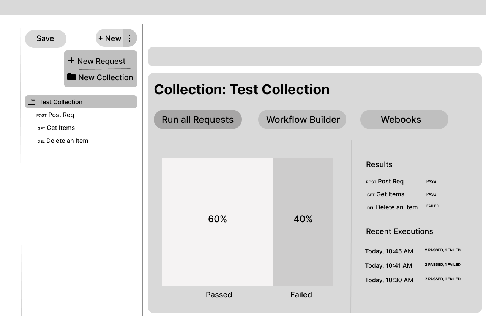
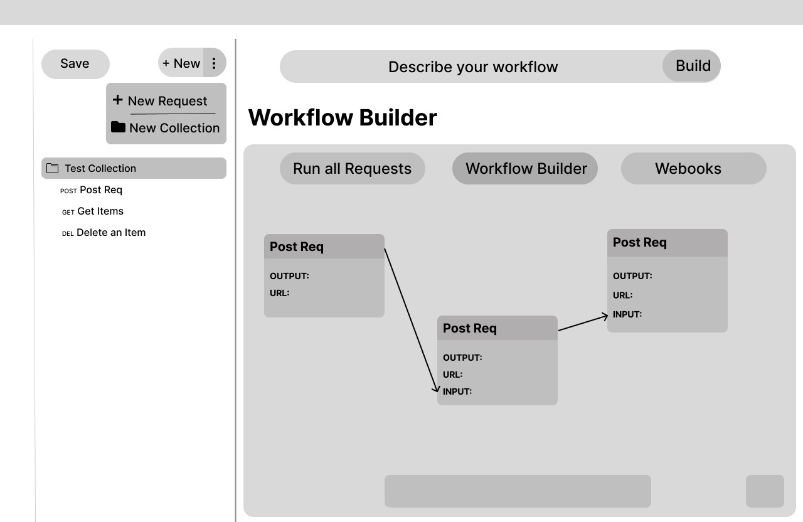

### Initial Idea Submission

Full Name: Sagar Newpane
University name: University of Wolverhamtpon
Program you are enrolled in (Degree & Major/Minor): Computer Science
Year: 3rd
Expected graduation date: 2025

Project Title: Building Collaborative GitOps and Visual Workflow Environment in ApiDash

Relevant issues: [Issue #502](https://github.com/foss42/apidash/issues/502) [Issue #120](https://github.com/foss42/apidash/issues/120)

## Idea description:

The idea focuses on 3 tasks which are kind of inter-related:

1) Collection Dashboard: Currently the App lacks a collection feature to group endpoints of a particular module/feature. As it helps in organising the workflow and endpoints. Solving this would be my first task.

 

Initial Ideas includes:
- Collection tab is opened when clicked on the name of the collection on the left panel.
- Includes all the enpoints in a collection
- Can test all the enpoints from a single dashboard
- Visual metrics showing the success rate of the collection
- View recent logs on workflow executions and status
- Webhooks for automatic pushing results or notifications to external APIs

2) Visual Workflow Builder: In a collection testing of one endpoint after another and passing data can be easily managed and automated using a builder with a Drag and Drop interface which can be built in two ways:

 

- AI Builder: User can describe the flow and working of the wokrflow and agent will generate the nodes in the editor. The initial plan for this agent is to be a seperate agent than DashBot the exists in the bottom right to keep the working within it and avoid complexity. The placement is for this agent is thought to be on the top.

- Manual Builder: Users can drag and drop endpoints on the editor, can connect endpoints, control the flow of data manually and adjust as needed.

3) Git Integrations: Currently there is no way to collaborate with other developers.Git also provides other functionality like:
- Version Tracking for endpoints, collections and even workflows
- Branching workspaces for experimenting without breaking existing endpoints/workflows.
- Direct integration with CI/CD pipelines for automated testing in GitHub.