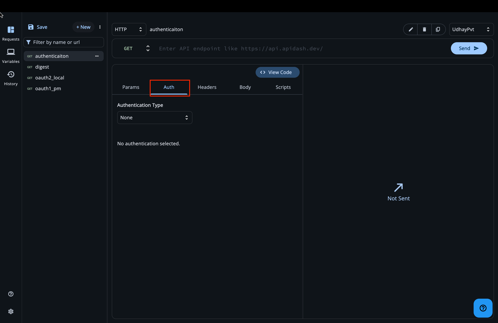
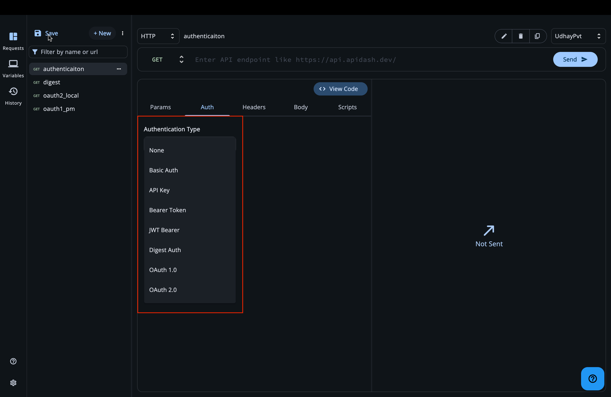
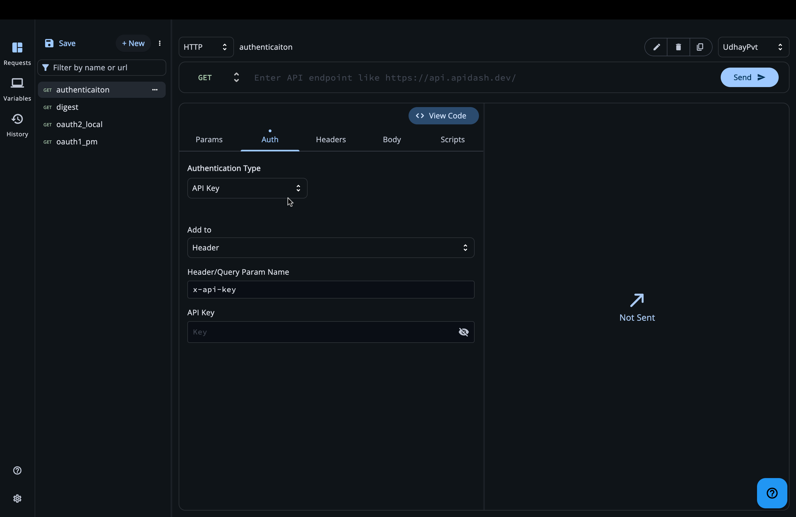
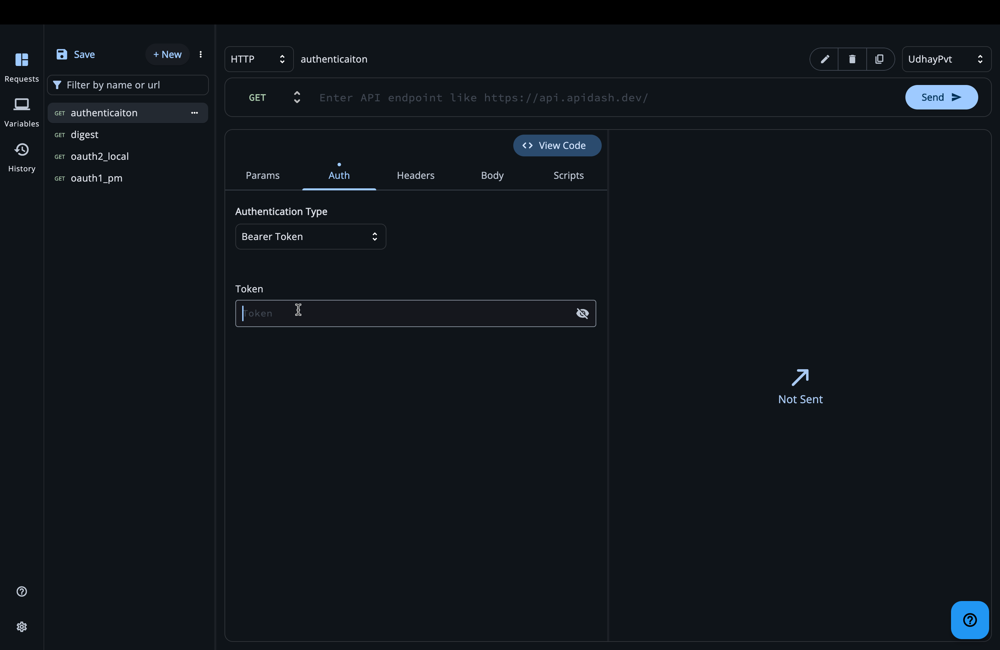
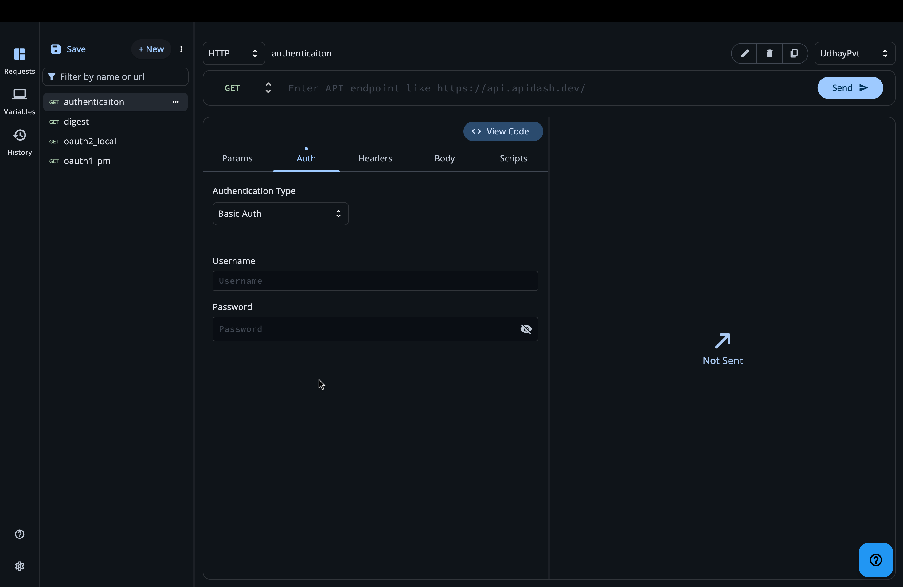
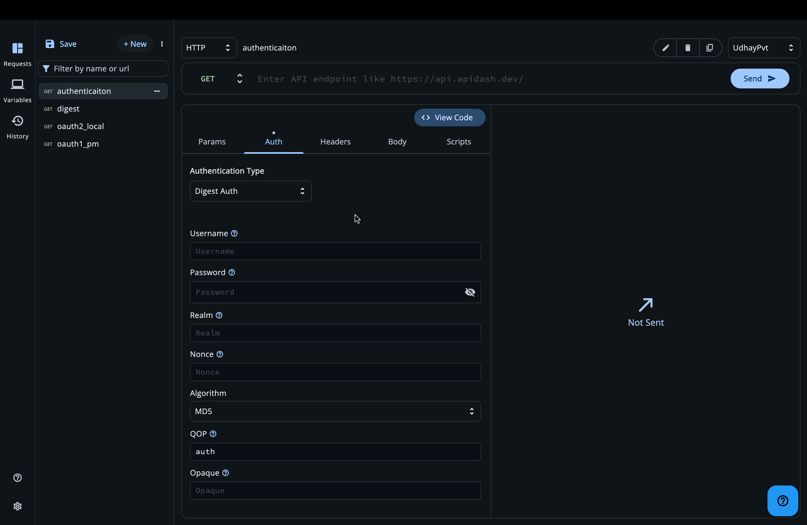
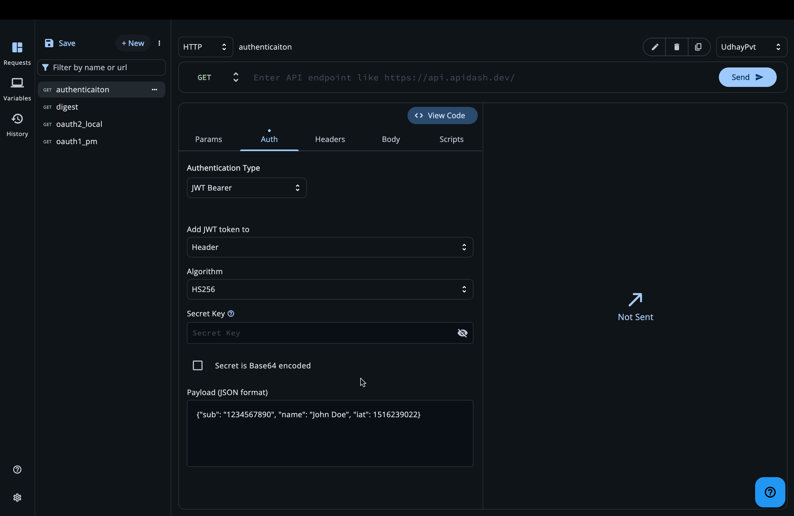
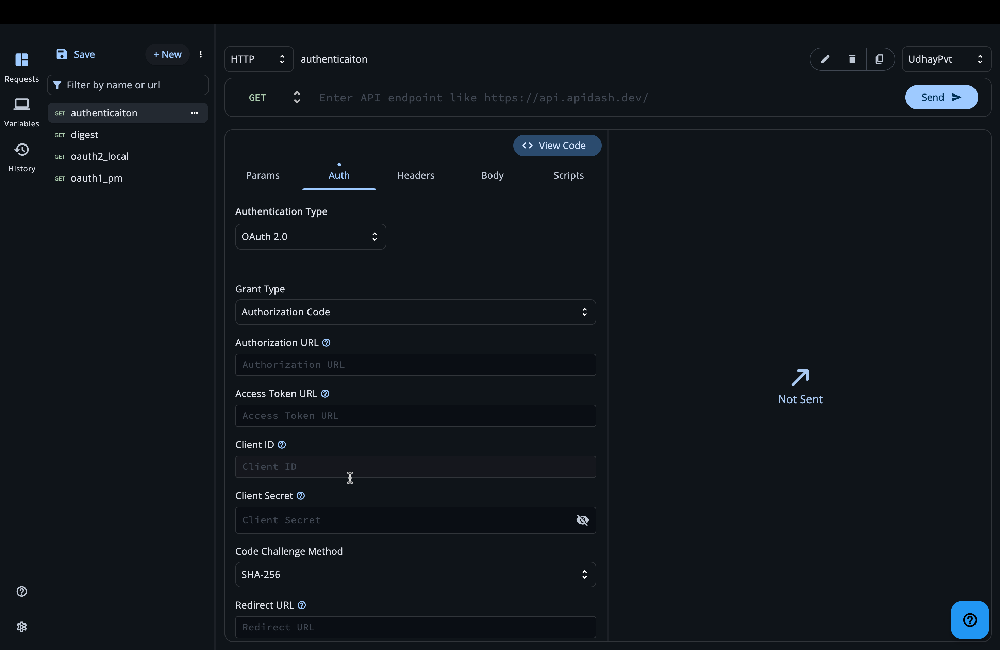
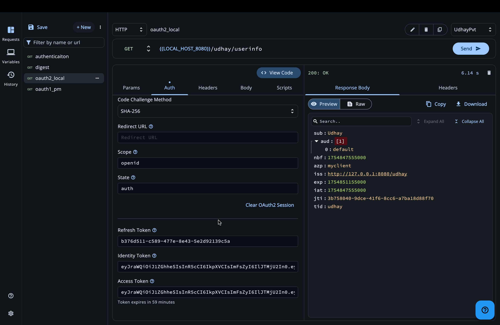

# Authentication in API Dash

This guide explains how to authenticate your API requests in API Dash. We’ll start from zero and walk through each supported method with plain-language steps, examples, and tips.

Use this page when you need your requests to include credentials (tokens, keys, usernames/passwords, etc.).

> 

---

## Where to find authentication

1. Open any request (or create a new one).
2. Switch to the “Authentication” tab.
3. Use the “Authentication Type” dropdown to select how you want to authenticate.

> 

When a type is selected, API Dash shows the relevant fields. As you type, your request preview updates and API Dash will attach the credentials to the outgoing request either in headers or in the URL (depending on the method).

---

## Supported methods at a glance

- None (No Auth)
- API Key
- Bearer Token
- Basic Auth (username & password)
- Digest Auth
- JWT Bearer (signed JSON Web Token)
- OAuth 1.0
- OAuth 2.0 (Authorization Code, Resource Owner Password, Client Credentials; PKCE support)

Each section below explains what it is, when to use it, and exactly how to fill it in API Dash.

---

## None (No Auth)

- Use when your API is public or doesn’t require credentials.
- API Dash won’t add any Authorization headers or query parameters.

Steps:
1. In Authentication Type, select “None”.
2. Send your request as usual.

---

## API Key

API key auth sends a single key-value pair with your request, either in a header or as a query parameter.

Typical use: Public APIs that issue static keys for access control.

What API Dash sends:
- If “Add to” is Header: a header named <Name> with the key as its value (default name: `x-api-key`).
- If “Add to” is Query Params: a `?<Name>=<Key>` appended to the URL.

Fields in API Dash:
- Add to: Header or Query Params
- Header/Query Param Name: default `x-api-key` (editable)
- API Key: your actual key value

Steps:
1. Select “API Key”.
2. Choose “Add to”: Header (default) or Query Params.
3. Set the “Header/Query Param Name” (leave as `x-api-key` unless your API expects a different name).
4. Paste your API key in “API Key”.
5. Send the request.

> 

Example result (Header mode):
- Header: `x-api-key: <your-key>`

---

## Bearer Token

Bearer tokens are access tokens like OAuth 2.0 access tokens or other opaque tokens your API provides.

What API Dash sends:
- Header: `Authorization: Bearer <token>`

Fields in API Dash:
- Token

Steps:
1. Select “Bearer Token”.
2. Paste your token into “Token”.
3. Send the request.

> 

---

## Basic Auth

Basic authentication encodes a username and password and sends them in the Authorization header.

What API Dash sends:
- Header: `Authorization: Basic <base64(username:password)>`

Fields in API Dash:
- Username
- Password

Steps:
1. Select “Basic Auth”.
2. Enter your Username and Password.
3. Send the request.

> 

Security note: Basic Auth is only safe over HTTPS. Avoid using it over plain HTTP.

---

## Digest Auth

Digest authentication is a challenge-response mechanism. The server provides a challenge (realm, nonce, etc.), and the client computes a response using a hash function.

When to use: If the API server requires Digest Auth (you’ll typically see a 401 with `WWW-Authenticate: Digest ...`).

What API Dash sends:
- An `Authorization: Digest ...` header built using the fields below.

Fields in API Dash:
- Username: your account username
- Password: your account password (hashed in the auth process, not sent in plain text)
- Realm: protection space defined by the server (from server challenge)
- Nonce: server-provided random value
- Algorithm: hashing algorithm (e.g., MD5, SHA-256, SHA-512 depending on server)
- QOP: quality of protection (commonly `auth` or `auth-int`)
- Opaque: server-provided string to echo back

Steps:
1. Select “Digest”.
2. Fill Username and Password.
3. Fill the challenge details (Realm, Nonce, Opaque) from the server’s 401 response(done automatically by APIDash).
4. Choose the Algorithm and QOP your server requires.
5. Send the request again.

> 

Tip: If you don’t have Realm/Nonce/Opaque yet, send the request without them, APIDash will fill them for you.

---

## JWT Bearer (signed JSON Web Token)

JWT lets you create and sign a token that your API accepts as a credential. API Dash can sign a JWT for you based on your inputs.

What API Dash sends:
- If “Add JWT token to” is Header: `Authorization: Bearer <signed-jwt>`
- If “Add JWT token to” is Query Params: `?token=<signed-jwt>`

Fields in API Dash:
- Add JWT token to: Header or Query Params
- Algorithm: select the signing algorithm
  - HS...: HMAC with SHA (requires a Secret)
  - RS...: RSA (requires a Private Key)
  - ES...: ECDSA (requires a Private Key)
  - PS...: RSA-PSS (requires a Private Key)
- Secret: the HMAC secret (for HS algorithms)
- Secret is Base64 encoded: check if your secret is base64
- Private Key: PKCS#8 PEM for RS/ES/PS algorithms
- Payload: JSON payload to include in the token (e.g., `{"sub":"123","name":"Alice"}`)

Steps (HS256 example):
1. Select “JWT”.
2. Set “Add JWT token to” -> Header (recommended).
3. Choose Algorithm: HS256.
4. Enter your Secret (check “Secret is Base64 encoded” only if your secret is actually base64 encoded).
5. Enter your JSON Payload.
6. Send the request. API Dash signs and attaches the token.

Steps (RS256 example):
1. Select “JWT” Bearer.
2. Set “Add JWT token to” -> Header.
3. Choose Algorithm: RS256.
4. Paste your PKCS#8 Private Key into “Private Key”.
5. Enter your JSON Payload.
6. Send the request.

> 

Notes:
- Header prefix is `Bearer` when adding to headers.
- Query parameter key is `token` when adding to URL.
- Ensure clocks are in sync if your API validates `iat`, `nbf`, or `exp` claims.

---

## OAuth 1.0

OAuth 1.0 signs requests using consumer credentials and (optionally) user access tokens. API Dash generates the OAuth 1.0 signature based on the fields you enter.

What API Dash sends:
- The OAuth 1.0 parameters and signature, attached according to your configuration.

Fields in API Dash:
- Consumer Key
- Consumer Secret
- Signature Method: HMAC or PLAINTEXT variants (choose what your API requires)
- Access Token (optional; required for 3-legged flows after authorization)
- Token Secret (optional; pairs with Access Token for signing)
- Callback URL (if your provider requires a callback during authorization)
- Verifier (PIN/code returned by provider after user authorization)
- Timestamp (usually auto-generated by servers/clients; enter only if required)
- Nonce (random string; enter only if required by your flow)
- Realm (optional)

Steps (high level):
1. Select “OAuth 1.0”.
2. Enter Consumer Key and Consumer Secret.
3. Choose your Signature Method (check your API docs).
4. If your API uses 2‑legged OAuth 1.0, you typically won’t have Access Token/Token Secret.
5. If your API requires an access token (e.g., from a completed 3‑legged flow), paste the Access Token and Token Secret you obtained (and Verifier if your provider requires it).
6. Send your request.

Note: API Dash does not perform the 3‑legged OAuth 1.0 authorization flow. Obtain tokens externally and enter them here. See “Limitations (OAuth 1.0)” below.

Credential storage:
- API Dash stores OAuth 1.0 tokens/credentials in your workspace at `oauth1_credentials.json` when applicable.

> 

Tip: Some providers require parameters to be in the URL/body vs. header. API Dash handles parameter placement while signing; ensure your request method/body type matches provider expectations.

### Limitations (OAuth 1.0)

- API Dash doesn’t implement the complete three-legged OAuth 1.0 flow (request token → user authorization → access token). Obtain the Access Token and Token Secret (e.g., from provider portal, from your backend, or from another request) and enter them here.

---

## OAuth 2.0

OAuth 2.0 issues short-lived access tokens and (optionally) long-lived refresh tokens. API Dash supports common grant types and PKCE.

Default behavior:
- API Dash sends `Authorization: Bearer <access_token>` on requests that use OAuth 2.0.
- Tokens can be read from and written to a credentials file in your workspace, and the UI shows token details if present.

Grant types supported:
- Authorization Code (with optional PKCE)
- Resource Owner Password (username/password)
- Client Credentials

Fields in API Dash:
- Grant Type: choose one of the above
- Authorization URL (Authorization Code)
- Access Token URL (all grant types)
- Client ID (all grant types)
- Client Secret (all grant types, except public clients where it’s not used)
- Redirect URL (Authorization Code)
- Scope (space-separated)
- State (Authorization Code)
- Code Challenge Method (Authorization Code with PKCE): SHA-256 or Plaintext
- Username, Password (Resource Owner Password)
- Refresh Token (optional; displayed/stored if provided by server)
- Identity Token (optional; OpenID Connect providers may return this)
- Access Token (current token value, if any)

Token persistence and session control:
- API Dash uses a credentials file at `oauth2_credentials.json` in your workspace to store tokens returned by the provider.
- If the file includes an expiration timestamp, the UI shows “Token expires in …”.
- Use “Clear OAuth2 Session” to delete the credentials file and reset tokens in the UI.

> 
> 

### Platform-specific behavior

- Desktop (macOS, Windows, Linux)
  - Default Redirect URL: `http://localhost:{port}/callback`
  - Port range used by the local callback server: 8080–8090 (first available port)
  - Opens your system browser for authorization and handles the callback locally
- Mobile (iOS, Android)
  - Default Redirect URL: `apidash://oauth2`
  - Uses a custom URL scheme; authorization occurs in-app or via system browser

### Limitations (OAuth 2.0)

- Token endpoint responses must be JSON (`application/json`). API Dash sets `Accept: application/json` on token requests; providers returning `application/x-www-form-urlencoded` or `text/plain` are not supported.
- On desktop, the local callback requires a free port between 8080 and 8090. If all are occupied, the flow fails.
- Not supported grant types: Implicit and Device Authorization.

For technical details, see the developer guide: [OAuth Authentication Limitations](../dev_guide/oauth_authentication_limitations.md).

Using Authorization Code (with or without PKCE):
1. Select “OAuth 2.0”.
2. Set Grant Type: Authorization Code.
3. Fill Authorization URL, Access Token URL, Client ID, Client Secret (if required), Redirect URL, Scope, and State.
4. If using PKCE, choose the Code Challenge Method (SHA-256 recommended). API Dash will handle code challenge/verifier details during the flow.
5. Complete your provider’s auth steps (you may need to perform the code exchange by calling the token endpoint from a request in API Dash using these values). When the provider returns tokens, API Dash will store them in `oauth2_credentials.json` and show them in the UI.
6. Subsequent requests will include your Access Token automatically.

Using Resource Owner Password:
1. Select Grant Type: Resource Owner Password.
2. Fill Access Token URL, Client ID/Secret (if required), Scope, Username, and Password.
3. Obtain tokens from the provider (by calling the token endpoint with these values). API Dash will reflect the tokens if saved to the credentials file.

Using Client Credentials:
1. Select Grant Type: Client Credentials.
2. Fill Access Token URL, Client ID/Secret, and Scope (if required).
3. Obtain and store the Access Token. Requests will include the token automatically.

Refreshing tokens:
- If your provider returns a Refresh Token, API Dash will auto-refresh access tokens in the background when needed and update `oauth2_credentials.json`.
- You can also paste new token values directly into the fields when testing or overriding.

---

## Troubleshooting & tips

- Getting 401/403? Double-check the auth type and field values. Verify the header/query params match what your API expects.
- Wrong token location? For API Key and JWT, confirm “Add to” is set correctly.
- OAuth redirect issues? Make sure the Redirect URL in API Dash exactly matches what you registered with the provider.
- Token not appearing? For OAuth 2.0/1.0, check that your credentials file exists in the workspace and contains the expected fields.
- Security: Use HTTPS. Keep secrets and private keys safe. Avoid committing credentials to git.
 - Desktop OAuth 2.0: ensure at least one port in 8080–8090 is free; stop conflicting services before starting the flow.
 - Non-JSON token responses: if your provider’s token endpoint doesn’t return JSON, the flow isn’t supported. Consider a proxy that converts responses to JSON or contact the provider.

---

## FAQ

- Can I use custom header names for Bearer tokens?
  - If you need a custom header, use API Key auth with the header name `Authorization` and value like `Bearer <token>`.
- Can I add custom JWT headers or change the header prefix?
  - API Dash uses the `Bearer` prefix for header-based JWTs and the `token` key for query params.
- Do I have to use the credentials files?
  - For OAuth 1.0/2.0, the credentials files help API Dash remember tokens. You can also paste tokens manually.

You’re set! Pick the auth type, fill the fields, and send your request.
