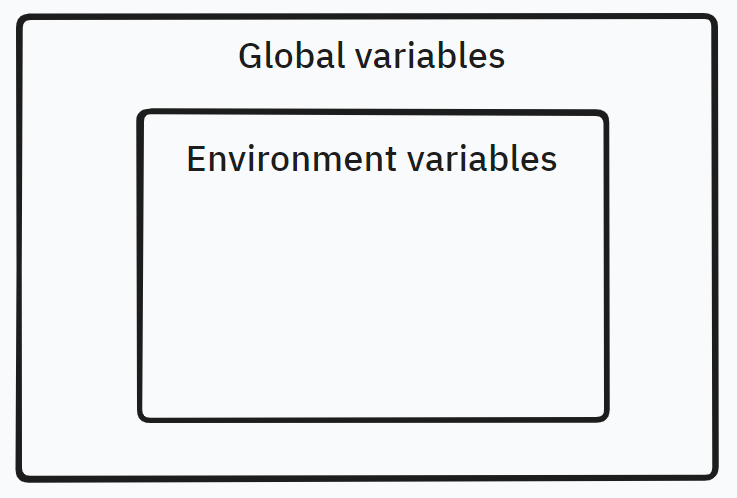
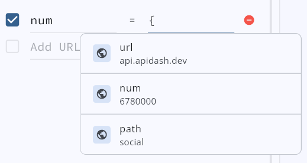
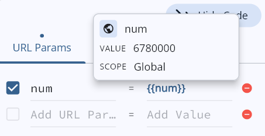
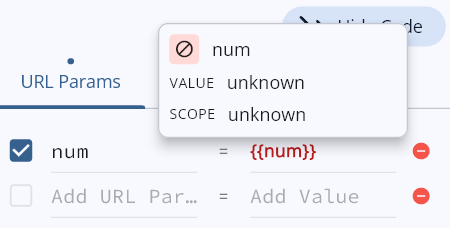

# Environment Variables Manager

The _Environment Variables Manager_ in API Dash allows you to store and reuse values efficiently. It enables you to manage variables and easily switch between different sets of variables.

## Variable Scopes

API Dash provides two scopes of variables:

- **Global variables :** Variables declared in this scope are available regardless of the current active environment.
- **Environment cariables:** Variables declared in a particular environment are available only when that environment is set as active.

### Scope Hierarchy

**Environment Scope takes precedence over Global Scope.**

If a variable with the same name exists in both the Global and Environment Scopes, and the environment is active, the value from the Environment Scope will be used.

#### Example

Suppose you have a variable named `API_URL` defined in both the Global Scope and an Environment Scope (e.g., `Development`).

- Global Scope:
  - `API_UR`L = `https://api.foss42.com`
- Development Environment Scope:
  - `API_URL` = `https://api.apidash.dev`

If the `Development` environment is active, `https://api.apidash.dev.com` will be used as the `API_URL`. If no environment is active, or if a different environment is active, the Global Scope value `https://api.foss42.com` will be used.

## Using a Variable

To use a variable in API Dash, follow these steps:

1. **Declare the Variable:**

First, ensure that the variable is declared either in the Global Scope or within the desired Environment Scope. You can do this through the Environment Variables Manager.

2. **Select the Active Environment:**

If your variable is environment-specific, ensure that the correct environment is selected as active. This ensures that the appropriate value is used.

3. **Insert the Variable into a Field:**

When constructing a request, insert the variable into a field by typing the variable name prefixed with `{` or `{{`. As you start typing, API Dash will display suggestions based on the available variables. You can select a variable from the suggestions or continue typing to manually enter the variable, such as `{{API_URL}}` or `{{var}}`.

#### Fields that currently support variables:

- URL field.
- Params (key & value).
- Header (key & value).

> Note: The Header key field supports variable substitution but does not offer highlighting or suggestions.

4. **Checing scope and value**

You can quickly check the scope and value of a variable by hovering over it on Desktop or tapping it on Mobile. The blue highlighting indicates that the variable is available in a particular scope and its value will be substituted.

If a variable is not found in either the active or global scope, it will be highlighted in red. When substituted, its value will be an empty string, indicating that it's undefined.
