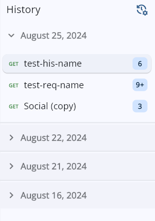
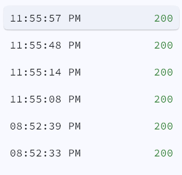
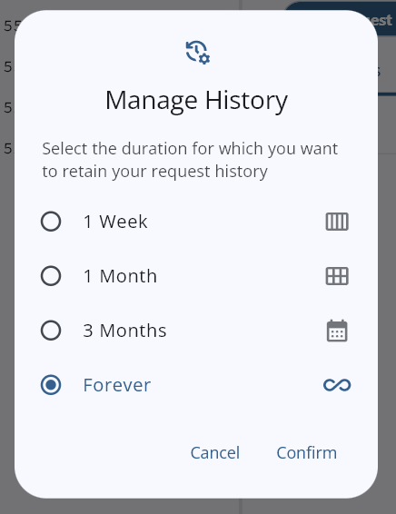

# History of Requests

The _History of Requests_ in API Dash allows you to review all the requests and responses that you had sent and received in the past.

## History Organizing

Your request history is thoughtfully organized to help you easily navigate through your past interactions:

1. **Date-Based Grouping:**

All requests are first grouped by the date they were sent. Each day is represented as a collapsible section, allowing you to focus on specific timeframes.

2. **Request Clustering:**

Within each date, requests that share the same HTTP method and URL or the same HTTP method and name are clustered together. These grouped requests are represented by a single card, with an indicator showing the number of requests that fall under that group.

3. **Detailed View:**

When you select a grouped request, a detailed list view appears, displaying each individual request’s timestamp and the corresponding response status. This allows you to quickly assess the history and performance of similar requests over time.

## History Actions

When viewing a request in the history, you have two actions available:

1. **Duplicate:**
   This action creates a new request with a unique requestId while retaining all the original request options, including URL parameters, headers, and body content. This allows you to easily modify and resend similar requests.

2. **Request:**
   This action navigates you directly to the original request, matching the requestId of the history entry. It enables you to review or edit the original request details.

> Note: If the original request has been deleted, the "Request" button will be disabled.

## History Auto-Clearing

To help manage and maintain an organized history log, API Dash includes an Auto-Clearing feature for request history. This feature allows you to customize the retention period for your request history, ensuring that older entries are automatically removed according to your preferences.

### History Retention Periods

Users can choose from the following predefined retention periods:

- **One Week:** Automatically clears requests older than 7 days.
- **One Month:** Automatically clears requests older than 30 days.
- **Three Months:** Automatically clears requests older than 90 days.
- **Forever:** Keeps the entire request history without any automatic deletion.

  This customization ensures that your request history remains clean and efficient, only storing the information you find most relevant. By adjusting the retention period, you can balance between having access to past requests and keeping the history log manageable.

> Note: Auto-clearing occurs at the start of the application, so any changes to your retention settings will take effect the next time you launch the app.
