# Using MQTT in API Dash

This guide explains how to connect to an MQTT broker, subscribe to topics, and publish messages in API Dash. We'll start from zero and walk through every option in plain language with step-by-step instructions, examples, and tips.

Use this page when you want to test or interact with an MQTT broker — for example IoT devices, sensors, or any real-time publish/subscribe messaging system — instead of sending one-off HTTP requests.

> **MQTT is different from HTTP.** Instead of sending a request and waiting for a single response, you open a long-lived connection to a central server called the **broker**. You never talk to other clients directly — everything goes through the broker. Each message is **published** to a **topic** (a hierarchical name like `home/living-room/temperature`), and every client that has **subscribed** to that topic receives a copy. Publishers and subscribers don't know about each other; the broker routes messages between them purely by topic. This decoupling is the heart of the *publish/subscribe* model. Messages flow in both directions and appear live as they arrive.

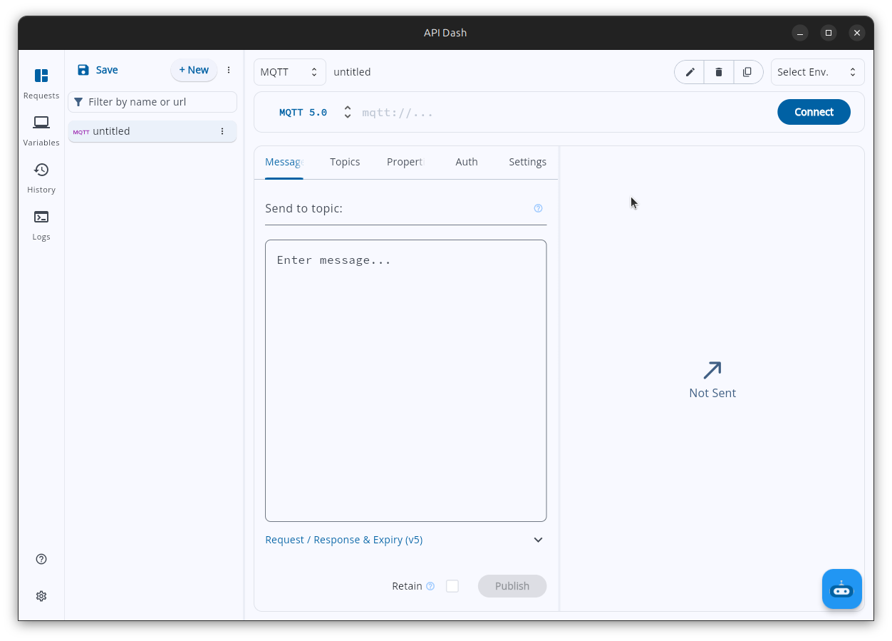

---

## Where to find MQTT

1. Create a new request (or open an existing one).
2. Find the request type / protocol selector (the same switcher you use to pick HTTP, GraphQL, or AI) and choose **MQTT**.
3. The request now switches into MQTT mode:
   - The **URL field becomes the Broker URL** (it shows a `mqtt://...` placeholder).
   - Where the HTTP method dropdown normally sits, you'll now see an **MQTT Version** selector.
   - The blue action button reads **Connect** instead of **Send**.

Once you're in MQTT mode, everything you need lives in the request tabs (**Message**, **Topics**, **Properties**, **Auth**, **Settings**) and the live message log in the response pane.

---

## MQTT at a glance

- **Broker URL** — the address of the MQTT broker you connect to.
- **MQTT Version** — choose **MQTT 3.1.1** or **MQTT 5.0** (default: MQTT 5.0).
- **Connect / Disconnect** — open or close the connection.
- **Topics tab** — the list of topics you want to subscribe to (receive messages from).
- **Message tab** — type and publish a message to a topic.
- **Properties tab** — custom key/value metadata (MQTT 5.0 only).
- **Auth tab** — username and password for the broker.
- **Settings tab** — port, Client ID, Keep Alive, QoS, TLS, WebSocket, Last Will, and session options.
- **Message log** — the live event stream in the response pane, showing every message sent and received.

Each section below explains what an option is, when to use it, and exactly how to fill it in.

---

## Quick start

This is the fastest way to see MQTT working end to end using a free public broker.

1. Create a new request and set its type to **MQTT**.
2. In the **Broker URL** field, enter a public test broker, for example `broker.hivemq.com` or `broker.emqx.io`.
3. Click **Connect** (or press **Enter** in the Broker URL field). The button changes to **Disconnect** and the status dot in the log turns green.
4. Go to the **Topics** tab and add a topic filter, for example `apidash/test/hello`. Tick its checkbox so it's enabled.
5. Go to the **Message** tab. In **Send to topic:**, enter the same topic (`apidash/test/hello`), type a message in the payload box (for example `Hello MQTT`), and click **Publish**.
6. Watch the **message log** in the response pane. You'll see your message echoed as a sent entry, and because you're subscribed to that topic, you'll also see it arrive back as a received message.
7. When you're done, click **Disconnect**.

> Tip: Publishing to a topic you're also subscribed to is the easiest way to confirm the whole round trip works. Once that succeeds, you know your connection, subscription, and publishing are all healthy.

---

## Choosing your MQTT version

The **MQTT Version** selector sits where the HTTP method dropdown normally appears (right next to the Broker URL).

Both versions share the same core — a broker, topics, publish/subscribe, QoS levels, retained messages, and Last Will. MQTT 5.0 is a backward-compatible **superset**: it keeps all of that and adds features on top, rather than changing the fundamentals. So the real question is whether you need any of the 5.0 additions.

- **MQTT 3.1.1** — the most widely deployed version. Use it if your broker or devices only support 3.1.1, or if you want the simplest setup. Everything you need for basic pub/sub is here.
- **MQTT 5.0** — the newer version, and the default. On top of 3.1.1 it adds **user properties** (custom key/value metadata on messages), **response topic + correlation data** (a built-in request/response pattern), **message expiry**, **session expiry** (fine-grained control over how long the broker keeps your session), and **reason codes** (detailed explanations when the broker accepts or rejects something). Pick it when you want any of these, or when working against a modern broker. **This is the default.**

When you switch versions, API Dash shows or hides the version-specific options automatically (this is called progressive disclosure — you only see what applies to your chosen version). Specifically, the **Properties** tab and several MQTT 5.0 fields appear only when you select MQTT 5.0.

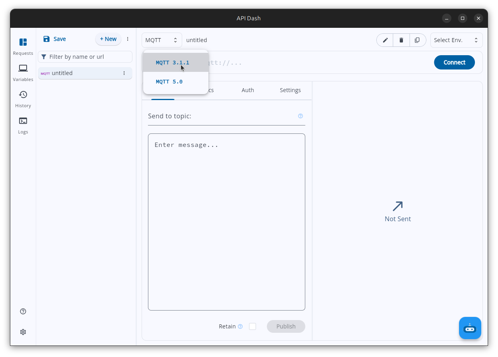

> If you're not sure which to pick, start with the default (MQTT 5.0). Most modern public brokers support it. If you hit trouble connecting, switch to MQTT 3.1.1.

---

## Connecting to a broker

### Broker URL

- **What it is:** the hostname or IP address of the MQTT broker.
- **When to use it:** always — it's how API Dash knows where to connect.
- **UI label:** the main URL field (placeholder `mqtt://...`).

Steps:
1. Make sure the request type is **MQTT**.
2. Type the broker address into the URL field (for example `broker.hivemq.com`).
3. Click **Connect**, or simply press **Enter** while your cursor is in the field.

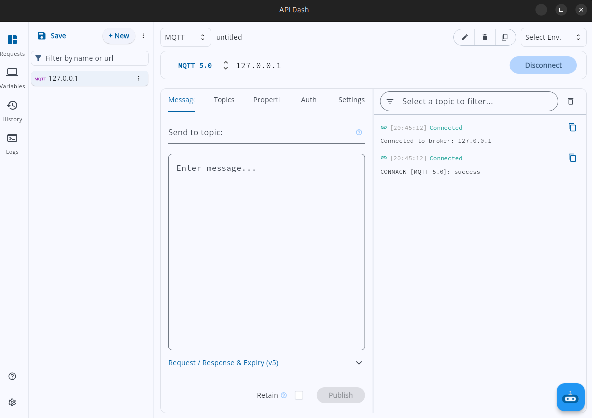

### Connect and Disconnect

- The action button reads **Connect** when you're disconnected.
- While connecting, the status shows a **connecting** state.
- Once connected, the button changes to **Disconnect** and the status dot turns **green**.
- Click **Disconnect** at any time to close the connection.

When you connect, API Dash automatically subscribes to all the enabled topics in your **Topics** tab, so you start receiving messages right away.

---

## Connection settings

Open the **Settings** tab to fine-tune how API Dash connects. Sensible defaults are filled in, so for most public brokers you can connect without changing anything here.

| Setting | UI label | Default | What it does |
|---|---|---|---|
| Port | Port | 1883 | The network port on the broker to connect to. |
| Client ID | Client ID | auto-generated | A unique name identifying your client to the broker. |
| Keep Alive | Keep Alive (s) | 60 | Seconds between heartbeat pings that keep the connection alive. |
| Default QoS | Default QoS | 0 | The delivery guarantee used for all your subscribes and publishes. |

### Port

- **What it is:** the broker's network port.
- **Default:** `1883` (the standard plain-text MQTT port).
- **Auto-remapping:** when you turn on certain options, API Dash automatically updates the port for you so it matches the transport you chose:

| You enable… | Port becomes |
|---|---|
| Use TLS | 8883 |
| Use WebSocket | 8083 |
| Use TLS **and** WebSocket | 8084 |

> You can always override the port manually if your broker uses a non-standard one.

### Client ID

- **What it is:** a name that uniquely identifies your client to the broker. It's the key the broker uses to store and look up your **session** — your subscriptions, and any messages queued for you while offline, are filed under this ID. (Both versions.)
- **Why it matters:** the Client ID must be unique on a given broker. If a second client connects using an ID that's already in use, the broker disconnects the first one. It's also how you **resume a session**: reconnecting with the *same* Client ID (and a non-clean session) tells the broker "I'm the same client as before — restore my state."
- **When to set it:** leave it blank and API Dash generates one for you automatically (something like `apidash_` followed by a timestamp). Set your own only if your broker requires a specific Client ID, or if you want to resume a session later.

### Keep Alive (s)

- **What it is:** the maximum time (in seconds) that may pass with no traffic before the client must send a small heartbeat packet (a `PINGREQ`). It's how the broker knows a client that's connected but quiet is still alive. (Both versions.)
- **Why it matters:** if the broker hears nothing — no messages *and* no heartbeat — for roughly 1.5× the Keep Alive interval, it assumes the client is dead and closes the connection. This lapse is also what triggers the **Last Will**: a client that vanishes without a clean disconnect is detected via Keep Alive, and the broker then publishes its will message.
- **Default:** `60`. Lower it to detect dropped connections sooner on flaky networks; raise it to reduce background traffic on stable ones.

### Default QoS

**What it is:** QoS (Quality of Service) is the *delivery guarantee* attached to a message — how much effort the broker and client spend making sure it arrives. It applies in two independent places: the QoS you **publish** with (how hard the broker tries to deliver your message onward) and the QoS you **subscribe** with (the highest QoS the broker will use when delivering to you). The **Default QoS** dropdown sets both. (Available in both MQTT 3.1.1 and 5.0.)

| QoS | Name | Meaning |
|---|---|---|
| 0 | At most once | Fire and forget. Fastest, but a message may be lost. **(Default)** |
| 1 | At least once | The broker acknowledges delivery. A message may arrive more than once. |
| 2 | Exactly once | A full handshake guarantees the message arrives exactly once. Slowest. |

The trade-off is speed and simplicity versus reliability:

- **QoS 0** sends once with no acknowledgement. Fastest and lightest, but if the network drops the packet it's simply gone — no retry. Good for high-frequency data where a lost reading doesn't matter because a fresh one is coming (e.g. a sensor publishing every second).
- **QoS 1** re-sends until the receiver acknowledges, so the message is guaranteed to arrive — but a retry can cause the same message to be **delivered more than once**, so the receiver must tolerate duplicates.
- **QoS 2** uses a four-step handshake to guarantee the message arrives **exactly once**, with no loss and no duplicates. Safest but slowest, so reserve it for messages where a duplicate would cause real harm (e.g. a billing event or a one-shot command).

> For interactive testing, QoS 0 is usually fine. Use QoS 1 or 2 only when you specifically need delivery guarantees.

---

## Authentication

Open the **Auth** tab to send a username and password to the broker.

- **What it is:** a username and password sent to the broker inside the CONNECT packet when you connect. The broker checks them and either accepts or rejects the connection. This proves *who you are*; it's separate from **TLS**, which encrypts the connection but doesn't identify you. (Both versions.)
- **When to use it:** only if your broker is protected. Leave both fields blank for anonymous (open) brokers like the public test brokers.
- **Note:** unless **Use TLS** is on, credentials travel unencrypted over the network — enable TLS whenever you send real credentials to a real broker.
- **UI labels:** **Username** and **Password** (the password is masked as you type).

Steps:
1. Open the **Auth** tab.
2. Enter your **Username** and **Password**.
3. Connect as usual.

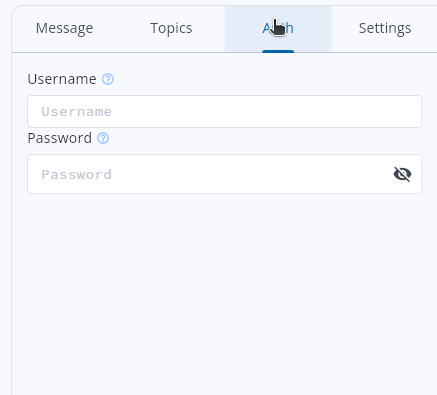

> Most public test brokers don't require credentials, so you can skip this tab when getting started.

---

## Transport & Security

In the **Settings** tab, expand the **Transport & Security** section to control how the connection is encrypted and tunneled.

### Use TLS

- **UI label:** **Use TLS** — "Encrypt the connection (TLS/SSL)".
- **Default:** off.
- **What it does:** wraps the MQTT connection in TLS/SSL so everything between you and the broker — your username, password, and message payloads included — is encrypted and can't be read or tampered with by anyone on the network in between. It does **not** log you in; that's what the Auth tab is for. (Both versions.)
- **When to use it:** whenever your broker offers a secure endpoint, and always in production.

Turning this on automatically bumps the port from `1883` to `8883` (the standard secure MQTT port).

### Allow Invalid Certificates

- **UI label:** **Allow Invalid Certificates** — "Accept self-signed / untrusted certs".
- **Default:** off.
- **Visibility:** this toggle only appears when **Use TLS** is on (it has no meaning otherwise).
- **What it does:** tells API Dash to trust the broker even if its certificate is self-signed or not issued by a recognized authority.
- **When to use it:** for test brokers that use self-signed certificates — a common example is `test.mosquitto.org` on its secure port.

> Warning: Only enable this for testing. Accepting invalid certificates removes a key security protection, so never use it against a production broker.

### Use WebSocket

- **UI label:** **Use WebSocket**.
- **Default:** off.
- **What it does:** tunnels the MQTT connection over a WebSocket transport instead of a raw TCP connection. The MQTT protocol is identical either way — only the underlying pipe changes. (Both versions.)
- **When to use it:** when your broker only exposes a WebSocket endpoint, when a restrictive firewall or proxy only allows web (HTTP/WebSocket) traffic, or when the broker must also serve browser-based clients (browsers can only speak MQTT over WebSocket).

Turning this on automatically adjusts the port to `8083` (or `8084` if TLS is also on).

---

## Last Will & Testament (LWT)

In the **Settings** tab, expand the **Last Will & Testament (LWT)** section.

- **What it is:** a message you hand to the broker *when you connect*. The broker holds onto it and publishes it **on your behalf** only if your connection ends unexpectedly — the network drops, the app crashes, or the Keep Alive lapses. If you disconnect cleanly (clicking **Disconnect**), the broker discards the will without ever sending it. (Both versions.)
- **Why it matters:** in pub/sub there's no other automatic way for the rest of the system to notice that a client silently vanished. The will turns an ungraceful disconnect into an ordinary message that other clients can subscribe to and react to.
- **When to use it:** the classic use is **presence / online-offline status**. A device publishes `online` (often retained) when it connects, and registers a will of `offline` on the same topic; if it drops, subscribers see it go `offline` instantly, with no polling. It's also handy for alerting or failover when a critical publisher disappears.

The LWT fields:

| Field | What it does |
|---|---|
| Will Topic | The topic the broker publishes your will message to. |
| Will Message | The payload the broker publishes on your behalf if you drop unexpectedly. |
| Will QoS | The delivery guarantee for the will message. |
| Retain Will | If on, the broker keeps the will as the topic's retained message for future subscribers. |

Steps:
1. Open the **Settings** tab and expand **Last Will & Testament (LWT)**.
2. Enter a **Will Topic** (for example `clients/myclient/status`).
3. Enter a **Will Message** (for example `offline`).
4. Optionally raise **Will QoS** or turn on **Retain Will**.
5. Connect. The broker now holds your will and publishes it automatically if you drop unexpectedly.

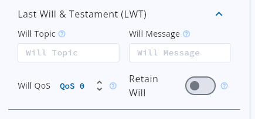

---

## Session control (Clean Start & Session Expiry)

**What a session is:** when you connect, the broker can keep **session state** for your Client ID — the list of topics you're subscribed to, plus any QoS 1 and QoS 2 messages that arrived on those topics *while you were offline*. A **persistent session** means that state survives a disconnect: reconnect with the same Client ID and the broker restores your subscriptions and delivers the messages you missed. A **clean session** means the broker throws all of that away, so every connection starts from scratch. Persistent sessions let a device drop off the network and catch up on what it missed when it returns.

How you control this depends on the MQTT version you chose.

### MQTT 3.1.1

MQTT 3.1.1 has a single **Clean Session** flag. API Dash connects with a clean session every time, so the broker keeps no state for you between connections — every reconnect is a fresh start. (In 3.1.1 you can't set *how long* a persistent session lasts; that's fixed by the broker. MQTT 5.0 adds that control below.)

### MQTT 5.0

MQTT 5.0 splits the old single flag into two finer controls: **Clean Start** decides whether you *begin* with a fresh session, and **Session Expiry** decides how long the broker *keeps* the session after you disconnect.

In the **Settings** tab you'll see a **Clean Start** toggle.

- **UI label:** **Clean Start** — "Session ends on disconnect".
- **Default:** on.
- **What it does (when on):** your session is discarded the moment you disconnect — a fresh start every time.

If you turn **Clean Start off**, a new field appears:

- **UI label:** **Session Expiry (s)**.
- **Default:** `3600` (one hour).
- **What it does:** tells the broker how many seconds to keep your session (including your subscriptions and any queued messages) after you disconnect, so you can reconnect and resume where you left off.

> To resume a session later, turn **Clean Start off**, set a **Session Expiry** long enough for your needs, and reconnect with the **same Client ID**.

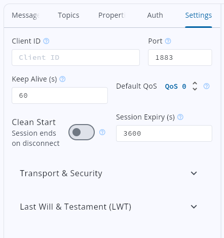

---

## Subscribing to topics

Open the **Topics** tab to choose which topics you want to receive messages from. This is a table where each row is one topic filter.

Each row has:
- An **enable/disable checkbox** — tick it to subscribe, untick it to unsubscribe.
- A **Topic filter** text field — the topic (or wildcard pattern) you want to listen to.
- A **remove button** — deletes the row.

Adding rows:
- Start typing in the empty last row and a new blank row appears automatically.
- Or click **Add Topic** to add a row manually.

Steps:
1. Open the **Topics** tab.
2. Type a topic into a row, for example `home/living-room/temperature`.
3. Make sure the row's checkbox is ticked.
4. Repeat for as many topics as you like.

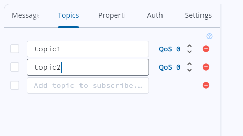

### Wildcards

Topics are **hierarchical**: levels are separated by `/`, as in `home/living-room/temperature` (three levels). Wildcards let a single subscription match many topics at once instead of listing each one — invaluable when you don't know every topic name ahead of time, or when you want everything under a branch. They work in both MQTT versions.

Topic filters support two MQTT wildcards:

| Wildcard | Meaning | Example | Matches |
|---|---|---|---|
| `+` | Single level | `home/+/temperature` | `home/living-room/temperature`, `home/bedroom/temperature` |
| `#` | Multi level (must be last) | `sensors/#` | `sensors/temp`, `sensors/humidity/outdoor`, and everything below `sensors/` |

> Wildcards work only in subscriptions (the Topics tab), never when publishing. When you publish, you must use a full, specific topic.

### Live subscription behavior

The Topics tab reacts immediately while you're connected:

- **Tick a topic** → API Dash subscribes to it right away.
- **Untick a topic** → API Dash unsubscribes immediately.
- **Edit a topic** → API Dash resubscribes with the new filter.

If you're **not** connected, your topics are simply remembered and subscribed automatically the next time you **Connect**.

All subscriptions use the **Default QoS** from the Settings tab.

---

## Publishing a message

Open the **Message** tab to send a message to a topic.

Fields:
- **Send to topic:** — the full topic you're publishing to. As you type, API Dash suggests topics you're already subscribed to (a convenience only; you can type any topic).
- **Message payload** — a multiline text box for the message body.
- **Retain** checkbox — if on, the broker stores this message as the last message on the topic, so future subscribers receive it immediately when they subscribe.
- **Publish** button — sends the message.

Steps:
1. Open the **Message** tab.
2. Enter a topic in **Send to topic:** (for example `apidash/test/hello`).
3. Type your message in the payload box.
4. Optionally turn on **Retain**.
5. Click **Publish**.

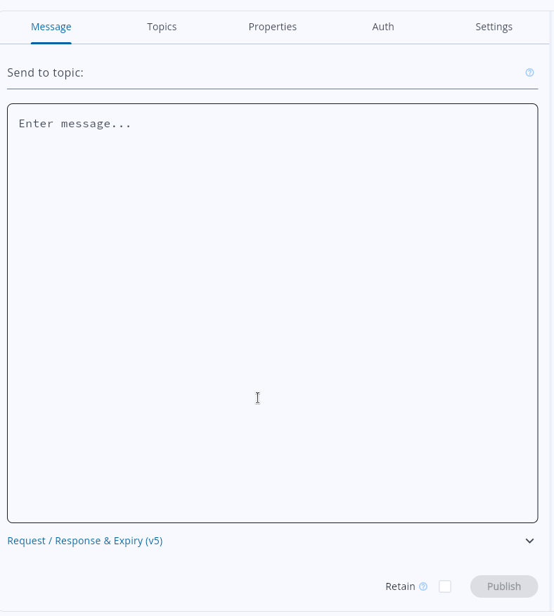

> The **Publish** button is enabled only when you are **connected** and have entered a topic. If it's greyed out, check that you've connected and typed a topic.

### Retained messages

**What it is:** normally a published message is delivered only to clients that are **already subscribed** at the instant it's sent — publish to a topic no one is watching and the message is simply gone. Turning on **Retain** tells the broker to *also* store this message as the **last known value** for that topic. The broker keeps exactly one retained message per topic; a new retained publish replaces the previous one.

**Why it matters:** when any **new** client subscribes to that topic later, the broker immediately delivers the stored retained message — so a late joiner gets the **current state** right away instead of waiting for the next publish. Classic uses: the latest sensor reading (a dashboard that connects mid-stream sees the current temperature at once), or a device's `online`/`offline` status (a client learns a device's state the moment it subscribes). Without retain, a new subscriber sees nothing until the next message happens to be published. (Retained messages work in both MQTT versions.)

> To clear a retained message, publish an **empty payload** to the same topic with **Retain** turned on.

Every message you publish is echoed into the message log as a **sent** entry, showing the payload and topic, so you have a record of what you sent.

---

## MQTT 5.0 extras

These options appear only when the **MQTT Version** is set to **MQTT 5.0**.

### User Properties

Open the **Properties** tab (visible only for MQTT 5.0).

- **What it is:** custom key/value string pairs (like HTTP headers) that ride *alongside* a message rather than inside its payload. The broker passes them through untouched, and every subscriber that receives the message also receives its user properties — so the receiver can read this metadata without parsing the message body. This is an **MQTT 5.0-only** feature; 3.1.1 has no equivalent. You can attach them to the CONNECT and to each PUBLISH.
- **When to use it:** to carry structured context that isn't really part of the payload — a trace/correlation ID for debugging, the source device or app name, a content hint, or routing tags a downstream consumer can act on — while keeping the payload itself clean.
- **UI:** a table where each row has an **enable checkbox**, a **Key** field, a **Value** field, and a **remove** button.

Steps:
1. Switch the MQTT Version to **MQTT 5.0**.
2. Open the **Properties** tab.
3. Add a row, enter a **Key** and **Value** (for example `trace-id` → `abc-123`).
4. Make sure the row's checkbox is ticked.
5. Connect and/or publish — the enabled properties are sent along.

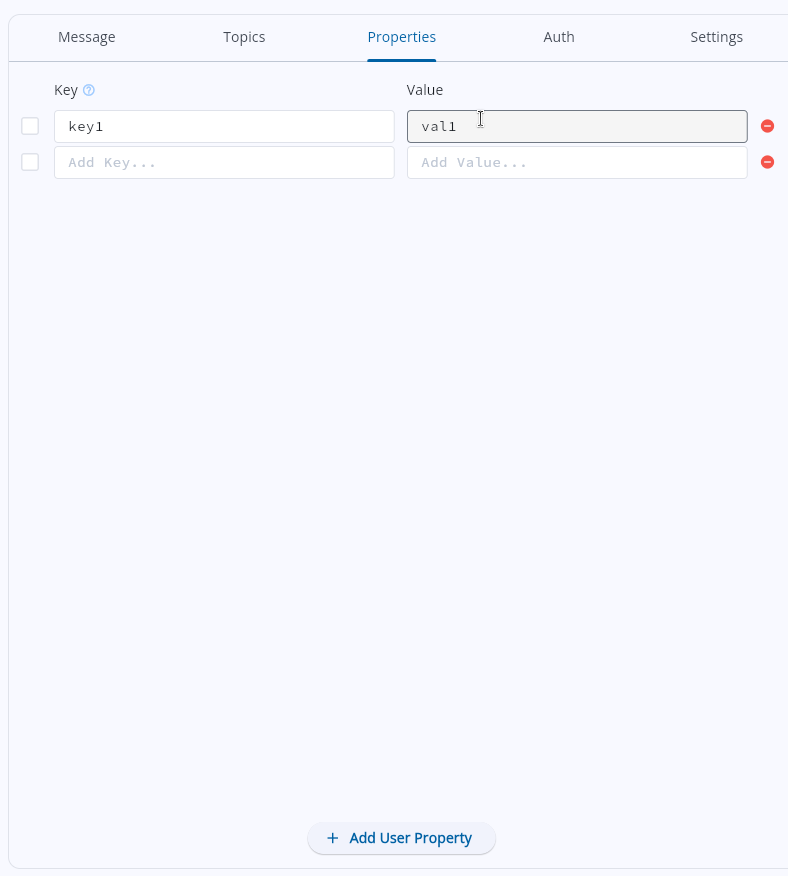

> Only rows that are **enabled** and have a **non-empty key** are actually sent. Blank or unticked rows are ignored.

### Request / Response & Expiry

Pub/sub is one-directional by nature: you publish to a topic and the broker fans it out to subscribers — there's no built-in "reply" the way HTTP pairs a response with every request. MQTT 5.0 adds two properties that let you build a request/response exchange on top of pub/sub, plus a separate message-lifetime control. Expand the collapsible section titled **Request / Response & Expiry (v5)** in the **Message** tab. (All three are **MQTT 5.0-only**.)

- **Response Topic** — the topic you want the answer sent to. The responder has no other way to know where to reply, so you include it in the request; the responder then publishes its answer to that topic (which the requester is normally already subscribed to).
- **Correlation Data** — an opaque token you attach to the request; the responder copies it verbatim into the reply. Because replies arrive asynchronously — and you may have several requests in flight at once — you match each incoming reply back to the request that caused it by comparing this token.
- **Message Expiry Interval (seconds)** — unrelated to request/response: it tells the broker how long to keep this message for subscribers that are currently offline (persistent sessions) before discarding it. `0` or empty means no expiry.

> **The request/response pattern:** the requester subscribes to a reply topic, then publishes a request carrying that **Response Topic** and a unique **Correlation Data** token. The responder does its work, publishes the result to the Response Topic, and echoes the token back. The requester matches the reply by the token — giving you HTTP-style request/response over MQTT's pub/sub.

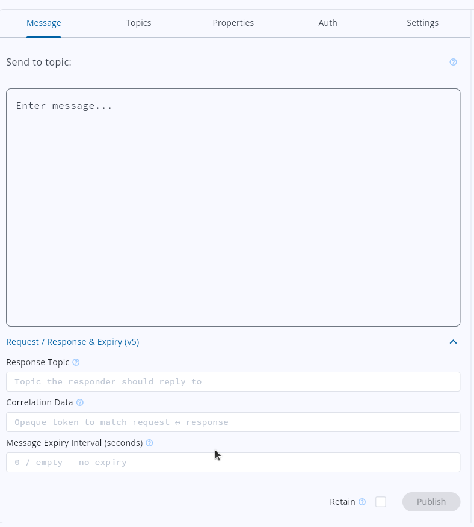

### Reason codes

With MQTT 5.0, the broker returns detailed diagnostic **reason codes** for connection and subscription events. API Dash surfaces these in the message log, so after you connect, subscribe, or disconnect you'll see entries such as a successful CONNACK, a SUBACK granting QoS 1, or a normal-disconnection DISCONNECT. These are a big help when debugging why a broker rejected a connection or subscription.

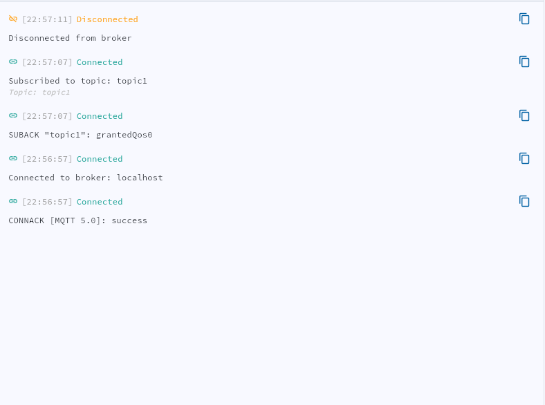

---

## The message log

The response pane shows a **live event stream** — a running log of everything that happens on the connection.

What you'll see:
- **Connection events** — for example "Connected to broker", per-topic "Subscribed to topic: …", and "Disconnected from broker".
- **Every message sent and received**, each with a **direction icon** (so you can tell sent from received), a **timestamp** in `HH:MM:SS` format, and the **payload**.
- **Received messages** also show a **`Topic: <topic>`** badge so you know which topic they arrived on.

Things you can do in the log:

- **Copy a payload** — tap any message to copy its payload to your clipboard. You'll see a "Copied to clipboard" confirmation.
- **Expand long messages** — messages longer than 300 characters are shortened, with an expand toggle to see the full text.
- **Search** — use the search box to filter messages by payload text (case-insensitive).
- **Filter by topic** — add topic filters as chips (press **Enter** to add each one) to narrow the log to specific topics. These filters support wildcards, just like subscriptions.
- **Clear the log** — click the red **✕** button to empty the log.

> The log holds up to a maximum number of events, controlled by the **Max Connection Messages** app setting. Older entries are dropped once you reach the limit, which keeps memory usage in check during high-volume streams.

---

## Connection lifecycle at a glance

API Dash shows your connection status with a colored dot and the action button label:

Typical log entries you'll see:
- On connect: **"Connected to broker: \<url\>"** followed by **"Subscribed to topic: …"** for each enabled topic.
- On disconnect: **"Disconnected from broker"**.
- On failure: **"Connection failed: \<error\>"** with the reason.

Click **Disconnect** whenever you want to close the connection.

---

## Public test brokers

These free brokers are handy for trying things out without setting up your own. None of them require a username or password for the plain (non-TLS) ports.

| Broker | Address | Plain port | TLS port | Notes |
|---|---|---|---|---|
| HiveMQ | `broker.hivemq.com` | 1883 | 8883 | Open public broker. |
| EMQX | `broker.emqx.io` | 1883 | 8883 | Supports MQTT 5.0. |
| Mosquitto | `test.mosquitto.org` | 1883 | 8883 | The TLS port uses a self-signed certificate — enable **Allow Invalid Certificates**. |

> These are shared public brokers used by many people. Don't publish anything sensitive to them, and expect to see other people's traffic if you subscribe to broad wildcards like `#`.

---

## Troubleshooting & tips

- **Can't connect?** Check that the **Port** matches your transport. If you turned on **Use TLS**, the port should be the secure one (usually 8883); for plain connections use 1883. API Dash auto-remaps the port for you when you toggle TLS or WebSocket, but a manually entered port can get out of sync.
- **TLS connection fails with a certificate error?** If you're using a test broker with a self-signed certificate (like `test.mosquitto.org` on its secure port), turn on **Allow Invalid Certificates** under Transport & Security. Don't use this in production.
- **Connected but not receiving messages?** Confirm the topic in your **Topics** tab is enabled (checkbox ticked) and matches what's being published. Double-check your wildcards (`+` matches one level, `#` matches everything below). Also verify the publisher and your subscription are using a compatible QoS.
- **Publish button greyed out?** You must be **connected** and have a topic typed in **Send to topic:** before you can publish.
- **Want to resume a session after disconnecting (MQTT 5.0)?** Turn **Clean Start off**, set a **Session Expiry** long enough to cover your downtime, and reconnect with the **same Client ID**.
- **Broker rejected your connection (MQTT 5.0)?** Read the **reason code** in the message log — it usually tells you exactly why (bad credentials, not authorized, etc.).
- **Log filling up too fast?** Use the **search box** or add **topic filter chips** to focus on what matters, and use the **clear (✕)** button to reset. If you regularly handle high-volume streams, adjust **Max Connection Messages** in the app settings.

---

You're set! Pick MQTT, enter a broker, Connect, subscribe in the Topics tab, publish in the Message tab, and watch your messages flow through the live log.
