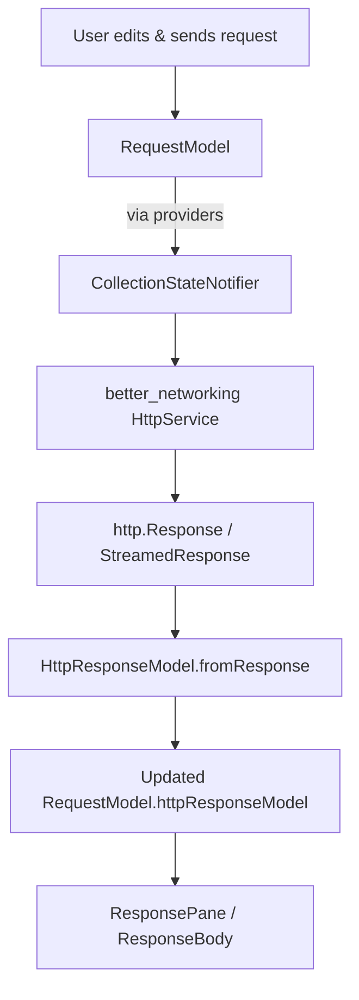

## API Dash – Project Context and Architecture Overview

This document provides a high-level overview of the API Dash codebase so that new contributors or AI assistants can reason about its architecture and add features safely, without having to read every file.

It is **descriptive only** – no behavior is defined here – and is based on the current repository state.

---

## 1. Project Overview

**API Dash** is a cross‑platform API testing and exploration tool built with **Flutter**. It provides:

- A request editor for REST, GraphQL, and AI (LLM) APIs.
- A response viewer with multiple modes (Preview, Raw, Code, Answer, SSE, Structured).
- History, environment variables, scripting, and code generation.
- Built‑in support for AI APIs and an experimental **OpenResponses Structured Viewer** and **A2UI / GenUI**-style UI rendering.

The app is architected as a Flutter UI that composes:

- A core data/model layer in `packages/apidash_core`.
- A reusable networking layer in `packages/better_networking`.
- A design system in `packages/apidash_design_system`.
- AI request utilities and model providers in `packages/genai`.

State management is done using **Riverpod** (with `StateNotifier` for core collections).

---

## 2. Folder Structure

Only the most important top‑level directories are listed here:

- `lib/`
  - `screens/` – Top‑level screens (home, history, terminal, mobile pages, dialogs).
  - `widgets/` – Reusable widgets (response viewers, headers, fields, buttons, previewers).
  - `models/` – App‑level models like `RequestModel`, history models.
  - `providers/` – Riverpod providers and `StateNotifier`s for collections, history, terminal, etc.
  - `utils/` – Helper utilities (HTTP, history, conversion, OpenResponses adapter, GenUI adapter).
  - `services/` – Platform/infrastructure services (Hive persistence, window, history, shared prefs).
  - `dashbot/` – “DashBot” AI assistant features (chat, prompts, actions).
  - `terminal/` – Terminal models, enums, widgets.
  - `consts.dart` – Global constants, enums, UI labels, response view configuration.

- `packages/`
  - `apidash_core/` – Core models and import/export utilities (curl, HAR, Postman, Insomnia).
  - `apidash_design_system/` – Tokens (colors, typography), common widgets, base design.
  - `better_networking/` – HTTP client manager, request/response models, networking helpers.
  - `genai/` – AI request model, model providers (OpenAI, Anthropic, Gemini, Ollama, AzureOpenAI).
  - Additional helper packages: `curl_parser`, `json_explorer`, `json_field_editor`, `seed`, `postman`, `har`, `insomnia_collection`, `multi_trigger_autocomplete_plus`.

- `doc/` – Developer and user guides, GSoC proposals, security docs.
- `test/`, `integration_test/` – Widget, model, provider, and E2E tests.

---

## 3. Architecture Design

At a high level, API Dash follows a **model–view–state** pattern:

- **Models** (from `apidash_core`, `better_networking`, and app‑specific models in `lib/models`) represent requests, responses, history, environments, AI requests, etc.
- **State** is orchestrated via **Riverpod** providers (e.g. `selectedRequestModelProvider`, `collectionStateNotifierProvider`).
- **Views** (Flutter widgets in `lib/screens` and `lib/widgets`) read Riverpod state and render UI.

Separation of concerns:

- **Networking** is delegated to `better_networking` (`HttpService`, `HttpResponseModel`, `HttpRequestModel`), keeping HTTP logic decoupled from Flutter UI.
- **Core request semantics and persistence** (e.g. `RequestModel`, history, environments) are provided by `apidash_core` + app models.
- **Design system & theming** come from `apidash_design_system` (shared typography, colors, and widgets like `ADTextButton`).
- **GenAI plumbing** (AI requests, normalizing responses, provider-specific quirks) lives in `packages/genai`.
- **LLM → OpenResponses** and **A2UI → Flutter** are thin, **UI‑oriented adapter layers** in `lib/utils`.

---

## 4. Request Pipeline

### Key models

- `RequestModel` (`lib/models/request_model.dart`)
  - Represents a single request tab in the UI.
  - Fields:
    - `id`
    - `apiType` (`APIType.rest`, `APIType.graphql`, `APIType.ai`)
    - `httpRequestModel` (`HttpRequestModel` from `apidash_core`/`better_networking`)
    - `httpResponseModel` (`HttpResponseModel` from `better_networking`)
    - `aiRequestModel` (`AIRequestModel` from `genai`)
    - `responseStatus`, `message`, `isWorking`, `sendingTime`, `isStreaming`, scripts, etc.

- `HttpRequestModel` / `HttpResponseModel` (`packages/better_networking/lib/models`)
  - `HttpRequestModel` encapsulates method, URL, headers, body, auth model.
  - `HttpResponseModel` encapsulates status code, headers, request headers, `body`, `formattedBody`, `mediaType`, `time`, `bodyBytes`, `sseOutput`.

### Execution flow

The canonical request execution lives in `lib/providers/collection_providers.dart` within `CollectionStateNotifier`:

1. **Selection & substitution**
   - `selectedRequestModelProvider` picks the current `RequestModel` based on `selectedIdStateProvider`.
   - `selectedSubstitutedHttpRequestModelProvider` (and helpers) apply environment variables.

2. **Send HTTP / Stream HTTP**
   - The notifier calls into `better_networking`’s `sendHttpRequest` or `streamHttpRequest` (in `packages/better_networking/lib/services/http_service.dart`), passing:
     - `requestId`
     - `APIType`
     - `HttpRequestModel`
   - `http_service.dart`:
     - Handles auth via `handleAuth`.
     - Constructs and sends requests via `http.Client` and `http.Request` / `MultipartRequest`.
     - Measures timing.
     - Supports streaming responses, including SSE/event‑stream content types.

3. **Build `HttpResponseModel`**
   - `HttpResponseModel.fromResponse` (in `packages/better_networking/lib/models/http_response_model.dart`) merges headers, determines `mediaType`, and sets:
     - `body` (raw response body).
     - `formattedBody` via `formatBody` (`http_response_utils.dart` – pretty JSON/XML, safe HTML detection).
     - `bodyBytes`, `time`, optional `sseOutput`.

4. **Update `RequestModel` state**
   - `CollectionStateNotifier` updates the `RequestModel` with:
     - `responseStatus`
     - `message` (human‑friendly reason from `kResponseCodeReasons` in `consts.dart`)
     - `httpResponseModel`
     - `isWorking = false`, `isStreaming` flags.
   - Also records history (`HistoryRequestModel`) and sends preview output into the terminal log.

5. **Riverpod → UI**
   - Consumers (like `ResponsePane` and `ResponseBody`) read `selectedRequestModelProvider` and render the response.

Request/response flow diagram:



---

## 5. Response Rendering System

The response rendering system is composed of:

- `ResponsePane` (screen fragment)
- `ResponseBody` (logic wrapper)
- `ResponseBodySuccess` (view‑mode switcher)
- Mode‑specific viewers:
  - `Previewer`
  - `CodePreviewer`
  - Raw `SelectableText`
  - `SSEDisplay`
  - `OpenResponsesStructuredViewer`

### Core view enum and configuration

**File:** `lib/consts.dart`

- `enum ResponseBodyView { preview, code, raw, answer, sse, structured, none }`
  - Each value has a label and icon used in segmented controls.

- Predefined mode lists:
  - `kRawBodyViewOptions`, `kPreviewRawBodyViewOptions`, `kCodeRawBodyViewOptions`, `kAnswerRawBodyViewOptions`, `kSSERawBodyViewOptions`, etc.

- Content-type → view options map:
  - `kResponseBodyViewOptions`:
    - Maps `(type, subtype)` (e.g. `application/json`) to a list of `ResponseBodyView`s.
    - E.g. JSON → `[preview, raw]`, `text/event-stream` → `[sse, raw]`, images → `[preview]`.

This is the **configuration source** for which modes are available per response type.

### ResponsePane

**File:** `lib/screens/home_page/editor_pane/details_card/response_pane.dart`

Purpose: top‑level response panel in the desktop editor.

- Reads `selectedRequestModelProvider` for:
  - `isWorking`
  - `responseStatus`
  - error `message`
  - `httpResponseModel`

- Shows:
  - `SendingWidget` while working.
  - `NotSentWidget` if there’s no response yet.
  - `ErrorMessage` if status == -1 (cancelled or unexpected error).
  - `ResponseDetails` otherwise, which includes:
    - `ResponsePaneHeader` (status, message, time, clear button).
    - `ResponseTabs` with:
      - `ResponseBodyTab` (the body viewer).
      - `ResponseHeadersTab` (request/response headers).

### ResponseBody

**File:** `lib/widgets/response_body.dart`

Purpose:

- Orchestrates response body rendering and mode selection.

Responsibilities:

- Reads `RequestModel` and `HttpResponseModel`.
- Validates:
  - `httpResponseModel != null`
  - `body != null` and non‑empty.
- Determines `MediaType` from `HttpResponseModel.mediaType` (defaults to `text/plain`).
- Determines base `options` (list of `ResponseBodyView`) and `highlightLanguage`:
  - For AI (`apiType == APIType.ai`): uses `kAnswerRawBodyViewOptions` (`[answer, raw]`).
  - For REST/GraphQL: uses `getResponseBodyViewOptions(mediaType)` (from `lib/utils/http_utils.dart`).
- SSE handling:
  - `isSSE = responseModel.sseOutput?.isNotEmpty ?? false`.
  - `formattedBody = isSSE ? sseOutput.join('\n') : responseModel.formattedBody`.
- If `formattedBody == null`:
  - Clones `options` and removes `ResponseBodyView.code`.

#### OpenResponses and adapter integration

Inside `ResponseBody`, for JSON responses (`application/*json*`):

1. It does a single `jsonDecode(body)`.
2. If the request is **AI** (`APIType.ai`):
   - It calls `OpenResponsesAdapter.tryConvert(decoded)`.
   - Uses `source = adapted ?? decoded`.
3. For non‑AI requests:
   - `source = decoded` (adapter is **not** used).
4. If `source` is a `Map<String, dynamic>` with:
   - `output` as a non‑empty `List`
   - each item a `Map` containing a `type` field
   - then:
     - sets `openResponsesRoot = source`.
     - appends `ResponseBodyView.structured` to `options` if not already present.

Finally, it instantiates:

```dart
ResponseBodySuccess(
  mediaType: mediaType,
  options: options,
  bytes: responseModel.bodyBytes!,
  body: body,
  formattedBody: formattedBody,
  highlightLanguage: highlightLanguage,
  sseOutput: responseModel.sseOutput,
  isAIResponse: selectedRequestModel?.apiType == APIType.ai,
  aiRequestModel: selectedRequestModel?.aiRequestModel,
  isPartOfHistory: isPartOfHistory,
  openResponsesRoot: openResponsesRoot, // may be null
);
```

### ResponseBodySuccess

**File:** `lib/widgets/response_body_success.dart`

Purpose: **mode switcher and renderer** for the response body.

Responsibilities:

- Displays a `SegmentedButton<ResponseBodyView>` for `widget.options`.
- Uses the enum’s `label` and `icon` from `consts.dart`.
- Controls the current selection index `segmentIdx`.
- Renders the current segment via a `switch (currentSeg)`:

Modes:

- `ResponseBodyView.preview` / `none`
  - Renders `Previewer`:
    - `Previewer` (`lib/widgets/previewer.dart`) dispatches based on `type` / `subtype`:
      - JSON → `JsonPreviewer` (tree view).
      - Images → `Image.memory` or `SvgPicture`.
      - PDF → `PdfPreview`.
      - Audio → `Uint8AudioPlayer`.
      - Video → `VideoPreviewer`.
      - CSV → `CsvPreviewer`.
      - Other → `ErrorMessage` suggesting Raw view.

- `ResponseBodyView.code`
  - Renders `CodePreviewer` (`lib/widgets/previewer_code.dart`) with:
    - `widget.formattedBody ?? widget.body`.
    - `highlightLanguage` and `kLightCodeTheme`/`kDarkCodeTheme`.

- `ResponseBodyView.answer`
  - Renders `SelectableText(widget.formattedBody ?? widget.body)` as plain text.
  - Used mostly for AI plain‑text answers.

- `ResponseBodyView.raw`
  - Renders raw or formatted body text:
    - For AI responses: shows the **true body**.
    - For non‑AI: `formattedBody ?? body`.

- `ResponseBodyView.sse`
  - Renders `SSEDisplay` (`lib/widgets/sse_display.dart`):
    - For AI streaming requests: uses `aiRequestModel.getFormattedStreamOutput` to interpret SSE chunks.
    - For non‑AI streaming: shows JSON or raw chunks as cards.

- `ResponseBodyView.structured`
  - If `openResponsesRoot == null`:
    - Shows an `ErrorMessage` telling the user to use Preview/Raw.
  - Else:
    - Renders `OpenResponsesStructuredViewer(root: openResponsesRoot!)`.

---

## 6. Flutter UI Architecture

### High‑level layout

- Desktop:
  - `home_page` with:
    - `CollectionPane` on the left (list of requests).
    - `EditorPane` on the right (URL, request details, response pane).
  - Split views implemented via widgets like `SplitviewDashboard`, `SplitviewDrawer`.

- Mobile:
  - `lib/screens/mobile/requests_page/`:
    - `RequestResponsePage`, `RequestTabs`, `RequestResponsePageBottombar`.

### Key screens

- `lib/screens/home_page/editor_pane/editor_default.dart`
  - Default content when no request is selected.

- `lib/screens/home_page/editor_pane/details_card/request_pane/`
  - Request editing UI:
    - URL, headers, query params, body, scripts, auth.
    - Specialized panes for GraphQL and AI requests.

- `lib/screens/history/`
  - History list and details page.

- `lib/screens/terminal/terminal_page.dart`
  - Terminal logging of requests/responses with streaming previews.

### Reusable components

- `lib/widgets/`
  - `field_*` widgets for text, headers, URL, search fields.
  - `button_*` widgets for send, copy, share, download, etc.
  - `table_*` widgets for param/header/form data entry.
  - `previewer_*` widgets for response content (JSON, CSV, code, video).
  - `response_pane_header.dart`, `response_headers.dart`, `response_body.dart`.
  - `error_message.dart` for consistent error display.

The UI heavily uses layout helpers and tokens from `apidash_design_system`, including spacing constants, typography (`kCodeStyle`), and AD* widgets (e.g. `ADTextButton`).

---

## 7. Important Models

### RequestModel

**File:** `lib/models/request_model.dart`

Purpose:

- Central unit representing a user request (tab) in API Dash.

Key fields:

- `String id`
- `APIType apiType` (REST / GraphQL / AI).
- `String name`, `String description`
- `HttpRequestModel? httpRequestModel`
- `HttpResponseModel? httpResponseModel`
- `AIRequestModel? aiRequestModel`
- `int? responseStatus`, `String? message`
- State flags: `isWorking`, `sendingTime`, `isStreaming`
- Scripts: `preRequestScript`, `postRequestScript`

Interactions:

- Managed by `CollectionStateNotifier`.
- Displayed via URL card, request pane, and response pane.
- Serialized/deserialized via Freezed & JSON (with some fields excluded from JSON).

### History Models

**Files:**

- `lib/models/history_request_model.dart`
- `lib/models/history_meta_model.dart` (and generated Freezed files)

Purpose:

- Store historical requests, metadata (timestamp, status), and responses.

Interactions:

- Updated and read via `history_providers.dart`.
- Rendered in `lib/screens/history/`.

### AIRequestModel

**File:** `packages/genai/lib/models/ai_request_model.dart`

Purpose:

- Represents an AI request independent of a specific provider.

Key responsibilities:

- Provides `httpRequestModel` (constructed via provider `ModelProvider`).
- `getFormattedOutput(Map x)` and `getFormattedStreamOutput(Map x)` delegate to provider-specific formatters (OpenAI, Anthropic, Gemini, etc.).

---

## 8. Important Widgets

Summarizing the most relevant ones:

- `ResponsePane` – entry point for response display on the editor page.
- `ResponseBody` – orchestrates media type, options, SSE and OpenResponses detection.
- `ResponseBodySuccess` – segmented control and mode rendering.
- `Previewer` & `JsonPreviewer` – typed previews for JSON and other media types.
- `SSEDisplay` – shows streaming SSE chunks in a structured way (cards, AI stream formatting).
- `OpenResponsesStructuredViewer` – renders OpenResponses `output` items as structured cards, including reasoning, messages, function calls, function call outputs, and A2UI components.
- `A2UIViewer` – thin wrapper that delegates to `GenUIAdapter` to render A2UI/GenUI specs.

---

## 9. Utilities and Helpers

Important utility modules:

- `lib/utils/http_utils.dart`
  - `getResponseBodyViewOptions(MediaType?)`:
    - Maps media type to `[ResponseBodyView]` and syntax highlight language using `kResponseBodyViewOptions` and `kCodeHighlighterMap`.

- `lib/utils/history_utils.dart`
  - Helpers for converting between history models and view models.

- `lib/utils/openresponses_adapter.dart`
  - **LLM → OpenResponses adapter**:
    - `OpenResponsesAdapter.tryConvert(dynamic providerResponse)`:
      - Detects provider formats and returns an OpenResponses‑shaped `Map<String, dynamic>` with an `output` array, or `null` if not recognized.
    - `_tryOpenAI`:
      - Reads `choices[0].message.content` → message item.
      - Reads `choices[0].message.tool_calls[*].function` → `function_call` items (with parsed JSON arguments).
      - Reads optional `choices[0].message.reasoning` → `reasoning` items.
    - `_tryGemini`:
      - Reads `candidates[0].content.parts` with `type == 'text'` and concatenates them into one message.
    - `_tryAnthropic`:
      - Reads `content[0].text` → one message item.

- `lib/utils/genui_adapter.dart`
  - **A2UI/GenUI → Flutter adapter**:
    - `GenUIAdapter.build(Map<String, dynamic> spec)`:
      - Supports spec types:
        - `text` → `SelectableText`.
        - `card` → `Card` with title/subtitle/body.
        - `row` → `Row` of child specs.
        - `column` → `Column` of child specs.
        - `button` → `ElevatedButton` (label only, no behavior yet).
        - `list` → `Column` of `ListTile`s from `items`.
      - Unknown types fall back to `SelectableText(spec.toString(), style: kCodeStyle)`.

These utilities keep rendering logic and provider‑specific formats out of the core UI widgets.

---

## 10. Constants and Configuration

**File:** `lib/consts.dart`

Responsibilities:

- Platform flags: `kIsMacOS`, `kIsWindows`, `kIsMobile`, etc.
- Window sizes: `kMinWindowSize`, `kMinInitialWindowWidth`, etc.
- Labels and hints:
  - Request/response labels, button text (`kLabelSend`, `kLabelResponse`, `kLabelResponseBody`, etc.).
- HTTP status code reasons: `kResponseCodeReasons`.
- Response view configuration:
  - `enum ResponseBodyView`.
  - Mode lists: `kPreviewRawBodyViewOptions`, `kCodeRawBodyViewOptions`, etc.
  - Media type → view mode mapping: `kResponseBodyViewOptions`.
  - Code highlighter mapping: `kCodeHighlighterMap`.

This file is a central configuration point that the rest of the app relies on for consistent UX and semantics.

---

## 11. AI API Support

AI support is layered:

- `packages/genai`:
  - `AIRequestModel` and provider abstractions (`ModelProvider`).
  - Providers for `OpenAI`, `Anthropic`, `Gemini`, `Ollama`, `AzureOpenAI`.
  - Each provider:
    - Builds `HttpRequestModel` (URL, headers, body) for its API.
    - Implements `outputFormatter` for non‑streamed responses.
    - Implements `streamOutputFormatter` for streamed responses.

- `lib/screens/common_widgets/ai/` and `lib/screens/home_page/editor_pane/details_card/request_pane/ai_request/`:
  - AI request UI: model selector, prompts, configs, auth.

- `lib/utils/openresponses_adapter.dart`:
  - Normalizes provider responses into **OpenResponses** format so the Structured viewer can render:
    - Reasoning (`type: reasoning`).
    - Messages (`type: message` with `output_text` parts).
    - Tool/function calls (`type: function_call` with parsed arguments).

- `lib/widgets/sse_display.dart`:
  - For streaming AI responses, reconstructs a readable text stream via `AIRequestModel.getFormattedStreamOutput`.

- `lib/widgets/openresponses_structured_viewer.dart` + `A2UIViewer`:
  - High‑level UI for visualizing AI responses in a **structured** way.

---

## 12. Networking Layer

The networking layer is encapsulated in `packages/better_networking`:

- `lib/services/http_service.dart`:
  - `sendHttpRequest` and `streamHttpRequest`:
    - Handles:
      - URL validation and scheme fixing via `getValidRequestUri`.
      - Auth via `handleAuth`.
      - HTTP methods with and without bodies.
      - Multipart form data.
      - GraphQL requests (with special body and headers).
      - Streaming responses via `makeStreamedRequest` and a `StreamController`.
  - `HttpClientManager` ensures:
    - Per‑request clients.
    - Cancellation support.

- `lib/models/http_response_model.dart`:
  - `fromResponse` constructs an `HttpResponseModel` from `http.Response`, handling:
    - Headers merging.
    - Content type inference.
    - Body vs bytes.
    - `formattedBody` via `formatBody`.
    - SSE detection and `sseOutput`.

This layer is **provider‑agnostic** and reused both for manual requests and auto‑generated AI/agent requests.

---

## 13. Data Flow Across the System

End‑to‑end data flow for a typical REST/AI request:


For **AI requests with Structured view**:

```mermaid
flowchart TD
  AR[AIRequestModel] --> HReq[HttpRequestModel (provider)]
  HReq --> HTTP
  HTTP --> ProvResp[Provider JSON response]
  ProvResp --> ORA[OpenResponsesAdapter.tryConvert]
  ORA --> ORJSON[OpenResponses JSON]
  ORJSON --> RespBody[ResponseBody detection]
  RespBody --> RBS
  RBS --> ORView[OpenResponsesStructuredViewer]
  ORView --> A2UI[A2UIViewer/GenUIAdapter (for UI components)]
```

---

## CURRENT SYSTEM SUMMARY

### Main Architecture

- Flutter UI organized into `screens/` and `widgets/`.
- Model layer spans:
  - `RequestModel` and history models in `lib/models`.
  - `HttpRequestModel` / `HttpResponseModel` in `better_networking`.
  - `AIRequestModel` and model providers in `genai`.
- State management via Riverpod (`collection_providers.dart`, `history_providers.dart`, `terminal_providers.dart`, etc.).
- Config and enums centralized in `lib/consts.dart`.
- Design system & styling in `packages/apidash_design_system`.

### How Requests Work

- UI builds or edits a `RequestModel`.
- Providers/StateNotifiers orchestrate:
  - environment substitution,
  - HTTP/GraphQL/AI request construction,
  - network execution via `better_networking`,
  - response model creation and history logging.

### How Responses Are Rendered

- `ResponsePane` and `ResponseBody` read `RequestModel.httpResponseModel`.
- Response view modes are chosen based on:
  - `MediaType` → `kResponseBodyViewOptions`.
  - `APIType` (AI vs REST/GraphQL).
  - SSE presence and `formattedBody`.
- `ResponseBodySuccess` shows a segmented mode switch and dispatches to:
  - `Previewer` (JSON, images, videos, CSV, audio, PDFs).
  - `CodePreviewer` for pretty‑printed code/markup.
  - Raw `SelectableText`.
  - `SSEDisplay` for streaming content.
  - `OpenResponsesStructuredViewer` for structured AI content (OpenResponses and A2UI).

### Extension Points for New Features

Areas that are intentionally modular and safe to extend:

- **Response modes:**
  - Add new `ResponseBodyView` enum values in `consts.dart`.
  - Extend `ResponseBodySuccess`’s `switch` to render new viewers.
  - Optionally expand `kResponseBodyViewOptions` for new media subtypes.

- **Structured AI rendering:**
  - Extend `OpenResponsesAdapter` to support more provider formats or richer OpenResponses features (e.g., tool call outputs, multi‑turn messages).
  - Extend `OpenResponsesStructuredViewer` to render new `type` items (e.g., charts, tables) using the existing card pattern.
  - Extend `GenUIAdapter` to support more A2UI/GenUI components (inputs, toggles, etc.).

- **AI providers:**
  - Add new model providers in `packages/genai` implementing `ModelProvider`.
  - Integrate them via `AIRequestModel` and the existing model selector UI.

- **Networking:**
  - New request types can plug into `better_networking` via additional helpers or new `APIType` branches, while leaving existing REST/GraphQL/AI flows untouched.

Overall, the current system is structured so that **new response types and AI workflows** can be added primarily by:

- Updating adapter layers (`OpenResponsesAdapter`, `GenUIAdapter`),
- Adding new viewers under `lib/widgets/`,
- And adjusting configuration in `lib/consts.dart`,

without requiring deep changes to the networking layer or core request lifecycle.

