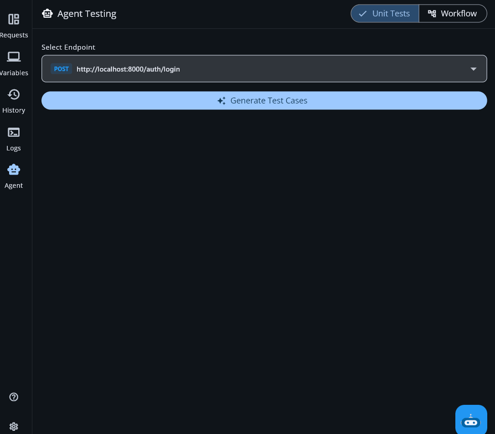
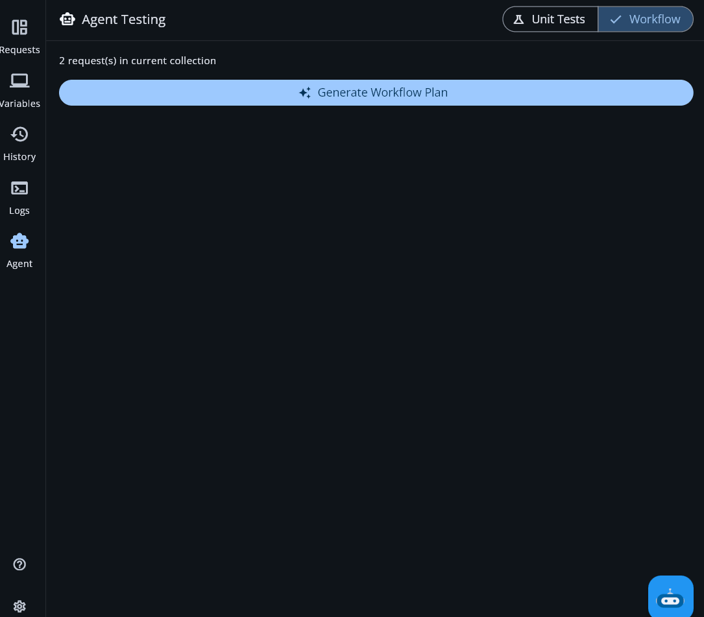

<div align="center">

# 🤖 Agentic API Testing — API Dash

**AI-powered, agentic test generation and execution directly inside your API client.**

[](https://github.com/foss42/apidash)
[](https://github.com/Aanish-Bangre/apidash)
[](https://flutter.dev)
[](./LICENSE)

</div>

---

## What This Does

This feature adds **AI-powered, agentic test generation and execution** directly inside API Dash. You pick an endpoint (or a collection of requests), click one button, and the AI:

1. **Analyzes your API shape** — method, URL, headers, body.
2. **Generates typed test cases** with real assertions (status codes, body content, response times).
3. **Lets you review and select** which tests to run.
4. **Executes them live** against the real API and shows pass/fail results.

### Supported Modes

| Mode | What it does |
|:---|:---|
| **Unit Test** | Generate & run test cases for a single endpoint. |
| **Workflow** | Plan & execute a multi-step sequence across your whole collection, passing data between steps. |

---

## Demo

<table style="width: 100%; border-collapse: collapse; border: none;">
  <tr>
    <th style="text-align: center; border: none; width: 50%;"><h3>Unit Test Mode</h3></th>
    <th style="text-align: center; border: none; width: 50%;"><h3>Workflow Mode</h3></th>
  </tr>
  <tr>
    <td style="text-align: center; border: none; vertical-align: top;">
      <p><i>Generate → Review → Run test cases for a single endpoint.</i></p>
      
    </td>
    <td style="text-align: center; border: none; vertical-align: top;">
      <p><i>Plan → Review → Execute multi-step sequences with live streaming.</i></p>
      
    </td>
  </tr>
</table>

---

## Architecture Overview

```text
┌────────────────────────────────────────────────────────┐
│               Flutter App (lib/)                        │
│                                                        │
│  lib/agent_testing/                                    │
│  ├── agent_testing_screen.dart   ← main UI screen      │
│  ├── providers/                                        │
│  │   └── agent_testing_provider.dart ← Riverpod state  │
│  └── widgets/                    ← checklist, cards    │
└──────────────────────┬─────────────────────────────────┘
                       │ calls
┌──────────────────────▼─────────────────────────────────┐
│        packages/apidash_agent/lib/                     │
│                                                        │
│  agents/                                               │
│  ├── unit_test_agent.dart  ← AI generate + HTTP run    │
│  └── workflow_agent.dart   ← AI plan + streaming run   │
│                                                        │
│  models/ assertion · test_case · test_result           │
│          workflow_step · data_binding · workflow_result│
│                                                        │
│  utils/                                                │
│  ├── prompt_builder.dart     ← all AI system prompts   │
│  └── json_path_extractor.dart ← $.field extraction     │
└──────────────────────┬─────────────────────────────────┘
                       │ uses
┌──────────────────────▼─────────────────────────────────┐
│        packages/genai/ (existing package)              │
│  AIAgent · AIAgentService · AIRequestModel             │
└────────────────────────────────────────────────────────┘
```

---

## How It Works

### Mode 1 — Unit Test

**Generate → Review → Run**

```text
idle ──► generating ──► review ──► running ──► complete
  ▲          │             │           │           │
  └──────────┴───(error)───┴───────────┴───────────┘
```

1. **Generate** — `UnitTestAgent` sends a structured prompt to the configured AI model. The system prompt enforces strict JSON output: 6 test cases, 4 categories (`happy_path`, `edge_case`, `security`, `performance`), typed integers for status codes and response times.
2. **Review** — The UI renders a checklist. You toggle which cases to run.
3. **Run** — `UnitTestAgent.runSelectedTests()` sends real HTTP requests, measures response time with a `Stopwatch`, evaluates each `Assertion` against the actual response, and returns a `TestResult` per case with a per-assertion breakdown.

---

### Mode 2 — Workflow

**Plan → Review → Execute (streaming)**

1. **Plan** — `WorkflowAgent` sends all request metadata to the AI model. The system prompt instructs the AI to order steps correctly (e.g., POST before GET), inject `{{variableName}}` placeholders, and specify `dataExtractions` for inter-step data passing.
2. **Review** — The user sees the full step plan before any HTTP call is made.
3. **Execute** — `WorkflowAgent.execute(steps)` is an `async*` stream. Each step:
   - Resolves `{{placeholders}}` in URLs, headers, and bodies from a growing `context` map.
   - Makes the real HTTP request and runs assertions.
   - Extracts values via `JsonPathExtractor` and writes them into the `context`.
   - Yields a `WorkflowStepResult` immediately so the UI updates live.

---

## Data Models

| Model | Purpose |
|:---|:---|
| **`TestCase`** | One AI-generated test: method, url, headers, body, assertions, `isSelected` flag. |
| **`Assertion`** | A single check: `AssertionType` (`statusCode`, `bodyContains`, `responseTimeUnder`) + expected value. |
| **`TestResult`** | Outcome: actual status code, body, duration, per-assertion results. |
| **`WorkflowStep`** | One step in a multi-request plan + `dataExtractions`. |
| **`DataBinding`** | Pairs a `variableName` with a `jsonPath` expression for data passing. |

---

## Prompt Engineering

All prompts live in `PromptBuilder` (`packages/apidash_agent/lib/utils/prompt_builder.dart`):

- **Unit Test system prompt** enforces: Exactly 6 test cases, typed integers for codes, and four fixed categories.
- **Workflow system prompt** enforces: Correct step ordering, `{{variableName}}` syntax for dynamic headers/URLs, and a limit of 1 data extraction per step to prevent over-engineering.

---

## Setup

**Prerequisites:** Flutter SDK, an AI model configured in API Dash (`Settings → Models → set default`).

```bash
git clone https://github.com/Aanish-Bangre/apidash.git
cd apidash
git checkout feat/gsoc-agentic-testing
flutter pub get
flutter run
```

1. Navigate to any saved API request.
2. Open the **Agent Testing** panel.
3. Choose **Unit Tests** or **Workflow**.

---

## Known Limitations

- `JsonPathExtractor` currently supports `$.field` and `$.array[0].field`. Complex filters are planned.
- Workflow execution halts on the first failed step by design.
- Test results are not currently persisted across app restarts.
- AI output quality depends on the configured model.

---

<div align="center">
Built with ❤️ using Flutter · Powered by Gemini/OpenAI · GSoC 2025
</div>